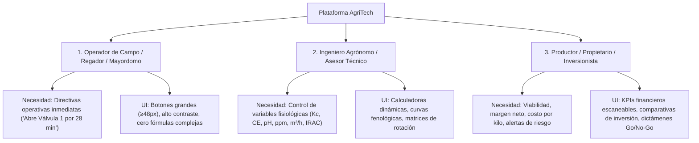

# Guía Maestra de UX/UI para Agricultura y Horticultura Protegida (Agri-UX/UI)

Este skill define los estándares de diseño, arquitectura de información y patrones de interacción visual para transformar plataformas agrícolas complejas con abundante carga física, química y matemática en herramientas intuitivas, operables en campo y transparentes para cualquier perfil de usuario.

---

## 1. Los Tres Modelos Mentales del Ecosistema Agrícola

Cualquier interfaz agrícola debe satisfacer simultáneamente a tres perfiles que interactúan con la misma realidad en campo:

---

## 2. Principios Fundamentales de Diseño Agrícola

### 2.1. Legibilidad bajo Condiciones de Campo (Outdoor & Sunlight Usability)
* **Contraste Extremo:** Ratios de contraste $\ge 4.5:1$ (estándar WCAG AA) y preferiblemente $\ge 7:1$ para métricas críticas leídas en pantalla de teléfono bajo radiación solar intensa.
* **Jerarquía Tipográfica:** Tamaños mínimos de fuente en tarjetas de $14\text{px}$ ($0.875\text{rem}$), títulos en $18-24\text{px}$ con peso semibold/bold ($600-700$). Números de KPIs destacados en tipografía monoespaciada o display de alto impacto ($1.5 - 2.0\text{rem}$).
* **Zonas Táctiles de Campo (Touch Targets):** En dispositivos móviles o tablets en campo, los botones y selectores deben tener una altura mínima de **$48\text{px}$** y espaciado de seguridad $\ge 8\text{px}$ para operarse con manos enguantadas o húmedas.

### 2.2. Semántica Cromática Agronómica Universal
En agricultura, los colores tienen significados biológicos y operativos universales. **No usar colores genéricos ni arbitrarios**:

| Color / Token Visual | Tono Hex Recomendado | Significado Agronómico | Casos de Uso en UI |
| :--- | :--- | :--- | :--- |
| **Agua & Riego** | Azul Cielo / Cyan (`#38bdf8`, `#0284c7`) | Humedad, pulsos, volumen diario, pozos, trasvases | Láminas brutas (L/pl/sem), m³/día, caudales (L/s), goteros |
| **Vigor & Nutrición** | Verde Esmeralda (`#10b981`, `#059669`) | Salud vegetal, biomasa, asimilación, fertilizantes | Rendimientos (Ton), Nitrógeno, Potasio, fósforo, estados OK |
| **Clima & Radiación** | Ámbar / Oro (`#f59e0b`, `#d97706`) | Horas sol, radiación, bochorno, ventilación, vientos | Extractores eólicos, temperatura (°C), vientos (km/h) |
| **Alerta Crítica / Salinidad** | Carmín / Coral (`#f43f5e`, `#e11d48`) | Estrés osmótico, plagas, ácaros, toxicidad por cloro, ácido | Advertencias de fitotoxicidad, taponamiento, plagas sin malla |
| **Electromecánica & Bombas** | Violeta / Púrpura (`#a855f7`, `#7c3aed`) | Motores, bombas, sectores, potencia (HP), filtros | Sectores hidráulicos, variadores (VFD), manómetros ($\Delta P$) |
| **Fondos & Superficies** | Azul Oscuro Pizarra (`#0f172a`, `#050912`) | Modo oscuro de alta inmersión con tarjetas *glassmorphism* | Contenedores de datos, visualizadores de planos técnicos |

---

## 3. Patrones de Interacción: Divulgación Progresiva (Progressive Disclosure)

Los proyectos agrícolas poseen densidades de datos abrumadoras. El error más común de diseño es mostrar todas las fórmulas, variables y descripciones juntas. Se debe aplicar el **Patrón de los 4 Niveles de Profundidad**:

1. **Nivel 1: El Escaneo Visual (3 segundos):**
   * Tarjeta con KPI principal en grande (`18.5 m³/día`), etiqueta clara y un *badge* de estado (`3 Sectores Activos`).
2. **Nivel 2: La Decisión Interactiva (10 segundos):**
   * Selectores desplegables o botones de alternancia (ej. *Pozo vs Yacambú*, *AIFA vs Granulado*, *Etapa Fenológica*). El cambio debe actualizar instantáneamente los valores en pantalla sin recargar la página.
3. **Nivel 3: La Instrucción Operativa de Campo (30 segundos):**
   * Desglose práctico: horario exacto de encendido de la bomba, duración de pulso por sector, cantidad de sacos o litros a mezclar en el tanque.
4. **Nivel 4: El Respaldo Científico / Ingeniería (A demanda):**
   * Acordeón o enlace a la memoria técnica (`.md` o modal) con las ecuaciones FAO-56, balance hidrogeológico o cálculo de pérdida de carga para validación agronómica formal.

---

## 4. Componentes Clave de un Dashboard Agrícola de Alto Rendimiento

### 4.1. Badge de Georreferenciación y Viento Dominante
* Toda cabecera debe situar físicamente el predio con coordenadas satelitales clicables (`📍 9°53'20"N 69°35'35"W`) y la dirección del viento dominante para que el operario oriente mentalmente las naves y cortinas.

### 4.2. Tarjetas de Sectorización y Equipamiento
* Representar los sectores no como simples números en una lista, sino como **bloques visuales espaciales** que indiquen qué camellones abarca cada válvula, el caudal que demandan a la bomba y su tiempo de riego individual.

### 4.3. Recetas de Tanques de Fertirriego "Cuchara en Mano"
* En lugar de mostrar solo milimoles o ppm, traducir siempre a **kilogramos físicos de producto comercial por semana o por bolsa**.
* Agrupar estrictamente por compatibilidad química (Tanque A: Calcio + Hierro; Tanque B: Fosfatos + Sulfatos + Micros; Tanque C: Ácido).

### 4.4. Alertas Fitosanitarias Contextuales con Código de Acción
* Si una plaga no es retenida por la infraestructura física (ej. ácaros en malla 50×25), mostrar una tarjeta de alerta con icono visual (`⚠️`), el modo de acción químico recomendado (código IRAC/FRAC) y la indicación de aplicación al envés foliar.

---

## 5. Checklist de Calidad UX/UI Agrícola (Audit Checklist)

Antes de dar por finalizada cualquier interfaz para el agro, verificar:

- [ ] **Comprensión sin Agrónomo:** ¿Un operario o mayordomo entiende qué válvula abrir y por cuántos minutos sin necesidad de interpretar integrales ni derivadas?
- [ ] **Unidades Visibles y Precisas:** ¿Cada número tiene su unidad explícita y normalizada (`m³/h`, `L/pl/día`, `bar`, `dS/m`, `Ton`, `kg/sem`)?
- [ ] **Semántica de Color Correcta:** ¿El agua es azul/cyan, la planta verde, el calor ámbar y el peligro salino/ácido rojo?
- [ ] **Rendimiento Reactivo:** ¿Los selectores de fenología o fuente de agua actualizan los datos en menos de 100 ms sin salto de pantalla?
- [ ] **Acceso a Planos y Documentación:** ¿Existen enlaces directos para abrir los planos SVG en pestaña completa y descargar las memorias técnicas?
- [ ] **Sin Falsos Placeholders:** ¿Todos los datos corresponden a las coordenadas y parámetros reales de la finca?
