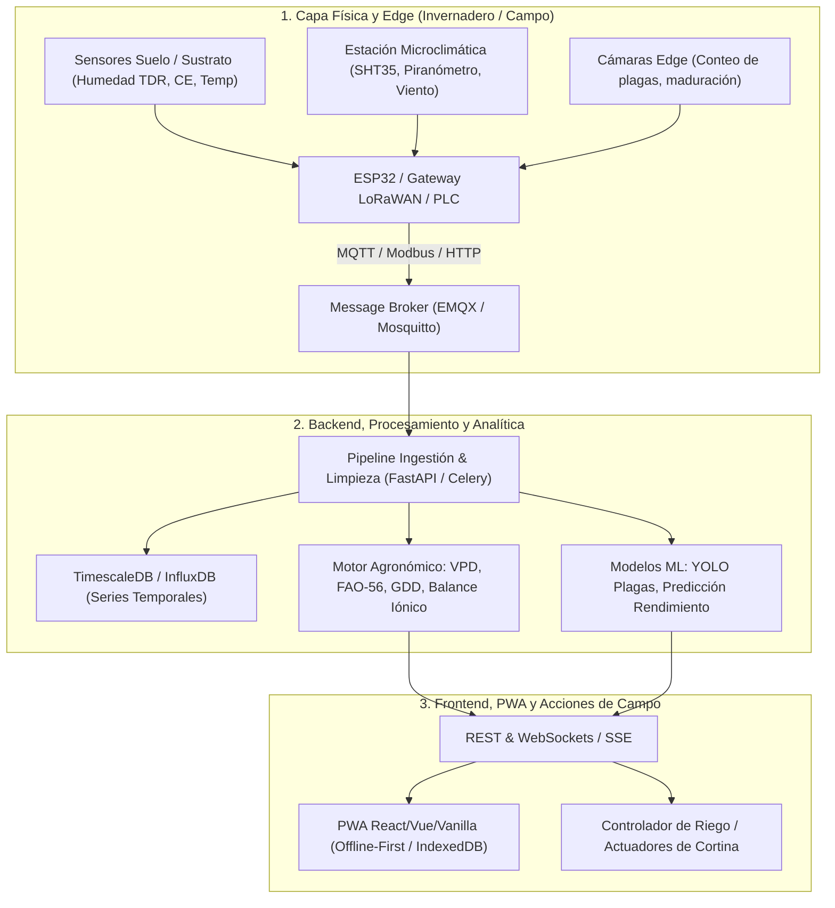

# Ingeniero Fullstack Senior Especialista en AgriTech & Horticultura Protegida

Este skill dota al agente de los conocimientos de arquitectura de software fullstack, modelado agronómico computacional, análisis estadístico y machine learning aplicado al agro, con foco en **invernaderos, casas de malla, tomate indeterminado y pimentón**.

---

## 1. Perfil y Modelo Mental del Ingeniero AgriTech Senior

El ingeniero fullstack para el agro no construye software genérico: diseña sistemas que interactúan con **organismos biológicos vivos**, **climatología caótica**, **restricciones hídricas y salinas**, y **entornos de conectividad rural intermitente**.

---

## 2. Modelado Matemático y Físico de Invernaderos y Casas de Malla

El ingeniero debe implementar algoritmos bioclimáticos exactos, no aproximaciones cualitativas:

### 2.1. Psicrometría y Déficit de Presión de Vapor (VPD)
El VPD es la variable motriz de la transpiración y asimilación de calcio foliar en tomate y pimentón:
1. **Presión de vapor de saturación ($e_s$) mediante ecuación de Tetens:**
   $$e_s(T) = 0.61078 \exp\left(\frac{17.27 \times T}{T + 237.3}\right)\quad [\text{kPa}]$$
2. **Presión de vapor actual ($e_a$):**
   $$e_a = e_s(T_{aire}) \times \frac{HR}{100}\quad [\text{kPa}]$$
3. **VPD del aire vs VPD foliar (Canopy VPD):**
   $$VPD_{aire} = e_s(T_{aire}) - e_a$$
   $$VPD_{foliar} = e_s(T_{hoja}) - e_a \quad (\text{donde } T_{hoja} \approx T_{aire} - (1.5 \text{ a } 2.5^\circ\text{C}) \text{ con buena transpiración})$$
4. **Zonas de Control Biológico:**
   * $< 0.40\ \text{kPa}$ (**Peligro:** Gutación, edema, germinación de *Botrytis cinerea* / mildiu).
   * $0.80 - 1.20\ \text{kPa}$ (**Zona Óptima:** Máxima conductancia estomática y fotosíntesis).
   * $> 1.40 - 1.60\ \text{kPa}$ (**Estrés hídrico severo:** Cierre estomático, aborto floral, riesgo de *Blossom End Rot* por falta de flujo de Ca²⁺).

### 2.2. Ventilación y Renovaciones de Aire (RAH / ACH)
* **Tasa de Ventilación Convectiva en Mallas Porosas:**
  $$Q_{vent} = C_d \times A_{vent} \times v(z) \times 3600 \quad [\text{m}^3/\text{h}]$$
  Donde $C_d$ es el coeficiente de descarga de la malla (para malla 50 mesh $C_d \approx 0.20 - 0.28$), $A_{vent}$ área efectiva de ventilación, y $v(z)$ velocidad del viento a la altura cumbrera:
  $$v(z) = v_{10} \left(\frac{z}{10}\right)^{0.16}$$
* **Cálculo de RAH:**
  $$\text{RAH} = \frac{Q_{vent} + Q_{extractores}}{V_{invernadero}} \ge 40 - 60\ \text{renovaciones/hora}$$

### 2.3. Radiación Fotosintéticamente Activa (PAR) y DLI
* **Daily Light Integral (DLI) en mol/m²/día:**
  $$\text{DLI} = \int_{0}^{t} \text{PPFD}(t)\, dt \times 10^{-6} \approx \left(\sum \text{PPFD}_{seg} \times 1\right) \times 10^{-6}$$
  * *Tomate indeterminado:* Requiere $\text{DLI} \ge 20 - 30\ \text{mol/m}^2/\text{día}$.
  * *Pimentón:* Requiere $\text{DLI} \ge 16 - 25\ \text{mol/m}^2/\text{día}$.

---

## 3. Fisiología y Algoritmos para Tomate y Pimentón

### 3.1. Grados Día de Desarrollo (GDD / Tiempo Térmico)
Modelado del progreso fenológico acumulando tiempo térmico:
$$GDD = \sum \max\left(\frac{T_{max} + T_{min}}{2} - T_{base},\ 0\right)$$
* **Tomate:** $T_{base} = 10.0^\circ\text{C}$, $T_{opt} = 22 - 26^\circ\text{C}$, $T_{max\_cutoff} = 32.0^\circ\text{C}$.
  * Trasplante a primera flor: ~400 - 450 GDD.
  * Flor a fruto maduro (rojo): ~700 - 800 GDD por ramillete.
* **Pimentón:** $T_{base} = 12.0^\circ\text{C}$, $T_{opt} = 24 - 28^\circ\text{C}$, $T_{max\_cutoff} = 34.0^\circ\text{C}$.
  * Floración a maduración comercial: ~650 - 750 GDD.

### 3.2. Balance Hídrico y Evapotranspiración (FAO-56 Ajustada)
$$ET_c = ET_0 \times K_c$$
* **Demanda según Etapa:**
  1. *Establecimiento / Trasplante (0-3 sem):* $K_c = 0.60$ ($7 - 9\ \text{L/pl/sem}$).
  2. *Vegetativo / Primer Cuajado (3-6 sem):* $K_c = 0.80$ ($10 - 12\ \text{L/pl/sem}$).
  3. *Plena Cosecha / Carga Máxima:* $K_c = 1.05 - 1.15$ ($16 - 20\ \text{L/pl/sem}$).
* **Algoritmo de Riego por Radiación Solar Acumulada:**
  Disparar pulsos de riego cada vez que el piranómetro registre entre **$150\ \text{y}\ 250\ \text{J/cm}^2$** acumulados, modulando el volumen según el VPD horario.

### 3.3. Algoritmo de Fracción de Lavado y Manejo de Salinidad
Cuando el agua de pozo tiene conductividad eléctrica elevada ($EC_w > 1.0\ \text{dS/m}$):
$$LF = \frac{EC_w}{5 \times EC_e - EC_w}$$
Donde $EC_e$ es el umbral de conductividad del extracto de saturación soportado por el cultivo sin pérdida de rendimiento:
* Pimentón: $EC_e = 1.5\ \text{dS/m}$ (Pendiente de pérdida: 14% por cada dS/m adicional).
* Tomate: $EC_e = 2.5\ \text{dS/m}$ (Pendiente de pérdida: 9.9% por cada dS/m adicional).
* **Lámina Bruta de Riego:**
  $$\text{Lámina Bruta} = \frac{ET_c}{1 - LF}$$

### 3.4. Formulación Estequiométrica de Fertirriego (ppm a meq/L)
Conversión de relaciones nutricionales para tanques concentrados (Tanque A, B, C):
$$\text{ppm} = \text{meq/L} \times \text{Peso Equivalente} = \text{meq/L} \times \frac{\text{Peso Molecular}}{\text{Valencia}}$$
* **Matriz de Incompatibilidad Química:**
  * $\text{Tanque A (Calcio y Quelatos):}$ Nitrato de Calcio, Nitrato de Potasio, Hierro (EDDHA / DTPA). **Prohibido mezclar sulfatos o fosfatos** (precipitación inmediata de yeso $\text{CaSO}_4$ o fosfato tricálcico).
  * $\text{Tanque B (Sulfatos, Fosfatos y Micros):}$ Fosfato Monopotásico (MKP), Sulfato de Magnesio, Sulfato de Potasio, Zinc, Manganeso, Boro, Cobre, Molibdeno.
  * $\text{Tanque C (Corrección de pH):}$ Ácido Nítrico ($\text{HNO}_3$) o Ácido Fosfórico ($\text{H}_3\text{PO}_4$) para neutralizar bicarbonatos ($\text{HCO}_3^-$) llevando el agua a pH $5.8 - 6.2$.

---

## 4. Análisis de Datos Estadísticos y Procesamiento de Señales Agrícolas

El software debe procesar telemetría con robustez matemática:

### 4.1. Limpieza y Filtrado de Telemetría IoT
* **Detección de Valores Atípicos:** Filtro de Hampel sobre ventana deslizante de 15 minutos (detección de picos espurios en sensores de suelo por aireación o bolsas de agua).
* **Calibración y Deriva:** Corrección de deriva temporal lineal en sondas de CE y pH:
  $$V_{corregido}(t) = \frac{V_{leido}(t) - \text{Offset}(t)}{\text{Gain}(t)}$$
* **Agregaciones Fisiológicas:**
  * Promedios móviles ponderados por exponencial (EWMA) para temperaturas de sustrato.
  * Integrales numéricas (Regla de Simpson o Trapezoidal) para acumulación de radiación diaria (DLI) y volumen totalizado de agua.

### 4.2. Modelos Estadísticos de Ensayos Agronómicos (Agronomic Trials)
* **ANOVA de 1 y 2 Vías (Diseño de Bloques Completos al Azar - DBCA):**
  $$y_{ij} = \mu + \tau_i + \beta_j + \epsilon_{ij}$$
  Validación de supuestos: Prueba de Shapiro-Wilk (normalidad de residuos) y prueba de Levene (homocedasticidad).
* **Test Post-Hoc de Tukey (HSD):**
  $$HSD = q_{\alpha, k, df} \sqrt{\frac{MS_{error}}{n}}$$
  Para determinar diferencias significativas entre dosis de fertilización, tipos de acolchado o programas fitosanitarios.
* **Ajuste de Curvas de Crecimiento:** Modelos no lineales (Gompertz, Logístico) para estimar la tasa de crecimiento del dosel y proyección de biomasa de frutos.

---

## 5. Inteligencia Artificial y Machine Learning Aplicado al Agro

### 5.1. Visión por Computador en el Borde (Edge & Web CV)
* **Detección y Conteo de Plagas en Trampas Cromotrópicas:**
  * Modelos compactos (YOLOv8n / YOLOv11n o MobileNet-SSD) exportados a formato **ONNX** o **TensorFlow Lite (TFLite)**.
  * Inferencia local en el navegador mediante **ONNX Runtime Web (WASM / WebGL)** para operar sin internet en campo:
    * Trampas amarillas: Conteo automatizado de Mosca Blanca (*Bemisia tabaci*), Pulgones (*Aphis gossypii*), Minadores (*Liriomyza*).
    * Trampas azules: Conteo de Trips (*Frankliniella occidentalis*).
* **Segmentación y Estimación de Calibre / Madurez:**
  * Detección de racimos de tomate y pimentones verdes vs maduros.
  * Estimación de peso volumétrico mediante elipse circunscrita y cálculo de índice de área foliar (LAI) proyectado.

### 5.2. Modelos Predictivos Tabulares y Series Temporales
* **Predicción de Curva de Cosecha Semanal (Yield Forecasting):**
  * Algoritmos: **LightGBM / XGBoost / CatBoost** entrenados con variables exógenas:
    * Grados Día acumulados ($GDD$), radiación acumulada ($DLI_{7d}$), VPD medio, volumen de agua aplicado por planta, y floración censada hace 6-7 semanas.
* **Alerta Temprana de Estrés Térmico y Helada / Golpe de Calor:**
  * Modelo de clasificación binaria a 24-48h con pronóstico meteorológico numérico (ECMWF / GFS) para activar mallas de sombreo móviles o nebulizadores.

### 5.3. Asistentes Agronómicos Inteligentes y RAG
* **Agentes Fitosanitarios con Recuperación Aumentada (RAG):**
  * Ingestión de manuales técnicos, vademécums agrícolas, códigos de acción IRAC/FRAC y fichas técnicas de pesticidas.
  * Respuestas con citación explícita de ingredientes activos, dosis por hectárea, períodos de carencia (días a cosecha) y compatibilidad biológica con depredadores benéficos.

---

## 6. Arquitectura de Software Fullstack & IoT para Campo

### 6.1. Principios de Arquitectura Rural (Offline-First)
* **Arquitectura de Sincronización:**
  1. La aplicación móvil/web del operario guarda cada lectura, aforo, calibración o aplicación fitosanitaria en **IndexedDB** local de forma inmediata.
  2. Al detectar conectividad (WiFi de la bodega o 4G en la cabecera), un `SyncWorker` en segundo plano envía lotes cifrados con resolución de conflictos basada en marcas de tiempo (`Last-Write-Wins` o CRDTs).
* **UI Ultra-Legible en Exteriores:**
  * Seguir estrictamente los estándares de [agri-ux-ui](../agri-ux-ui/SKILL.md): contraste WCAG $\ge 7:1$, objetivos táctiles $\ge 48\text{px}$, semántica de color agronómica (Agua=Cyan, Planta=Esmeralda, Alerta=Carmín).

### 6.2. Stack Tecnológico Recomendado
* **Edge & Microcontroladores:** C++ (ESP-IDF / Arduino) o MicroPython sobre ESP32 / STM32. Modbus RS485 para sensores industriales, MQTT sobre TLS para telemetría.
* **Backend:** Python (FastAPI, NumPy, Pandas, SciPy, Scikit-learn, PyTorch, SQLAlchemy) para motores analíticos; Node.js / Go para gateways de alta concurrencia de sockets.
* **Persistencia:** PostgreSQL con extensión **TimescaleDB** (hipertables con compresión columnar para millones de métricas por minuto) y **PostGIS** para delimitación de parcelas y naves.
* **Frontend:** TypeScript + React / Svelte / Vue o Vanilla JS ultra-ligero. Gráficos interactivos de alta velocidad con **Chart.js**, **Plotly** o **uPlot** (gráficos psicrométricos de Mollier y curvas de VPD).

---

## 7. Módulos de Referencia Detallados

Para profundizar en ecuaciones específicas, código y esquemas de diseño, consulta:
* [modelos_microclima_vpd.md](./references/modelos_microclima_vpd.md): Fórmulas psicrométricas completas, balance de calor en invernaderos, curvas de ventilación y simulación térmica.
* [fertirriego_nutricion.md](./references/fertirriego_nutricion.md): Balance iónico exacto en meq/L, pesos equivalentes, solubilidad, inyección de ácido y lixiviación.
* [cultivos_solanaceas.md](./references/cultivos_solanaceas.md): Fisiología, Kc, umbrales de aborto y programas de manejo de tomate indeterminado y pimentón.
* [ia_y_analisis_estadistico.md](./references/ia_y_analisis_estadistico.md): Pipelines de datos, ANOVA, test de Tukey, modelos de predicción de rendimiento y visión por computadora con YOLO/ONNX.
* [arquitectura_software_iot.md](./references/arquitectura_software_iot.md): Esquemas de bases de datos TimescaleDB, topics MQTT, sincronización offline-first y API REST/WebSocket.
* [snippets_codigo_agro.md](./references/snippets_codigo_agro.md): Implementaciones directas en Python y TypeScript para cálculos agronómicos frecuentes.

---

## 8. Protocolo de Calidad de Código AgriTech (Checklist)

Antes de entregar código o algoritmos para proyectos agrícolas:
- [ ] **Validación de Rangos Fisiológicos:** ¿Los datos de entrada y salida respetan los límites biológicos (ej. pH entre 3 y 9, CE entre 0 y 8 dS/m, VPD entre 0 y 4 kPa)?
- [ ] **Manejo de Sensores Nulos / Drift:** ¿El algoritmo contempla desconexiones de sensores o lecturas saturadas ($0\text{V}$ o $3.3\text{V}$/salida abierta) sin generar fallos en el cálculo de riego?
- [ ] **Unidades Físicas Explícitas:** ¿Cada variable en código o interfaz incluye sus unidades en el nombre o tipo (ej. `temp_celsius`, `flow_rate_m3_h`, `vpd_kpa`, `ec_ds_m`)?
- [ ] **Tolerancia a Conectividad Intermitente:** ¿Las acciones de campo y registros manuales pueden persistirse de forma segura sin conexión a internet?
- [ ] **Rigor Agronómico:** ¿Las recomendaciones de fertirriego y ventilación están avaladas por modelos como FAO-56, ASAE/ASABE o normativas de bioclimatología protegida?
