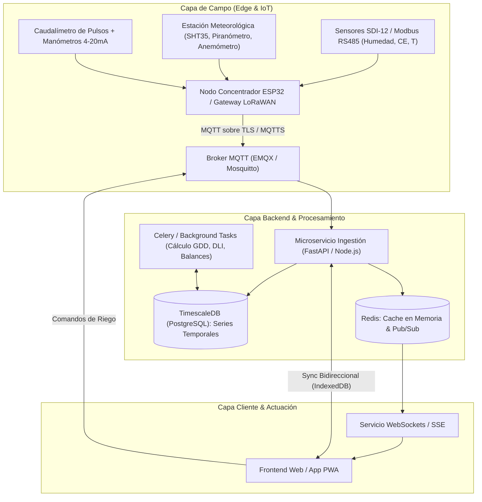
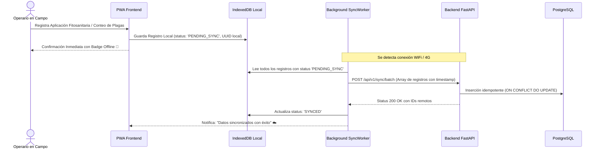

# Arquitectura de Software Fullstack, IoT y Bases de Datos Agrícolas

Este documento define la arquitectura de sistemas escalables para agrotecnología (AgriTech), integrando telemetría de campo, brokers MQTT, almacenamiento en series temporales con TimescaleDB y aplicaciones web progresivas (PWA) con tolerancia a desconexión (*offline-first*).

---

## 1. Topología del Sistema y Flujo de Datos



---

## 2. Protocolo de Telemetría IoT y Esquema MQTT

### 2.1. Jerarquía Estándar de Tópicos MQTT
Estructura semántica para soportar múltiples predios, naves y sectores:

```
finca/{finca_id}/invernadero/{invernadero_id}/sector/{sector_id}/telemetria
finca/{finca_id}/invernadero/{invernadero_id}/clima/telemetria
finca/{finca_id}/invernadero/{invernadero_id}/actuador/{actuador_id}/comando
finca/{finca_id}/invernadero/{invernadero_id}/actuador/{actuador_id}/estado
```

### 2.2. Payload JSON Normalizado de Telemetría (QoS 1)
Todas las variables deben portar sus unidades físicas estandarizadas en el nombre de la clave:

```json
{
  "device_id": "ESP32_INV01_SEC03",
  "timestamp": "2026-09-06T14:30:00Z",
  "battery_voltage_v": 3.92,
  "signal_rssi_dbm": -68,
  "metrics": {
    "temp_air_celsius": 27.4,
    "relative_humidity_pct": 64.2,
    "vpd_air_kpa": 1.30,
    "solar_irradiance_w_m2": 680.5,
    "soil_moisture_vol_pct": 32.8,
    "soil_ec_pore_ds_m": 2.15,
    "soil_temp_celsius": 23.1,
    "line_pressure_bar": 1.45,
    "instant_flow_l_min": 24.8
  }
}
```

---

## 3. Modelo de Base de Datos (PostgreSQL + TimescaleDB + PostGIS)

### 3.1. Esquema Relacional de Entidades Espaciales
```sql
-- Extensión geográfica y de series temporales
CREATE EXTENSION IF NOT EXISTS timescaledb CASCADE;
CREATE EXTENSION IF NOT EXISTS postgis;

-- 1. Tabla de Fincas / Predios
CREATE TABLE fincas (
    finca_id UUID PRIMARY KEY DEFAULT gen_random_uuid(),
    nombre VARCHAR(100) NOT NULL,
    ubicacion GEOMETRY(Point, 4326) NOT NULL,
    elevacion_msnm NUMERIC(6,2),
    fuente_agua VARCHAR(50) DEFAULT 'pozo_profundo',
    ec_agua_base_ds_m NUMERIC(4,2),
    created_at TIMESTAMPTZ DEFAULT NOW()
);

-- 2. Invernaderos / Casas de Malla
CREATE TABLE invernaderos (
    invernadero_id UUID PRIMARY KEY DEFAULT gen_random_uuid(),
    finca_id UUID REFERENCES fincas(finca_id) ON DELETE CASCADE,
    codigo VARCHAR(50) NOT NULL UNIQUE,
    tipo_estructura VARCHAR(50) NOT NULL, -- 'casa_malla', 'invernadero_multitunel', etc.
    superficie_m2 NUMERIC(8,2) NOT NULL,
    altura_alero_m NUMERIC(4,2) NOT NULL,
    altura_cumbrera_m NUMERIC(4,2) NOT NULL,
    tipo_malla VARCHAR(100) DEFAULT '110_gsm_50_mesh_blanco',
    cultivo_actual VARCHAR(50), -- 'tomate_indeterminado', 'pimenton'
    fecha_trasplante DATE,
    geometria GEOMETRY(Polygon, 4326)
);

-- 3. Sectores de Riego Hidráulico
CREATE TABLE sectores_riego (
    sector_id UUID PRIMARY KEY DEFAULT gen_random_uuid(),
    invernadero_id UUID REFERENCES invernaderos(invernadero_id) ON DELETE CASCADE,
    numero_sector INT NOT NULL,
    numero_camellones INT NOT NULL,
    numero_plantas INT NOT NULL,
    caudal_diseno_m3_h NUMERIC(6,2) NOT NULL,
    presion_nominal_bar NUMERIC(4,2) DEFAULT 1.5
);
```

### 3.2. Hipertabla de Telemetría (TimescaleDB)
```sql
CREATE TABLE telemetria_ambiental (
    time TIMESTAMPTZ NOT NULL,
    invernadero_id UUID NOT NULL REFERENCES invernaderos(invernadero_id),
    temp_aire NUMERIC(4,2),
    humedad_relativa NUMERIC(4,1),
    vpd_kpa NUMERIC(4,2),
    radiacion_w_m2 NUMERIC(6,1),
    co2_ppm NUMERIC(6,1),
    viento_km_h NUMERIC(4,1)
);

-- Convertir a hipertabla particionada por semanas
SELECT create_hypertable('telemetria_ambiental', 'time', chunk_time_interval => INTERVAL '7 days');

-- Activar compresión columnar automática para datos > 14 días
ALTER TABLE telemetria_ambiental SET (
    timescaledb.compress,
    timescaledb.compress_segmentby = 'invernadero_id',
    timescaledb.compress_orderby = 'time DESC'
);
SELECT add_compression_policy('telemetria_ambiental', INTERVAL '14 days');
```

### 3.3. Vista Materializada Continua para KPIs Diarios
```sql
CREATE MATERIALIZED VIEW kpis_diarios_invernadero
WITH (timescaledb.continuous) AS
SELECT 
    time_bucket('1 day', time) AS dia,
    invernadero_id,
    AVG(temp_aire) AS temp_media,
    MAX(temp_aire) AS temp_max,
    MIN(temp_aire) AS temp_min,
    AVG(vpd_kpa) AS vpd_medio,
    MAX(vpd_kpa) AS vpd_max,
    -- Integral de Luz Diaria (DLI aproximado en mol/m2/d con 2.1 umol/J)
    SUM(radiacion_w_m2 * 2.1 * 300) / 1000000.0 AS dli_mol_m2_dia
FROM telemetria_ambiental
GROUP BY dia, invernadero_id;
```

---

## 4. Patrón de Sincronización Offline-First para Cuaderno de Campo (PWA)

Las parcelas agrícolas sufren desconexión celular frecuente. La interfaz no debe depender de peticiones HTTP en tiempo real para registrar labores:



### 4.1. Esquema de Base Local (Dexie.js / IndexedDB)
```javascript
import Dexie from 'dexie';

export const localDb = new Dexie('AgriFieldDB');

localDb.version(1).stores({
  registros_monitoreo: '++id, uuid, sector_id, timestamp, plaga_id, conteo, sync_status',
  pulsos_riego: '++id, uuid, sector_id, volumen_l, fecha_inicio, fecha_fin, sync_status',
  calibraciones_sensores: '++id, sensor_id, fecha, offset, ganancia, sync_status'
});
```

---

## 5. API Backend (FastAPI + Pydantic + WebSockets)

### 5.1. Esquema de Validación Agronómica con Pydantic
```python
from pydantic import BaseModel, Field, field_validator
from datetime import datetime
from typing import Optional

class TelemetriaIn(BaseModel):
    invernadero_id: str
    timestamp: datetime
    temp_aire: float = Field(..., ge=-5.0, le=55.0, description="Temperatura en Celsius")
    humedad_relativa: float = Field(..., ge=0.0, le=100.0, description="Humedad Relativa en %")
    radiacion_w_m2: Optional[float] = Field(None, ge=0.0, le=1500.0)
    ec_suelo_ds_m: Optional[float] = Field(None, ge=0.0, le=15.0)

    @field_validator('temp_aire')
    @classmethod
    def validar_congruencia(cls, v):
        if v > 48.0:
            # Registrar warning interno de posible sensor expuesto a radiación directa
            pass
        return v
```

### 5.2. Endpoint WebSocket para Streaming de Microclima
```python
from fastapi import FastAPI, WebSocket, WebSocketDisconnect
from typing import Dict, List

app = FastAPI()

class ConnectionManager:
    def __init__(self):
        self.active_connections: Dict[str, List[WebSocket]] = {}

    async def connect(self, inv_id: str, websocket: WebSocket):
        await websocket.accept()
        if inv_id not in self.active_connections:
            self.active_connections[inv_id] = []
        self.active_connections[inv_id].append(websocket)

    def disconnect(self, inv_id: str, websocket: WebSocket):
        self.active_connections[inv_id].remove(websocket)

    async def broadcast_telemetria(self, inv_id: str, message: dict):
        if inv_id in self.active_connections:
            for connection in self.active_connections[inv_id]:
                await connection.send_json(message)

manager = ConnectionManager()

@app.websocket("/ws/invernadero/{inv_id}")
async def websocket_endpoint(websocket: WebSocket, inv_id: str):
    await manager.connect(inv_id, websocket)
    try:
        while True:
            # Mantener conexión viva con ping-pong
            data = await websocket.receive_text()
    except WebSocketDisconnect:
        manager.disconnect(inv_id, websocket)
```
