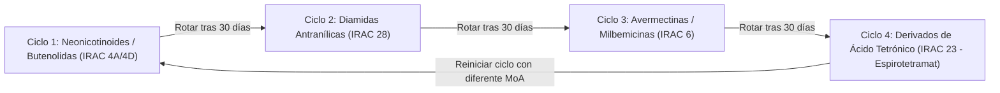

# Fisiología, Manejo Agronómico y Modelos de Producción: Tomate y Pimentón

Este documento detalla los parámetros fisiológicos, curvas fenológicas, densidades de siembra, podas y modelos de predicción de cosecha para **tomate indeterminado de hilo alto** y **pimentón de invernadero**.

---

## 1. Tomate Indeterminado (*Solanum lycopersicum*)

### 1.1. Arquitectura de Planta y Sistema de Tutorado
* **Hábito Indeterminado:** El meristemo apical continúa creciendo indefinidamente, emitiendo ramilletes florales cada 3 hojas (frecuencia rítmica de 1 ramillete cada 7 - 10 días).
* **Tutorado de Hilo Alto:**
  * Altura de alambre de soporte: $\ge 2.20\ \text{m}$ (óptimo $2.80 - 3.50\ \text{m}$ en invernaderos altos).
  * Fijación: Rafia agrícola colgada de ganchos holandeses con bobina de reserva o malla espaldera biorientada (Hortomalla 15×15 cm).
  * **Operación de Descolgado (Lean & Drop):** Cuando el ápice alcanza el alambre superior, se desprenden 30 - 50 cm de rafia hacia un lado, manteniendo la zona fotosintéticamente activa siempre en el estrato vertical de $1.20 - 2.20\ \text{m}$.
* **Labores de Manejo Obligatorias:**
  * **Desbrote Axilar (Chuponenteo):** Eliminación semanal de brotes axilares cuando miden $\le 3 - 5\ \text{cm}$ (antes de lignificar). Retrasarlo reduce el calibre del fruto un 15-20%.
  * **Deshoje Basal:** Retirar de 2 a 3 hojas basales por semana debajo del ramillete cosechado para facilitar la circulación de aire perimetral, reduciendo el riesgo de *Botrytis cinerea* y facilitando la entrada de luz.
  * **Raleo de Frutos:** Mantener un número uniforme de frutos por ramillete para estabilizar la carga de asimilados:
    * Tomate ensalada / beef: 4 a 5 frutos/ramillete.
    * Tomate racimo / roma: 6 a 7 frutos/ramillete.
    * Tomate cherry / uva: 12 a 16 frutos/ramillete.

### 1.2. Umbrales Térmicos y Fenología (GDD Base 10 °C)
* **Temperatura Base ($T_{base}$):** $10.0^\circ\text{C}$.
* **Rango Óptimo Día:** $22.0 - 26.0^\circ\text{C}$.
* **Rango Óptimo Noche:** $15.0 - 18.0^\circ\text{C}$.
* **Umbral Crítico de Aborto Floral:** $> 32.0^\circ\text{C}$ diurno o $> 21.0^\circ\text{C}$ nocturno continuo (el polen pierde viabilidad y el estigma se dehisce sin fecundación).

| Etapa Fenológica | Duración Típica (Días) | GDD Acumulados (°C·día) | Demanda Hídrica ($K_c$) |
| :--- | :--- | :--- | :--- |
| **Trasplante a Prendimiento** | 1 - 10 | $80 - 110$ | 0.50 - 0.60 |
| **Vegetativo a 1ra Floración** | 11 - 28 | $280 - 340$ | 0.70 - 0.80 |
| **Cuajado de Primeros Ramilletes** | 29 - 45 | $480 - 560$ | 0.90 - 1.00 |
| **Engorde de Frutos (Ramilletes 1 a 3)** | 46 - 70 | $780 - 950$ | 1.05 - 1.15 |
| **Cosecha Continua (Semana 10 a 35+)** | 71 - 250+ | $120\ \text{GDD/semana}$ | 1.10 - 1.20 |

### 1.3. Densidad de Siembra y Proyección de Rendimiento
* **Densidad Estándar:** $2.2 - 2.8\ \text{tallos/m}^2$.
* **Marco de Plantación Común:** Camellones a $1.20 - 1.40\ \text{m}$ de centro a centro, con plantas separadas a $0.25 - 0.35\ \text{m}$ (hileras simples o dobles alternadas).
* **Potencial de Cosecha en Casa de Malla (Ciclo de 6 a 8 meses):**
  * Rendimiento esperado: $12 - 18\ \text{kg/m}^2$ ($120 - 180\ \text{Ton/ha}$).
  * Peso medio por fruto (ensalada / chonto): $130 - 180\ \text{g}$.
  * Número de ramilletes comerciales por planta: $12 - 18\ \text{ramilletes}$.

---

## 2. Pimentón de Invernadero (*Capsicum annuum*)

### 2.1. Arquitectura y Manejo Fisiológico
* **Estructura Dicotómica:** El pimentón crece con un tallo principal que se bifurca en dos ramas primarias (la "cruz"), y cada una vuelve a dividirse en sucesivas dicotomías o nudos fructíferos.
* **Eliminación de la Flor Reina (Fruto de la Cruz):**
  * Labor agronómica crítica: Remover manualmente la primera flor o fruto que aparece en la primera bifurcación ("cruz").
  * **Justificación Bioenergética:** Si se deja crecer la flor reina, el fruto absorbe hasta el 65% de los fotoasimilados disponibles, paralizando el crecimiento de las raíces y retrasando el porte de los brazos secundarios en 3 a 4 semanas. Su eliminación incrementa el rendimiento total de la planta en un 25-35%.
* **Sistemas de Conducción:**
  * **Sistema Español (Perimetral con Malla / Hilos Horizontales):** Se colocan estacas y mallas espalderas a los lados de la cama de cultivo a intervalos de 20-30 cm de altura, dejando que los brazos crezcan libremente dentro de la caja de soporte (ideal para ahorro de mano de obra).
  * **Sistema Holandés (2 a 4 Brazos Guiados a Rafia Vertical):** Cada brazo se enrolla en un hilo vertical individual y se podan los brotes terciarios a 1 hoja. Permite frutos de calibre extra (Blocky $> 220\ \text{g}$).

### 2.2. Umbrales Térmicos y Fenología (GDD Base 12 °C)
* **Temperatura Base ($T_{base}$):** $12.0^\circ\text{C}$.
* **Rango Óptimo Día:** $24.0 - 28.0^\circ\text{C}$.
* **Rango Óptimo Noche:** $18.0 - 20.0^\circ\text{C}$.
* **Umbral Crítico de Aborto Floral:** $> 31.5^\circ\text{C}$ (las anteras se atrofian, polen estéril, caída masiva de botones florales).
* **Sensibilidad a la Salinidad:** Umbral de pérdida $EC_e = 1.5\ \text{dS/m}$. Por cada $1.0\ \text{dS/m}$ adicional, se pierde un **14% de rendimiento**.

| Etapa Fenológica | Duración Típica (Días) | GDD Acumulados (°C·día) | Coeficiente $K_c$ |
| :--- | :--- | :--- | :--- |
| **Trasplante y Enraizamiento** | 1 - 15 | $120 - 150$ | 0.55 - 0.65 |
| **Bifurcación y Formación de Cruz** | 16 - 35 | $220 - 300$ | 0.70 - 0.80 |
| **Floración de Brazos Principales** | 36 - 60 | $350 - 480$ | 0.85 - 0.95 |
| **Llenado y Cambio de Color (Viraje)** | 61 - 95 | $550 - 750$ | 1.00 - 1.10 |
| **Cosecha Escalonada** | 96 - 210+ | $110\ \text{GDD/semana}$ | 1.05 sostenido |

### 2.3. Densidad y Rendimiento Esperado
* **Densidad:** $2.8 - 3.4\ \text{plantas/m}^2$.
* **Rendimiento Esperado en Casa de Malla:**
  * Verde (cosecha inmadura): $8 - 12\ \text{kg/m}^2$.
  * Rojo / Amarillo maduro (virado completo): $6 - 9\ \text{kg/m}^2$.
  * Frutos promedio por planta: $15 - 25\ \text{frutos}$ (tipo blocky / cónico).

---

## 3. Manejo Integrado de Plagas y Enfermedades (MIP / IPM)

### 3.1. Matriz de Vectores y Patógenos Clave en Solanáceas

| Plaga / Patógeno | Nombre Científico | Daño Fisiológico / Transmisión | Eficacia Malla 50 Mesh | Estrategia de Control Principal |
| :--- | :--- | :--- | :--- | :--- |
| **Mosca Blanca** | *Bemisia tabaci* (Biogrupos MEAM1/MED) | Succión de floema, fumagina, vector del Virus del Rizado Amarillo del Tomate (TYLCV). | **100% Barrera Física** (apertura malla $\le 192\ \mu\text{m}$). | Monitoreo con trampas amarillas (umbral $\ge 2$ adultos/trampa/día $\rightarrow$ tratamiento biológico o químico). |
| **Trips Occidental** | *Frankliniella occidentalis* | Picadura en flores y brotes; vector del Virus del Bronceado del Tomate (TSWV). | **Alta Barrera Física** ($\sim 95\%$). | Trampas cromotrópicas azules; depredadores *Amblyseius swirskii* u *Orius laevigatus*. |
| **Ácaros (Araña Roja / Ácaro Blanco)** | *Tetranychus urticae* / *Polyphagotarsonemus latus* | Decoloración foliar, clorosis punteada, telaraña densa, deformación apical en pimentón. | **0% (Inmune a la malla)**. Tamaño adulto $100 - 300\ \mu\text{m}$. | **Control Biológico y Químico Obligatorio:** Liberación de *Phytoseiulus persimilis* / *Neoseiulus californicus*; azufre micronizado; acaricidas selectivos. |
| **Gusano Cogollero / Minador** | *Spodoptera* / *Tuta absoluta* / *Liriomyza* | Galería en frutos y hojas verdes; perforación de frutos apicales. | **100% Barrera Física**. | Feromonas de confusión sexual; *Bacillus thuringiensis* var. *kurstaki*. |

### 3.2. Rotación de Ingredientes Activos por Código IRAC
Para evitar el colapso por resistencia genética en valles agrícolas intensivos:

* **Regla Inviolable de Programación:** Nunca aplicar el mismo grupo IRAC por más de dos aplicaciones consecutivas en la misma generación de la plaga.
