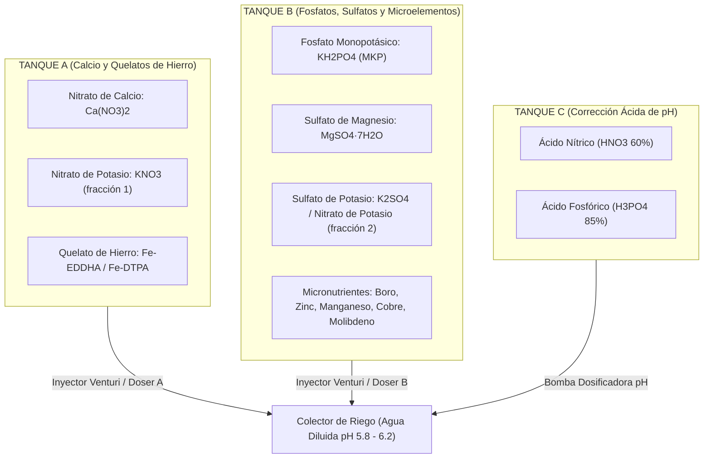

# Fertirriego, Formulación Nutricional y Manejo de Salinidad

Este documento contiene los algoritmos matemáticos y estequiométricos para el cálculo de soluciones nutritivas, dosificación de tanques concentrados (A, B y C) y balance de salinidad para tomate y pimentón bajo fertirriego por goteo.

---

## 1. Conversiones Estequiométricas Fundamentales

Las formulaciones agronómicas se calculan en **miliequivalentes por litro (meq/L)** o **milimoles por litro (mmol/L)** para garantizar la electroneutralidad de la solución:

$$\sum \text{Cationes (meq/L)} \approx \sum \text{Aniones (meq/L)}$$

### 1.1. Ecuaciones de Conversión

$$\text{meq/L} = \frac{\text{ppm (mg/L)}}{\text{Peso Equivalente}} = \frac{\text{ppm (mg/L)} \times |\text{Valencia}|}{\text{Peso Atómico}}$$

$$\text{ppm (mg/L)} = \text{meq/L} \times \frac{\text{Peso Atómico}}{|\text{Valencia}|}$$

$$\text{mmol/L} = \frac{\text{ppm (mg/L)}}{\text{Peso Molecular}} = \frac{\text{meq/L}}{|\text{Valencia}|}$$

### 1.2. Tabla de Pesos Atómicos, Valencias y Equivalentes

| Elemento / Ion | Símbolo / Fórmula | Peso Atómico (g/mol) | Valencia ($z$) | Peso Equivalente ($\text{g/eq}$) | Factor Conversión (1 meq/L a ppm) |
| :--- | :--- | :--- | :--- | :--- | :--- |
| **Nitrato** | $\text{NO}_3^-\ (\text{N})$ | 14.007 | 1 | 14.007 | 14.0 ppm de N |
| **Amonio** | $\text{NH}_4^+\ (\text{N})$ | 14.007 | 1 | 14.007 | 14.0 ppm de N |
| **Fósforo** | $\text{H}_2\text{PO}_4^-\ (\text{P})$ | 30.974 | 1 | 30.974 | 31.0 ppm de P |
| **Potasio** | $\text{K}^+$ | 39.098 | 1 | 39.098 | 39.1 ppm de K |
| **Calcio** | $\text{Ca}^{2+}$ | 40.078 | 2 | 20.039 | 20.0 ppm de Ca |
| **Magnesio** | $\text{Mg}^{2+}$ | 24.305 | 2 | 12.153 | 12.2 ppm de Mg |
| **Sulfato** | $\text{SO}_4^{2-}\ (\text{S})$ | 32.065 | 2 | 16.033 | 16.0 ppm de S |
| **Sodio** | $\text{Na}^+$ | 22.990 | 1 | 22.990 | 23.0 ppm de Na |
| **Cloruro** | $\text{Cl}^-$ | 35.453 | 1 | 35.453 | 35.5 ppm de Cl |
| **Bicarbonato** | $\text{HCO}_3^-$ | 61.016 | 1 | 61.016 | 61.0 ppm de $\text{HCO}_3$ |

### 1.3. Estimación Teórica de la Conductividad Eléctrica ($EC$)
Una solución equilibrada tiene una conductividad aproximada proporcional a la suma catiónica:

$$EC_{\text{teórica}} (\text{dS/m}) \approx \frac{\sum \text{Cationes (meq/L)}}{10} \approx \frac{\sum \text{Aniones (meq/L)}}{10}$$

*Fórmula empírica de sólidos disueltos totales (TDS):*
$$\text{TDS}\ (\text{mg/L}) \approx EC\ (\text{dS/m}) \times 640\quad (\text{para } EC < 5.0\ \text{dS/m})$$

---

## 2. Soluciones Nutritivas Estándar (Steiner / Sonneveld Modificadas)

### 2.1. Tomate Indeterminado de Hilo Alto (meq/L en Gotero)

| Nutriente | Trasplante - Enraizamiento | Vegetativo a 1er Cuajado | Fructificación Plena / Cosecha |
| :--- | :--- | :--- | :--- |
| $\text{N-NO}_3^-$ | $10.0 - 11.0$ | $12.0 - 13.5$ | $13.5 - 15.0$ |
| $\text{N-NH}_4^+$ | $0.8 - 1.0$ | $0.8 - 1.0$ | $0.5 - 0.8$ |
| $\text{H}_2\text{PO}_4^-$ | $1.2 - 1.5$ | $1.5 - 1.8$ | $1.5 - 1.8$ |
| $\text{K}^+$ | $5.0 - 6.0$ | $7.0 - 8.5$ | **$9.0 - 11.0$** |
| $\text{Ca}^{2+}$ | $8.0 - 9.0$ | $8.5 - 9.5$ | **$8.5 - 9.5$** |
| $\text{Mg}^{2+}$ | $3.0 - 3.5$ | $3.5 - 4.0$ | $3.5 - 4.5$ |
| $\text{SO}_4^{2-}$ | $3.0 - 3.5$ | $3.5 - 4.0$ | $4.0 - 5.0$ |
| **Relación K/Ca** | $\approx 0.65$ | $\approx 0.85 - 0.95$ | **$\approx 1.10 - 1.25$** |
| **EC Objetivo** | $1.8 - 2.0\ \text{dS/m}$ | $2.2 - 2.5\ \text{dS/m}$ | $2.5 - 3.0\ \text{dS/m}$ |

*Nota Crítica para Tomate:* En fructificación pico, si el ratio $\text{K/Ca}$ supera $1.5$ bajo alta transpiración (VPD $> 1.4\text{ kPa}$), el potasio inhibe competitivamente al calcio en los frutos distales, provocando **podredumbre apical (*Blossom End Rot*)**. Mantener siempre $\text{Ca}^{2+} \ge 8.5\ \text{meq/L}$.

### 2.2. Pimentón (*Capsicum annuum*) (meq/L en Gotero)

| Nutriente | Vegetativo Inicial | Floración y Cuajado | Engorde de Frutos |
| :--- | :--- | :--- | :--- |
| $\text{N-NO}_3^-$ | $11.0 - 12.0$ | $12.5 - 13.5$ | $13.0 - 14.0$ |
| $\text{N-NH}_4^+$ | $\le 0.5$ | $\le 0.5$ | $\le 0.3$ |
| $\text{H}_2\text{PO}_4^-$ | $1.2 - 1.4$ | $1.4 - 1.6$ | $1.4 - 1.6$ |
| $\text{K}^+$ | $5.5 - 6.5$ | $7.0 - 8.0$ | **$8.0 - 9.5$** |
| $\text{Ca}^{2+}$ | $8.5 - 9.5$ | $9.0 - 10.0$ | **$9.0 - 10.0$** |
| $\text{Mg}^{2+}$ | $3.0 - 3.5$ | $3.5 - 4.0$ | $3.5 - 4.0$ |
| $\text{SO}_4^{2-}$ | $3.0 - 3.5$ | $3.5 - 4.0$ | $3.5 - 4.5$ |
| **Relación K/Ca** | $\approx 0.65$ | $\approx 0.75 - 0.80$ | **$\approx 0.90 - 1.00$** |
| **EC Objetivo** | $1.8 - 2.1\ \text{dS/m}$ | $2.0 - 2.3\ \text{dS/m}$ | $2.2 - 2.6\ \text{dS/m}$ |

*Sensibilidad del Pimentón:* Es extremadamente sensible al amonio ($\text{NH}_4^+$). Mantener el amonio por debajo del $5\%$ del nitrógeno total para prevenir aborto radical y necrosis de ápices.

---

## 3. Matriz de Compatibilidad de Fertilizantes y Tanques Madre

Para preparar soluciones madre concentradas (ej. 100× o 200×):

### 3.1. Reglas Químicas Inviolables
1. **Calcio + Sulfato:** $\text{Ca}^{2+} + \text{SO}_4^{2-} \longrightarrow \text{CaSO}_4\downarrow$ (Precipitación de yeso insoluble, taponamiento masivo e instantáneo de emisores de goteo).
2. **Calcio + Fosfato:** $3\text{Ca}^{2+} + 2\text{PO}_4^{3-} \longrightarrow \text{Ca}_3(\text{PO}_4)_2\downarrow$ (Fosfato tricálcico insoluble a pH $> 6.2$).
3. **Quelatos de Hierro:** Proteger de la luz solar directa (fotodegradación rápida de Fe-EDTA / Fe-DTPA). Para suelos calcáreos o aguas con pH $> 7.0$, usar obligatoriamente **Fe-EDDHA** (estable hasta pH 9.0).

---

## 4. Algoritmo de Neutralización de Bicarbonatos y pH

Las aguas de pozo en regiones semiáridas suelen contener concentraciones elevadas de bicarbonatos ($\text{HCO}_3^-$ entre $2.0\ \text{y}\ 6.0\ \text{meq/L}$), lo que eleva el pH a $7.5 - 8.5$.

### 4.1. Bicarbonato Residual Objetivo
Para mantener un efecto tampón o buffer estable que evite caídas drásticas de pH en el sustrato:
$$\text{HCO}_{3\_residual}^- \approx 0.5 - 0.8\ \text{meq/L}\quad (\approx 30 - 50\ \text{ppm})$$

### 4.2. Bicarbonatos a Neutralizar
$$\Delta \text{HCO}_3^- = \text{HCO}_{3\_agua}^- - \text{HCO}_{3\_residual}^-\quad [\text{meq/L}]$$

### 4.3. Cálculo de Volumen de Ácido por Metro Cúbico ($1\ \text{m}^3$) de Agua

$$V_{\text{ácido}}\ (\text{mL/m}^3) = \frac{\Delta \text{HCO}_3^-\ (\text{meq/L}) \times 1000}{\text{Normalidad del Ácido (eq/L)}}$$

Donde:
* **Ácido Nítrico ($\text{HNO}_3$ al 60%, densidad $1.37\ \text{kg/L}$):**
  * Concentración: $\approx 13.0\ \text{eq/L}$ ($13.0\ \text{meq/mL}$).
  * Aporte de nitrógeno: $1\ \text{mL/m}^3$ aporta $13.0\ \text{meq de N}$ por cada 1.000 L ($13.0\ \text{ppm de N-NO}_3$).
  * Fórmula práctica:
    $$V_{\text{HNO}_3\ 60\%}\ (\text{mL/m}^3) = \frac{\Delta \text{HCO}_3^-}{0.0130} \approx \Delta \text{HCO}_3^- \times 76.9\ \text{mL/m}^3$$
* **Ácido Fosfórico ($\text{H}_3\text{PO}_4$ al 85%, densidad $1.68\ \text{kg/L}$):**
  * Concentración útil a pH 6.0 (primer protón): $\approx 14.6\ \text{eq/L}$.
  * Aporte de fósforo: $1\ \text{mL/m}^3$ aporta $\approx 14.6\ \text{ppm de P}$.

---

## 5. Algoritmo de Fracción de Lixiviación ($LF$) y Control de Salinidad

### 5.1. Ecuación de Rhodes / FAO-29
Para mantener la salinidad de la zona radicular en el umbral agronómico sin mermas de rendimiento:

$$LF = \frac{EC_w}{5 \times EC_e - EC_w}$$

Donde:
* $EC_w$: Conductividad eléctrica del agua de riego de entrada (dS/m).
* $EC_e$: Conductividad eléctrica máxima tolerable del extracto de saturación del suelo sin pérdida de rendimiento ($1.5\ \text{dS/m}$ para pimentón, $2.5\ \text{dS/m}$ para tomate).

### 5.2. Cálculo del Volumen Bruto de Riego
$$V_{bruto}\ (\text{L/planta/día}) = \frac{ET_c\ (\text{L/planta/día})}{1 - LF}$$

### 5.3. Monitoreo del Drenaje en Sustrato (Bandejas de Control)
En cultivo hidropónico o enarenado con goteros:
$$\% \text{Drenaje Real} = \frac{V_{drenado}}{V_{aplicado}} \times 100$$
$$EC_{\text{drenaje}} \le EC_{\text{aporte}} + 1.0\ \text{dS/m}$$
*Si $EC_{\text{drenaje}} > EC_{\text{aporte}} + 1.5\ \text{dS/m}$, el sistema debe disparar automáticamente un pulso de lixiviación con agua y 20% más de volumen.*
