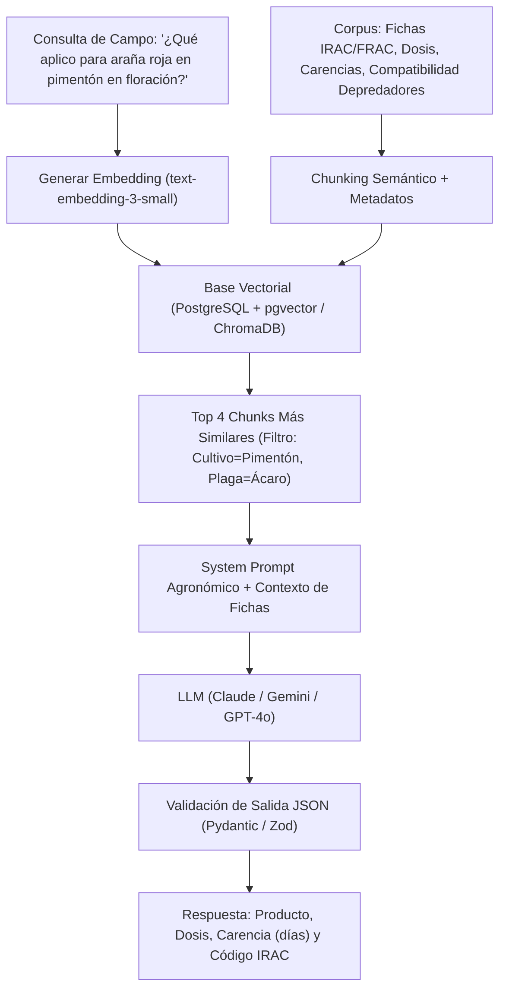

# Inteligencia Artificial, Machine Learning y Análisis Estadístico en Agricultura

Este documento proporciona los fundamentos matemáticos, algoritmos y flujos de trabajo para la implementación de modelos estadísticos, visión por computadora y analítica predictiva en el sector agropecuario.

---

## 1. Diseños Experimentales y Análisis Estadístico de Ensayos de Campo

Los ensayos agronómicos (evaluación de híbridos, bioestimulantes, frecuencias de riego, dosis de fertilización) están sujetos a variabilidad espacial intrínseca del suelo y microclima.

### 1.1. Diseño de Bloques Completos al Azar (DBCA / RCBD)
El modelo lineal aditivo para aislar el efecto del gradiente ambiental mediante bloques es:

$$y_{ij} = \mu + \tau_i + \beta_j + \epsilon_{ij}$$

Donde:
* $y_{ij}$: Variable de respuesta (ej. rendimiento en kg/planta, calibre en mm, °Brix).
* $\mu$: Media general.
* $\tau_i$: Efecto del $i$-ésimo tratamiento ($i = 1, \dots, t$).
* $\beta_j$: Efecto del $j$-ésimo bloque ($j = 1, \dots, b$).
* $\epsilon_{ij}$: Error experimental aleatorio, con supuesto $\epsilon_{ij} \sim \mathcal{N}(0, \sigma^2)$.

### 1.2. Tabla de Análisis de Varianza (ANOVA DBCA)

| Fuente de Variación | Grados de Libertad ($GL$) | Suma de Cuadrados ($SS$) | Cuadrado Medio ($MS$) | Estadístico $F$ |
| :--- | :--- | :--- | :--- | :--- |
| **Tratamientos** | $t - 1$ | $SS_{Trat} = b \sum (\bar{y}_{i\cdot} - \bar{y}_{\cdot\cdot})^2$ | $\frac{SS_{Trat}}{t - 1}$ | $F_{Trat} = \frac{MS_{Trat}}{MS_{Error}}$ |
| **Bloques** | $b - 1$ | $SS_{Bloq} = t \sum (\bar{y}_{\cdot j} - \bar{y}_{\cdot\cdot})^2$ | $\frac{SS_{Bloq}}{b - 1}$ | $F_{Bloq} = \frac{MS_{Bloq}}{MS_{Error}}$ |
| **Error Experimental** | $(t - 1)(b - 1)$ | $SS_{Error} = SS_{Total} - SS_{Trat} - SS_{Bloq}$ | $\frac{SS_{Error}}{(t-1)(b-1)}$ | — |
| **Total** | $N - 1$ ($b \cdot t - 1$) | $SS_{Total} = \sum \sum (y_{ij} - \bar{y}_{\cdot\cdot})^2$ | — | — |

* **Regla de Decisión:** Si $p\text{-valor} < 0.05$ (o $0.01$), se rechaza $H_0$ (existen diferencias significativas entre tratamientos).

### 1.3. Validación de Supuestos y Pruebas Post-Hoc
1. **Normalidad de Residuos:** Prueba de **Shapiro-Wilk** ($W$). Si $p < 0.05$, aplicar transformación Box-Cox o usar pruebas no paramétricas (Kruskal-Wallis).
2. **Homocedasticidad (Varianza Constante):** Prueba de **Levene** o Bartlett.
3. **Comparación Múltiple de Medias (Tukey HSD):**
   $$HSD = q_{\alpha, t, GL_{error}} \sqrt{\frac{MS_{Error}}{b}}$$
   Cualquier par de medias cuya diferencia $|\bar{y}_i - \bar{y}_j| > HSD$ se considera estadísticamente distinta al nivel de significancia $\alpha$.

---

## 2. Procesamiento de Señales y Telemetría de Sensores Agrícolas

### 2.1. Filtro de Hampel para Detección y Remoción de Outliers
Los sensores de humedad de suelo TDR/FDR y sondas de conductividad en campo sufren picos espurios debido a burbujas de aire, fluctuaciones de voltaje o pisadas de operarios.

* **Algoritmo de Hampel:** Sobre una ventana deslizante temporal de tamaño $W = 2k + 1$:
  1. Calcular la mediana local: $m_i = \text{mediana}(x_{i-k}, \dots, x_i, \dots, x_{i+k})$.
  2. Calcular la Desviación Absoluta Mediana (MAD):
     $$\text{MAD}_i = 1.4826 \times \text{mediana}(|x_{i-k} - m_i|, \dots, |x_{i+k} - m_i|)$$
  3. Si $|x_i - m_i| > 3 \times \text{MAD}_i$, $x_i$ se clasifica como *outlier* y se reemplaza por $m_i$.

### 2.2. Compensación de Deriva (Drift) en Sensores Electroquímicos
Las sondas de pH y CE sufren ensuciamiento y envejecimiento de membrana:
$$V_{\text{calibrado}}(t) = S(t) \cdot V_{\text{bruto}}(t) + O(t)$$
Donde la ganancia $S(t)$ y el offset $O(t)$ se recalculan en cada calibración con soluciones patrón ($4.01 / 7.00\ \text{pH}$ y $1.413\ \text{mS/cm}$).

---

## 3. Visión por Computadora (Computer Vision) en el Borde

### 3.1. Detección y Conteo de Plagas en Trampas Cromotrópicas
* **Arquitectura:** **YOLOv8 Nano / Small** o **YOLOv11 Nano** entrenado con datasets de plagas agrícolas.
* **Clases Principales:**
  0: `mosca_blanca` (*Bemisia tabaci*)
  1: `trips` (*Frankliniella occidentalis*)
  2: `pulgon` (*Aphis*)
  3: `minador_adulto` (*Liriomyza*)
* **Métricas Objetivo:** $\text{mAP@50} \ge 0.88$, tiempo de inferencia $< 45\ \text{ms}$ en CPU móvil.
* **Conteo por Densidad de Trampa:**
  $$\text{Densidad} = \frac{\sum \text{detecciones}}{\text{Área de trampa (cm}^2\text{)}}\quad [\text{insectos/cm}^2/\text{día}]$$
  * Si $\text{Densidad}_{\text{mosca}} \ge 0.5\ \text{ind/cm}^2/\text{d} \longrightarrow$ Alerta Amarilla (Monitoreo reforzado).
  * Si $\text{Densidad}_{\text{mosca}} \ge 1.5\ \text{ind/cm}^2/\text{d} \longrightarrow$ Alerta Roja (Intervención biológica/química inmediata).

### 3.2. Clasificación de Madurez y Aforo de Cosecha en Tomate
* **Segmentación de Instancias:** Identificación de contorno individual de fruto.
* **Escala de Maduración USDA (6 Estados):**
  1. Verde (*Green*)
  2. Rompiente / Viraje (*Breaker*: < 10% superficie rosa/amarilla)
  3. Cambiante (*Turning*: 10 - 30%)
  4. Rosa (*Pink*: 30 - 60%)
  5. Rojo Claro (*Light Red*: 60 - 90%)
  6. Rojo Maduro (*Red*: > 90%)
* **Estimación de Masa por Visión:**
  $$V \approx \frac{4}{3} \pi a b^2 \quad (\text{elipsoide prolato}),\quad \text{Masa} \approx V \times \rho_{\text{tomate}}\ (\rho \approx 0.96 - 0.99\ \text{g/cm}^3)$$

### 3.3. Inferencia Offline en Cliente con ONNX Runtime Web
Para permitir que el agrónomo o mayordomo tome una fotografía en campo sin señal telefónica:
1. Exportar el modelo PyTorch a ONNX: `model.export(format="onnx", imgsz=640, half=True)`.
2. Cuantización INT8: Reducción del tamaño de ~25 MB a ~6.5 MB.
3. Inferencia en el navegador: Cargar con `@microsoft/onnxruntime-web` ejecutado en WebGL / WebGPU o WASM multihilo.

---

## 4. Modelos Predictivos Tabulares y Series Temporales

### 4.1. Predicción Semanal de Cosecha (Yield Forecasting)
* **Algoritmo Recomendado:** **LightGBM / CatBoost** (manejan relaciones no lineales y datos climáticos con alta fidelidad).
* **Matriz de Características (Feature Engineering):**
  * $GDD_{\text{cum\_7d}}$, $GDD_{\text{cum\_30d}}$: Grados-día acumulados.
  * $DLI_{\text{prom\_14d}}$: Integral de luz diaria promedio de las últimas dos semanas.
  * $VPD_{\text{max\_diario\_prom}}$: Estrés térmico registrado.
  * $\text{Agua}_{\text{total\_semanal}}$: Litros aplicados por metro cuadrado.
  * $\text{Conteo\_Flores}_{\text{lag\_42d}}$: Conteo de racimos en floración de hace 6 semanas (lag fenológico de cuajado a madurez).
* **Métrica de Desempeño:** $\text{MAPE} \le 12\%$ en la predicción del volumen semanal (cajas/semana).

### 4.2. Detección de Anomalías en Red de Riego (Leak & Clogging Detection)
* **Algoritmo:** **Isolation Forest** o **Autoencoder Convolucional 1D** sobre la relación presión de cabezal vs caudalímetro ($\Delta P \text{ vs } Q$):
  * **Fuga / Rotura de Tubería:** Caudal anómalamente alto con caída brusca de presión en el sector.
  * **Taponamiento de Goteros / Filtros Colmatados:** Presión elevada en el colector con disminución progresiva del caudal total ($Q < 0.85 \times Q_{\text{nominal}}$).

---

## 5. Asistentes Agronómicos Inteligentes con RAG (Retrieval-Augmented Generation)

### 5.1. Arquitectura del Agente Asesor Agronómico

### 5.2. Reglas Estrictas del System Prompt Agronómico
1. **Prohibición de Inventar Dosificaciones:** Si la dosis no está explícita en el contexto recuperado, el agente debe declarar: *"Consulte la etiqueta oficial del fabricante"*.
2. **Prioridad de Residuos Cero:** Advertir siempre el **Período de Carencia (PHI / Días a Cosecha)** y el **Intervalo de Reingreso (REI / Horas de Seguridad)**.
3. **Respeto a Enemigos Naturales:** Si el productor utiliza control biológico (ej. *Amblyseius swirskii*), desaconsejar piretroides y organofosforados de amplio espectro.
