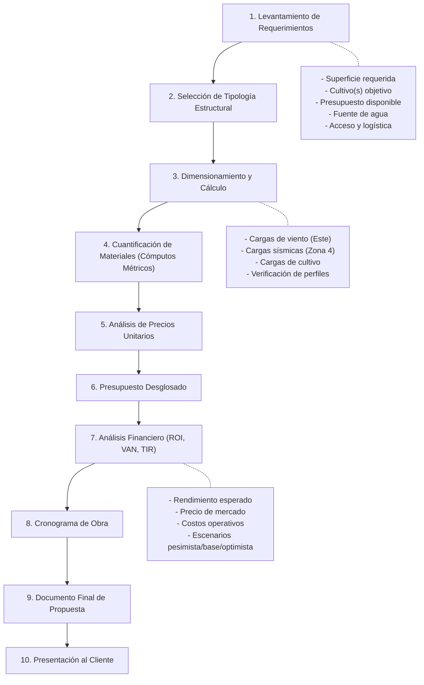

# Arquitecto e Ingeniero Estructural de Invernaderos y Casas de Malla

## Propuestas de Negocio para Fabricación de Estructuras Protegidas — Valle de Quíbor

Este skill dota al agente del perfil completo de un **Arquitecto-Ingeniero Estructural Senior** que además domina la **agronomía de cultivos protegidos** y la **formulación de propuestas comerciales** para la fabricación e instalación de invernaderos y casas de malla en el Valle de Quíbor.

> **Filosofía del Skill:** No se trata solo de calcular vigas y tensores; el ingeniero estructural de invernaderos debe entender *por qué* cada decisión constructiva impacta directamente el rendimiento del cultivo, el retorno de inversión del productor y la viabilidad del proyecto. Cada propuesta de negocio es un documento técnico-comercial que debe convencer tanto al agrónomo como al inversionista.

---

## 1. Georreferenciación y Parámetros de Sitio (Datos de Diseño)

Toda propuesta, cálculo o memoria descriptiva debe partir de los parámetros verificados del sitio:

| Parámetro | Valor de Diseño | Fuente |
| :--- | :--- | :--- |
| **Coordenadas** | $9^\circ 53' 20.0''\ \text{N},\ 69^\circ 35' 35.0''\ \text{W}$ | GPS / Google Maps |
| **Elevación** | 695 – 710 msnm | Modelo digital de terreno |
| **Clasificación Climática** | Köppen BSh (Semiárido cálido) | NASA MERRA-2 |
| **Temperatura Máxima de Diseño** | 31 °C (marzo) | MERRA-2, serie 1980-2016 |
| **Temperatura Mínima de Diseño** | 19 °C (julio-agosto) | MERRA-2 |
| **Velocidad Media del Viento** | 7.0 – 10.4 km/h | MERRA-2 |
| **Ráfaga de Diseño** | 27 km/h (7.5 m/s) | Registros regionales |
| **Dirección Dominante** | ESTE (88% persistencia, 11 meses) | Rosa de vientos validada |
| **Precipitación Máxima Mensual** | 104 mm (mayo) | MERRA-2 |
| **Zona Sísmica** | 4 (Alta sismicidad — Norma COVENIN 1756) | FUNVISIS |
| **Tipo de Suelo Superficial** | Franco-arcilloso a arcilloso (sedimentario lacustre) | Estudios CIDIAT-ULA |

---

## 2. Tipologías Estructurales para Quíbor

### 2.1. Casa de Malla Tipo Parral Plano Tensado (Tipo Almería Adaptado)

Estructura económica de techo plano o ligeramente inclinado (2-5%), con cubierta 100% de malla anti-insectos. Ideal para casas de malla de 1.000 – 5.000 m².

```
┌─────────────────────────────────────────────────┐
│  VISTA FRONTAL — PARRAL PLANO TENSADO           │
│                                                 │
│         ══════════════════════════    ← Malla    │
│        / Guayas de acero (techo) \   ← 3.80 m   │
│       /                          \              │
│  ┃───┃──────────────────────────┃───┃  Pilares  │
│  ┃   ┃                          ┃   ┃  3.00 m   │
│  ┃   ┃     Zona de Cultivo      ┃   ┃  (alero)  │
│  ┃   ┃                          ┃   ┃           │
│  ████████████████████████████████████  Suelo    │
│  [Dado]                          [Dado] Ciment. │
└─────────────────────────────────────────────────┘
```

**Especificaciones Constructivas:**
- **Pilares perimetrales:** Tubo galvanizado Ø 2½" × 2.0 mm, empotrados en dados de concreto 40×40×60 cm
- **Pilares interiores:** Tubo galvanizado Ø 2" × 2.0 mm, separación modular 4.00 m × 4.00 m
- **Techo:** Red de guayas de acero galvanizado trenzado ¼" (6.35 mm) 6×19, tensadas en cuadrícula de 1.00 m × 1.00 m
- **Cubierta:** Malla HDPE monofilamento 50 mesh, 110 gsm, color blanco
- **Altura libre al alero:** 3.00 m mínimo (3.80 m óptimo para tomate indeterminado)
- **Pendiente de techo:** 2-5% para evacuación de lluvia

### 2.2. Casa de Malla Plana Total (Tipo Parral Almeriense 100% Malla)

Estructura **completamente plana** donde **tanto las paredes como el techo son de malla anti-insectos**, sin ningún elemento de cubierta plástica, arcos ni cerchas. Es la tipología más económica, de máxima ventilación natural y la más adecuada para el clima semiárido caliente de Quíbor donde el **sobrecalentamiento** es el enemigo principal, no el frío.

La estructura consiste en una retícula de pilares de acero galvanizado conectados en sus cabezas por alambres de acero de alta resistencia (alambrones o guayas) que forman una red tensada plana sobre la cual se tiende la malla. Las paredes perimetrales son igualmente de malla, fijada con perfil de aluminio y resorte zig-zag. No existen arcos, cerchas ni cumbreras: **el techo es un plano horizontal** con ligera pendiente (1-3%) para evacuación de lluvia.

```
┌──────────────────────────────────────────────────────────────────────┐
│  VISTA FRONTAL — CASA DE MALLA PLANA TOTAL (TIPO PARRAL)            │
│                                                                      │
│  ════════════════════════════════════════════════════  ← Malla techo │
│  ┃    ┃    ┃    ┃    ┃    ┃    ┃    ┃    ┃    ┃    ┃  ← Alambrones  │
│  ┃    ┃    ┃    ┃    ┃    ┃    ┃    ┃    ┃    ┃    ┃    tensados    │
│  ┃    ┃    ┃    ┃    ┃    ┃    ┃    ┃    ┃    ┃    ┃  ← h = 3.00 m │
│  ┃    ┃    ┃    ┃    ┃    ┃    ┃    ┃    ┃    ┃    ┃    (pimentón)  │
│  ┃    ┃    ┃    ┃    ┃    ┃    ┃    ┃    ┃    ┃    ┃    h = 3.80 m │
│M ┃    ┃    ┃    ┃    ┃    ┃    ┃    ┃    ┃    ┃    ┃ M  (tomate)   │
│A ┃    ┃    ┃    ┃    ┃    ┃    ┃    ┃    ┃    ┃    ┃ A              │
│L ┃    ┃    ┃    ┃    ┃    ┃    ┃    ┃    ┃    ┃    ┃ L  Pilares     │
│L ┃    ┃    ┃    ┃    ┃    ┃    ┃    ┃    ┃    ┃    ┃ L  interiores  │
│A ┃    ┃    ┃    ┃    ┃    ┃    ┃    ┃    ┃    ┃    ┃ A  cada 4 m   │
│  █████████████████████████████████████████████████████  Suelo       │
│  [D]  4m   4m   4m   4m   4m   4m   4m   4m   4m [D]  Dados cim.  │
│                    Ancho total = 40.0 m                              │
└──────────────────────────────────────────────────────────────────────┘

┌──────────────────────────────────────────────────────────────────────┐
│  VISTA EN PLANTA — RETÍCULA DE ALAMBRONES (TECHO)                   │
│                                                                      │
│  ┌────┬────┬────┬────┬────┬────┬────┬────┬────┬────┐                │
│  │    │    │    │    │    │    │    │    │    │    │  Cuadrícula     │
│  ├────┼────┼────┼────┼────┼────┼────┼────┼────┼────┤  de alambrones │
│  │    │    │    │    │    │    │    │    │    │    │  1.0 m × 1.0 m │
│  ├────┼────┼────┼────┼────┼────┼────┼────┼────┼────┤                │
│  │    │    │    │    │    │    │    │    │    │    │  Malla 50 mesh  │
│  ├────┼────┼────┼────┼────┼────┼────┼────┼────┼────┤  sobre la red  │
│  │    │    │    │    │    │    │    │    │    │    │                │
│  ├────┼────┼────┼────┼────┼────┼────┼────┼────┼────┤  Guaya perim. │
│  │    │    │    │    │    │    │    │    │    │    │  ¼" en borde   │
│  └────┴────┴────┴────┴────┴────┴────┴────┴────┴────┘                │
│   ↑                                                  ↑              │
│   Tensores                                   Tensores               │
│   perimetrales                             perimetrales             │
└──────────────────────────────────────────────────────────────────────┘
```

#### Especificaciones Constructivas — Casa de Malla Plana Total

> **📦 Material Base del Proyecto:**
> - **Tubería:** Tubo redondo de ventilación **Ø 2" × 2.3 mm × 6 m** — Precio unitario: **$24.98 USD/tubo**
> - **Malla:** HDPE monofilamento virgen **130 gsm, 50×25 mesh, blanca** — Rollos de **4 m × 100 m** (400 m²/rollo)

| Elemento | Especificación | Detalle |
| :--- | :--- | :--- |
| **Pilares perimetrales** | **Tubo redondo Ø 2" × 2.3 mm × 6 m** (galv. caliente Z-275) | Cortado a medida, empotrados en dados 40×40×60 cm, separación 4.00 m. **$24.98/tubo** |
| **Pilares esquineros** | **Tubo redondo Ø 2" × 2.3 mm × 6 m** (galv. caliente Z-275) — Doble tubo | 2 tubos soldados con platina de refuerzo + tornapuntas diagonal a 45° y tensor de guaya |
| **Pilares interiores** | **Tubo redondo Ø 2" × 2.3 mm × 6 m** (galv. caliente Z-275) | Cuadrícula modular 4.00 m × 4.00 m. Cortado a largo de pilar. **$24.98/tubo** |
| **Correas horizontales** | **Tubo redondo Ø 2" × 2.3 mm × 6 m** (galv. caliente Z-275) | Correas de arriostramiento perimetral y a media altura. **$24.98/tubo** |
| **Cabeza de pilar** | Platina soldada 100×100×6 mm con 4 orificios | Para paso y amarre de alambrones en ambos sentidos |
| **Alambrones de techo** | Alambre de acero galvanizado alta resistencia cal. 10 (3.4 mm) | Red ortogonal 1.00 m × 1.00 m, tensados con carraca |
| **Guaya perimetral superior** | Guaya de acero ¼" (6.35 mm) 6×19 galvanizada | Cordón de borde que recibe el perímetro de la malla de techo |
| **Cubierta de techo** | **Malla HDPE 50×25 mesh, 130 gsm, blanca, monofilamento** | Rollos de 4 m × 100 m. Tendida sobre la red de alambrones, atada con hilo HDPE cada 50 cm |
| **Cerramientos laterales** | **Malla HDPE 50×25 mesh, 130 gsm, blanca, monofilamento** | Rollos de 4 m × 100 m. Fijada con perfil aluminio tipo "C" y resorte zig-zag galvanizado |
| **Tensores perimetrales** | Tensores forjados ojo-ojo ½" galvanizados | En pilares esquineros y cada 3 pilares en fachada Este |
| **Muertos de anclaje** | Concreto ciclópeo enterrado a 45°, profundidad 1.0 m | Obligatorios en las 4 esquinas y cada 12 m en fachada Este |
| **Cimentación** | Dados concreto ciclópeo f'c = 210 kgf/cm² | 40×40×60 cm (perímetro), 30×30×50 cm (interiores) |
| **Pendiente de techo** | 1 – 3% | Lograda mediante pilares de altura decreciente N→S o E→W |
| **Evacuación pluvial** | Canaleta de chapa gal. cal. 26 en borde bajo del techo | La malla permite paso del 40-55% del agua; la canaleta recoge escorrentía |

#### Alturas Recomendadas según Cultivo

| Cultivo | Altura Mínima del Pilar | Altura Óptima | Volumen Interior (por 1.000 m²) |
| :--- | :---: | :---: | :---: |
| **Pimentón** (porte 0.8-1.2 m) | 2.50 m | **3.00 m** | 2.500 – 3.000 m³ |
| **Tomate Indeterminado** (hilo alto a 2.2 m) | 3.00 m | **3.80 m** | 3.000 – 3.800 m³ |
| **Pepino / Melón tutorado** | 2.80 m | **3.50 m** | 2.800 – 3.500 m³ |

> **⚠️ Advertencia Termodinámica para Tomate en Parral Plano:**
> La casa de malla plana a 3.80 m tiene un volumen buffer de ~3.800 m³ por cada 1.000 m², significativamente menor que un multitúnel de 5.5 m de cumbrera (~4.250 m³). Esto implica que la temperatura interna puede superar los **33-35 °C** en las horas pico de marzo-abril si el viento baja de 5 km/h. Para mitigar:
> 1. Instalar **7-10 extractores eólicos cenitales** (24"-30") como refuerzo convectivo
> 2. Considerar **malla de sombreo removible** (35-50% sombra) sobre el techo de malla durante marzo-abril
> 3. Aumentar frecuencia de riego en horas de calor para enfriamiento evaporativo del sustrato
>
> **Para pimentón, la altura de 3.00 m en parral plano es completamente viable y óptima.**

#### Ventajas de la Casa de Malla Plana Total

1. **Costo mínimo:** Es la tipología más económica (USD 12-18/m²), sin arcos, cerchas ni curvado de tubos
2. **Máxima ventilación:** El techo de malla permite ventilación vertical directa (convección cenital) además de la ventilación lateral — 100% del perímetro + 100% del techo son permeables al aire
3. **Fabricación sencilla:** No requiere dobladora de tubos, roladora ni equipos especiales; solo corte, soldadura y galvanizado de tubos rectos
4. **Montaje rápido:** Pilares verticales rectos con alambrones tensados; se monta en **4-6 semanas** para 1.000 m²
5. **Difusión solar natural:** La malla blanca en el techo difumina la radiación directa, reduciendo quemaduras foliares y mejorando la penetración de luz al dosel inferior
6. **Drenaje pluvial:** La malla permite el paso parcial de lluvia (~40-55%), reduciendo la carga hidrostática sobre la estructura vs. plástico (que retiene el 100%)
7. **Resistencia a viento:** El techo plano de malla ofrece menor área de succión que un arco, y el coeficiente de arrastre de la malla ($C_d = 0.60-0.70$) reduce significativamente las cargas eólicas vs. plástico ($C_d = 1.0$)

#### Limitaciones

1. **Sin control de lluvia:** El cultivo recibe lluvia parcial directa, lo que puede favorecer enfermedades foliares (*Phytophthora*, *Alternaria*) en temporada húmeda (mayo-octubre)
2. **Menor volumen buffer térmico:** Comparado con multitúnel de 5.5 m; requiere extractores eólicos complementarios para tomate en meses calientes
3. **No apta para climas fríos o de helada:** No proporciona efecto invernadero (calentamiento pasivo nocturno); solo es barrera física contra insectos y viento
4. **Vida útil de la malla de techo:** La malla de techo expuesta a radiación UV directa puede degradarse más rápido (4-6 años) que la malla lateral (6-8 años); considerar reposición selectiva

#### Cómputos Métricos de Referencia — Casa de Malla Plana 1.000 m² (40 m × 25 m)

> **Tubo base:** Ø 2" × 2.3 mm × 6 m — **$24.98 USD c/u**
> **Malla base:** 130 gsm, 50×25 mesh, blanca — Rollos 4 m × 100 m (400 m²/rollo)

| Material | Cantidad | Unidad | Tubos de 6 m | Costo Tubería (USD) | Nota |
| :--- | :---: | :--- | :---: | :---: | :--- |
| Pilares perimetrales Ø 2" × 2.3 mm, L = 3.80 m | 34 | und | 34 | $849.32 | Perímetro cada 4.0 m. Un tubo/pilar (sobran 2.20 m para correas) |
| Pilares esquineros Ø 2" × 2.3 mm, L = 3.80 m (doble) | 4 | und | 8 | $199.84 | 2 tubos/esquina soldados con platina |
| Pilares interiores Ø 2" × 2.3 mm, L = 3.80 m | 54 | und | 54 | $1,348.92 | Cuadrícula 4 m × 4 m (9 × 6) |
| Correas horizontales perim. Ø 2" × 2.3 mm | 130 | ml | 22 | $549.56 | Arriostramiento perimetral a media altura (1.80 m) |
| Correas de refuerzo fachada Este | 25 | ml | 5 | $124.90 | Correa adicional a media altura en fachada E |
| Tornapuntas esquineros Ø 2" × 2.3 mm, L ≈ 2.7 m | 8 | und | 4 | $99.92 | 2 por esquina, cortados de tubos de 6 m |
| **SUBTOTAL TUBERÍA** | — | — | **127** | **$3,172.46** | — |
| | | | | | |
| Alambre galvanizado cal. 10 (techo, red 1m×1m) | ~2.600 | ml | — | — | 40 alambrones de 25 m + 25 de 40 m |
| Guaya perimetral superior ¼" | 130 | ml | — | — | Perímetro (2×40 + 2×25) |
| **Malla 130 gsm 50×25 mesh blanca (techo)** | **1.100** | **m²** | — | — | **2.75 rollos** de 4 m × 100 m (+10% solapes) |
| **Malla 130 gsm 50×25 mesh blanca (laterales)** | **520** | **m²** | — | — | **1.30 rollos** de 4 m × 100 m (perímetro × h + solapes) |
| **TOTAL MALLA** | **1.620** | **m²** | — | — | **≈ 4.05 rollos → Comprar 5 rollos** de 4 m × 100 m |
| Perfil aluminio tipo "C" (fijación malla) | 260 | ml | — | — | Perímetro × 2 (superior e inferior) |
| Resorte zig-zag galvanizado | 260 | ml | — | — | Ídem |
| Tensores ojo-ojo ½" galvanizados | 16 | und | — | — | 4 esquinas + cada 12 m fachada E |
| Muertos de anclaje (concreto ciclópeo) | 16 | und | — | — | Ídem tensores |
| Dados de cimentación 40×40×60 cm | 38 | und | — | — | Perimetrales + esquineros |
| Dados de cimentación 30×30×50 cm | 54 | und | — | — | Interiores |
| Puerta esclusa doble cortina (2.0 × 2.5 m) | 1 | und | — | — | Fachada Norte o Sur |

### 2.3. Casa de Malla Multitúnel (Arco Gótico / Semicircular)

Estructura de arcos metálicos con cubierta de malla. Mayor volumen de aire por metro cuadrado. Ideal para tomate de hilo alto con alturas de cumbrera de 5.5 – 6.5 m.

```
┌─────────────────────────────────────────────────┐
│  VISTA FRONTAL — MULTITÚNEL 5 NAVES             │
│                                                 │
│    ⌢       ⌢       ⌢       ⌢       ⌢          │
│   / \     / \     / \     / \     / \   ← 5.5 m│
│  /   \   /   \   /   \   /   \   /   \  Cumbr. │
│ /     \ /     \ /     \ /     \ /     \         │
│┃       ┃       ┃       ┃       ┃       ┃← 3.0 m│
│┃       ┃       ┃       ┃       ┃       ┃ Alero │
│┃       ┃       ┃       ┃       ┃       ┃        │
│████████████████████████████████████████  Suelo  │
│ 8.0 m   8.0 m   8.0 m   8.0 m   8.0 m          │
│              Ancho total = 40.0 m               │
└─────────────────────────────────────────────────┘
```

**Especificaciones Constructivas:**
- **Arcos:** Tubo galvanizado Ø 2½" × 2.5 mm doblado en arco gótico, radio de curvatura calculado para luz de 8.0 m
- **Pilares columna:** Tubo galvanizado Ø 3" × 2.5 mm o perfil cuadrado 76×76×2.5 mm
- **Cimentación:** Dados de concreto armado 50×50×80 cm con espárrago embebido M16
- **Arriostramientos:** Cruces de San Andrés con guaya ¼" en cada tramo perimetral y cada 3 tramos interiores
- **Canales:** Chapa galvanizada calibre 24 para evacuación pluvial entre naves

### 2.4. Invernadero con Cubierta de Plástico (Polietileno o Policarbonato)

Estructura cerrada con cubierta plástica, ventilación cenital y lateral controlada. Mayor inversión pero control climático superior.

- **Cubierta:** Polietileno tricapa coextruido 200 micras UV-estabilizado (4-5 años) o policarbonato alveolar 6-8 mm (10-15 años)
- **Ventilación cenital:** Apertura continua tipo mariposa con malla anti-insectos en aberturas
- **Ventilación lateral:** Cortinas enrollables motorizadas con malla 50 mesh

---

## 3. Ingeniería Estructural y Cálculos de Resistencia

### 3.1. Cargas de Diseño para Quíbor

#### A. Carga de Viento (NVE / COVENIN 2003)

La presión dinámica del viento sobre la estructura se calcula como:

$$q = \frac{1}{2} \rho v^2$$

Donde $\rho = 1.127\ \text{kg/m}^3$ (densidad del aire a 700 msnm y 28 °C) y $v$ es la velocidad de diseño.

**Velocidad de Diseño con Factor de Seguridad:**
$$V_{diseño} = V_{ráfaga} \times F_S = 27\ \text{km/h} \times 1.5 = 40.5\ \text{km/h} = 11.25\ \text{m/s}$$

**Presión Dinámica Básica:**
$$q_0 = \frac{1}{2} \times 1.127 \times 11.25^2 = 71.3\ \text{N/m}^2 = 7.27\ \text{kgf/m}^2$$

**Presión Efectiva sobre Malla Anti-Insectos:**
La malla actúa como un filtro poroso que reduce pero no elimina la carga eólica:
$$q_{malla} = q_0 \times C_{d,malla} \times C_p$$
- $C_{d,malla}$ (Coef. de arrastre de malla 50 mesh): 0.60 – 0.80
- $C_p$ (Coef. de presión según geometría): 0.80 (barlovento), -0.50 (sotavento), -0.70 (succión cubierta)

$$q_{barlovento} = 71.3 \times 0.70 \times 0.80 = 39.9\ \text{N/m}^2 \approx 4.1\ \text{kgf/m}^2$$

#### B. Carga de Lluvia (Estancamiento en Cubierta Plana)

$$W_{lluvia} = \rho_{agua} \times g \times h_{max} = 1000 \times 9.81 \times 0.05 = 490\ \text{N/m}^2 = 50\ \text{kgf/m}^2$$

Para cubiertas planas de malla, considerar acumulación máxima de 50 mm (mayo, evento extremo).

#### C. Carga de Cultivo Suspendido (Tomate de Hilo Alto)

| Parámetro | Valor | Unidad |
| :--- | :---: | :--- |
| Peso por planta en plena carga | 4.0 – 6.0 | kg |
| Densidad de plantación | 2.2 – 2.5 | plantas/m² |
| Carga distribuida en tutorado | 10 – 15 | kg/m lineal |
| Carga puntual por gancho | 5 – 8 | kg |

#### D. Carga Sísmica (COVENIN 1756 — Zona 4)

Quíbor se encuentra en **Zona Sísmica 4** (alta peligrosidad). Para estructuras agrícolas ligeras:
- **Coeficiente sísmico horizontal:** $A_0 = 0.30g$ (aceleración de diseño)
- **Factor de importancia:** $I = 1.0$ (estructura ocupacional temporal)
- **Factor de reducción:** $R = 4.0$ (estructura metálica arriostrada)
- **Cortante basal de diseño:**
$$V_{sismo} = \frac{A_0 \times I}{R} \times W_{total} = \frac{0.30 \times 1.0}{4.0} \times W = 0.075 \times W$$

### 3.2. Diseño de Elementos Estructurales

#### A. Verificación de Pilares a Compresión + Flexión

Para pilares perimetrales sometidos a viento lateral (el caso crítico en la fachada ESTE):

**Carga axial combinada con momento flector:**
$$\frac{P}{P_n} + \frac{M}{M_n} \le 1.0$$

Donde:
- $P$ = carga axial por peso propio + cultivo + cubierta
- $P_n$ = capacidad nominal a compresión del tubo (según esbeltez $\lambda = KL/r$)
- $M$ = momento flector por presión de viento = $q_{barlovento} \times s \times \frac{h^2}{2}$
- $M_n$ = capacidad nominal a flexión del perfil tubular

**Ejemplo para pilar perimetral Ø 2½" × 2.5 mm, h = 3.80 m, separación s = 4.0 m:**
- $I = 7.56\ \text{cm}^4$, $W = 4.74\ \text{cm}^3$, $A = 3.73\ \text{cm}^2$, $r = 1.42\ \text{cm}$
- $\lambda = \frac{2.0 \times 380}{1.42} = 535$ → Requiere arriostamiento intermedio o tubo mayor
- **Solución:** Arriostrar a media altura con correa horizontal o usar Ø 3" × 2.5 mm ($r = 1.81\ \text{cm}$, $\lambda = 420$)

#### B. Dimensionamiento de Guayas y Tensores

**Tensión en guaya perimetral de anclaje (fachada Este):**
$$T = q_{viento} \times A_{tributaria} \times F_S$$

Para un panel de malla de 4.0 m × 3.80 m con $q = 40\ \text{N/m}^2$ y $F_S = 2.0$:
$$T = 40 \times (4.0 \times 3.80) \times 2.0 = 1216\ \text{N} = 124\ \text{kgf}$$

**Guaya de acero ¼" (6.35 mm) 6×19:**
- Carga de rotura mínima: 2.270 kgf
- Factor de seguridad efectivo: $2270 / 124 = 18.3$ ✓ (mínimo requerido: 3.0)

#### C. Cimentación — Dados de Concreto

**Verificación al arranque (uplift) por succión de viento:**
$$W_{dado} \ge F_{succión} \times F_S$$

Succión sobre cubierta:
$$F_{succión} = q_0 \times C_p \times A_{tributaria} = 71.3 \times 0.70 \times (4.0 \times 4.0) = 799\ \text{N} = 81.5\ \text{kgf}$$

Peso del dado 50×50×80 cm de concreto ciclópeo ($\gamma = 2300\ \text{kg/m}^3$):
$$W_{dado} = 0.50 \times 0.50 \times 0.80 \times 2300 = 460\ \text{kg} \gg 81.5 \times 2.0 = 163\ \text{kgf}$$ ✓

---

## 4. Producción Agrícola en Invernaderos: Indicadores para Propuestas de Negocio

### 4.1. Rendimientos Esperados en Quíbor bajo Estructura Protegida

| Cultivo | Rendimiento a Cielo Abierto | Rendimiento en Casa de Malla | Rendimiento en Invernadero | Incremento |
| :--- | :---: | :---: | :---: | :---: |
| **Tomate Indeterminado** | 30 – 50 Ton/Ha | 80 – 120 Ton/Ha | 150 – 250 Ton/Ha | 3× – 5× |
| **Pimentón** | 15 – 25 Ton/Ha | 40 – 70 Ton/Ha | 80 – 120 Ton/Ha | 3× – 5× |

### 4.2. Costos de Referencia por m² (Venezuela, Q3 2024 — Ajustar por Inflación)

| Tipología | Costo Estructura (USD/m²) | Costo Cubierta (USD/m²) | Costo Instalación (USD/m²) | **Total (USD/m²)** |
| :--- | :---: | :---: | :---: | :---: |
| Casa de Malla Parral 1.000 m² | 8 – 12 | 3 – 5 | 4 – 6 | **15 – 23** |
| Casa de Malla Multitúnel 1.000 m² | 12 – 18 | 4 – 6 | 5 – 8 | **21 – 32** |
| Invernadero Plástico 1.000 m² | 18 – 28 | 8 – 14 | 8 – 12 | **34 – 54** |

> **Nota:** Los precios son referenciales y deben actualizarse al momento de cada cotización según el tipo de cambio, disponibilidad de materiales galvanizados en Venezuela y costos de transporte desde Barquisimeto/Valencia.

### 4.3. Indicadores Financieros Clave para Propuestas

| Indicador | Fórmula | Valor Referencial (Casa de Malla, Tomate) |
| :--- | :--- | :--- |
| **Inversión Total** | Estructura + Riego + Preparación de suelo | 25.000 – 40.000 USD (1.000 m²) |
| **Ingreso Bruto Anual** | Rendimiento × Precio × Ciclos/año | 15.000 – 30.000 USD |
| **Costo Operativo Anual** | Mano de obra + Insumos + Energía + Agua | 6.000 – 12.000 USD |
| **Margen Neto Anual** | Ingreso Bruto − Costo Operativo | 9.000 – 18.000 USD |
| **Período de Recuperación** | Inversión Total / Margen Neto | 1.5 – 3.0 años |
| **ROI Anual** | (Margen Neto / Inversión) × 100 | 35% – 70% |
| **Vida Útil Estructura** | Galvanizado en caliente, mantenimiento | 15 – 25 años |
| **Vida Útil Malla** | HDPE virgen UV-estabilizado | 5 – 8 años |

---

## 5. Estructura de una Propuesta de Negocio Profesional

Toda propuesta generada con este skill debe seguir esta estructura documental:

### 5.1. Portada y Datos del Proyecto
- Nombre del proyecto y ubicación GPS
- Nombre del cliente / productor / inversionista
- Fecha de emisión y vigencia de la propuesta
- Datos de la empresa fabricante / contratista
- Número de propuesta y versión

### 5.2. Resumen Ejecutivo (1 página máximo)
- Descripción concisa del proyecto (qué se construirá, para qué cultivo)
- Superficie total y tipología estructural
- Inversión total estimada
- Rendimiento esperado y período de recuperación
- **Dictamen Go/No-Go** con semáforo visual

### 5.3. Memoria Descriptiva del Proyecto
- Localización y condiciones del sitio (clima, viento, suelo, agua)
- Tipología estructural seleccionada y justificación técnica
- Materiales especificados (perfilería, cubierta, sistema de riego)
- Orientación de naves y justificación aerodinámica
- Sistema de cultivo (densidad, tutorado, fertirriego)

### 5.4. Memoria de Cálculo Estructural
- Cargas de diseño (viento, lluvia, cultivo, sismo)
- Verificación de pilares, arcos, correas y arriostramientos
- Cálculo de cimentaciones
- Dimensionamiento de guayas, tensores y anclajes
- **Factores de seguridad aplicados** con trazabilidad normativa

### 5.5. Planos y Esquemas
- Planta general acotada
- Cortes transversal y longitudinal
- Detalle de cimentación tipo
- Detalle de uniones y conexiones
- Detalle de fijación de malla/plástico
- Isométrico 3D conceptual (si aplica)

### 5.6. Presupuesto Desglosado
```
┌──────────────────────────────────────────────────────────┐
│ PRESUPUESTO TIPO — CASA DE MALLA PLANA 1.000 m²         │
│ Tubo: Ø 2" × 2.3 mm × 6 m ($24.98 c/u)                 │
│ Malla: 130 gsm 50×25 mesh blanca (rollos 4×100 m)       │
├──────────────────────────────────────────────────────────┤
│ PARTIDA 1: ESTRUCTURA METÁLICA (Tubo Ø 2" × 2.3 mm)    │
│   1.1 Pilares perimetrales Ø 2" × 2.3 mm   (34 und)    │
│   1.2 Pilares interiores Ø 2" × 2.3 mm     (54 und)    │
│   1.3 Correas horizontales Ø 2" × 2.3 mm   (27 und)    │
│   1.4 Esquineros dobles + tornapuntas       (12 und)    │
│   1.5 Arriostramientos (guaya ¼" + tensores)(xx und)    │
│   → Total tubos Ø 2" × 2.3 mm: ~127 und × $24.98       │
│   → Subtotal tubería: ~$3,172 USD                        │
│                                                          │
│ PARTIDA 2: CUBIERTA Y CERRAMIENTOS                      │
│   2.1 Malla 130gsm 50×25 mesh blanca 4×100m (5 rollos) │
│   2.2 Perfil de sujeción aluminio tipo "C"   (xx ml)    │
│   2.3 Resorte zig-zag galvanizado            (xx ml)    │
│   2.4 Guayas de acero ¼" para techo          (xx ml)    │
│                                                          │
│ PARTIDA 3: CIMENTACIONES Y ANCLAJES                     │
│   3.1 Dados de concreto ciclópeo             (xx und)    │
│   3.2 Tensores ojo-ojo ½"                    (xx und)    │
│   3.3 Muertos de anclaje perimetrales        (xx und)    │
│                                                          │
│ PARTIDA 4: SISTEMA DE RIEGO POR GOTEO                   │
│   4.1 Cabezal de riego (filtros, inyectores) (01 Glb)   │
│   4.2 Tubería principal y secundaria         (xx ml)    │
│   4.3 Cinta de goteo / laterales             (xx ml)    │
│   4.4 Tanques de fertirriego (A, B, C)       (03 und)   │
│                                                          │
│ PARTIDA 5: MANO DE OBRA E INSTALACIÓN                   │
│   5.1 Fabricación en taller                  (xx Glb)   │
│   5.2 Transporte a sitio                     (01 Glb)   │
│   5.3 Montaje y soldadura en campo           (xx Glb)   │
│   5.4 Tendido de malla y acabados            (xx Glb)   │
│                                                          │
│ SUBTOTAL DIRECTO:                     $XX,XXX.XX USD    │
│ Administración y Utilidad (15-20%):   $ X,XXX.XX USD    │
│ ═══════════════════════════════════════════════════      │
│ TOTAL PROPUESTA:                      $XX,XXX.XX USD    │
└──────────────────────────────────────────────────────────┘
```

### 5.7. Cronograma de Obra
- Fase 1: Fabricación en taller (2-3 semanas)
- Fase 2: Preparación del terreno y cimentaciones (1-2 semanas)
- Fase 3: Montaje de estructura metálica (2-3 semanas)
- Fase 4: Tendido de cubierta (malla/plástico) (1 semana)
- Fase 5: Instalación de sistema de riego (1-2 semanas)
- Fase 6: Pruebas, ajustes y entrega (3-5 días)
- **Plazo total estimado:** 8 – 12 semanas

### 5.8. Análisis de Retorno de Inversión (ROI)
- Proyección de ingresos a 5 años con escenarios (pesimista, base, optimista)
- Flujo de caja mensual del primer ciclo productivo
- Punto de equilibrio (Break-Even Point)
- Valor Actual Neto (VAN) y Tasa Interna de Retorno (TIR)
- Análisis de sensibilidad (precio del tomate, rendimiento, costos)

### 5.9. Garantías y Condiciones Comerciales
- Garantía estructural (10-15 años en galvanizado)
- Garantía de malla (3-5 años contra degradación UV)
- Condiciones de pago (anticipo, hitos, entrega)
- Vigencia de la propuesta (30-60 días)
- Exclusiones y notas aclaratorias

---

## 6. Especificaciones de Materiales para Quíbor

### 6.1. Perfilería de Acero — Material del Proyecto

> **📦 Tubo Seleccionado para el Proyecto:**
> **TUBERÍA REDONDA DE VENTILACIÓN Ø 2" × 2.3 mm × 6 m** — Precio: **$24.98 USD / tubo**

Este tubo se usa como elemento **universal** para toda la estructura de la casa de malla plana (pilares, correas, tornapuntas). Sus propiedades:

| Propiedad | Valor |
| :--- | :--- |
| Diámetro exterior (OD) | 50.8 mm (2") |
| Espesor de pared ($t$) | 2.3 mm |
| Longitud comercial | 6.00 m |
| Precio unitario | **$24.98 USD** |
| Área de sección ($A$) | 3.51 cm² |
| Momento de inercia ($I$) | 6.92 cm⁴ |
| Módulo de sección ($W$) | 2.72 cm³ |
| Radio de giro ($r$) | 1.40 cm |
| Peso lineal | 2.75 kg/m |
| Peso por tubo (6 m) | 16.5 kg |
| Límite de fluencia ($F_y$) | 2.530 kgf/cm² (250 MPa) — ASTM A500 Gr. B |
| Resistencia a tracción ($F_u$) | 3.160 kgf/cm² (310 MPa) |
| Galvanizado requerido | **Inmersión en caliente Z-275** |

**Aplicación por elemento:**

| Elemento | Perfil | Largo de Corte | Tubos de 6 m Necesarios | Costo/Elemento |
| :--- | :--- | :---: | :---: | :---: |
| Pilar (h = 3.80 m) | Ø 2" × 2.3 mm | 3.80 m + 0.60 m empotrado = 4.40 m | 1 tubo (sobran 1.60 m) | $24.98 |
| Pilar (h = 3.00 m, pimentón) | Ø 2" × 2.3 mm | 3.00 m + 0.60 m empotrado = 3.60 m | 1 tubo (sobran 2.40 m) | $24.98 |
| Correa horizontal (tramo 4.0 m) | Ø 2" × 2.3 mm | 4.00 m | 1 tubo (sobran 2.00 m) | $24.98 |
| Correa horizontal (tramo 6.0 m) | Ø 2" × 2.3 mm | 6.00 m | 1 tubo exacto | $24.98 |
| Tornapunta esquinero (L ≈ 2.70 m) | Ø 2" × 2.3 mm | 2.70 m | ½ tubo (2 por tubo) | $12.49 |

> **💡 Optimización de Corte:** Los retazos sobrantes de los pilares (1.60 m o 2.40 m por tubo) pueden aprovecharse para fabricar tornapuntas, refuerzos de puerta/esclusa y marcos de la esclusa sanitaria, minimizando el desperdicio.

> **CRÍTICO para Quíbor:** No usar perfilería galvanizada en frío (electrodeposición) para pilares ni correas. La combinación de salinidad ambiental del valle (evaporación de suelos salinos) y bochorno crónico (22-29 días/mes de HR alta) degrada la capa de zinc electrolítico en 3-5 años. Solo galvanizado por inmersión en caliente (Z-275, ≥ 275 g/m² de zinc) garantiza durabilidad de 15-25 años.

**Otros elementos estructurales (no tubería Ø 2"):**

| Elemento | Especificación | Galvanizado |
| :--- | :--- | :--- |
| Arriostramiento diagonal | Guaya ¼" 6×19 con alma de acero | Galvanizado de fábrica. Rotura: 2.270 kgf |
| Tensor | Forjado ½" ojo-ojo | Galvanizado en caliente. Rotura: 1.800 kgf |
| Alambrón de techo | Alambre galvanizado cal. 10 (3.4 mm) | Galvanizado de fábrica |

### 6.2. Cubierta de Malla Anti-Insectos — Material del Proyecto

> **📦 Malla Seleccionada para el Proyecto:**
> **Malla HDPE monofilamento virgen 130 gsm, 50×25 mesh, BLANCA** — Rollos de **4 m × 100 m** (400 m²/rollo)

| Especificación | Valor |
| :--- | :--- |
| Material | HDPE monofilamento virgen |
| Densidad de trama | 50×25 mesh (50×25 hilos/pulgada) |
| Apertura máxima | ≤ 192 μm |
| **Gramaje** | **130 gsm** |
| Color | **Blanco** (difusión solar, reflexión IR) |
| Estabilización UV | Mínimo 3% concentración HALS |
| Vida útil esperada | 5 – 8 años |
| **Presentación comercial** | **Rollos de 4.00 m × 100 m (400 m² por rollo)** |

> **Nota sobre gramaje 130 gsm vs. 110 gsm:** La malla de 130 gsm es ligeramente más densa y resistente mecánicamente que la de 110 gsm, lo cual aporta mayor durabilidad frente al roce con alambrones y viento. La contrapartida es una reducción marginal (~5-8%) en la permeabilidad aerodinámica. Para las condiciones de Quíbor (viento persistente del Este), esta reducción es despreciable y la mayor durabilidad resulta más ventajosa. El coeficiente de arrastre de la malla 130 gsm se ajusta a $C_{d,malla} \approx 0.65 - 0.80$.

### 6.3. Concreto para Cimentaciones

| Parámetro | Especificación |
| :--- | :--- |
| Resistencia mínima | f'c = 210 kgf/cm² (21 MPa) |
| Tipo | Concreto ciclópeo (30% piedra limpia Ø 4"-8") |
| Recubrimiento mínimo | 5 cm (exposición a suelo salino) |
| Acero de refuerzo | Barra corrugada Ø 3/8" y ½" fy = 4.200 kgf/cm² |
| Espárrago de anclaje | Varilla lisa Ø 5/8" con rosca M16, longitud embebida 40 cm |

---

## 7. Refuerzos Especiales para la Fachada ESTE (Barlovento)

La fachada ESTE recibe el impacto directo del viento dominante durante 11 meses del año. Toda propuesta para Quíbor debe incluir refuerzos obligatorios:

1. **Doble poste esquinero:** Dos pilares Ø 2½" en esquinas Noreste y Sureste, unidos con platina de acero
2. **Tensores diagonales externos:** Guaya ¼" desde la cabeza del pilar hasta muerto de anclaje enterrado a 45°, profundidad 1.0 m, separado 1.5 m de la base del pilar
3. **Correa de arriostramiento a media altura:** Tubo Ø 1½" horizontal a 1.80 m para reducir longitud efectiva de pandeo de pilares
4. **Refuerzo de malla:** Doble costura en los paños de malla orientados al Este, con hilo HDPE de alta tenacidad
5. **Puerta/esclusa sanitaria:** Nunca orientar la puerta principal directamente al Este (embudo de insectos y presión de viento). Ubicar en fachada Norte o Sur con doble cortina de malla (esclusa)

---

## 8. Protocolo de Generación de Propuestas

Al generar una propuesta de negocio, seguir este flujo:



### 8.1. Preguntas Obligatorias al Cliente

Antes de elaborar cualquier propuesta, se deben obtener:

1. **¿Cuál es la superficie deseada?** (m² o hectáreas)
2. **¿Qué cultivo(s) se van a producir?** (tomate, pimentón, otros)
3. **¿Tiene fuente de agua propia?** (pozo, acueducto, reservorio)
4. **¿Conoce la calidad del agua?** (CE, pH, caudal disponible)
5. **¿Cuál es el presupuesto disponible o rango de inversión?**
6. **¿El terreno está preparado?** (nivelación, accesos, electricidad)
7. **¿Tiene experiencia previa en cultivos protegidos?**
8. **¿Cuál es el mercado destino?** (local, regional, exportación)

---

## 9. Normativa Aplicable y Referencias

| Norma | Descripción | Aplicación |
| :--- | :--- | :--- |
| COVENIN 1618 | Estructuras de acero para edificaciones | Verificación de perfiles |
| COVENIN 1756 | Edificaciones sismorresistentes | Cargas sísmicas Zona 4 |
| COVENIN 2003 | Acciones del viento sobre las construcciones | Presiones de diseño |
| COVENIN 1753 | Estructuras de concreto armado | Cimentaciones |
| NTC-ICONTEC 5167 | Invernaderos para producción agrícola | Referencia colombiana complementaria |
| UNE-EN 13031-1 | Invernaderos — Diseño y construcción | Referencia europea |
| FAO-56 | Evapotranspiración del cultivo | Dimensionamiento de riego |

---

## 10. Checklist de Calidad de Propuesta

Antes de entregar una propuesta al cliente, verificar:

- [ ] **Georreferenciación correcta:** ¿Las coordenadas del proyecto están explícitas y verificadas?
- [ ] **Cargas de viento calculadas:** ¿Se usó la ráfaga de 27 km/h × FS ≥ 1.5 desde el ESTE?
- [ ] **Altura adecuada al cultivo:** ¿Tomate = mínimo 3.0 m al alero y 5.5 m a cumbrera? ¿Pimentón ≥ 2.5 m?
- [ ] **Galvanizado correcto:** ¿Se especificó inmersión en caliente Z-275 para todos los pilares?
- [ ] **Malla correcta:** ¿110 gsm, 50 mesh, HDPE monofilamento virgen, color blanco?
- [ ] **Fachada Este reforzada:** ¿Se incluyeron doble poste, tensores y muertos de anclaje?
- [ ] **Puerta/esclusa sanitaria:** ¿Orientada a Norte o Sur, no al Este?
- [ ] **Presupuesto completo:** ¿Incluye estructura, cubierta, cimentación, riego, mano de obra y utilidad?
- [ ] **ROI calculado:** ¿Se presentan escenarios pesimista, base y optimista?
- [ ] **Cronograma realista:** ¿Plazo de 8-12 semanas para 1.000 m²?
- [ ] **Normativa citada:** ¿Se referencian COVENIN 1756, 2003, y normas complementarias?
- [ ] **Unidades físicas:** ¿Todos los valores tienen unidades explícitas (kgf, N/m², m, mm, USD)?
