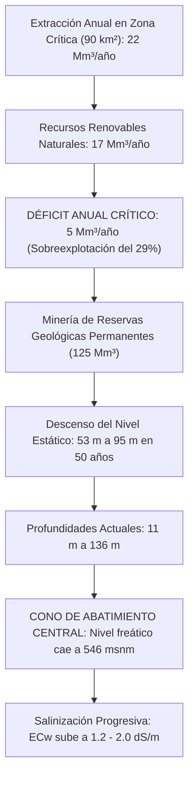

# Hidrogeología del Valle de Quíbor, Dinámica del Acuífero y Recarga Artificial (CIDIAT-ULA / SHYQ)

---

## 1. Contexto Fisiográfico y Balance Hídrico Regional

El Valle de Quíbor está emplazado en un valle intramontano de aproximadamente **243 km²** dentro de la denominada *"Depresión o Surco de Barquisimeto"* (confluencia del Sistema Andino, Coriano y Cordillera de la Costa), con altitudes de fondo plano entre **600 msnm** (sectores Guadalupe y El Milagro) y **800 msnm** (El Molino al Sur), y pendientes suaves de 0.26% a 0.59%.

### El Déficit Atmosférico Severo:
* **Precipitación Promedio Anual:** $400\text{ a }532\text{ mm/año}$ (equivalente a 518 millones de m³/año en toda la cuenca del acuífero). Régimen bimodal con picos en mayo-junio y octubre-noviembre, y solo 55 a 106 días con lluvia al año.
* **Evaporación Media Anual:** **$1.700\text{ a }3.200\text{ mm/año}$**.
* **Déficit Evaporativo:** La evaporación potencial excede a las precipitaciones en una relación de **4 a 6 veces**, catalogando a Quíbor como un bosque seco tropical / semiárido cálido (Köppen BSh). La agricultura a cielo abierto sin cobertura plástica sufre un estrés hídrico y osmótico continuo.

---

## 2. Geología y Litología del Medio Poroso

* **Origen Geológico:** Depresión tectónica rellenada por sedimentos **fluvio-lacustres de edad cuaternaria**, confinados lateralmente y en el basamento por rocas sedimentarias y metamórficas del Cretácico y Terciario.
* **Estratigrafía Hidrogeológica:**
  * El medio acuífero es altamente heterogéneo, conformado por **lentes lenticulares de gravas y arenas de alta permeabilidad intercalados con estratos limo-arcillosos**.
  * Funciona como un sistema multicapa complejo con sectores de acuífero libre y sectores semiconfinados.
  * **Sector Norte:** Espesor de sedimentos de $0\text{ a }120\text{ m}$, con espesor saturado de hasta $90\text{ m}$.
  * **Sector Sur:** Espesor de sedimentos de $0\text{ a }230\text{ m}$, con espesor saturado máximo de apenas $10\text{ m}$.
* **Red Hidrográfica Superficial:** Drenada por tres quebradas principales paralelas de Sur a Norte: Las Guardias, Atarigua (o Acarigua) y Palo Negro (San José), tributarias de la quebrada Las Raíces hacia la cuenca del Río Tocuyo.

---

## 3. Minería del Agua, Sobreexplotación y Cono de Abatimiento Central

Desde el inicio del desarrollo hortícola intensivo bajo riego en los años 60, el acuífero ha sido sometido a un régimen de sobreexplotación permanente:

### Datos Cuantitativos Validados (Alvarado, 1989; CIDIAT-SHYQ; Jégat et al., 2012):
1. **Balance de Masas:** En el área de mayor bombeo ($90\text{ km}^2$), la extracción promedia **$22\times 10^6\text{ m}^3\text{/año}$**, mientras que la recarga renovable natural es de solo **$17\times 10^6\text{ m}^3\text{/año}$**.
2. **Tasa de Déficit:** La extracción **supera la recarga en un 29% ($5\text{ Mm}^3\text{/año}$)**, consumiendo las reservas geológicas (estimadas en $125\text{ Mm}^3$).
3. **Descenso Histórico de Niveles:**
   * En 1963, el descenso máximo registrado fue de 53 m en el Norte y 95 m en el Sur.
   * Para 1987, el nivel estático fluctuaba entre 20 y 86 m (Norte) y de 81 a 135 m (Sur).
   * Campañas recientes (2008-2012) registran profundidades de bombeo entre **$11\text{ m y }136\text{ m}$**.
4. **Piezometría y Cono de Depresión:**
   * Zona de recarga (Quebrada Atarigua): **795 msnm**.
   * Parte central del Valle (zona de concentración de pozos): **546 msnm**.
   * Salida del Valle (Quebrada Las Raíces): **571 msnm**.
   * El nivel freático en el centro del valle está **25 metros por debajo del nivel de salida**, formando un **inmenso cono de abatimiento cerrado** que impide el drenaje natural y concentra sales solubles en el centro del acuífero.

---

## 4. Génesis de la Salinidad del Pozo y su Impacto en Fertirriego

La salinidad de las aguas subterráneas en Quíbor ($EC_w \approx 1.2 - 2.0\text{ dS/m}$, pH $7.6 - 8.2$) no es accidental:
1. **Lavado de Arcillas Terciarias y Sales Fósiles:** Al abaratarse el nivel freático a más de 80-120 m de profundidad, los conos de succión extraen agua de estratos profundos en contacto prolongado con formaciones marinas/lacustres del Terciario ricas en yesos ($\text{CaSO}_4$), dolomitas y sulfatos.
2. **Retorno de Riegos Ineficientes:** 50 años de riego por inundación y gravedad a cielo abierto han lixiviado fertilizantes y sales superficiales hacia el acuífero central sin salida hidrológica.
3. **Exigencia Agronómica:** El agua de pozo exige obligatoriamente:
   * **Fracción de Lavado ($LF = 20\%$):** Sobre-riego controlado para evitar quemado de ápices y necrosis radicular.
   * **Inyección de Ácido Nítrico (60%):** Para neutralizar bicarbonatos ($\text{HCO}_3^- > 3.0\text{ mmol/L}$) que taponan goteros y bloquean micronutrientes.

---

## 5. Simulación de Recarga Artificial con el Trasvase Yacambú (Visual MODFLOW 4.1)

El estudio de **Jégat, Mora, Hernández (CIDIAT-ULA) junto a Alvarado, Massiah (SHYQ) y Terán (2012)** modeló matemáticamente el acuífero mediante **Visual MODFLOW 4.1**:
* **Discretización:** 93 filas × 121 columnas, con **11.253 nodos activos** divididos en **12 estratos litológicos** calibrados con 42 pozos exploratorios y pruebas de permeabilidad tipo Lefranc.
* **Hipótesis de Inyección:** Baterías de 4 pozos profundos con inyección de $25\text{ L/s}$ por pozo (**$100\text{ L/s}$ por batería**) y trincheras de infiltración en la salida del túnel de trasvase Yacambú.
* **Escenarios Clave Evaluados:**
  * Inyección artificial de **$1.0\text{ m}^3\text{/s}$ ($1.000\text{ L/s} = 31.5\text{ Mm}^3\text{/año}$)** proveniente de los excedentes del Río Yacambú durante horizontes de 20 y 50 años.
* **Conclusiones Hidrogeológicas del Modelo:**
  1. **Recuperación Generalizada:** Con $1\text{ m}^3\text{/s}$ de recarga artificial, el acuífero detiene su abatimiento y revierte la tendencia histórica, recuperando decenas de metros en los niveles estáticos.
  2. **Conos Invertidos Locales:** En los sectores de inyección se generan domos freáticos sobre-elevados locales que empujan agua dulce de excelente calidad hacia las zonas de producción agrícola.

---

## 6. La Casa de Malla (2.000 m²) como Solución Tecnológica frente a la Crisis Hídrica

Frente a este diagnóstico hidrogeológico, el proyecto de **Casa de Malla de 2.000 m² con riego por goteo autocompensante (PC/ND), acolchado plástico y Malla 50×25** representa el modelo de **eficiencia de uso del agua (WUE)** más avanzado para el Valle de Quíbor:

| Parámetro Operativo | Campo Abierto Tradicional en Quíbor | Casa de Malla Tecnificada (2.000 m²) | Ventaja / Ahorro |
| :--- | :--- | :--- | :--- |
| **Evaporación Directa del Suelo** | 1.700 – 3.200 mm/año | Prácticamente 0 mm (Acolchado Mulch) | **-75% Pérdidas por evaporación** |
| **Transpiración Forzada por Viento** | Viento directo del Este a 10.4 km/h | Malla 50×25 frena viento en 45% | **-25% Estrés hídrico por viento** |
| **Consumo Diario en Pico de Cosecha** | 28.0 – 35.0 m³/día (riego por gravedad/aspersión) | **14.53 – 15.75 m³/día** (Goteros PC/ND) | **-50% Extracción neta de pozo** |
| **Eficiencia de Uso del Agua (WUE)** | 0.8 – 1.2 kg tomate / m³ de agua | **2.2 – 2.5 kg tomate / m³ de agua** | **+100% Productividad por m³** |
| **Control del Frente Salino** | Encharcamiento y salinización superficial | Bulbo continuo con lavado a la periferia | **Cero estrés osmótico radicular** |

---

## 7. Plan Operativo de Dos Escenarios Hidrológicos (Pozo Actual vs Yacambú)

El proyecto debe operar bajo una lógica bimodal según la fuente de agua disponible:

### Escenario A: Agua Actual de Pozo Profundo Abatido (Minería de Acuífero)
* **Calidad:** $EC_w \approx 1.4\text{ dS/m}$, pH $7.8$, bicarbonatos $\approx 3.5\text{ mmol/L}$.
* **Fracción de Lavado Obligatoria ($LF$):** **$20\%$**.
* **Consumo Pico Nave 2.000 m²:** **$15.08\text{ a }15.75\text{ m}^3\text{/día}$** (4.400 plantas a $23.1\text{ L/pl/sem}$).
* **Régimen de Riego:** 7 pulsos diarios de 16 minutos.
* **Tratamiento Químico:** Inyección de **$22\text{ L/semana de Ácido Nítrico al 60%}$** en el Tanque C para neutralizar bicarbonatos y evitar taponamiento salino de goteros.

### Escenario B: Agua de Trasvase Yacambú / Recarga Artificial (Agua Dulce Andina)
* **Calidad:** $EC_w \approx 0.4 - 0.6\text{ dS/m}$, pH $7.0 - 7.2$, bicarbonatos $\le 1.0\text{ mmol/L}$.
* **Fracción de Lavado Reducida ($LF$):** **$6.5\%$**.
* **Consumo Pico Nave 2.000 m²:** **$12.45\text{ m}^3\text{/día}$** (ahorro neto de **$2.63\text{ m}^3\text{/día} = 17.5\%$ menos extracción**).
* **Régimen de Riego:** 5 pulsos diarios de 14 minutos.
* **Tratamiento Químico:** Inyección de apenas **$6\text{ a }8\text{ L/semana de Ácido Nítrico}$** (ahorro del **65% en insumos de ácido**).
* **Calidad de Fruta:** Permite dosificar con precisión quirúrgica los nutrientes en los Tanques A y B sin el "ruido salino" de fondo del agua de pozo.
