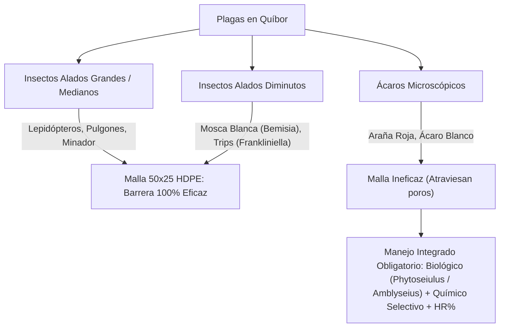

# Análisis Técnico Maestro: Casa de Malla en Quíbor (Municipio Jiménez, Lara)
## Cultivo Protegido de Pimentón (*Capsicum annuum*) y Tomate (*Solanum lycopersicum*)
### Coordenadas del Proyecto: [9°53'20.0"N 69°35'35.0"W (9.8889°N, -69.5931°W)](https://maps.app.goo.gl/yEVs9KCuuX1SvYJj8)

---

## Resumen Ejecutivo

El presente informe técnico consolida la evaluación microclimática, aerodinámica, fitosanitaria, hídrica y de cálculo estructural para la construcción y operación de una **casa de malla de 2.000 m² ($20.00\text{ m} \times 100.00\text{ m}$)** geolocalizada con precisión en las coordenadas satelitales **$9^\circ 53' 20.0''\ \text{N},\ 69^\circ 35' 35.0''\ \text{W}$** en el **Valle de Quíbor, Municipio Jiménez, Estado Lara, Venezuela** (695 – 710 msnm, clima semiárido cálido Köppen BSh). [Ver ubicación en Google Maps](https://maps.app.goo.gl/yEVs9KCuuX1SvYJj8).

El análisis parte de la evaluación rigurosa de datos climáticos georreferenciados (NASA MERRA-2 1980-2016 y estaciones locales) y responde a las dos decisiones críticas de ingeniería planteadas:
1.  **La viabilidad de mantener pilares a 2.5 metros de altura frente a la necesidad agronómica de 3.0 m al alero y 5.5 m a cumbrera para tomate indeterminado en hilo alto.**
2.  **La física real y número de extractores eólicos requeridos en cubierta, demostrando por qué los extractores no pueden sustituir la altura estructural, y definiendo la dotación complementaria correcta.**

---

## 1. Climatología Verificada del Valle de Quíbor

Los datos provienen de modelos climáticos asimilados NASA MERRA-2 centrados en las coordenadas del Valle de Quíbor y validados con mediciones meteorológicas regionales:

| Mes | Máx. Prom. (°C) | Mín. Prom. (°C) | Lluvia Prom. (mm) | Viento Prom. (km/h) | Días Bochornosos |
| :--- | :---: | :---: | :---: | :---: | :---: |
| **Enero** | 30 | 19 | 11 | 8.5 | 16.0 |
| **Febrero** | 30 | 20 | 14 | 8.9 | 14.5 |
| **Marzo** *(Mes más cálido)* | **31** | 20 | 26 | 9.0 | 18.6 |
| **Abril** | 30 | 20 | 73 | 8.9 | 22.6 |
| **Mayo** *(Mes más lluvioso)* | 29 | 20 | **104** | 9.4 | 28.1 |
| **Junio** *(Mes más ventoso)* | 28 | 20 | 96 | **10.4** | 27.6 |
| **Julio** *(Mes más fresco)* | 28 | 19 | 95 | 10.2 | 28.0 |
| **Agosto** *(Pico bochorno)* | 28 | 19 | 91 | 9.5 | **28.6** |
| **Septiembre** | 29 | 19 | 94 | 8.4 | 27.6 |
| **Octubre** | 29 | 20 | 93 | 7.1 | 28.5 |
| **Noviembre** *(Más calmado)* | 29 | 20 | 64 | **7.0** | 26.4 |
| **Diciembre** | 29 | 19 | 28 | 7.9 | 22.0 |

### Claves Bioclimáticas:
*   **Viento Dominante del Este:** Sopla del **Este durante 11 meses consecutivos** (hasta 88% de persistencia horaria). Solo en septiembre el viento vira temporalmente al Sur.
*   **Ráfagas de Diseño:** Ráfagas registradas de hasta **27 km/h (17 mph)** sobre una base media de 7 a 10 km/h.
*   **Bochorno Continuo:** De mayo a octubre hay entre 27 y 28 días mensuales con combinación de calor y humedad relativa elevada, lo que acentúa la necesidad de ventilación continua para evitar condensaciones foliares que detonen hongos (*Botrytis*, *Leveillula taurica*).

---

## 2. Matriz Fitosanitaria y Comportamiento de la Malla 50×25 HDPE

La elección de una malla monofilamento de polietileno de alta densidad (HDPE) de **50×25 hilos/pulgada** ($\le 192\ \mu\text{m}$ de apertura libre) es el estándar comercial anti-trips más estricto.



### Tabla Resumen de Control Integrado

| Plaga | Mecanismo de Dispersión | Eficacia de la Malla 50×25 | Control Preventivo / Biológico | Control Químico Rotacional (IRAC) |
| :--- | :--- | :---: | :--- | :--- |
| **Mosca blanca** (*Bemisia tabaci*) | Vuelo débil; arrastrada km por el viento Este. | **100% Efectiva** | Trampas pegajosas amarillas; *Eretmocerus mundus*. | Neonicotinoides (4A), Piriproxifen (7C), Spiromesifen (23). |
| **Trips** (*Frankliniella occidentalis*) | Flotan en corrientes de aire; cuerpo alargado ($\le 1$ mm). | **100% Efectiva** (barrera estándar) | Trampas azules; ácaros depredadores *Amblyseius swirskii*. | Spinosad (5), Abamectina (6), Acefato (1B). |
| **Pulgones** (*Myzus persicae*) | "Plancton aéreo" masivo arrastrado por vientos. | **100% Efectiva** | Eliminación malezas; mariquitas, crisopas. | Pirimicarb (1A), Flonicamid (29), Piretroides (3A). |
| **Ácaros** (*Tetranychus urticae / P. latus*) | No vuelan; contacto, herramientas, plántula infectada. | **0% Efectiva** (pasan por la malla) | Plántulas certificadas; *Phytoseiulus persimilis*. | Abamectina (6), Hexitiazox (10A), Azufre mojable. |
| **Minador** (*Liriomyza spp.*) | Vuelo corto a nivel de dosel. | **100% Efectiva** | Trampas amarillas; *Diglyphus isaea*. | Cyromazina (17), Abamectina (6). |
| **Lepidópteros** (*Spodoptera, Helicoverpa*) | Polillas nocturnas de vuelo activo. | **100% Efectiva** | Trampas feromonas; trampas de luz UV. | *Bacillus thuringiensis* (11A), Clorantraniliprol (28). |

---

## 3. Altura Estructural: 2.5 m vs 3.5 m – 5.5 m

### El Límite Térmico del Tomate
*   **Polinización óptima:** 23 °C a 25 °C.
*   **Alargamiento del estilo:** A $>32\ \text{°C}$ el pistilo sobresale del cono estaminal, impidiendo que el polen fecunde el estigma.
*   **Inviabilidad de polen:** A $>35\ \text{°C}$ el grano de polen pierde viabilidad.
*   **Aborto floral masivo:** Temperaturas sostenidas de $>34\ \text{°C}$ de día con noches cálidas (>20-22 °C), o picos de 40 °C por más de 4 horas, provocan caída total de flores.

### Termodinámica de la Casa de Malla
En Quíbor, durante marzo y abril la temperatura exterior alcanza los **31 °C** a la sombra.
*   En una casa de malla baja de **2.5 m de altura**, con tomate tutorado hasta 2.2 m, la masa foliar bloquea el escaso colchón de aire superior (apenas 30 cm libres). La radiación solar calienta el dosel y el suelo, generando un incremento térmico interior de **+3 °C a +6 °C**.
*   **Resultado a 2.5 m:** Temperaturas interiores pico de **34 °C a 37 °C**, coincidiendo exactamente con la zona de aborto floral.
*   **Resultado a 3.0 m alero / 5.5 m cumbrera:** El volumen de amortiguación térmica pasa de $\approx 2.500\ \text{m}^3$ a **$\approx 5.500\ \text{m}^3$** (más del doble). El aire sobrecalentado asciende naturalmente 2 metros por encima del alambre de tutorado (2.2 m), manteniendo el dosel vegetal entre 28 °C y 31 °C.

---

## 4. Análisis de Extractores Eólicos en Cubierta

### Ecuación TurboExtractor (420 mm / 17"):
$$Q = (0.818 + 0.0303 \times A) \times (121.5 + 103.4 \times V + 11.6 \times G + 5.6 \times T)$$

Con los parámetros medios de Quíbor ($V = 9.0\ \text{km/h}$ a 10 m, $T = 23.5\ \text{°C}$, gradiente térmico $G = 5\ \text{°C}$):
*   A **2.5 m** de altura ($V_{efectivo} \approx 7.2\ \text{km/h}$ por capa límite): **$Q \approx 941\ \text{m}^3/\text{h}$** por extractor.
*   A **5.5 m** de altura ($V_{efectivo} \approx 8.2\ \text{km/h}$): **$Q \approx 1.154\ \text{m}^3/\text{h}$** por extractor.
*   A **7.0 m** de altura ($V_{efectivo} \approx 8.5\ \text{km/h}$): **$Q \approx 1.226\ \text{m}^3/\text{h}$** por extractor.

### ¿Se Puede Reemplazar la Altura con Extractores Eólicos?
Para evacuar la carga térmica de 1.000 m² a 60 RAH:
$$Q_{total} = 5.500\ \text{m}^3 \times 60 = 330.000\ \text{m}^3/\text{h}$$
*   Unidades de 17" necesarias a 2.5 m: $\frac{330.000}{941} \approx \mathbf{350\ \text{extractores}}$ (1 cada 2.8 m²).
*   Unidades de 36" (900 mm) industriales: $\approx \mathbf{78\ \text{extractores}}$.

**Conclusión:** Constructiva, financiera y estructuralmente es **imposible** sustituir la altura con extractores eólicos.

### La Solución Real: Ventilación Porosa Perimetral + Refuerzo Cenital
1.  **Paredes de Malla Perimetral (130 m lineales × 3.0 m = 390 m² de fachada):** Con el viento Este de Quíbor (7-10 km/h), las paredes intercambian de forma natural más de **$300.000\ \text{m}^3/\text{h}$ a costo cero**.
2.  **Extractores Eólicos en Cumbrera (Dotación Recomendada):**
    *   **7 a 10 unidades de 24" a 30" (600 - 750 mm)** en la cumbrera de 5.5 m.
    *   Su función no es mover todo el volumen de aire, sino **romper la bolsa de calor cenital durante las calmas de viento** por empuje térmico ascensional ($\Delta T \ge 3\ \text{°C}$).

---

## 5. Programa de Riego FAO-56 y Manejo de Salinidad

Para una densidad típica de 2.0 a 2.5 plantas/m² (2.000 - 2.500 plantas en 1.000 m²):

| Etapa Fenológica | Duración | $Kc$ FAO | $ET_c$ (mm/día) | Litros/Planta/Semana | Manejo Clave |
| :--- | :---: | :---: | :---: | :---: | :--- |
| Trasplante | Sem 0-3 | 0.60 | ~3.0 | 7 – 9 L | Raíz superficial (<15 cm). Alta frecuencia, bajo volumen. |
| Vegetativo | Sem 3-6 | 0.80 | ~4.0 | 10 – 12 L | Incremento gradual de fertirriego. |
| Floración / Cuajado | Sem 6-10 | 1.10 | ~5.8 | 15 – 17 L | **Crítico:** evitar cualquier estrés hídrico. |
| Fructificación / Cosecha | Sem 10+ | 1.05 | ~6.3 | 17 – 20 L | Pico de transpiración en calor de marzo-abril. |
| Fin de Ciclo | Final | 0.90 | ~5.0 | 13 – 14 L | Maduración y desaceleración. |

### Factor de Lavado por Salinidad de Pozo ($LF$):
Dado que el agua de pozo en Quíbor suele marcar $EC_w > 1.2 - 1.5\ \text{dS/m}$:
$$LF = \frac{EC_w}{5(EC_e) - EC_w}$$
Para pimentón ($EC_e = 1.5\ \text{dS/m}$) con agua de $1.4\ \text{dS/m}$, $LF \approx 23\%$. La lámina de riego debe incrementarse de 20 a **26 L/planta/semana**, fraccionada en 3 a 5 riegos diarios para evitar la concentración osmótica de sales en el bulbo radicular.

---

## 6. Recomendaciones Estructurales y Tutorado de Mínima Mano de Obra (2.000 m²)

```text
       Techo 100% Plano de Guayas de 3/8" a 3.80 m (20.00 m ANCHO × 100.00 m LARGO)
    ═════════════════════════════════════════════════════════════════════════════════
    │                                                                               │
    │  [Buffer Térmico Libre de 1.60 m — Ventilación Convectiva Tangencial al Este] │
    │                                                                               │
    │ - - - - - - - - - - - - - - - - - - - - - - - - - - - - - - - - - - - - - - - │
    │  Alambre Maestro Calibre 10 a 2.20 m + MALLA ESPALDERA (HORTOMALLA 15×15)     │
    │  ┌───┬───┬───┬───┐  (Cero Atados | Cero Clips | -88% Mano de Obra)            │
    │  ├───┼───┼───┼───┤  4.400 plantas / 19.8 toneladas de biomasa suspendida      │
    │  └───┴───┴───┴───┘  Racimos y ramas descansan por gravedad en cuadrícula      │
    │  Alambre Guía Inferior a 0.20 m sobre camellón (10 camellones de 100 m)       │
    │ - - - - - - - - - - - - - - - - - - - - - - - - - - - - - - - - - - - - - - - │
    │                                                                               │
    └───[Pilares Tubulares Verticales Sch 40 Ø 2 1/2" a 3.80 m libre]───────────────┘
    ═════════════════════════════════════════════════════════════════════════════════
    Zanja Perimetral Continua 20×20 cm (240 m lineales con Faldón Enterrado 20 cm)
```

1. **Estructura Tipo Parral Tensado (20.00 m × 100.00 m):**
   * Pilares verticales tubulares Schedule 40 de $\varnothing\ 2\ 1/2"$ a **3.80 m libre**.
   * Techo sustentado al 100% por red ortogonal de guayas de acero galvanizado de $3/8"$ en cuadrícula de $4.0\text{ m}$ (transversal) $\times 5.0\text{ m}$ (longitudinal).
   * Cero tubos en techo; 60% de ahorro en acero frente a galpones rígidos y ventilación convectiva cenital 100% abierta.
   * **Orientación Este-Oeste:** El eje de 100 m paralelo a los vientos dominantes del Este reduce en un 50% la superficie frontal expuesta a ráfagas de 27 km/h ($76\text{ m}^2$ frente a $152\text{ m}^2$).
2. **Sistema de Tutorado Óptimo: Malla Espaldera Biorientada (Hortomalla 15×15 cm):**
   * Se instala malla tutora de polipropileno de alta densidad (cuadrícula de **$15 \times 15\ \text{cm}$**) fijada entre el alambre maestro superior a **$2.20\text{ m}$** (Calibre 10) y un alambre guía inferior a **$0.20\text{ m}$** (Calibre 14) a lo largo de los 10 camellones de 100 m ($1.000\text{ m}$ lineales).
   * **Cero Atados y Cero Clips:** La planta y sus racimos se apoyan por gravedad en los cuadros de la malla.
   * **Ahorro Laboral:** Reduce el tiempo de guiado de 500 h/ha a **80 - 120 h/ha (ahorro de más del 85% en jornales: solo 2 jornales/mes para toda la nave de 2.000 m²)**.
   * **Blindaje contra Virosis:** Reduce en un **80% la manipulación física** de las plantas, previniendo la dispersión mecánica de patógenos letales como el Virus Rugoso del Tomate (**ToBRFV**) y el Virus del Mosaico (**TMV**).
   * **Despunte Apical a 2.20 m:** Al llegar al alambre maestro, se realiza un único corte apical (topping) a la 7ª-8ª floración, concentrando toda la savia en los racimos cuajados y eliminando el descolgado semanal.
3. **Modulación Oficial para Rollo de 4.00 m × 100.00 m (8 Rollos Totales):**
   * **5 franjas longitudinales de 100.00 m** en cubierta (Rollos 1 al 5 al 100% sin cortes transversales).
   * **2 franjas longitudinales de 100.00 m** para paredes laterales Norte y Sur (Rollos 6 y 7 al 100% sin cortes).
   * **2 cortes de 20.00 m** para cabeceras Este y Oeste + esclusa sanitaria de doble puerta (Rollo 8 con remanente de mantenimiento).
   * Desperdicio real de retazos en obra: **0.00 m (0%)**. Aprovechamiento global: **98.7%**.

---

## 7. Hidrogeología, Minería del Acuífero de Quíbor y Recarga Artificial (CIDIAT-ULA / SHYQ)

La viabilidad técnica de este proyecto agroproductivo está directamente ligada a la realidad hidrogeológica descrita por **Jégat, Mora, Hernández (CIDIAT-ULA), Alvarado, Massiah (SHYQ) y Terán (2012)** en su investigación sobre la dinámica del acuífero y su recarga artificial:

### 7.1. Diagnóstico Hidrogeológico y Sobreexplotación del Acuífero
* **Medio Físico:** Valle intramontano de 243 km² con relleno fluviolacustre cuaternario constituido por **lentes lenticulares de gravas y arenas intercalados con arcillas** (medio altamente heterogéneo y semiconfinado).
* **Déficit Evaporativo Severo:** Precipitación de 400 a 532 mm/año frente a una **evaporación media anual de 1.700 a 3.200 mm/año** (déficit de 4 a 6 veces). La agricultura a cielo abierto es insostenible.
* **Minería del Acuífero:** En la zona de mayor explotación (90 km²):
  * Extracción anual por bombeo: **$22\times 10^6\text{ m}^3\text{/año}$**.
  * Recarga natural renovable: solo **$17\times 10^6\text{ m}^3\text{/año}$**.
  * **Sobreexplotación del 29% ($5\text{ Mm}^3\text{/año}$ de déficit permanente)** extraído de las reservas geológicas ($125\text{ Mm}^3$).
* **Cono de Abatimiento Central:**
  * Descenso histórico de niveles estáticos de **53 m a 95 m** entre 1963 y 1987, con profundidades actuales que alcanzan los **136 metros**.
  * La cota piezométrica cae desde 795 msnm en la zona de recarga (Quebrada Atarigua) hasta **546 msnm en la parte central del Valle** (25 metros por debajo del nivel de salida en Quebrada Las Raíces a 571 msnm), formando una **cubeta cerrada sin drenaje natural** que concentra sales solubles y eleva la conductividad eléctrica de los pozos profundos a $EC_w = 1.2 - 2.0\text{ dS/m}$.

### 7.2. Modelación de Recarga Artificial (Visual MODFLOW 4.1)
El modelo matemático de CIDIAT-ULA / SHYQ (93 filas × 121 columnas, 11.253 nodos activos, 12 estratos litológicos calibrados con 42 pozos) demostró que:
* La inyección artificial de **$1.0\text{ m}^3\text{/s}$ ($1.000\text{ L/s}$)** proveniente del túnel de trasvase del Río Yacambú mediante baterías de 4 pozos profundos de inyección ($100\text{ L/s}$ por batería) revierte el abatimiento del acuífero y genera **conos invertidos de sobre-elevación freática** con agua andina de baja salinidad.

### 7.3. Doble Escenario de Operación del Invernadero (2.000 m²)
1. **Escenario A (Actual - Pozo Profundo en Cono Abatido):** $EC_w = 1.4\text{ dS/m}$, pH 7.8, requiere **$LF = 20\%$** de lavado salino, consumo de **$15.08\text{ m}^3\text{/día}$** y neutralización con $22\text{ L/semana de Ácido Nítrico 60\%}$.
2. **Escenario B (Conexión Yacambú / Recarga Artificial):** Agua dulce andina ($EC_w \approx 0.5\text{ dS/m}$), reduciendo la fracción de lavado a **$LF = 6.5\%$**, con consumo de **$12.45\text{ m}^3\text{/día}$ (ahorro de $2.63\text{ m}^3\text{/día} = 17.5\%$ de agua)** y 65% menos gasto en ácido nítrico.
3. **Eficiencia Hídrica de la Casa de Malla:** Gracias a los goteros autorregulantes PC a 40 cm y al microclima protegido con riego sectorizado en 3 bloques, la Casa de Malla produce **2.3 a 2.5 kg de tomate por m³ de agua** frente a 0.9 kg/m³ en campo abierto, constituyendo la única alternativa sostenible ante el agotamiento del acuífero de Quíbor.


