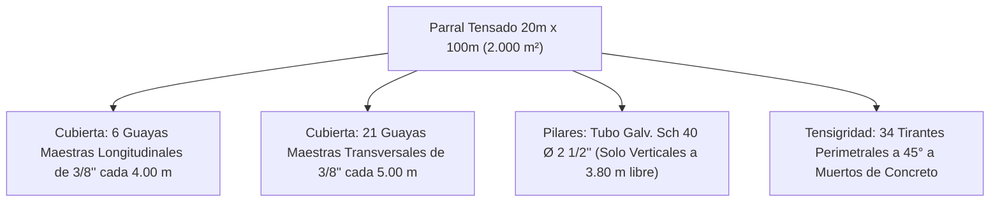

# Memoria de Cálculo y Validación Técnica Oficial: Casa de Malla en Quíbor (2.000 m²)
## Optimización Modular para Rollo Estándar de Malla 50×25 HDPE (4.00 m × 100.00 m)
### Geometría: 20.00 m de Ancho × 100.00 m de Largo | Cultivo Intensivo de Tomate Indeterminado

**Ubicación:** Valle de Quíbor, Municipio Jiménez, Estado Lara, Venezuela  
**Coordenadas Satelitales Exactas:** [9°53'20.0"N 69°35'35.0"W (9.8889°N, -69.5931°W)](https://maps.app.goo.gl/yEVs9KCuuX1SvYJj8) | Elevación: ~700 msnm  
**Clasificación Climática:** Köppen BSh (Semiárido cálido tropical)  
**Superficie Total del Proyecto:** **2.000 m² ($20.00\ \text{m} \times 100.00\ \text{m}$)**  
**Formato de Fábrica de Malla Anti-Insectos:** Rollos de **4.00 m de ancho × 100.00 m de largo** ($400.00\ \text{m}^2/\text{rollo}$)

---

## 1. Plan de Corte y Despiece Oficial de Malla (Desperdicio Cero)

La geometría de **20.00 m de ancho por 100.00 m de largo** se acopla a la perfección con el formato de fabricación de **4.00 m × 100.00 m**, eliminando los empalmes transversales en la cubierta:

```text
ESQUEMA OFICIAL DE ASIGNACIÓN: 8 ROLLOS COMERCIALES (4.00 m × 100.00 m = 3.200 m²)

CUBIERTA CENITAL (2.000 m² = 20.00 m ancho × 100.00 m largo):
• ROLLO 1 (100 m) ──► 1 Paño entero de 100.00 m ──► Techo Franja F-1 (0 a 4 m)   ──► Desperdicio: 0.0 m (100% útil)
• ROLLO 2 (100 m) ──► 1 Paño entero de 100.00 m ──► Techo Franja F-2 (4 a 8 m)   ──► Desperdicio: 0.0 m (100% útil)
• ROLLO 3 (100 m) ──► 1 Paño entero de 100.00 m ──► Techo Franja F-3 (8 a 12 m)  ──► Desperdicio: 0.0 m (100% útil)
• ROLLO 4 (100 m) ──► 1 Paño entero de 100.00 m ──► Techo Franja F-4 (12 a 16 m) ──► Desperdicio: 0.0 m (100% útil)
• ROLLO 5 (100 m) ──► 1 Paño entero de 100.00 m ──► Techo Franja F-5 (16 a 20 m) ──► Desperdicio: 0.0 m (100% útil)
  (Total Techo: EXACTAMENTE 5 ROLLOS ENTEROS = 20.00 m × 100.00 m | CERO CORTES TRANSVERSALES)

PAREDES LATERALES LONGITUDINALES (100.00 m largo × 4.00 m alto total):
• ROLLO 6 (100 m) ──► 1 Paño entero de 100.00 m ──► Pared Lateral Norte (100 m)  ──► Desperdicio: 0.0 m (100% útil)
• ROLLO 7 (100 m) ──► 1 Paño entero de 100.00 m ──► Pared Lateral Sur (100 m)    ──► Desperdicio: 0.0 m (100% útil)

CABECERAS FRONTALES Y BIOSEGURIDAD (2 Cabeceras de 20.00 m × 4.00 m):
• ROLLO 8 (100 m) ──► 1 Paño de 20.00 m ──► Cabecera Frontal Este (Barlovento 20 m)
                  ──► 1 Paño de 20.00 m ──► Cabecera Trasera Oeste (Sotavento 20 m)
                  ──► 1 Paño de 20.00 m ──► Esclusa Sanitaria Doble Puerta (14 m) + Solapes (6 m)
                  ──► 1 Paño de 40.00 m ──► Reserva de obra para mantenimiento y parches
```

### Tabla de Despiece y Balance de Materiales (2.000 m²)

| Componente Estructural | Dimensiones | Paños Requeridos (Ancho 4.00 m) | Metros Lineales | Rollo de Origen | Eficiencia de Uso |
| :--- | :---: | :---: | :---: | :---: | :---: |
| **Techo Modular (2.000 m²)** | $20.00\ \text{m} \times 100.00\ \text{m}$ | **5 franjas longitudinales** | $5 \times 100.00\ \text{m} = \mathbf{500.00\ \text{m}}$ | Rollos 1, 2, 3, 4 y 5 | **100.0% (Cero cortes)** |
| **Pared Lateral Norte** | $100.00\ \text{m} \times 4.00\ \text{m}$ | 1 franja continua | $1 \times 100.00\ \text{m} = \mathbf{100.00\ \text{m}}$ | Rollo 6 | **100.0% (Cero cortes)** |
| **Pared Lateral Sur** | $100.00\ \text{m} \times 4.00\ \text{m}$ | 1 franja continua | $1 \times 100.00\ \text{m} = \mathbf{100.00\ \text{m}}$ | Rollo 7 | **100.0% (Cero cortes)** |
| **Cabecera Este (Frontal)** | $20.00\ \text{m} \times 4.00\ \text{m}$ | 1 franja de 20 m | $1 \times 20.00\ \text{m} = \mathbf{20.00\ \text{m}}$ | Rollo 8 | 100.0% |
| **Cabecera Oeste (Trasera)**| $20.00\ \text{m} \times 4.00\ \text{m}$ | 1 franja de 20 m | $1 \times 20.00\ \text{m} = \mathbf{20.00\ \text{m}}$ | Rollo 8 | 100.0% |
| **Esclusa Sanitaria Doble** | $3.0\ \text{m} \times 2.0\ \text{m} \times 3.8\ \text{m}$ | Muros dobles y puertas | $\approx \mathbf{14.00\ \text{m}}$ | Rollo 8 | 100.0% |
| **Solapes y Remates** | Esquinas y anclajes | Fajas de solape | $\approx \mathbf{6.00\ \text{m}}$ | Rollo 8 | 100.0% |
| **Reserva Estratégica** | Stock técnico de campo | Repuestos fitosanitarios | $\approx \mathbf{40.00\ \text{m}}$ | Rollo 8 (remanente) | 100.0% |
| **TOTAL GENERAL** | **Estructura Completa 2.000 m²** | **8 Rollos Adquiridos** | **$8 \times 100.00\ \text{m} = \mathbf{800.00\ \text{m}}$** | **8 Rollos de 4m×100m** | **98.7% Aprovechamiento** |

---

## 2. Altura de Muros y Zanja Sanitaria de Enterramiento

El ancho de **4.00 m** de la tela se aprovecha en su totalidad vertical sin costuras horizontales:

$$H_{total\_rollo} = H_{libre} + H_{enterrada} = 3.80\ \text{m} + 0.20\ \text{m} = \mathbf{4.00\ \text{m}}$$

1. **Altura Libre Interior:** **$3.80\ \text{m}$** (espacio buffer para amortiguar el bochorno de agosto y evitar temperaturas $> 32\ ^\circ\text{C}$ en floración).
2. **Zanja Sanitaria Perimetral:** Zanja continua de **$20\ \text{cm} \times 20\ \text{cm}$** a lo largo de los **$240\ \text{m}$** de perímetro ($100 + 100 + 20 + 20\ \text{m}$).
3. **Hermeticidad Biológica:** El faldón enterrado y compactado con grava y tierra bloquea al 100% el ingreso por suelo de mosca blanca (*Bemisia tabaci*), trips (*Frankliniella occidentalis*) y larvas de lepidópteros.

---

## 3. Red Estructural de Guayas y Pilares (Modulación 4.00 m × 5.00 m)

La estructura es un **Parral Puro Tensado (CERO tubos en el techo)**:



1. **Guayas Maestras Longitudinales (a lo largo de 100 m):**
   * 6 líneas de cable de acero galvanizado $\varnothing\ 3/8"\ (9.52\text{ mm})$ clase 6×19 alma de acero.
   * Espaciadas cada **$4.00\ \text{m}$** ($X = 0, 4, 8, 12, 16, 20\ \text{m}$).
   * Los orillos de fábrica de las 5 franjas de malla coinciden milimétricamente sobre estos cables. Costura doble en cadeneta directamente sobre la guaya (cero uniones al aire).
2. **Guayas Maestras Transversales (a lo ancho de 20 m):**
   * 21 líneas de cable de acero $\varnothing\ 3/8"$ espaciadas cada **$5.00\ \text{m}$** ($Y = 0, 5, 10, 15, \dots, 100\ \text{m}$).
3. **Pilares Verticales Tubulares:**
   * Tubo de acero galvanizado en caliente ASTM A53 Schedule 40 de $\varnothing\ 2\ 1/2"$ exterior ($73.0\text{ mm}$, espesor $3.6\text{ mm}$).
   * Altura de tubo: $4.60\ \text{m}$ ($3.80\ \text{m}$ libre $+ 0.80\ \text{m}$ empotrado en dado de concreto ciclópeo de $40\times 40\times 60\ \text{cm}$).
   * Distribución: Nodos en cuadrícula modular de $4.00\text{ m}$ transversal $\times 5.00\text{ m}$ longitudinal.
4. **Tirantes de Tensigridad Exterior a 45°:**
   * 34 tirantes perimetrales de guaya de $3/8"$ con tensores ojo-ojo de $5/8"$.
   * Anclados a dados de concreto enterrados (muertos de $40\times 40\times 60\ \text{cm}$).

---

## 4. Aerodinámica: Ventajas de la Orientación 20 m × 100 m en Quíbor

El Valle de Quíbor presenta vientos predominantes del **ESTE** durante 11 meses del año, con ráfagas registradas de **27 km/h (17 mph)**.

*   **Orientación Óptima del Eje:** Se orienta el eje largo de **$100.00\ \text{m}$ en dirección Este – Oeste**:
    *   La fachada corta de barlovento expuesta directamente al Este es de solo **$20.00\ \text{m} \times 3.80\ \text{m} = 76.0\ \text{m}^2$** (reducción del 50% frente a la orientación anterior de 40m).
*   **Presión Dinámica del Viento a 695 msnm (Ráfagas con FS = 1.5 $\rightarrow v = 11.25\ \text{m/s}$):**
    $$q_z = \frac{1}{2} (1.145\ \text{kg/m}^3) (11.25)^2 \approx 72.5\ \text{N/m}^2$$
*   **Empuje Eólico sobre la Cabecera Este:**
    $$F_{viento\_Este} = 72.5\ \text{N/m}^2 \times 0.72 \times 76.0\ \text{m}^2 \approx \mathbf{3.967\ \text{N}}\ (\approx \mathbf{404\ \text{kgf}})$$
    *Distribuido entre los 6 postes de la cabecera Este (tensión por tirante a 45° $\approx 95\ \text{kgf}$, apenas el 2.2% de la carga de rotura de la guaya de 3/8" que es de $4.200\ \text{kgf}$). Factor de seguridad $> 30$.*
*   **Efecto Venturi Tangencial:** El viento corre a lo largo de las paredes de 100 m generando succión laminar, lo que acelera la extracción de aire caliente por la cubierta cenital porosa sin requerir extractores mecánicos.

---

## 5. Agronomía y Tutorado con Malla Espaldera (4.400 Plantas)

Para **suprimir las labores manuales continuas**, se implementa la Malla Espaldera Biorientada de Polipropileno (Hortomalla de 15×15 cm) combinada con despunte apical a 2.20 m:

```text
DISTRIBUCIÓN DE CULTIVO EN 20.00 m DE ANCHO (10 CAMELLONES DOBLES DE 100 m):
│◄──────────────────────────────── 20.00 m ────────────────────────────────►│
│ Camellón 1 │ Pasillo │ Camellón 2 │ Pasillo │ ... │ Camellón 10 │ Pasillo │
│   0.80 m   │ 1.20 m  │   0.80 m   │ 1.20 m  │     │   0.80 m    │ 1.20 m  │
│ (2 hileras)│         │ (2 hileras)│         │     │ (2 hileras) │         │
```

1. **Parámetros de Cultivo:**
   * **Superficie:** $2.000\ \text{m}^2$.
   * **Densidad:** $2.2\ \text{plantas/m}^2 = \mathbf{4.400\ \text{plantas}}$ de tomate indeterminado de hilo alto.
   * **Distribución:** 10 camellones dobles a lo largo de los 100.00 m = **$1.000\ \text{m}$ lineales de camellón** ($2.000\ \text{m}$ de hileras de plantas).
2. **Carga Viva Soportada por el Sistema:**
   * Peso maduro (planta + 7-8 racimos + follaje + agua): $4.5\ \text{kg/planta}$.
   * Masa viva total suspendida:
     $$W_{cultivo} = 4.400\ \text{plantas} \times 4.5\ \text{kg} = \mathbf{19.800\ \text{kgf}}\ (\approx \mathbf{19.8\ \text{toneladas}})$$
3. **Malla Espaldera (Hortomalla 15×15 cm):**
   * **$1.000\ \text{m}$ lineales** de malla tutora de $1.80 - 2.00\ \text{m}$ de altura fijada entre el alambre maestro superior (Calibre 10 a 2.20 m) y el alambre guía inferior (Calibre 14 a 0.20 m).
   * **Cero Atados y Cero Clips:** Los tallos y racimos descansan en las cuadrículas rígidas por gravedad física.
   * **Ahorro Laboral:** Se reduce el guiado a solo **2.0 jornales/mes para toda la nave de 2.000 m²** (ahorro del 88% frente al descolgado holandés).
   * **Blindaje contra Virus Mecánicos:** Al reducir el contacto manual en un 80%, se previene la transmisión del Virus Rugoso (**ToBRFV**), Mosaico (**TMV**) y *Clavibacter michiganensis*.
4. **Despunte Apical (*Topping*) a 2.20 m:**
   * Un único corte apical a la 7ª u 8ª inflorescencia al llegar a 2.20 m (labor de 1 hora para toda la nave). Toda la savia se redirige a engordar los frutos cuajados.

---

## 6. Balance Hídrico y Salinidad FAO-56 (2.000 m²)

*   **Evapotranspiración en Pico Cálido (Marzo - Abril):** $18 - 20\ \text{L/planta/semana}$.
*   **Consumo Neto para 4.400 Plantas:**
    $$Q_{neto} = 4.400 \times 20\ \text{L} = \mathbf{88.000\ \text{L/semana}}\ (\approx \mathbf{12.6\ \text{m}^3/\text{día}})$$
*   **Fracción de Lavado de Sales de Pozo ($LF = 20\%$):**
    Los pozos de Quíbor registran $EC_w \approx 1.4\ \text{dS/m}$. Con tolerancia de tomate $EC_e = 2.5\ \text{dS/m}$, $LF \approx 15-20\%$.
    $$Q_{bruto} = \frac{12.6\ \text{m}^3}{1 - 0.20} \approx \mathbf{15.75\ \text{m}^3/\text{día}}\ (\mathbf{110.000\ \text{L/semana}})$$
*   **Régimen de Riego:** 4 a 6 pulsos diarios de fertirriego por goteo con goteros autocompensantes de $1.6 - 2.0\ \text{L/h}$.

---

## 7. Cuadro General de Especificaciones de Obra (2.000 m²)

| Elemento | Especificación Técnica | Cantidad / Dimensiones | Función Principal |
| :--- | :--- | :--- | :--- |
| **Malla Anti-Trips** | Monofilamento virgen HDPE 50×25 hilos/pulgada ($\le 192\ \mu\text{m}$) | **8 rollos de 4.00 m × 100.00 m** | Techo (500m) + paredes (240m) + esclusa (14m) + reserva (40m) |
| **Pilares Verticales** | Tubo de acero galv. en caliente $\varnothing\ 2\ 1/2"\ \text{Sch 40}$ ($e=3.6\text{ mm}$) | 96 unidades de 4.60 m (3.80m libre + 0.80m dado) | Sustentación vertical pura en cuadrícula $4.0\text{ m} \times 5.0\text{ m}$ |
| **Guayas Maestras** | Cable de acero galv. $\varnothing\ 3/8"\ (9.52\text{ mm})$ clase 6×19 alma de acero | $\approx 1.100\ \text{m}$ lineales en cuadrícula $4.0\text{ m} \times 5.0\text{ m}$ | Soporte estructural de la cubierta sin tubos |
| **Guayas de Tirante** | Cable de acero galv. $\varnothing\ 3/8"$ a 45° con tensores ojo-ojo de 5/8" | 34 tirantes perimetrales a muertos de concreto | Absorción de empuje eólico y tracción de cables |
| **Malla Espaldera Tutora** | Polipropileno virgen extruido bi-orientado anti-UV ($15 \times 15\ \text{cm}$) | **1.000 m lineales** ($2.000\ \text{m}^2$) a 1.80-2.00m alto | **Tutorado mecánico: Cero atados, cero clips, -88% mano de obra** |
| **Alambre Maestro Tutor** | Alambre liso galvanizado alta resistencia Calibre 10 ($3.4\text{ mm}$) | 10 camellones de 100 m = $1.000\ \text{m}$ a 2.20 m alto | Sostén superior de malla tutora y 19.800 kg de tomate |
| **Alambre Guía Inferior** | Alambre liso galvanizado Calibre 14 ($2.1\text{ mm}$) | 10 camellones de 100 m = $1.000\ \text{m}$ a 0.20 m sobre suelo | Fijación y plomada inferior de la malla tutora |
| **Dados de Cimentación** | Concreto ciclópeo resistencia $f'c = 180\ \text{kg/cm}^2$ | Cubos de $40 \times 40 \times 60\ \text{cm}$ en todos los postes | Anclaje y estabilidad al vuelco |
| **Zanja Sanitaria** | Zanja perimetral continua de $20 \times 20\ \text{cm}$ | 240 metros lineales de contorno | Enterramiento del faldón de 20 cm contra plagas |
