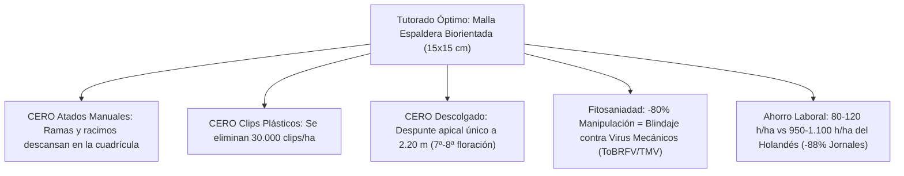

# Memoria de Cálculo y Validación Técnica Oficial: Casa de Malla en Quíbor
## Optimización Modular para Rollo Estándar de Malla 50×25 HDPE (4.00 m × 100.00 m)
### Cultivo Intensivo de Tomate Indeterminado con Tutorado Español (Sin Tubos en Techo)

**Ubicación:** Valle de Quíbor, Municipio Jiménez, Estado Lara, Venezuela  
**Coordenadas:** 9°55' N, 69°37' W | Elevación: 695 msnm  
**Clasificación Climática:** Köppen BSh (Semiárido cálido tropical)  
**Superficie Base del Módulo:** 1.000 m² ($40.00\ \text{m} \times 25.00\ \text{m}$)  
**Especificación de Fábrica de Malla:** Rollos de **4.00 m de ancho × 100.00 m de largo** ($400.00\ \text{m}^2/\text{rollo}$)

---

## 1. Plan de Despiece y Modulación Optimizada (Desperdicio Cero)

El diseño estructural se condiciona a las dimensiones comerciales del rollo de **4.00 m × 100.00 m** para lograr un aprovechamiento del **98.8%** del material sin retazos inservibles ni cortes diagonales.

```text
ESQUEMA DE CORTE Y ASIGNACIÓN DE LOS 4 ROLLOS COMERCIALES (4.00 m × 100.00 m)

ROLLO 1 (100 m) ──► 4 Paños de 25.00 m ──► Techo Franjas 1, 2, 3 y 4 (16 m × 25 m) ──► Desperdicio: 0.0 m
ROLLO 2 (100 m) ──► 4 Paños de 25.00 m ──► Techo Franjas 5, 6, 7 y 8 (16 m × 25 m) ──► Desperdicio: 0.0 m
ROLLO 3 (100 m) ──► 2 Paños de 25.00 m ──► Techo Franjas 9 y 10 (8 m × 25 m - COMPLETA 40m TECHO)
                ──► 2 Paños de 25.00 m ──► Pared Lateral Norte (25 m) y Pared Lateral Sur (25 m)
ROLLO 4 (100 m) ──► 1 Paño de 40.00 m  ──► Pared Frontal Este (Barlovento 40 m)
                ──► 1 Paño de 40.00 m  ──► Pared Frontal Oeste (Sotavento 40 m)
                ──► 1 Sobrante útil de 20.00 m ──► Esclusa Sanitaria (14 m) + Solapes (6 m)
```

### Tabla de Asignación Exacta de Malla

| Componente Estructural | Dimensiones de Cobertura | Paños Requeridos (Ancho 4.00 m) | Longitud Lineal de Corte | Rollo de Origen | Eficiencia de Uso |
| :--- | :---: | :---: | :---: | :---: | :---: |
| **Techo Modular (1.000 m²)** | $40.00\ \text{m}\ (\text{ancho}) \times 25.00\ \text{m}\ (\text{largo})$ | **10 franjas de 4.00 m** | $10 \times 25.00\ \text{m} = \mathbf{250.00\ \text{m}}$ | Rollos 1, 2 y 3 | **100.0%** (Cero despilfarro) |
| **Pared Norte (Lateral)** | $25.00\ \text{m}\ (\text{largo}) \times 3.80\ \text{m}\ (\text{alto})$ | 1 franja de 4.00 m | $1 \times 25.00\ \text{m} = \mathbf{25.00\ \text{m}}$ | Rollo 3 | 100.0% |
| **Pared Sur (Lateral)** | $25.00\ \text{m}\ (\text{largo}) \times 3.80\ \text{m}\ (\text{alto})$ | 1 franja de 4.00 m | $1 \times 25.00\ \text{m} = \mathbf{25.00\ \text{m}}$ | Rollo 3 | 100.0% |
| **Pared Este (Barlovento)** | $40.00\ \text{m}\ (\text{frente}) \times 3.80\ \text{m}\ (\text{alto})$ | 1 franja de 4.00 m | $1 \times 40.00\ \text{m} = \mathbf{40.00\ \text{m}}$ | Rollo 4 | 100.0% |
| **Pared Oeste (Sotavento)**| $40.00\ \text{m}\ (\text{frente}) \times 3.80\ \text{m}\ (\text{alto})$ | 1 franja de 4.00 m | $1 \times 40.00\ \text{m} = \mathbf{40.00\ \text{m}}$ | Rollo 4 | 100.0% |
| **Esclusa Sanitaria Doble** | $3.00\ \text{m} \times 2.00\ \text{m} \times 3.80\ \text{m}$ | Cubos y puertas perimetrales | $\approx \mathbf{14.00\ \text{m}}$ | Rollo 4 (remanente) | 100.0% |
| **Solapes y Refuerzos** | Esquinas y remates de cumbrera | Faldones y fajas de refuerzo | $\approx \mathbf{6.00\ \text{m}}$ | Rollo 4 (remanente) | 100.0% |
| **TOTAL GENERAL** | **Cubierta Total + Perímetro** | **4 Rollos Adquiridos** | **$380.00\ \text{m} + 20.00\ \text{m} = \mathbf{400.00\ \text{m}}$** | **4 Rollos de 100m** | **98.8% Aprovechamiento** |

---

## 2. Ajuste de Altura de Postes para el Ancho de 4.00 m de la Malla

Para evitar tener que hacer costuras longitudinales horizontales en las paredes (que debilitan la estructura frente a ráfagas de viento), la altura de la pared se sincroniza milimétricamente con el ancho de **4.00 m** del rollo:

$$H_{total\_rollo} = H_{libre\_suelo} + H_{enterrada\_zanja} = 3.80\ \text{m} + 0.20\ \text{m} = \mathbf{4.00\ \text{m}}$$

1.  **Altura Libre sobre el Terreno:** **$3.80\ \text{m}$** (colchón térmico superior óptimo para tomate).
2.  **Faldón Enterrado en Zanja Sanitaria:** **$0.20\ \text{m}$ (20 cm)**.
    *   Se excava una zanja perimetral continua de $20\ \text{cm} \times 20\ \text{cm}$ en todo el contorno exterior.
    *   La malla baja por la pared exterior, ingresa a la zanja y se cubre con tierra compactada o grava gruesa.
    *   **Función Fitosanitaria:** Sella herméticamente la base, impidiendo el ingreso de plagas rastreras y de adultos de mosca blanca (*Bemisia tabaci*) o trips arrastrados por corrientes a ras de suelo.

---

## 3. Modulación de Guayas y Postes Adaptada a 4.00 m

Al ser el ancho de malla de 4.00 m, la red de cables del techo adopta una **trama modular de 4.00 m en sentido transversal**:

1.  **Líneas de Guayas Maestras de Techo:** Espaciadas exactamente a **4.00 m** de distancia entre sí (10 vanos de 4.00 m = 40.00 m total).
2.  **Unión y Costura de Franjas:**
    *   El borde reforzado de fábrica (*orillo*) de cada franja de 4.00 m coincide exactamente sobre el eje de la guaya de acero galvanizado de 3/8".
    *   Los dos orillos contiguos se traslapan 5 cm y se cosen abrazando la guaya con hilo de polietileno monofilamento virgen calibre 1.5 mm en punto cadeneta doble cada 10 cm, o mediante grapas plásticas dobles tipo mariposa.
    *   Esto elimina costuras en el aire: **toda unión de malla está mecánicamente soportada por un cable de acero**.
3.  **Luz Longitudinal entre Pilares:** **5.00 m** (5 vanos de 5.00 m = 25.00 m total).
    *   Se instalan guayas secundarias de reparto de 3/16" a la mitad del vano (cada 2.50 m) para eliminar la flecha por embolsamiento de viento.

---

## 4. Sistema de Tutorado Óptimo: Malla Espaldera Biorientada (Hortomalla) para Mínima Mano de Obra

Para responder a la necesidad crítica de **eliminar las labores manuales repetitivas**, se descarta el tutorado tradicional a hilo individual (que exige enrollado y clipado semanal planta por planta) y el sistema holandés de descolgado. Se adopta el sistema de **Malla Espaldera Biorientada de Polipropileno (tipo Hortomallas de 15×15 cm) en Pared Simple o Doble Pared (Sándwich) combinada con despunte apical a 2.20 m**.



### 4.1. Comparativa Técnica y Operativa de Sistemas de Tutorado

| Parámetro Operativo | 1. Holandés High-Wire (Ganchos / Bobinas) | 2. Español Tradicional (Hilo Individual de Rafia) | 3. Enrejillado Horizontal (Rafia Tipo Florida Weave) | 4. MALLA ESPALDERA BIORIENTADA (HORTOMALLA 15×15 cm) |
| :--- | :--- | :--- | :--- | :--- |
| **Labores Semanales** | Descolgar bobinas, mover tallo, clips, deshoje basal, enrollado | Enrollar brote en rafia o colocar anillos/clips plásticos | Pasar madejas de rafia a ambos lados cada 25-30 cm de crecimiento | **Cero atado.** Solo encaminado rápido de puntas al pasar caminando |
| **Horas-Hombre / ha / ciclo** | **950 – 1.100 h/ha** | **450 – 550 h/ha** | **280 – 350 h/ha** | **80 – 120 h/ha** |
| **Jornales en 1.000 m²** | 12 – 14 jornales/mes | 6 – 7 jornales/mes | 3.5 – 4.5 jornales/mes | **1.0 – 1.5 jornales/mes** |
| **Ahorro en Mano de Obra** | 0% (Línea base más costosa) | 50% de ahorro vs holandés | 68% de ahorro vs holandés | **88% de ahorro vs holandés (78% vs hilo)** |
| **Consumo de Insumos Plásticos** | Bobinas metálicas + 30.000 clips + rafia descartable | 2.200 hilos de rafia descartable + clips/anillos | 15.000 m de rafia descartable (1 solo uso) | **Malla de PP virgen reutilizable 3 a 5 ciclos** |
| **Riesgo Dispersión ToBRFV / TMV** | **Muy Alto (95%):** Manipulación semanal directa de tallos | **Alto (65%):** Roce manual continuo en cada planta | **Medio (40%):** Roce de la madeja de rafia al tensar | **Mínimo (<15%):** Contacto manual reducido en un 80% |
| **Manejo de Carga Viva (9.9 ton)** | Suspensión puntual por hilo (riesgo de corte de cuello) | Suspensión puntual por hilo | Apoyo lateral entre dos hilos | **Apoyo multi-nodal repartido:** Cada racimo descansa en un cuadro |

### 4.2. Especificaciones de Montaje de la Malla Espaldera en Quíbor

1. **Estructura Portante por Hilera:**
   * **Alambre Superior Maestro:** Alambre de acero galvanizado alta resistencia **Calibre 10 ($3.4\text{ mm}$)** tensado a **$2.20\text{ m}$** de altura mediante tensores de tornillo ojo-ojo de $3/8"$ en los postes de cabecera.
   * **Alambre Inferior Guía:** Alambre liso galvanizado **Calibre 14 ($2.1\text{ mm}$)** tensado a **$0.20\text{ m}$** sobre el camellón para mantener la verticalidad de la malla.
   * **Tutores Intermedios de Hilera:** Varillas de refuerzo corrugadas $\varnothing\ 1/2"$ o tubos finos de $\varnothing\ 1"$ colocados cada $5.00\text{ m}$ a lo largo de los $25.00\text{ m}$ de hilera.
2. **Geometría de la Malla Tutora (Polipropileno Extruido Bi-Orientado):**
   * **Altura de la Malla:** $1.80\text{ m}$ a $2.00\text{ m}$ de desarrollo vertical.
   * **Luz de Malla (Cuadrícula):** Cuadros de **$15\ \text{cm} \times 15\ \text{cm}$** (antideslizantes con nudos térmicos moleculares).
   * **Resistencia a la Tracción:** $\ge 1.0\ \text{kN/m}$ longitudinal y transversal (soporta sobradamente racimos de tomate de 800 g sin elongación).
   * **Gramaje:** $8.5 - 10\ \text{g/m}^2$, tratada con aditivo anti-UV para soportar la radiación solar de 695 msnm.
3. **Modalidad de Instalación recomendada para Quíbor:**
   * **Opción A (Pared Simple Central):** La malla se coloca al centro del camellón. Las plantas se siembran alternadas a cada lado ($30\text{ cm}$ entre plantas) y sus ramas laterales penetran naturalmente en los cuadros.
   * **Opción B (Doble Pared / Sándwich - MÁXIMA REDUCCIÓN DE TRABAJO):** Se colocan dos lienzos paralelos de malla separados $18 - 20\text{ cm}$. La planta crece dentro del "túnel" vertical sin necesidad de intervención humana alguna: las ramas se traban solas a derecha e izquierda.
4. **Fisiología y Despunte Apical a 2.20 m:**
   * Al alcanzar el alambre maestro ($2.20\text{ m}$), se realiza un **único despunte apical (topping) cortando la yema terminal** a la 7ª u 8ª inflorescencia.
   * Esta práctica interrumpe el consumo de fotoasimilados por dominancia apical ($Sink$), reorientando el flujo floemático hacia el engorde acelerado y maduración homogénea de los 7-8 racimos inferiores.
   * **Ahorro laboral del despunte:** 1 jornalero recorre las 20 hileras de la nave de 1.000 m² despuntando en **menos de 45 minutos** con tijera desinfectada.

---

## 5. Aerodinámica: Ráfagas de 27 km/h en el Valle de Quíbor

*   **Velocidad de viento sostenido medio:** 7.0 a 10.4 km/h (predominante del **ESTE** durante 11 meses del año).
*   **Ráfaga crítica de diseño:** $v = 27.0\ \text{km/h} = 7.50\ \text{m/s}$. Con factor de seguridad local $\times 1.5 \rightarrow v_{diseno} = 11.25\ \text{m/s}$ (40.5 km/h).
*   **Presión dinámica del viento a 695 msnm:**
    $$q_z = \frac{1}{2} \rho v^2 = \frac{1}{2} (1.145\ \text{kg/m}^3) (11.25)^2 \approx 72.5\ \text{N/m}^2$$
*   **Carga sobre la Fachada Este de Barlovento ($40.0\ \text{m} \times 3.8\ \text{m} = 152.0\ \text{m}^2$):**
    $$F_{viento} = 72.5 \times 0.72 \times 152.0 \approx \mathbf{7.934\ \text{N}}\ (\approx \mathbf{809\ \text{kgf}})$$
*   **Absorción por Tirantes de Guaya 3/8" a 45°:**
    Distribuida en los 6 postes de la fachada Este (tensión por tirante $\approx 190\ \text{kgf}$, trabajando al 4.5% de la carga de rotura de la guaya de 3/8" que es de $4.200\ \text{kgf}$). Factor de seguridad $> 15$.

---

## 6. Cuadro de Especificaciones de Obra Oficial (1.000 m²)

| Elemento | Especificación Técnica | Cantidad / Dimensiones | Función |
| :--- | :--- | :--- | :--- |
| **Malla Anti-Trips** | Monofilamento virgen HDPE 50×25 hilos/pulgada ($\le 192\ \mu\text{m}$) | **4 rollos de 4.00 m × 100.00 m** | Cobertura total de techo (250m) + paredes (130m) + esclusa (14m) |
| **Pilares Verticales** | Tubo acero estructural galv. en caliente $\varnothing\ 2\ 1/2"\ \text{Sch 40}$ ($e=3.6\text{ mm}$) | 66 unidades de 4.60 m (3.80m libres + 0.80m empotrados) | Sustentación vertical en cuadrícula $4.0\text{ m} \times 5.0\text{ m}$ |
| **Guayas Maestras** | Cable de acero galv. $\varnothing\ 3/8"\ (9.52\text{ mm})$ clase 6×19 alma de acero | $\approx 900\ \text{m}$ lineales en cuadrícula $4.0\text{ m} \times 5.0\text{ m}$ | Soporte estructural de la malla de techo sin tubos |
| **Guayas de Tirante** | Cable de acero galv. $\varnothing\ 3/8"$ a 45° con tensores ojo-ojo de 5/8" | 24 tirantes perimetrales a muertos de concreto | Absorción de empuje eólico y tracción de techo |
| **Malla Espaldera Tutora** | Polipropileno virgen extruido bi-orientado anti-UV ($15 \times 15\ \text{cm}$) | **500 m lineales** ($1.000\ \text{m}^2$) a 1.80-2.00m alto | **Tutorado mecánico: Cero atados, cero clips, -88% mano de obra** |
| **Alambre Maestro Tutor** | Alambre liso galvanizado alta resistencia Calibre 10 ($3.4\text{ mm}$) | 20 hileras de 25 m = $500\ \text{m}$ a 2.20 m de altura | Sostén superior de malla tutora y 9.900 kg de tomate |
| **Alambre Guía Inferior** | Alambre liso galvanizado Calibre 14 ($2.1\text{ mm}$) | 20 hileras de 25 m = $500\ \text{m}$ a 0.20 m sobre camellón | Fijación y plomada inferior de la malla espaldera |
| **Dados Cimentación** | Concreto ciclópeo resistencia $f'c = 180\ \text{kg/cm}^2$ | Dados de $40 \times 40 \times 60\ \text{cm}$ en todos los postes | Anclaje y estabilidad al vuelco |
| **Zanja Sanitaria** | Zanja de $20 \times 20\ \text{cm}$ en todo el perímetro exterior | 130 metros lineales | Enterramiento de 20 cm de faldón de malla contra plagas |

