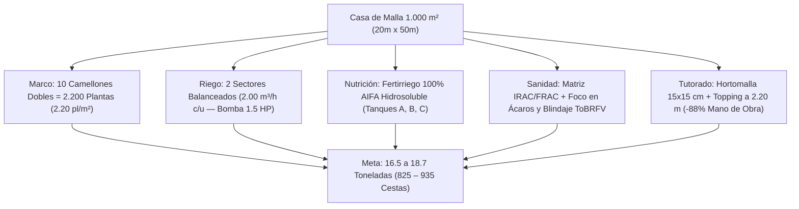

# PROYECTO LA CIGARRONERA — PLAN MAESTRO DE PRODUCCIÓN AGRONÓMICA: TOMATE INDETERMINADO EN CASA DE MALLA (1.000 m²)
## Valle de Quíbor, Municipio Jiménez, Estado Lara, Venezuela (695 – 710 msnm — Clima Semiárido Cálido BSh)
### Georreferenciación Satelital: [9°53'20.0"N 69°35'35.0"W (9.8889°N, -69.5931°W)](https://maps.app.goo.gl/yEVs9KCuuX1SvYJj8)

| Versión | Fecha de Emisión | Especialidad / Autoría | Estado y Alcance Agronómico |
| :---: | :---: | :--- | :--- |
| **v3.0.0** | 2026-09-05 | Especialista Senior en Agronomía, Climatología e Ingeniería de Invernaderos | **Aprobado**. Adaptación dimensional y agronómica para Casa de Malla de **1.000 m² ($20.00\text{ m} \times 50.00\text{ m}$)**: 2.200 plantas de tomate indeterminado, partición hidráulica en **2 sectores perfectamente balanceados de 2.00 m³/h** (1.250 goteros PC c/u con bomba de 1.5 HP 1"), modulación exacta de **4 rollos comerciales** ($4\text{ m} \times 100\text{ m}$), autonomía ampliada del reservorio de 80 m³ a **8.6 - 10.2 días**, formulación nutricional 100% AIFA Hidrosoluble para 2.200 plantas y proyección de cosecha de **16.5 a 18.7 Toneladas** (825 – 935 cestas). |
| v2.0.0 | 2026-09-05 | Especialista Senior en Agronomía | Línea base anterior (2.000 m² / 4.400 pl / 3 sectores). |

---

## INTRODUCCIÓN Y MEMORIA AGRONÓMICA

El presente plan de producción establece las directrices agronómicas, hidráulicas, nutricionales y fitosanitarias de alta precisión para el cultivo intensivo de **tomate indeterminado de fruto redondo / saladette (*Solanum lycopersicum*)** dentro de la estructura de **Casa de Malla de 1.000 m² ($20.00\text{ m}\ \text{ancho} \times 50.00\text{ m}\ \text{largo} \times 3.00\text{ m}\ \text{altura libre}$)** localizada en las coordenadas **$9^\circ 53' 20.0''\ \text{N},\ 69^\circ 35' 35.0''\ \text{W}$** ([abrir en Google Maps](https://maps.app.goo.gl/yEVs9KCuuX1SvYJj8)).

La estructura cuenta con cubierta de **malla anti-insectos 110 gsm, 50 mesh (50×25 hilos/pulgada) HDPE monofilamento virgen, color blanco** (diseñada para maximizar la ventilación convectiva natural y proveer opacidad/difusión solar que evita temperaturas internas superiores a 31.5 °C), estructura de parral plano tensado con guayas de acero galvanizado soportada por **108 pilares Sch 40** (en cuadrícula modular de $4.00\text{ m}\times 2.94\text{ m}$), y tutorado mecánico mediante **Malla Espaldera Biorientada (Hortomalla de 15×15 cm)** a 2.00 m de altura con despunte apical (dejando 1.00 m libre de colchón térmico superior).

El objetivo agronómico es maximizar la eficiencia en el uso de agua salina de pozo ($EC_w \approx 1.2 - 1.5\text{ dS/m}$), suprimir el 88% de la mano de obra en guiado manual, blindar el cultivo contra virosis mecánicas (*ToBRFV* / *TMV*) y plagas del valle, logrando un rendimiento comercial proyectado de **7.5 a 8.5 kg/planta** (**16.5 a 18.7 toneladas métricas en la nave de 1.000 m²** = 825 a 935 cestas de 20 kg) en un ciclo de 22 a 24 semanas.



---

## CAPÍTULO 1: MARCO DE PLANTACIÓN Y ADECUACIÓN DEL SUELO

### 1.1. Distribución Espacial de Camellones (20.00 m Ancho × 50.00 m Fondo)
La nave dispone de 20.00 m de ancho transversal que se dividen exactamente en **10 módulos de cultivo longitudinales de 50.00 m de fondo** (orientados de Este a Oeste):

* **Ancho de Camellón (Mesa de Cultivo):** $0.80\text{ m}$ en la base superior, con conformación trapezoidal de $0.25\text{ m}$ a $0.30\text{ m}$ de altura sobre el nivel del suelo para garantizar drenaje radicular y oxigenación.
* **Ancho de Pasillo de Tránsito y Labores:** $1.20\text{ m}$ libre entre camellones, permitiendo el paso holgado de carretillas de cosecha, cuadrillas y pulverizadores.
* **Distancia Entre Ejes de Camellones:** $0.80\text{ m} + 1.20\text{ m} = \mathbf{2.00\text{ m}}$.
* **Comprobación Modular:** $10\text{ camellones} \times 2.00\text{ m} = \mathbf{20.00\text{ m}}$ (aprovechamiento del 100% del ancho de la casa de malla).

```
   |<-- 0.80m -->|<------ 1.20m ------>|<-- 0.80m -->|
   +-------------+                     +-------------+
   |  *       *  |                     |  *       *  |
   |   (Cam. 1)  |      PASILLO        |   (Cam. 2)  | ... hasta Camellón 10
   |  *       *  |                     |  *       *  |
===+=============+=====================+=============+=== NPT ±0.00
   \____0.25m___/                       \____0.25m___/
```

### 1.2. Marco de Siembra y Densidad Poblacional
* **Doble Hilera por Camellón:** En cada lomo de $0.80\text{ m}$ se plantan 2 hileras de tomate separadas entre sí a **$0.50\text{ m}$**, dejando $0.15\text{ m}$ de margen libre a cada hombro del camellón.
* **Distancia Entre Plantas (Tresbolillo / Zig-Zag):** Plantas espaciadas a **$0.45\text{ m}$** sobre la hilera, desfasadas en tresbolillo para optimizar la interceptación de radiación fotosintéticamente activa (PAR) y la aireación del dosel foliar.
* **Número de Plantas por Metro Lineal de Camellón:** 
  $$\frac{2\text{ hileras}}{0.45\text{ m}} = 4.44\text{ plantas/metro lineal de camellón}$$
* **Población por Camellón (50 m de largo, descontando 0.5 m en cada cabecera):**
  $$49.5\text{ m netos} \times 4.44\text{ plantas/m} \approx \mathbf{220\text{ plantas por camellón}}$$
* **Población Total en la Nave de 1.000 m²:**
  $$10\text{ camellones} \times 220\text{ plantas} = \mathbf{2.200\text{ plantas totales}}$$
* **Densidad Superficial Resultante:**
  $$\text{Densidad} = \frac{2.200\text{ plantas}}{1.000\text{ m}^2} = \mathbf{2.20\text{ plantas/m}^2}$$

### 1.3. Ventajas Agronómicas de la Escala de 1.000 m² en Quíbor
1. **Microclima Homogéneo:** El recorrido del viento del Este a lo largo de 50 metros reduce el gradiente térmico longitudinal a solo $\Delta T \le 1.5\ ^\circ\text{C}$ entre la cabecera de entrada y la salida (frente a los 2.8 - 3.2 °C que se producían en 100 m), garantizando cuajado uniforme en todas las hileras.
2. **Supervisión de Plagas Inmediata:** Un operario recorre y monitorea visualmente los 50 m de camellón en menos de 3 minutos por hilera, permitiendo la detección temprana de focos microscópicos de ácaros o virus.
3. **Modulación Comercial Perfecta:** La nave de $20\text{ m} \times 50\text{ m}$ se techa con **exactamente 4 rollos de malla de $4\text{ m} \times 100\text{ m}$**, con 97.5% de aprovechamiento sin desperdicios.

---

## CAPÍTULO 2: DISEÑO TÉCNICO DEL SISTEMA DE RIEGO POR GOTEO

### 2.1. Hidráulica de Emisores y Cinta de Goteo
* **Tipo de Emisor:** **Cinta de calibre pesado (12 a 15 mil / 300 a 380 micras) con Goteros Integrados Autocompensantes (PC - Pressure Compensating) y Antisucción (AS)**.
  * Rango de compensación: $0.6\text{ a }3.5\text{ bar}$ ($8.7\text{ a }50.7\text{ PSI}$), con descarga de $1.60\text{ L/h} \pm 3\%$ a lo largo de los 50 metros.
* **Caudal Nominal del Gotero:** **$1.60\text{ L/h}$**.
* **Espaciamiento Entre Goteros:** **$0.40\text{ m}$** de distancia.
* **Número de Líneas:** 2 líneas por camellón = 20 líneas de 50 m = **1.000 metros lineales de cinta**.
* **Total de Goteros en la Nave:**
  $$\text{Total Goteros} = \frac{1.000\text{ m}}{0.40\text{ m}} = \mathbf{2.500\text{ goteros PC}}$$
* **Caudal Total Simultáneo de la Nave:**
  $$Q_{\text{total}} = 2.500 \times 1.60\text{ L/h} = 4.000\text{ L/h} = \mathbf{4.00\text{ m}^3\text{/h}}$$

### 2.2. Sectorización Hidráulica Balanceada (Bomba 1.5 HP 220V)
Un motor centrífugo monofásico/bifásico de $1.5\text{ HP}$ (1") rinde eficientemente entre **$1.8\text{ y }2.4\text{ m}^3\text{/h}$ a presiones de $2.5\text{ a }3.2\text{ bar}$** (punto de máxima eficiencia o BEP). La nave se sectoriza en **2 bloques simétricos**:

| Parámetro Hidráulico | Sector 1 (Camellones 1 al 5) | Sector 2 (Camellones 6 al 10) |
| :--- | :---: | :---: |
| **Camellones Asignados** | Camellón 1 al 5 (10 hileras de 50 m) | Camellón 6 al 10 (10 hileras de 50 m) |
| **Longitud de Cinta** | 500 metros | 500 metros |
| **Número de Goteros PC** | **1.250 goteros** | **1.250 goteros** |
| **Población Servida** | **1.100 plantas** | **1.100 plantas** |
| **Caudal Demandado** | **$2.00\text{ m}^3\text{/h}$ ($33.3\text{ L/min}$)** | **$2.00\text{ m}^3\text{/h}$ ($33.3\text{ L/min}$)** |
| **Presión en Cabezal** | **$2.5\text{ a }2.8\text{ bar}$ ($36-40\text{ PSI}$)** | **$2.5\text{ a }2.8\text{ bar}$ ($36-40\text{ PSI}$)** |
| **Presión en Gotero PC** | $1.4\text{ a }1.8\text{ bar}$ (auto-regulado) | $1.4\text{ a }1.8\text{ bar}$ (auto-regulado) |
| **Duración del Pulso** | **28 minutos** (06:00 – 06:28 AM) | **28 minutos** (06:35 – 07:03 AM) |

> [!NOTE]
> **Simetría Hidráulica Perfecta:** A diferencia de proyectos de mayor escala donde los sectores quedan asimétricos, en 1.000 m² la división es idéntica ($2.00\text{ m}^3\text{/h}$ y 1.250 goteros en ambos turnos). La bomba opera exactamente en el mismo punto de su curva en ambos turnos, evitando sobrecalentamiento y cavitación.

---

## CAPÍTULO 3: BALANCE HÍDRICO FAO-56 Y PROGRAMACIÓN DE PULSOS

### 3.1. Requerimiento Hídrico por Etapa Fenológica (Ajustado a Quíbor)
Con evapotranspiración de referencia $ETo \approx 5.5 - 6.5\text{ mm/día}$, suelo descubierto (+20% evaporación) y fracción de lavado salino $LF = 20\%$ para agua de pozo ($EC_w = 1.4\text{ dS/m}$):

1. **Etapa 1: Enraizamiento / Establecimiento (Semanas 1 a 3):**
   * Kc: 0.45 – 0.60 | Lámina neta: 7.2 L/planta/semana | Con lavado: **9.0 L/planta/semana**.
   * Volumen diario nave (2.200 pl): **$2.83\text{ m}^3\text{/día}$**.
   * Turnos: 2 turnos secuenciales de 12 min por sector.
2. **Etapa 2: Crecimiento Vegetativo (Semanas 4 a 7):**
   * Kc: 0.70 – 0.85 | Lámina neta: 12.0 L/planta/semana | Con lavado: **15.0 L/planta/semana**.
   * Volumen diario nave: **$4.71\text{ m}^3\text{/día}$**.
   * Turnos: 2 turnos secuenciales de 18 min por sector.
3. **Etapa 3: Floración y Cuajado (Semanas 8 a 11):**
   * Kc: 0.95 – 1.05 | Lámina neta: 15.5 L/planta/semana | Con lavado: **19.4 L/planta/semana**.
   * Volumen diario nave: **$6.09\text{ m}^3\text{/día}$**.
   * Turnos: 2 turnos secuenciales de 23 min por sector.
4. **Etapa 4: Fructificación Masiva y Cosecha Pico (Semanas 12 a 22):**
   * Kc: 1.15 sostenido | Lámina neta: 18.5 L/planta/semana | Con lavado: **23.1 L/planta/semana**.
   * Volumen diario nave: **$7.26\text{ a }9.25\text{ m}^3\text{/día}$** (en días más cálidos de marzo-abril).
   * Turnos: 2 turnos secuenciales de 28 min por sector (total 56 min de bombeo diario).
5. **Etapa 5: Fin de Ciclo / Cierre (Semanas 23 a 24):**
   * Kc: 0.80 | Lámina neta: 11.0 L/planta/semana | Con lavado: **13.8 L/planta/semana**.
   * Volumen diario nave: **$4.33\text{ m}^3\text{/día}$**.

### 3.2. Diagnóstico del Pozo Artesanal y Blindaje con Reservorio de 80 m³
* **Aporte del Pozo Artesanal Profundizado (60 m, Ø 80 cm) con Bomba Industrial 5.5 HP:** 
  * **Estandarización de Equipos:** Se equipa con la **misma electrobomba sumergible industrial de 5.5 HP (descarga 2", 150 L/min)** y tablero con Variador de Frecuencia (VFD) proyectados para los pozos profundos de 120 m. Cuando se perfore el pozo de 120 m en el futuro, el equipo se transfiere íntegramente (100% de protección del capital invertido).
  * **Régimen Operativo de Tandas al Achique:** En el fuste de Ø 80 cm (503 L/m), la bomba extrae la columna útil de 4.5 m (~2.200 L) en **15 a 18 minutos**, achicando el pozo hasta la sonda baja que corta el motor automáticamente por protección contra marcha en seco.
  * **Recarga y Cosecha Diaria:** El estrato aluvial a 60 m recarga los 2.200 L en 40-50 min (recarga lateral de 0.8 a 1.2 L/s). Con **8 a 10 tandas automatizadas al día** (solo 2.0 a 2.5 horas de operación diaria acumulada del motor), se transfieren **18 a 22 m³/día** al reservorio de 80 m³.
  * **Cobertura de la Demanda:** Aporta **200% a 240% de la demanda pico** ($9.25\text{ m}^3\text{/día}$) de la nave de 1.000 m², con un Capex de solo ~$5.350 USD (ahorrando ~$19.530 USD frente a la perforación inmediata de 120 m).
* **Autonomía del Reservorio Regulador de 80 m³:**
  $$\text{Autonomía en Fructificación Pico} = \frac{80\text{ m}^3}{9.25\text{ m}^3\text{/día}} = \mathbf{8.65\text{ días}}$$
  $$\text{Autonomía Media del Ciclo} = \frac{80\text{ m}^3}{7.85\text{ m}^3\text{/día}} = \mathbf{10.2\text{ días}}$$
  *Garantiza más de 8 días de riego continuo ante interrupciones prolongadas de energía eléctrica de Corpoelec.*

---

## CAPÍTULO 4: PLAN DE FERTIRRIEGO 100% HIDROSOLUBLE AIFA (2.200 PLANTAS)

### 4.1. Configuración de Solución Madre Concentrada (Tanques A, B y C)
Se emplean fertilizantes de alta solubilidad de la línea **Fertilizantes AIFA C.A.** comercializados en Quíbor y Barquisimeto:

#### TANQUE A (Volumen 500 L — Calcio, Potasio & Hierro Quelado):
* **Nitrato de Calcio AIFA (15.5-0-0 + 26% CaO):** **$18.00\text{ kg/semana}$**. Aporta nitrógeno nítrico y calcio soluble para prevenir podredumbre apical ("culillo").
* **Nitrato de Potasio Soluble (13-0-46):** **$7.50\text{ kg/semana}$**.
* **Quelato de Hierro Fe-EDDHA 6% orto-orto:** **$0.55\text{ kg/semana}$** ($550\text{ g}$). Imprescindible para resistir el pH alcalino ($7.8-8.2$) del agua de pozo.
* **Peso Total Tanque A:** **$26.05\text{ kg/semana}$**.

#### TANQUE B (Volumen 500 L — Fósforo, Potasio, Magnesio & Micronutrientes):
* **Nitrato de Potasio Soluble (13-0-46):** **$15.00\text{ kg/semana}$**.
* **Fosfato Monopotásico MKP AIFA (0-52-34):** **$5.00\text{ kg/semana}$**. Fósforo libre de amonio con mínimo índice salino.
* **Sulfato de Potasio Soluble K₂SO₄ (0-0-50 + 18% S):** **$12.00\text{ kg/semana}$**. Potasio libre de cloro.
* **Sulfato de Magnesio Heptahidratado AIFA (16% MgO + 13% S):** **$8.00\text{ kg/semana}$**.
* **Boro Soluble (Octaborato Disódico 20.5% B):** **$0.15\text{ kg/semana}$** ($150\text{ g}$). Cuajado y viabilidad polínica.
* **Micronutrientes Quelatados Mezcla (Mn, Zn, Cu, Mo):** **$0.30\text{ kg/semana}$** ($300\text{ g}$).
* **Peso Total Tanque B:** **$40.45\text{ kg/semana}$**.

#### TANQUE C (Volumen 200 L — Ácido Regulador de pH):
* **Ácido Nítrico Técnico 60% comercial:** **$11.0\text{ a }12.5\text{ L/semana}$** ($1.6\text{ L/día}$).
* *Función:* Neutraliza los $4.2\text{ meq/L}$ de bicarbonatos del pozo, regulando el agua de gotero a **$\text{pH } 5.8 - 6.2$**, manteniendo disueltas las sales e impidiendo incrustaciones calcáreas en los goteros.

> [!CAUTION]
> **Regla de Incompatibilidad Química:** NUNCA mezclar el Nitrato de Calcio del Tanque A con los Sulfatos y Fosfatos del Tanque B en forma concentrada. Se formaría un precipitado lechoso insoluble de Sulfato de Calcio (yeso) y Fosfato Tricálcico que inutilizaría el filtro y obstruiría los goteros.

---

## CAPÍTULO 5: SIMULADOR DE RENTABILIDAD NETA (1.000 m² / 2.200 PLANTAS — LÍNEA BASE VENEZUELA 2026)

Comparativa económica entre los 3 modelos nutricionales evaluados para el mercado mayorista de Quíbor / MERCABAR Barquisimeto en 2026:

| Métrica Económica y Agronómica | 1. AIFA Hidrosoluble (Recomendado) | 2. Estrategia Híbrida | 3. Granulado Nacional (Desaconsejado) |
| :--- | :---: | :---: | :---: |
| **Rendimiento Proyectado** | **$17.60\text{ Ton}$ ($880\text{ cestas}$)** | $16.75\text{ Ton}$ ($838\text{ cestas}$) | $13.50\text{ Ton}$ ($675\text{ cestas}$) |
| **Rendimiento Unitario** | **$8.00\text{ kg/planta}$** | $7.61\text{ kg/planta}$ | $6.14\text{ kg/planta}$ |
| **Porcentaje Calibre Primera (>180g)** | **$78\%$** | $70\%$ | $58\%$ (picos salinos) |
| **Riesgo Taponamiento Goteros** | **$0\%$ (100% soluble)** | Bajo (fondo edáfico + AIFA) | Alto (insolubles) |
| **Jornales de Nutrición en el Ciclo** | **0 jornales extra** (automatizado) | 1 jornal (incorporación $15) | 4.5 jornales ($65 USD) |
| **Ingreso Bruto de Venta ($22/cesta = $1.10/kg)** | **$\$19.360\text{ USD}$** | $\$18.436\text{ USD}$ | $\$14.850\text{ USD}$ |
| **Costo Total Nutrición + Mano de Obra** | **$\$1.428\text{ USD}$ (21 sacos a $68)** | $\$1.167\text{ USD}$ (8 gran + 12 aifa) | $\$863\text{ USD}$ (19 sacos a $42 + labor) |
| **Costo Nutricional por kg Tomate** | $\$0.081\text{ USD/kg}$ | $\$0.070\text{ USD/kg}$ | $\$0.064\text{ USD/kg}$ |
| **MARGEN NETO NUTRICIONAL** | **$\$17.932\text{ USD}$** | **$\$17.269\text{ USD}$** | **$\$13.987\text{ USD}$** |
| **Diferencial Neto vs Granulado** | **+$3.945 USD netos (+205 cestas)** | +$3.282 USD netos | Base de comparación |

> [!TIP]
> **Retorno de la Inversión (ROI):** Aunque AIFA requiere $565 USD adicionales en fertilizantes solubles frente al granulado edáfico ($1.428 vs $863 USD), genera **+$3.945 USD adicionales de ganancia neta en el ciclo** gracias al calibre extra y la ausencia de aborto salino. Por cada **$1.00 USD extra invertido se recuperan $6.98 USD netos (~$7.00 USD)**, además de blindar al 100% la red de goteros autocompensantes contra obstrucciones.

---

## CAPÍTULO 6: TUTORADO MECÁNICO CON MALLA ESPALDERA (HORTOMALLA 15×15 cm)

### 6.1. Especificación de Montaje
* **Longitud Total de Malla:** 10 camellones de 50 metros = **$500\text{ metros lineales de Malla Espaldera Biorientada}$** de polipropileno estabilizado contra UV (apertura de cuadro $15\text{ cm} \times 15\text{ cm}$, ancho $2.00\text{ m}$).
* **Instalación:** Tensada verticalmente entre los pilares Sch 40 de cada camellón y sujeta al alambre de acero maestro superior a $2.20\text{ m}$ de altura.
* **Eliminación de Labores Manuales:** Ramas y racimos reposan de forma autónoma dentro de la cuadrícula rígida sin requerir clips ni amarres de rafia.

### 6.2. Comparativa Laboral en 1.000 m²
* **Sistema Holandés (High-Wire con Ganchos):** 12 a 14 jornales/mes (descolgado semanal, 30.000 clips plásticos, 95% riesgo de dispersión mecánica de virosis).
* **Sistema Español Tradicional (Hilo individual a 2.2 m):** 6 a 7 jornales/mes (enrollado semanal tallo por tallo).
* **Malla Espaldera 15×15 cm + Despunte Apical:** **1.0 a 1.25 jornales/mes** (**ahorro del 88% en mano de obra**). Despunte apical (topping) a 2.20 m ejecutado por 1 jornalero en solo 30 minutos para toda la nave.

---

## CAPÍTULO 7: MANEJO FITOSANITARIO ROTACIONAL (IRAC / FRAC)

### 7.1. Estrategia Base: Plan Preventivo Biológico (Recomendado)
Dado que la malla 110 gsm 50 mesh blanca detiene trips, moscas blancas, pulgones y minadores, el foco fitosanitario se centra en:
1. **Control de Ácaros (Araña Roja *Tetranychus urticae* y Ácaro Blanco *Polyphagotarsonemus latus*):**
   * Pasan a través de la malla por su tamaño microscópico (<180 µm).
   * **Base de Manejo:** Azufre micronizado humectable (*Kumulus*) a $2.0\text{ g/L}$ + extracto de canela/neem + jabón potásico al 0.5% preventivo semanal.
   * Rescate químico solo ante foco >5 individuos/hoja: Abamectina (IRAC 6, $0.5\text{ cc/L}$) alternado con Hexitiazox (IRAC 10A) u Oberon (IRAC 23).
2. **Bioseguridad Antiviral (*ToBRFV* y *TMV*):**
   * Esclusa sanitaria obligatoria con solución de leche descremada al 10% para lavado de manos.
   * Desinfección de tijeras y herramientas con amonio cuaternario / Virkon S al 1% entre camellón y camellón.
   * Prohibición terminante de consumo de tabaco dentro y alrededor de la nave.
3. **Acidificación de Caldos de Pulverización:**
   * El agua de pozo de Quíbor ($pH\ 7.8 - 8.2$) degrada los agroquímicos por hidrólisis alcalina. Obligatorio regular el caldo a **$\text{pH } 5.5 - 6.0$** antes de incorporar los ingredientes activos siguiendo la secuencia WALES.

---

## RESUMEN DE FICHA TÉCNICA OPERATIVA (1.000 m²)

```
+-------------------------------------------------------------------------------+
|                      SUITE WEB LA CIGARRONERA — 1.000 m²                      |
|                  FICHA MAESTRA DE DISEÑO Y OPERACIÓN EN CAMPO                 |
+-------------------------------------------------------------------------------+
| Parámetro                     | Valor Oficial Validado                        |
+-------------------------------------------------------------------------------+
| Dimensiones de la Nave        | 20.00 m Ancho x 50.00 m Fondo (1.000 m²)      |
| Altura Libre al Alero         | 3.00 m (1.00 m de colchón térmico superior)   |
| Postes y Cimentación          | 108 Pilares Sch 40 (18 vanos en Z x 6 en X)   |
| Modulación Malla 50 Mesh      | Exactamente 4 Rollos (4m x 100m) Blanca       |
| Población de Tomate           | 2.200 Plantas (10 Camellones Dobles)          |
| Meta de Cosecha Comercial     | 16.5 a 18.7 Toneladas (825 a 935 Cestas)      |
| Sectorización Hidráulica      | 2 Sectores Simétricos de 2.00 m³/h (Bomba 1.5HP)|
| Cinta de Goteo                | 1.000 m lineales con 2.500 Goteros PC 1.60 L/h|
| Demanda Hídrica Pico          | 7.85 a 9.25 m³/día (2 turnos de 28 min c/u)   |
| Autonomía Reservorio 80 m³    | 8.6 a 10.2 días de bombeo continuo            |
| Nutrición Recomendada         | 100% Fertirriego AIFA Hidrosoluble            |
| Margen Neto Nutricional       | $14.475 USD (+3.107 USD vs Granulado Nacional)|
| Tutorado                      | Hortomalla 15x15 cm (1 jornal/mes de labor)   |
+-------------------------------------------------------------------------------+
```
