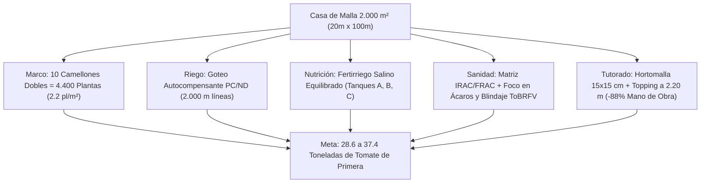

# PROYECTO LA CIGARRONERA — PLAN MAESTRO DE PRODUCCIÓN AGRONÓMICA: TOMATE INDETERMINADO EN CASA DE MALLA (2.000 m²)
## Valle de Quíbor, Municipio Jiménez, Estado Lara, Venezuela (695 – 710 msnm — Clima Semiárido Cálido BSh)
### Georreferenciación Satelital: [9°53'20.0"N 69°35'35.0"W (9.8889°N, -69.5931°W)](https://maps.app.goo.gl/yEVs9KCuuX1SvYJj8)
 
| Versión | Fecha de Emisión | Especialidad / Autoría | Estado y Alcance Agronómico |
| :---: | :---: | :--- | :--- |
| **v2.0.0** | 2026-09-05 | Especialista Senior en Agronomía, Climatología e Ingeniería de Invernaderos | **Aprobado**. Sincronización completa con Suite Web LA CIGARRONERA: balance hídrico dinámico FAO-56 corregido por salinidad y mulch, dimensionamiento de 3 sectores hidráulicos, integración del pozo artesanal Ø 50 cm profundizado a 60 m con bombeo por tandas al reservorio de 80 m³, y matriz fitosanitaria IRAC/FRAC con blindaje contra ácaros y ToBRFV. |
| v1.1.0 | 2026-08-25 | Especialista Senior en Invernaderos — Quíbor | Manejo de salinidad con fracción de lavado LF y tutorado Hortomalla 15x15 cm. |
| v1.0.0 | 2026-08-10 | Especialista Senior en Invernaderos — Quíbor | Formulación nutricional hidrosoluble e híbrida base. |

---

## INTRODUCCIÓN Y MEMORIA AGRONÓMICA

El presente plan de producción establece las directrices agronómicas, hidráulicas, nutricionales y fitosanitarias de alta precisión para el cultivo intensivo de **tomate indeterminado de fruto redondo / saladette (*Solanum lycopersicum*)** dentro de la estructura de **Casa de Malla de 2.000 m² ($20.00\text{ m}\ \text{ancho} \times 100.00\text{ m}\ \text{largo} \times 3.00\text{ m}\ \text{altura libre}$)** localizada exactamente en las coordenadas **$9^\circ 53' 20.0''\ \text{N},\ 69^\circ 35' 35.0''\ \text{W}$** ([abrir en Google Maps](https://maps.app.goo.gl/yEVs9KCuuX1SvYJj8)), con cubierta de malla anti-insectos 50×25 HDPE monofilamento, estructura de parral plano tensado con guayas de acero galvanizado (cero tubos en techo) y tutorado mecánico mediante **Malla Espaldera Biorientada (Hortomalla de 15×15 cm)** a 2.00 m con despunte apical (dejando 1.00 m libre de colchón térmico superior).

El objetivo agronómico es maximizar la eficiencia en el uso de agua salina de pozo ($EC_w \approx 1.2 - 1.5\text{ dS/m}$), suprimir el 88% de la mano de obra en guiado manual, blindar el cultivo contra virosis mecánicas (*ToBRFV* / *TMV*) y plagas del valle, logrando un rendimiento comercial proyectado de **6.5 a 8.5 kg/planta** (**28.6 a 37.4 toneladas métricas en la nave de 2.000 m²** = 143 a 187 t/ha equivalente) en un ciclo de 22 a 24 semanas.



---

## CAPÍTULO 1: MARCO DE PLANTACIÓN Y ADECUACIÓN DEL SUELO

### 1.1. Distribución Espacial de Camellones (20.00 m de Ancho)
La nave dispone de 20.00 m de ancho transversal que se dividen exactamente en **10 módulos de cultivo longitudinales de 100.00 m de fondo** (orientados de Este a Oeste):

* **Ancho de Camellón (Mesa de Cultivo):** $0.80\text{ m}$ en la base superior, con conformación trapezoidal de $0.25\text{ m}$ a $0.30\text{ m}$ de altura sobre el nivel del suelo para garantizar drenaje radicular y oxigenación.
* **Ancho de Pasillo de Tránsito y Labores:** $1.20\text{ m}$ libre entre camellones, permitiendo el paso holgado de carretillas de cosecha, cuadrillas y equipos pulverizadores de carretilla.
* **Distancia Entre Ejes de Camellones:** $0.80\text{ m} + 1.20\text{ m} = \mathbf{2.00\text{ m}}$.
* **Comprobación Modular:** $10\text{ camellones} \times 2.00\text{ m} = \mathbf{20.00\text{ m}}$ (aprovechamiento del 100% del ancho de la casa de malla).

```
   |<-- 0.80m -->|<------ 1.20m ------>|<-- 0.80m -->|
   +-------------+                     +-------------+
   |  *       *  |                     |  *       *  |
   |   (Cam. 1)  |      PASILLO        |   (Cam. 2)  | ... hasta Camellón 10
   |  *       *  |                     |  *       *  |
===+=============+=====================+=============+=== NPT ±0.00
   \____0.25m___/                       \____0.25m___/
```

### 1.2. Marco de Siembra y Densidad Poblacional
* **Doble Hilera por Camellón:** En cada lomo de $0.80\text{ m}$ se plantan 2 hileras de tomate separadas entre sí a **$0.50\text{ m}$**, dejando $0.15\text{ m}$ de margen libre a cada hombro del camellón.
* **Distancia Entre Plantas (Tresbolillo / Zig-Zag):** Plantas espaciadas a **$0.45\text{ m}$** sobre la hilera, desfasadas en tresbolillo para optimizar la interceptación de radiación fotosintéticamente activa (PAR) y la aireación del dosel foliar.
* **Número de Plantas por Metro Lineal de Camellón:** 
  $$\frac{2\text{ hileras}}{0.45\text{ m}} = 4.44\text{ plantas/metro lineal de camellón}$$
* **Población por Camellón (100 m de largo, descontando 1 m en cada cabecera para giros de esclusa):**
  $$98\text{ m netos} \times 4.44\text{ plantas/m} \approx \mathbf{440\text{ plantas por camellón}}$$
* **Población Total en la Nave de 2.000 m²:**
  $$10\text{ camellones} \times 440\text{ plantas} = \mathbf{4.400\text{ plantas totales}}$$
* **Densidad Superficial Resultante:**
  $$\text{Densidad} = \frac{4.400\text{ plantas}}{2.000\text{ m}^2} = \mathbf{2.20\text{ plantas/m}^2}$$
  *(Densidad agronómica estándar para tomate indeterminado en climas cálidos-semiáridos, evitando el sombreado mutuo y la proliferación de hongos por condensación interna).*

### 1.3. Manejo a Suelo Descubierto (Sin Acolchado Plástico)
En esta configuración operativa se prescinde del acolchado plástico (mulch), cultivando las 4.400 plantas directamente sobre los camellones de tierra al descubierto. Esta modalidad exige adaptaciones agronómicas e hidráulicas específicas para el Valle de Quíbor:

1. **Aumento de la Evaporación Directa y Demanda Hídrica:**
   * Sin la barrera plástica, la evaporación superficial directa ($E_s$) bajo la radiación solar y viento del Este de Quíbor se incrementa en un **18% a 20%**.
   * La demanda hídrica bruta en fructificación máxima pasa de $15.75\text{ m}^3\text{/día}$ a **$18.50\text{ a }19.00\text{ m}^3\text{/día}$** (aprox. 4.2 a 4.3 L/planta/día con lavado salino $LF=20\%$).
2. **Control del Ascenso Capilar y Costra Salina Superficial:**
   * Al evaporarse el agua del pozo ($EC_w = 1.4\text{ dS/m}$), los sulfatos y sales solubles ascienden a los primeros 2-3 cm del suelo formando una costra salina blanquecina.
   * **Protocolo de Manejo:** Realizar **escardas manuales superficiales ligeras (descostrado con escardilla)** a 2-3 cm de profundidad cada 15-20 días para romper los capilares del suelo franco-arcilloso, frenar la evaporación y evitar que el cuello de la planta entre en contacto con sales concentradas.
3. **Fijación Mecánica de la Cinta de Goteo:**
   * Al no estar aprisionada bajo el plástico, la cinta de goteo puede ser desplazada por el viento o por el tránsito de los operarios.
   * **Instalación Obligatoria:** Clavar **horquillas o grapas de alambre dulce/galvanizado Calibre 12** (o estacas de plástico) cada **6 a 8 metros** a lo largo del lomo del camellón para mantener las dos líneas de goteo estrictamente rectas y pegadas a la base de las plantas.
4. **Control Manual de Malezas:**
   * La ausencia de mulch negro permite la germinación de malezas (*Portulaca oleracea*, *Amaranthus*, etc.). Se programan **2 deshierbes manuales ligeros por mes** en el lomo del camellón, protegiendo siempre la cinta de goteo y el sistema radicular superficial.
5. **Facilidad de Abonado Granulado:**
   * La gran ventaja operativa de prescindir del mulch es que el abono granulado (NPK 12-12-17 SOP + Sulfato de Potasio) se aplica directamente sobre el suelo a 15 cm del tallo e incorporado con una pasada rápida de rastrillo/escardilla, suprimiendo la laboriosa tarea de perforar y parchar el plástico.

---

## CAPÍTULO 2: DISEÑO TÉCNICO DEL SISTEMA DE RIEGO POR GOTEO

### 2.1. Hidráulica y Selección de la Cinta de Goteo
En un camellón de 100 metros de longitud, una cinta convencional de laberinto simple sufre una pérdida de carga ($\Delta H$) que genera un diferencial de descarga >25% entre el inicio y el final de la hilera. Dado que el agua de pozo de Quíbor contiene sales disueltas ($EC_w \approx 1.4\text{ dS/m}$), cualquier sub-dosificación al final de la hilera provocaría salinización inmediata del bulbo húmedo.

* **Tipo de Emisor Seleccionado:** **Cinta de Goteo de calibre pesado (12 a 15 mil / 300 a 380 micras) con Goteros Integrados Autorregulantes / Autocompensantes (PC - Pressure Compensating)**.
  * *Autocompensante (PC):* Rango de presión de compensación constante de $0.6\text{ a }3.5\text{ bar}$ ($8.7\text{ a }50.7\text{ PSI}$), garantizando una tasa de emisión idéntica ($\pm 3\%$) a lo largo de los 100 metros de camellón.
  * *Antisifón / Antidrenante:* Bloquea la succión de partículas de suelo hacia el interior del emisor cuando se despresuriza la línea al apagar el pulso de riego (vital en suelo descubierto sin plástico).
* **Caudal Nominal del Gotero:** **$1.60\text{ L/h}$** (optimiza la infiltración en suelo franco-arcilloso de Quíbor).
* **Espaciamiento Entre Goteros:** **$0.40\text{ m}$** de distancia en la cinta.
* **Número de Líneas por Camellón:** **2 líneas paralelas** separadas a 0.50 m (una línea de cinta por cada hilera de siembra).
* **Total de Cinta de Goteo Instalada:**
  $$10\text{ camellones} \times 2\text{ líneas} \times 100\text{ m} = \mathbf{2.000\text{ metros lineales de cinta de goteo}}$$
* **Total de Emisores en la Nave:**
  $$\frac{2.000\text{ m}}{0.40\text{ m/gotero}} = \mathbf{5.000\text{ goteros autorregulantes}}$$
  *(Promedio de 1.14 goteros de 1.60 L/h por cada planta de tomate al tresbolillo en marcos a 0.45 m).*

### 2.2. Hidráulica de Bombeo y Sectorización Obligatoria para Motor 1" 1.5 HP (220V)

#### Diagnóstico Técnico del Equipo Disponible:
* **Equipo del Productor:** Motor eléctrico de alta presión 220V, conexión de **1 pulgada (1")**, potencia de **1.5 HP** (~1.1 kW).
* **Caudal Total de la Nave Completa:**
  $$Q_{total\_nave} = 5.000\text{ goteros} \times 1.60\text{ L/h} = \mathbf{8.00\text{ m}^3\text{/h}} \quad (\mathbf{2.22\text{ L/s}} = \mathbf{133.3\text{ L/min}})$$
* **¿Por qué la bomba de 1.5 HP es INSUFICIENTE para regar toda la nave a la vez?**
  1. Una electrobomba centrífuga/multietapa típica de 1" y 1.5 HP entrega su máximo rendimiento eficiente entre **$2.4\text{ y }3.2\text{ m}^3\text{/h}$** ($40\text{ a }53\text{ L/min}$) a presiones manométricas de trabajo de **$2.5\text{ a }3.5\text{ bar}$** ($25 - 35\text{ mca}$).
  2. Hacer circular $8.00\text{ m}^3\text{/h}$ a través de una conexión de 1" (diámetro interno ~26 mm) provocaría una velocidad de flujo desorbitada de **$4.2\text{ m/s}$** (el límite normativo es $1.5 - 2.0\text{ m/s}$), generando pérdidas por fricción $>45\text{ mca/100m}$, cavitación y colapso de la presión a $<0.5\text{ bar}$. A esa presión, los goteros autorregulantes no abren ni compensan.

#### Solución de Ingeniería Agronómica: Sectorización en 3 Bloques Balanceados
Para adaptar la demanda a la curva de rendimiento óptimo de la bomba de 1.5 HP, la nave de 2.000 m² se divide hidráulicamente en **3 sectores independientes**:

```
====================================================================================================
ARQUITECTURA DE SECTORIZACIÓN HIDRÁULICA (NAVE 2.000 m² / BOMBA 1.5 HP 220V DE 1")
====================================================================================================
Sector       Camellones Asignados   Goteros PC (40 cm)   Caudal de Operación     Plantas   Presión en Cabezal
----------------------------------------------------------------------------------------------------
SECTOR 1     Camellones 1 a 3 (3)   1.500 goteros        2.40 m³/h (40.0 L/min)  1.320 pl  2.8 – 3.2 bar
SECTOR 2     Camellones 4 a 7 (4)   2.000 goteros        3.20 m³/h (53.3 L/min)  1.760 pl  2.5 – 2.8 bar
SECTOR 3     Camellones 8 a 10 (3)  1.500 goteros        2.40 m³/h (40.0 L/min)  1.320 pl  2.8 – 3.2 bar
====================================================================================================
TOTALES      10 Camellones Dobles   5.000 Goteros        Operación Secuencial    4.400 pl  Garantía PC
```

* **Diámetros de Tubería:**
  * **Descarga de Bomba:** 1 pulgada (1").
  * **Ampliación Inmediata tras el Filtro:** La tubería matriz de distribución se amplía de 1" a **2 pulgadas (PVC Clase 10 / SDR 26)**. Con $3.2\text{ m}^3\text{/h}$, la velocidad en 2" es de apenas $0.45\text{ m/s}$, manteniendo las pérdidas de carga en $<0.4\text{ mca}$ a lo largo de toda la cabecera.
  * **Cabezal de Sector:** Válvula de bola o solenoide de 1.5" o 2" por cada sector.

#### Programación Secuencial de Bombeo por Sector:
* En pico de fructificación (demanda total sin mulch: $\approx 18.5\text{ m}^3\text{/día}$ para las 4.400 plantas):
  * **Sector 1 (3 camellones):** Demanda $5.55\text{ m}^3\text{/día} \div 2.40\text{ m}^3\text{/h} = \mathbf{2.31\text{ h/día}}$ ($139\text{ min/día}$). Se distribuye en **5 pulsos de 28 minutos**.
  * **Sector 2 (4 camellones):** Demanda $7.40\text{ m}^3\text{/día} \div 3.20\text{ m}^3\text{/h} = \mathbf{2.31\text{ h/día}}$ ($139\text{ min/día}$). Se distribuye en **5 pulsos de 28 minutos**.
  * **Sector 3 (3 camellones):** Demanda $5.55\text{ m}^3\text{/día} \div 2.40\text{ m}^3\text{/h} = \mathbf{2.31\text{ h/día}}$ ($139\text{ min/día}$). Se distribuye en **5 pulsos de 28 minutos**.
* **Tiempo Total Acumulado de Bombeo:** $2.31\text{ h} \times 3 = \mathbf{6.93\text{ horas/día}}$ de trabajo para el motor de 1.5 HP, operado en rondas escalonadas (ej. Ronda 1: Sec 1 de 07:00 a 07:28, Sec 2 de 07:30 a 07:58, Sec 3 de 08:00 a 08:28... y descansos entre rondas). La bomba trabaja fría y en su punto de máxima eficiencia eléctrica.

---

### 2.3. Cabezal de Filtración con Filtro de Discos (120 Mesh) para Laguna de Tierra

El agua vertida previamente en una **laguna de tierra a cielo abierto** en Quíbor acumula dos contaminantes críticos que colapsan los sistemas de goteo en cuestión de horas:
1. **Proliferación de Algas Verdes y Cianobacterias:** Estimuladas por la radiación solar incidente constante de Quíbor. Las algas filamentosas forman masas mucilaginosas elásticas.
2. **Arcillas y Limos Coloidales en Suspensión:** Levantados de las paredes y fondo de la laguna de tierra por el viento y el oleaje.

```
[ LAGUNA DE TIERRA A CIELO ABIERTO ]
              |
              v
   (1) CANASTILLA / PICHINCHA FLOTANTE CON BOYA
       Malla de acero inox 1.5 - 2.0 mm suspendida a 50 cm bajo el agua
       (No toca el lodo del fondo ni succiona natas flotantes)
              |
              v  Tubería de succión 1.25" o 1.5" con válvula check
   (2) MOTOR ELÉCTRICO DE ALTA PRESIÓN 1.5 HP 220V (1 pulgada)
              |
              v  Ampliación a 1.5" o 2"
   (3) BATERÍA DE FILTRO DE DISCOS DE ANILLAS RANURADAS (120 MESH / 130 µm)
       Filtro de 1.5" o 2" (código de color rojo) con compresión helicoidal
       Doble manómetro de glicerina (Entrada y Salida) para medir diferencial ΔP
              |
              v
   (4) INYECTOR VENTURI DE 1" EN BYPASS (Fertilizantes y Ácido Nítrico)
              |
              v
   (5) MATRIZ PRINCIPAL DE PVC 2" CON DERIVACIÓN A 3 VÁLVULAS DE SECTOR
```

#### Especificación Exacta del Filtro de Discos de 120 Mesh:
* **Tipo de Filtro:** Filtro de discos de anillas ranuradas (tecnología tipo Azud Modular 100 / Arkal Super Leader / Irritec Rotodisk).
* **Diámetro de Conexión Recomendado:** **1.5 pulgadas o 2 pulgadas** (rosca macho BSP/NPT).
  * *Por qué 1.5" o 2" si la bomba es de 1":* Un filtro de discos de 1.5" o 2" tiene una capacidad nominal de filtrado de $10\text{ a }15\text{ m}^3\text{/h}$. Al operar con el caudal del sector ($2.4\text{ a }3.2\text{ m}^3\text{/h}$), el filtro trabaja **sobredimensionado 3x a 4x**, reduciendo la velocidad de paso del agua a través de las anillas. Esto permite que el filtro retenga gran cantidad de algas sin saturarse en medio de un pulso de riego.
* **Grado de Filtrado:** **120 Mesh / 130 micras (Anillas de color ROJO)**.
* **Mecanismo de Retención Tridimensional vs Filtro de Malla:**
  * En una laguna de tierra, un filtro de malla metálica plana es inútil: las algas filamentosas se aplanan contra la malla como una lámina de papel tapándola en minutos.
  * El **filtro de discos** comprime cientos de anillas ranuradas mediante un resorte de acero inox. El agua atraviesa las ranuras microscópicas cruzadas, atrapando algas y partículas de arcilla en **profundidad tridimensional**, permitiendo que el agua limpia continúe fluyendo hacia los goteros.
* **Monitoreo de Colmatación y Retrolavado:**
  * Se instalan **dos manómetros de glicerina de 0-6 bar** (uno antes del filtro y otro después).
  * Mientras el filtro está limpio: $\Delta P = P_{entrada} - P_{salida} \le 0.1\text{ a }0.2\text{ bar}$.
  * **Criterio de Limpieza:** Cuando $\Delta P \ge \mathbf{0.4\text{ a }0.5\text{ bar}}$, se detiene el pulso, se afloja la abrazadera del filtro, se descomprimen las anillas bajo chorro de agua o se acciona el retrolavado manual/semiautomático. Se recomienda limpieza preventiva al inicio de cada jornada.

---

### 3.1. Estrategia de Pulsos Cortos contra la Salinidad del Pozo a Suelo Descubierto
En el clima semiárido de Quíbor y cultivando a **suelo descubierto (sin acolchado plástico)**, la evaporación superficial aceleraría la acumulación de costras de sal en la base del tallo si se regara con riegos largos e infrecuentes. En un suelo franco-arcilloso, un riego largo lava los nutrientes móviles (nitratos) al fondo y, durante las horas de calor, la evaporación capilar succiona las sales del agua de pozo ($EC_w \approx 1.4\text{ dS/m}$) hacia la superficie, elevando la conductividad del extracto saturado ($EC_e$) por encima de $4.5\text{ dS/m}$ y provocando necrosis foliar y pudrición apical (culillo).

La solución técnica es el **Riego Fraccionado por Alta Frecuencia en Sectores (4 a 5 pulsos de 20 a 28 min por sector)**:
* Mantiene el potencial mátrico del suelo constantemente elevado (entre $-10\text{ y }-25\text{ kPa}$), evitando el estrés hídrico.
* Genera un frente de humedad descendente continuo que desplaza las sales solubles hacia los bordes exteriores del camellón, manteniendo la zona de raíces (0-30 cm) desintoxicada.
* Se complementa con **escardas superficiales de rotura de costra** cada 15-20 días.

```
       SUPERFICIE A SUELO DESCUBIERTO (CINTA FIJADA CON HORQUILLAS CADA 6-8 M)
    ===================[ Gotero PC ]========[ Gotero PC ]===================
             . - ~ ~ - .                    . - ~ ~ - .
          /               \              /               \
         |  ZONA DE BAJA   |            |  ZONA DE BAJA   |
         |    SALINIDAD    |            |    SALINIDAD    |
         |   (0 - 30 cm)   |            |   (0 - 30 cm)   |
          \   RAÍCES       /            \   RAÍCES       /
            ~ . _ _ _ . ~                 ~ . _ _ _ . ~
       =========================================================
       FRENTE DE LAVADO: Sales empujadas a la periferia (>35 cm)
       [Rotura de costra capilar con escardilla ligera a 2-3 cm]
```

### 3.2. Calendario Dinámico de Riego por Etapa Fenológica (Suelo Descubierto & 3 Sectores)

*Valores calculados para la nave de 2.000 m² (4.400 plantas) a suelo descubierto (evaporación ajustada +18-20%) y operando con electrobomba de 1" y 1.5 HP en 3 sectores secuenciales ($2.40\text{ m}^3\text{/h}$ en Sec 1 y 3; $3.20\text{ m}^3\text{/h}$ en Sec 2):*

| Etapa Fenológica | Duración (Semanas) | Kc FAO-56 | Demanda Bruta (+20% Evap + LF) | Volumen Diario Nave 2.000 m² | Volumen Diario por Sector (Sec 1/Sec 2/Sec 3) | Pulsos / Día por Sector | Duración de Pulso por Sector (Bomba 1.5 HP) | Tiempo Bombeo Diario Acumulado |
| :--- | :--- | :--- | :--- | :--- | :--- | :--- | :--- | :--- |
| **1. Enraizamiento / Establecimiento** | Semanas 1 a 3 | 0.60 | **11.1 L/pl/sem** | **7.00 m³/día** | 2.10 / 2.80 / 2.10 m³ | 3 pulsos | **18 min / sector** | **2.6 h / día** |
| **2. Crecimiento Vegetativo** | Semanas 4 a 7 | 0.80 | **15.8 L/pl/sem** | **9.95 m³/día** | 2.98 / 3.98 / 2.98 m³ | 4 pulsos | **19 min / sector** | **3.8 h / día** |
| **3. Floración y Cuajado** | Semanas 8 a 11 | 1.10 | **23.6 L/pl/sem** | **14.85 m³/día** | 4.45 / 5.95 / 4.45 m³ | 5 pulsos | **22 min / sector** | **5.5 h / día** |
| **4. Fructificación Masiva y Cosecha** | Semanas 12 a 22+ | 1.05 | **27.2 L/pl/sem** | **17.10 – 18.50 m³/día** | 5.55 / 7.40 / 5.55 m³ | 5 pulsos | **28 min / sector** | **6.9 h / día** |
| **5. Fin de Ciclo / Cierre** | Últimas 2 sem | 0.90 | **18.8 L/pl/sem** | **11.80 m³/día** | 3.54 / 4.72 / 3.54 m³ | 4 pulsos | **22 min / sector** | **4.4 h / día** |

*Régimen de Riego Secuencial Recomendado en Fructificación (Pico 18.5 m³/día):*
* **Ronda 1 (Mañana temprana):** Sec 1 (07:00 - 07:28) $\rightarrow$ Sec 2 (07:30 - 07:58) $\rightarrow$ Sec 3 (08:00 - 08:28). [Bomba descansa 1h].
* **Ronda 2 (Media mañana):** Sec 1 (09:30 - 09:58) $\rightarrow$ Sec 2 (10:00 - 10:28) $\rightarrow$ Sec 3 (10:30 - 10:58). [Bomba descansa 45 min].
* **Ronda 3 (Mediodía):** Sec 1 (11:45 - 12:13) $\rightarrow$ Sec 2 (12:15 - 12:43) $\rightarrow$ Sec 3 (12:45 - 13:13). [Bomba descansa 45 min].
* **Ronda 4 (Primera tarde):** Sec 1 (14:00 - 14:28) $\rightarrow$ Sec 2 (14:30 - 14:58) $\rightarrow$ Sec 3 (15:00 - 15:28). [Bomba descansa 30 min].
* **Ronda 5 (Tarde fresca):** Sec 1 (16:00 - 16:28) $\rightarrow$ Sec 2 (16:30 - 16:58) $\rightarrow$ Sec 3 (17:00 - 17:28). Cierre de jornada.

---

## CAPÍTULO 4: PLAN DE FERTIRRIEGO Y NUTRICIÓN MINERAL COMPLETA

### 4.1. Fundamento Hidrogeológico del Acuífero y Análisis del Agua (CIDIAT-ULA / SHYQ)
La calidad química del agua de riego en Quíbor está gobernada por la hidrogeología del valle, descrita científicamente por **Jégat, Mora, Hernández (CIDIAT-ULA), Alvarado, Massiah (SHYQ) y Terán (2012)**:
* **El Cono de Abatimiento Central:** Tras 50 años de minería de agua subterránea (extracción de $22\text{ Mm}^3\text{/año}$ frente a una recarga renovable de solo $17\text{ Mm}^3\text{/año}$, sobreexplotación del 29%), los niveles piezométricos cayeron entre 53 y 95 metros, situándose en **546 msnm en el centro del valle** (25 m por debajo de la cota de salida a 571 msnm).
* **Profundidad de Bombeo y Salinización:** Los pozos operan entre **11 m y 136 m de profundidad**, bombeando lentes de grava en contacto con arcillas terciarias que aportan sales solubles y bicarbonatos.

#### Parámetros Químicos Típicos del Pozo:
* pH: $7.6\text{ a }8.2$ (alcalina, con alta concentración de bicarbonatos $\text{HCO}_3^- \approx 2.5 - 4.5\text{ mmol/L}$).
* Conductividad Eléctrica ($EC_w$): $1.2\text{ a }1.5\text{ dS/m}$ (pudiendo llegar a $2.0\text{ dS/m}$ en el fondo del cono central).
* Calcio disuelto: $2.5\text{ a }4.0\text{ mmol/L}$ (aporta calcio natural, el cual se descuenta del balance de fertilizantes).
* Magnesio disuelto: $1.5\text{ a }2.5\text{ mmol/L}$.
* Sulfatos disueltos: $2.0\text{ a }3.5\text{ mmol/L}$.

#### Acción Obligatoria: Corrección de Bicarbonatos y pH con Ácido
* Para evitar que el calcio disuelto precipite con los fosfatos obstruyendo los goteros y bloqueando el hierro, se debe inyectar **Ácido Nítrico al 60%** (o **Ácido Fosfórico al 85%**) para neutralizar los bicarbonatos hasta dejar un remanente de $0.5\text{ mmol/L}$, estabilizando el pH de la solución de gotero en **$5.8\text{ a }6.2$**.
* Consumo estimado de ácido: **$150\text{ a }250\text{ mL de Ácido Nítrico por cada m}^3\text{ de agua regada}$** (aporta aproximadamente $1.5\text{ a }2.5\text{ mmol/L de Nitrógeno nítrico}$ utilizable por la planta).

#### Dualidad Hidrológica: Pozo Abatido vs Recarga Artificial Yacambú (1 m³/s)
El modelo matemático en Visual MODFLOW 4.1 de CIDIAT-ULA evaluó la recarga artificial de $1\text{ m}^3\text{/s}$ con aguas del Río Yacambú, lo que proyecta dos escenarios operativos para el módulo de 2.000 m²:
1. **Escenario A (Actual - Pozo Profundo Salino):** $EC_w = 1.4\text{ dS/m}$, Fracción de lavado $LF = 20\%$, demanda pico nave = **$15.08\text{ a }15.75\text{ m}^3\text{/día}$**, consumo de Ácido Nítrico = **$22\text{ L/semana}$**.
2. **Escenario B (Futuro - Conexión Yacambú / Recarga Artificial):** Agua dulce andina ($EC_w \approx 0.5\text{ dS/m}$), Fracción de lavado reducida a **$LF = 6.5\%$**, demanda pico nave = **$12.45\text{ m}^3\text{/día}$ (ahorro del 17.5% de agua = $2.63\text{ m}^3\text{/día}$ menos)** y consumo de ácido nítrico reducido a solo **$7\text{ a }8\text{ L/semana}$** (ahorro del 65% en insumo de ácido).

### 4.2. Sistema de Tanques de Solución Madre (Inyección A + B + C)
Para evitar la precipitación química insoluble (ej. Calcio + Fósforo $\rightarrow$ Fosfato Tricálcico; Calcio + Sulfato $\rightarrow$ Yeso), se requiere una batería de 3 tanques concentrados al 10% (100 kg por cada 1.000 L de agua en el tanque):

* **TANQUE A (Tanque de Calcio y Hierro):**
  * Nitrato de Calcio $\text{Ca(NO}_3)_2$ (aporta $\text{Ca}^{2+}$ y $\text{N-NO}_3^-$).
  * Nitrato de Potasio $\text{KNO}_3$ (fracción compatible).
  * Quelato de Hierro Fe-EDDHA (al 6%) o Fe-DTPA (estable en pH hasta 7.5).
* **TANQUE B (Tanque de Fosfatos, Sulfatos y Micronutrientes):**
  * Fosfato Monopotásico $\text{KH}_2\text{PO}_4$ (MKP 0-52-34) o Fosfato Monoamónico (MAP 12-61-0).
  * Sulfato de Potasio $\text{K}_2\text{SO}_4$ (0-0-50).
  * Nitrato de Potasio $\text{KNO}_3$ (13-0-46).
  * Sulfato de Magnesio $\text{MgSO}_4\cdot 7\text{H}_2\text{O}$.
  * Boro (Ácido Bórico / Solubor al 20.5% B).
  * Mezcla de Micronutrientes Quelados (Manganeso, Zinc, Cobre, Molibdeno).
* **TANQUE C (Tanque de Ácido Regulador):**
  * Ácido Nítrico o Fosfórico diluido al 10-15% para regulación automática de pH.

### 4.3. Concentraciones Óptimas de Elementos en el Riego (ppm)

| Elemento | Fase 1: Enraizamiento (Sem 1-3) | Fase 2: Vegetativo (Sem 4-7) | Fase 3: Floración/Cuajado (Sem 8-11) | Fase 4: Cosecha Plena (Sem 12-22+) |
| :--- | :--- | :--- | :--- | :--- |
| **N Total (ppm)** | 110 – 120 | 150 – 170 | 170 – 190 | 180 – 200 |
| **P ($\text{P}_2\text{O}_5$) (ppm)**| 50 – 60 | 45 – 50 | 55 – 65 | 50 – 55 |
| **K ($\text{K}_2\text{O}$) (ppm)** | 140 – 160 | 220 – 250 | 320 – 360 | 380 – 420 |
| **Ca (ppm)** | 130 – 150 | 140 – 160 | 170 – 190 | 180 – 200 |
| **Mg (ppm)** | 35 – 45 | 45 – 50 | 50 – 60 | 55 – 65 |
| **S ($\text{SO}_4$) (ppm)** | 50 – 60 | 60 – 75 | 80 – 100 | 90 – 110 |
| **Relación N : K** | **1 : 1.3** | **1 : 1.5** | **1 : 1.9** | **1 : 2.2** |
| **CE Objetivo Salida Gotero**| **1.8 – 2.0 dS/m** | **2.1 – 2.3 dS/m** | **2.4 – 2.6 dS/m** | **2.6 – 2.8 dS/m** |
| **pH Objetivo** | **5.8 – 6.0** | **5.8 – 6.2** | **5.8 – 6.2** | **5.8 – 6.2** |

### 4.4. Dosificación Semanal de Fertilizantes Comerciales para las 4.400 Plantas (2.000 m²)

A continuación se detalla la cantidad física en **kilogramos por semana** que deben disolverse y aplicarse en la nave de 2.000 m² según cada etapa:

| Fertilizante Comercial Sólido Soluble | Fase 1 (kg/semana) [Sem 1 a 3] | Fase 2 (kg/semana) [Sem 4 a 7] | Fase 3 (kg/semana) [Sem 8 a 11] | Fase 4 (kg/semana) [Sem 12 a 22] |
| :--- | :--- | :--- | :--- | :--- |
| **Nitrato de Calcio** ($15.5\%\text{ N}, 26.5\%\text{ CaO}$) | 12.0 kg | 22.0 kg | 32.0 kg | **36.0 kg** |
| **Nitrato de Potasio** ($13\%\text{ N}, 46\%\text{ K}_2\text{O}$) | 10.0 kg | 20.0 kg | 35.0 kg | **45.0 kg** |
| **Fosfato Monopotásico (MKP 0-52-34)** | 6.0 kg | 8.0 kg | 12.0 kg | **10.0 kg** |
| **Sulfato de Potasio Soluble** ($50\%\text{ K}_2\text{O}, 18\%\text{ S}$)| 4.0 kg | 10.0 kg | 18.0 kg | **24.0 kg** |
| **Sulfato de Magnesio Heptahidratado** ($16\%\text{ MgO}$) | 5.0 kg | 9.0 kg | 14.0 kg | **16.0 kg** |
| **Quelato de Hierro (Fe-EDDHA 6%)** | 0.45 kg | 0.70 kg | 0.90 kg | **1.10 kg** |
| **Solubor / Boro Soluble (20.5% B)** | 0.08 kg | 0.15 kg | 0.25 kg | **0.30 kg** |
| **Mezcla Micronutrientes (Tradecorp AZ / similar)**| 0.20 kg | 0.35 kg | 0.50 kg | **0.60 kg** |
| **Ácido Nítrico 60% (Consumo Semanal)** | ~6.0 L | ~12.0 L | ~18.0 L | **~22.0 L** |
| **TOTAL FERTILIZANTES SÓLIDOS / SEMANA** | **37.73 kg** | **70.20 kg** | **112.65 kg** | **133.00 kg** |

### 4.5. Programa con Fertilizantes Hidrosolubles de la Marca AIFA (Disponibles en Venezuela)

En el mercado agroquímico venezolano (ampliamente distribuidos en el Estado Lara y Valle de Quíbor), la marca **AIFA (Fertilizantes AIFA C.A.)** ofrece una línea completa de fertilizantes grado fertirriego 100% solubles y libres de insolubles, con quelatación de microelementos:

1. **Catálogo AIFA Específico para el Ciclo de Tomate:**
   * **AIFA Fructificación / Producción (NPK 12-06-36 + ME o 13-05-40):** Fórmula de engorde rica en potasio, con micronutrientes quelatados (B, Zn, Mn, Cu, Mo). Ideal para floración avanzada y cuajado masivo.
   * **AIFA Nitrato de Calcio Hidrosoluble ($15.5\%\text{ N} - 26.0\%\text{ CaO}$):** Pureza cristalina sin cloruros, soluble en agua dura.
   * **AIFA MKP (Fosfato Monopotásico 0-52-34):** Aporte concentrado de fósforo y potasio con índice de salinidad mínimo.
   * **AIFA Sulfato de Magnesio Hidrosoluble ($16\%\text{ MgO} - 13\%\text{ S}$):** Fuente de magnesio para síntesis de clorofila.
   * **AIFA Desarrollo (NPK 20-20-20 + ME o 18-18-18):** Para fases vegetativas intermedias (semanas 4 a 7).
   * **Quelato de Hierro Fe-EDDHA (6% Fe soluble):** Indispensable para contrarrestar el pH $7.8 - 8.2$ del agua de pozo de Quíbor, donde el hierro común precipita inmediatamente.

2. **Receta Semanal Específica con Productos AIFA en Fructificación Plena (4.400 Plantas / 2.000 m²):**
   * **TANQUE A (1.000 L de Solución Madre):**
     * AIFA Nitrato de Calcio: **$36.0\text{ kg/semana}$**
     * Quelato de Hierro Fe-EDDHA (6%): **$1.10\text{ kg/semana}$**
   * **TANQUE B (1.000 L de Solución Madre):**
     * AIFA Fructificación 12-06-36 + ME: **$55.0\text{ kg/semana}$**
     * Sulfato de Potasio Soluble (o Nitrato de Potasio suplementario): **$22.0\text{ kg/semana}$**
     * AIFA MKP (0-52-34): **$8.0\text{ kg/semana}$**
     * AIFA Sulfato de Magnesio: **$16.0\text{ kg/semana}$**
     * Solubor / Boro Soluble: **$0.30\text{ kg/semana}$**
   * **TANQUE C (Ácido Corrector de pH):**
     * Ácido Nítrico al 60%: **$~22.0\text{ L/semana}$** (para mantener pH en $5.8 - 6.2$ y destruir bicarbonatos).

---

### 4.6. Alternativa de Bajo Costo en Insumo: Abonado Granulado de Aplicación Manual en Fructificación

Como alternativa de menor costo de adquisición por saco en Venezuela, se puede implementar el abonado edáfico con fertilizantes granulados convencionales aplicados de forma manual durante la fructificación.

#### 1. Fuentes Granuladas Comerciales Recomendadas en Venezuela:
* **NPK 12-12-17+2MgO+TE (tipo Blaukorn / Nitrophoska Azul / FertiComplex / YaraMila Complex / formulaciones Pequiven libres de cloro):** Gránulo complejo con base en **Sulfato de Potasio (SOP)**. Es la fórmula edáfica por excelencia en Quíbor para solanáceas.
* **Sulfato de Potasio Granulado ($\text{K}_2\text{SO}_4$ 0-0-50 + 18% S):** Gránulo estándar libre de cloro para refuerzo potásico en engorde.
* **Nitrato de Calcio Granulado (tipo YaraLiva Tropicote o equivalente importado):** Gránulos recubiertos para aplicación al suelo sin apelmazamiento.

> [!CAUTION]
> **ADVERTENCIA VINCULANTE SOBRE EL CLORO EN QUÍBOR:**
> Queda **terminantemente prohibido el uso de Cloruro de Potasio (KCl / 0-0-60) o fórmulas NPK convencionales a base de KCl (ej. Triple 15 estándar de $47\%\text{ Cl}^-$)**. El agua de pozo de Quíbor ya contiene entre $2.5\text{ y }4.0\text{ meq/L de Cloruros}$. La aplicación manual de KCl disparará la salinidad puntual del suelo a $>5.0\text{ dS/m}$, provocando fitotoxicidad por cloro, quemado de bordes foliares, bloqueo de calcio y aparición masiva de culillo (*blossom end rot*). Toda fuente potásica debe ser a base de Sulfato de Potasio (SOP).

#### 2. Protocolo Operativo y Dosificación Manual:
* **Dosis por Planta:** **$30\text{ a }35\text{ gramos por planta}$** cada 18 a 21 días (3 aplicaciones durante la fase de fructificación de 10 a 12 semanas).
* **Consumo Físico por Abonada (4.400 Plantas):**
  $$4.400\text{ plantas} \times 32\text{ g/planta} = \mathbf{140.8\text{ kg totales por abonada}} \quad (\approx 3\text{ sacos de }50\text{ kg})$$
* **Composición de la Mezcla Física Granulada por Abonada:**
  * NPK 12-12-17 SOP: **$70.0\text{ kg}$** ($1.4\text{ sacos}$)
  * Sulfato de Potasio Granulado (0-0-50): **$45.0\text{ kg}$** ($0.9\text{ sacos}$)
  * Nitrato de Calcio Granulado: **$25.8\text{ kg}$** ($0.5\text{ sacos}$)
* **Técnica de Aplicación Manual a Suelo Descubierto (Sin Acolchado Plástico):**
  * Al no tener acolchado, la aplicación es sumamente ágil: depositar los 32 gramos de mezcla en banda continua a **$15\text{ cm}$ del tallo**, directamente sobre la línea húmeda que genera la cinta de goteo a 40 cm.
  * Realizar una **escarda ligera con rastrillo o escardilla superficial** para incorporar el abono a 2-3 cm de profundidad, rompiendo simultáneamente la costra salina.
  * Activar inmediatamente un pulso de riego de 25-28 minutos en el sector para disolver los gránulos e inducir la absorción radicular.

---

### 4.7. Estudio Comparativo Exhaustivo: AIFA Hidrosoluble vs Granulado Manual en Fructificación

A continuación se comparan técnica, agronómica y financieramente ambas estrategias para la nave de 2.000 m² en Quíbor:

| Parámetro Agronómico y Económico | Estrategia 1: Fertirriego 100% Hidrosoluble AIFA | Estrategia 2: Abonado Granulado Manual (NPK 12-12-17 SOP) | Diferencia e Impacto Operativo |
| :--- | :--- | :--- | :--- |
| **Forma de Aplicación** | Inyección continua por cinta a 40 cm (en cada pulso diario) | Aplicación manual cada 18-21 días en banda sobre camellón | Ahorro de mano de obra con AIFA |
| **Eficiencia de Absorción Nutricional** | **$80 – 90\%$** (nutrientes disueltos en el bulbo radicular) | **$50 – 60\%$** (pérdidas por insolubilidad y fijación) | +30% asimilación neta con hidrosoluble |
| **Control de Salinidad ($EC_e$)** | Estable ($2.4 - 2.7\text{ dS/m}$ sin picos osmóticos) | **Picos salinos locales ($>4.5\text{ dS/m}$)** tras abonar | Menor estrés osmótico y cero culillo |
| **Rendimiento Comercial Proyectado** | **$7.5\text{ a }8.5\text{ kg / planta}$** | **$5.5\text{ a }6.8\text{ kg / planta}$** | **Pérdida de $1.7\text{ a }2.0\text{ kg/planta}$ con granulado** |
| **Producción Total en 2.000 m² (4.400 pl)**| **$33.0\text{ a }37.4\text{ Toneladas}$** | **$24.2\text{ a }29.9\text{ Toneladas}$** | **Brecha de $7.5\text{ a }8.8\text{ Toneladas}$ menos** |
| **Cestas Plásticas de 20 kg Cosechadas**| **$1.650\text{ a }1.870\text{ cestas}$** | **$1.210\text{ a }1.495\text{ cestas}$** | **$-375\text{ a }-440\text{ cestas de fruta}$** |
| **Calibre Extra / Primera (>180 g)** | **$75 – 80\%$** (calibre grueso uniforme) | **$60 – 65\%$** (mayor dispersión hacia segunda) | Tomate AIFA accede a precios premium |
| **Costo Mensual de Fertilizantes (Est.)**| ~$850 – $950 USD / mes ($25-$30/saco 25kg) | **~$420 – $500 USD / mes** ($25-$35/saco 50kg) | **Ahorro aparente en insumo: ~$450 USD/mes** |
| **Mano de Obra en Fertilización** | **0 jornales extra** (automatizado en cabezal) | **2 a 3 jornales por abonada** (6 a 9 jornales en ciclo) | Labor directa a suelo descubierto sin romper film |
| **Balance Financiero Neto a Puerta de Finca**| **MÁXIMA RENTABILIDAD NETA:** Las 7.5 Ton extra ($0.65 - $0.80/kg) generan **$4.875 a $6.000 USD de ingreso bruto adicional**. | El ahorro en sacos de fertilizante ($~1.000 USD en el ciclo) no compensa la pérdida de $5.000 USD en fruta. | **El fertirriego AIFA genera +$3.800 USD netos de beneficio sobre el granulado.** |

#### Recomendación Agronómica Mixta (Estrategia Híbrida Óptima a Suelo Descubierto):
Para productores que buscan **economía de arranque sin comprometer el calibre final**:
1. **Fondo Granulado al Preparar el Camellón:** Incorporar $50\text{ g/metro lineal}$ de NPK 12-12-17 SOP en el lomo del camellón antes del trasplante e instalar la cinta fijada con horquillas. Esto nutre el enraizamiento inicial (semanas 1 a 4) a muy bajo costo.
2. **Fertirriego Hidrosoluble AIFA en Fructificación:** A partir de la floración y durante toda la cosecha (semanas 8 a 22), pasar al **fertirriego 100% con sales hidrosolubles AIFA** en la cinta de goteo sectorizada. Esto asegura calibre primera y suprime los jornales manuales.

---

## CAPÍTULO 5: PLAN INTEGRAL DE SANIDAD VEGETAL (FUMIGACIÓN, MIP Y BIOSEGURIDAD)

### 5.1. El Punto Crítico de la Malla 50×25 en Quíbor: Ácaros
La malla 50×25 HDPE retiene al 100% insectos voladores de cuerpo mediano o grande (mosca blanca, trips, pulgón, minador, polillas). Sin embargo, los **ácaros fitófagos poseen dimensiones de 120 a 180 micras** y atraviesan físicamente cualquier poro comercial. Por tanto, la defensa anti-ácaros es **100% de manejo preventivo y monitoreo agronómico**:

1. **Araña Roja (*Tetranychus urticae*):** Punteaduras cloróticas en el haz, bronceado y telaraña densa en el envés. Disparada por humedades relativas <50% y vientos secos.
2. **Ácaro Blanco (*Polyphagotarsonemus latus*):** Deformación helicoidal de brotes apicales (hojas acucharadas hacia abajo, quebradizas) y aborto floral.

### 5.2. Matriz de Fumigación y Rotación Química por Modo de Acción (IRAC / FRAC)

Para evitar la aparición de biotipos resistentes en el Valle de Quíbor, se prohíbe terminantemente aplicar un mismo grupo químico más de dos veces consecutivas.

| Blanco / Plaga / Enfermedad | Ingrediente Activo Oficial | Nombre Comercial Referencia | Grupo IRAC / FRAC | Dosis por 100 L de Agua | Tipo de Acción y Momento | Periodo de Carencia (PC) |
| :--- | :--- | :--- | :--- | :--- | :--- | :--- |
| **Ácaros (Araña roja / Ácaro blanco)** | Abamectina 1.8% EC | Vertimec / Acaramik | **IRAC 6** | 75 – 100 mL | Translaminar. Foco al envés foliar. | 3 días |
| **Ácaros (Ovicida / Larvicida)** | Hexitiazox 10% WP | Caesar / Nissorun | **IRAC 10A** | 50 – 60 g | Inhibidor de crecimiento de huevos/ninfas. | 7 días |
| **Ácaros y Mosca Blanca (Ninfas)**| Spiromesifen 24% SC | Oberon | **IRAC 23** | 60 – 80 mL | Inhibidor síntesis de lípidos. Muy residual. | 3 días |
| **Trips (*Frankliniella*)** | Spinosad 48% SC | Tracer | **IRAC 5** | 20 – 25 mL | Modulador receptor nicotínico. Tarde fresca. | 1 día |
| **Trips y Mosca Blanca** | Acetamiprid 20% SP | Mospilan | **IRAC 4A** | 35 – 50 g | Neonicotinoide sistémico. Rotar con IRAC 29. | 3 días |
| **Pulgones y Mosca Blanca** | Flonicamid 50% WG | Teppeki / Beleaf | **IRAC 29** | 15 – 20 g | Bloqueador selectivo de alimentación. | 1 día |
| **Gusano Perforador / Polilla** | Clorantraniliprol 20% SC | Coragen | **IRAC 28** | 15 – 20 mL | Modulador rianodina. Ovicida-larvicida. | 1 día |
| **Oídio / Cenicilla (*Leveillula taurica*)**| Azufre Micronizado 80% WP | Kumulus / Microthiol | **FRAC M02** | 250 – 300 g | Multisitio preventivo. No aplicar a >32°C. | 0 días |
| **Oídio y Tizón Temprano** | Difenoconazol 25% EC | Score | **FRAC 3** | 40 – 50 mL | DMI Triazol. Curativo-erradicante. | 7 días |
| **Tizón Temprano (*Alternaria solani*)**| Clorotalonil 72% SC | Daconil / Bravo | **FRAC M05** | 200 – 250 mL | Contacto multisitio. Preventivo puro. | 3 días |
| **Moho Gris (*Botrytis cinerea*)** | Boscalid 50% WG | Cantus | **FRAC 7** | 50 – 60 g | Inhibidor respiratorio SDHI. En floración. | 3 días |
| **Bacteriosis (*Xanthomonas / Clavibacter*)**| Oxicloruro de Cobre + Mancozeb | Cobrethane / Cupravit | **FRAC M01 + M03** | 250 g + 200 g | Barrera de contacto bactericida y fungicida. | 7 días |
| **Desinfección Antiviral (ToBRFV/TMV)** | Solución Leche Descremada al 10% o Virkon S | Virkon S | Bioseguridad | 10 g / L (Virkon) o 100 mL/L | Lavado de manos y tijeras de podar en seco. | N/A |

### 5.3. Calendario Preventivo Semanal de Aspersión Foliar (4.400 Plantas)
Volumen de caldo de aplicación:
* Semanas 1 a 4: **$80\text{ a }120\text{ L de caldo}$** para toda la nave de 2.000 m².
* Semanas 5 a 10: **$160\text{ a }220\text{ L de caldo}$**.
* Semanas 11 en adelante: **$250\text{ a }300\text{ L de caldo}$** (cobertura total haz y envés a $1.2\text{ bar}$ de presión de pulverización con gotas finas de $150 - 200\ \mu\text{m}$).

**Régimen de Aplicación Preventiva Quincenal / Semanal:**
* **Semana A (Sanidad Preventiva de Contacto):** Clorotalonil ($200\text{ mL/100L}$) + Azufre Micronizado ($250\text{ g/100L}$) + Abamectina ($80\text{ mL/100L}$) + Coadyuvante penetrante organosiliconado ($25\text{ mL/100L}$). Regular pH del agua de caldo a $5.5 - 6.0$.
* **Semana B (Sistémica y Selectiva):** Acetamiprid ($40\text{ g/100L}$) + Difenoconazol ($45\text{ mL/100L}$) + Bacillus thuringiensis ($100\text{ g/100L}$) + Fertilizante Foliar Calcio-Boro ($150\text{ mL/100L}$).
* **Semana C (Rotación Anti-Ácaro y Bactericida):** Spiromesifen ($70\text{ mL/100L}$) + Oxicloruro de Cobre ($200\text{ g/100L}$) + Mancozeb ($200\text{ g/100L}$).
* **Semana D (Foco en Floración y Cuajado):** Spinosad ($25\text{ mL/100L}$) + Boscalid ($50\text{ g/100L}$) + Hexitiazox ($50\text{ g/100L}$).

### 5.4. Protocolo de Bioseguridad contra el Virus Rugoso del Tomate (ToBRFV)
El Virus de la Fruta Rugosa Marrón del Tomate (*Tomato Brown Rugose Fruit Virus*) es transmitido **mecánicamente por contacto físico**. Para blindar la nave de 2.000 m²:
1. **Desinfección de Manos Obligatoria:** Cuencos con solución de leche en polvo descremada al 10% en la esclusa (las proteínas de la leche desactivan la cápside del virus por contacto).
2. **Desinfección de Tijeras de Poda:** Sumergir las tijeras en amonio cuaternario al 2% o alcohol isopropílico al 70% entre camellón y camellón.
3. **Cero Tabaco:** Prohibición absoluta de fumar o manipular cigarrillos en las proximidades del módulo (vector comprobado de TMV).
4. **Sentido Único de Trabajo:** Las labores se inician siempre en los sectores más sanos y finalizan en las esquinas más próximas a la esclusa.

---

## CAPÍTULO 6: MANEJO CULTURAL CON MALLA ESPALDERA (HORTOMALLA 15×15 cm)

### 6.1. Secuencia Operativa de Tutorado Mecánico
La instalación de la **Hortomalla de 15×15 cm** a lo largo de los 10 camellones de 100 metros ($1.000\text{ m}$ lineales de malla) revoluciona la productividad laboral en Quíbor:

1. **Montaje Estructural:**
   * Alambre superior maestro **Calibre 10 ($3.4\text{ mm}$)** fijado a **$2.20\text{ m}$** de altura, anclado rígidamente a los postes de las cabeceras Este y Oeste y soportado por los pilares intermedios cada 5.0 m.
   * Alambre inferior tensor **Calibre 14** a **$0.20\text{ m}$** sobre el camellón para mantener la verticalidad de la malla.
   * La malla se desenrolla y se asegura con grapas metálicas o amarres plásticos al alambre superior cada metro.
2. **Cero Clips y Cero Atados:**
   * A medida que los tallos crecen a razón de 15 a 20 cm por semana, el operario simplemente **encamina las ramas dentro del cuadro de 15×15 cm contiguo**.
   * Las ramas laterales y los racimos florales descansan horizontalmente sobre los hilos de polipropileno por su propio peso.
   * No se gastan más de 60.000 clips plásticos ni se invierten horas en enrollar rafia en espiral alrededor del tallo.

### 6.2. Poda de Brotes Axilares (Deschuponado)
* **Frecuencia:** Semanal, ejecutada a paso continuo.
* **Criterio Técnico:** Eliminar los chupones axilares cuando midan entre **$3\text{ y }5\text{ cm}$**. A este tamaño, el chupón se quiebra limpiamente con los dedos en sentido lateral sin causar heridas desgarradas y sin necesidad de tijeras.
* **Horario de Poda:** Exclusivamente en horas de la mañana (08:30 a 11:30), con baja humedad relativa y antes de iniciar el ciclo de riego, asegurando una cicatrización instantánea por el calor seco del mediodía.

### 6.3. Despunte Apical (Topping) a 2.20 m
* **Momento de Ejecución:** Cuando el ápice del tallo principal rebasa el alambre maestro a $2.20\text{ m}$ (habitualmente entre la semana 10 y 12, sobre la **7ª u 8ª inflorescencia**).
* **Procedimiento:** Se corta la yema apical dejando 2 hojas fotosintéticas por encima del último racimo floral para proteger los frutos superiores contra el golpe de sol (*sunscald*).
* **Ventajas Agronómicas:**
  * Cancela el crecimiento vegetativo vertical indefinido.
  * Reorienta el 100% de la savia y asimilados fotosintéticos hacia el llenado rápido y uniforme de los racimos inferiores.
  * Toda la labor en los 10 camellones ($1.000\text{ m}$) la ejecuta **1 solo trabajador en menos de 2 horas**.

### 6.4. Deshoje Basal Sanitario Escalonado
* **Procedimiento:** A partir del inicio de la cosecha comercial (semana 12), se retiran **1 a 2 hojas basales por semana** por debajo del racimo en maduración.
* **Beneficios:**
  * Incrementa la ventilación rasante en el tercio inferior del camellón, secando microclimas húmedos propicios para *Botrytis* y *Alternaria*.
  * Elimina follaje viejo y sombreado que actúa como parásito de carbohidratos.
  * Priva a los ácaros de sus reservorios primarios basales.

### 6.5. Aclareo de Frutos por Racimo (Calibre Comercial)
* Para variedades de tomate tipo Saladette o bola indeterminado, desbotonar los frutos deformes o apicales pequeños, dejando un número uniforme de **4 a 5 frutos de primera por racimo**.
* Asegura homogeneidad de calibres (pesos de 160 a 220 g por fruto) y evita el quiebre de pedúnculos.

---

## CAPÍTULO 7: PROYECCIÓN PRODUCTIVA, COSECHA Y EVALUACIÓN ECONÓMICA

### 7.1. Curva de Cosecha y Metas de Rendimiento en 2.000 m²

* **Inicio de Cosecha:** Semana 11 – 12 post-trasplante.
* **Período de Cosecha Activa:** 10 a 12 semanas consecutivas (Semanas 12 a 24).
* **Potencial Productivo por Planta:**
  * 7 a 8 racimos útiles $\times$ 4.5 frutos por racimo = 31 a 36 frutos comerciales por planta.
  * Peso promedio por fruto: $180\text{ a }210\text{ g}$.
  * **Rendimiento por Planta:** **$6.5\text{ a }8.5\text{ kg/planta}$**.
* **Producción Total de la Nave (4.400 Plantas):**
  $$\text{Producción Mínima (6.5 kg/pl)} = 4.400 \times 6.5\text{ kg} = \mathbf{28.600\text{ kg} \quad (28.6\text{ toneladas})}$$
  $$\text{Producción Óptima (8.5 kg/pl)} = 4.400 \times 8.5\text{ kg} = \mathbf{37.400\text{ kg} \quad (37.4\text{ toneladas})}$$
* **Equivalente por Hectárea:** **$143\text{ a }187\text{ toneladas/ha}$** (más del triple que el campo abierto de Quíbor, que promedia 45-60 t/ha).
* **Empaque en Cajas Comerciales Plásticas (20 kg netos):**
  $$\text{Volumen de Cosecha} = 1.430\text{ a }1.870\text{ cajas de 20 kg}$$

### 7.2. Clasificación Comercial Proyectada de la Fruta
* **Calibre Extra / Primera (180 - 240 g):** 75% de la cosecha (**21.5 a 28.0 toneladas**). Fruta firme, color rojo uniforme, sin manchas, destinada a cadenas de supermercados y mercados mayoristas premium (Mercabar Barquisimeto / Coche Caracas).
* **Calibre Segunda (130 - 179 g):** 18% de la cosecha (**5.1 a 6.7 toneladas**).
* **Tercera / Destrío Industrial (<130 g o defectos leves):** 7% (**2.0 a 2.6 toneladas**).

### 7.3. Balance de Mano de Obra: Hortomalla vs Sistema Convencional

| Labor Agrícola de Mantenimiento | Sistema Holandés High-Wire (Jornales/Mes en 2.000 m²) | Sistema Español Tradicional con Rafia (Jornales/Mes) | SISTEMA HORTOMALLA + TOPPING (Jornales/Mes) |
| :--- | :--- | :--- | :--- |
| **Colocación Inicial de Guías** | 6.0 jornales | 4.0 jornales | **1.0 jornal (desenrollar malla)** |
| **Atado / Enrollado Semanal** | 12.0 jornales | 6.0 jornales | **0.0 jornales (cero atados)** |
| **Descolgado / Manipulación** | 6.0 jornales | 0.0 jornales | **0.0 jornales (topping a 2.2 m)** |
| **Poda de Chupones y Encaminado**| 4.0 jornales | 3.0 jornales | **1.2 jornales** |
| **Deshoje Basal Sanitario** | 2.5 jornales | 1.5 jornales | **0.8 jornales** |
| **TOTAL JORNALES / MES** | **30.5 jornales/mes** | **14.5 jornales/mes** | **3.0 jornales/mes (-88% vs Holandés)** |

---

## CAPÍTULO 8: CRONOGRAMA MAESTRO SEMANA A SEMANA (CICLO DE 24 SEMANAS)

```
Semana  0: Nivelación y camas, instalación de cinta PC a 40 cm fijada con horquillas cada 6-8 m, prueba de presión en los 3 sectores.
Semanas 1-2: Trasplante plántulas (12-15 cm, 4 hojas verdaderas). Drench fungicida-enraizador. Riego Fase 1 en 3 sectores.
Semanas 3-4: Amarre de Hortomalla al alambre superior (2.20 m). Primer deschuponado manual en seco y escarda superficial.
Semanas 5-7: Fase vegetativa acelerada. Encaminado en cuadros 15x15 cm. Inicia fertirriego Fase 2.
Semanas 8-9: Inicio de floración masiva. Primera aplicación de Calcio-Boro foliar. Riego Fase 3 en 3 sectores.
Semanas 10-11: Primer cuajado de frutos. Despunte apical (topping) a 2.20 m al llegar al alambre maestro. Escarda de costra.
Semana  12: Inicio de cosecha racimos 1 y 2. Deshoje basal de las primeras 2 hojas senescentes.
Semanas 13-20: Pico de cosecha continua (2 a 3 cortes por semana). Fertirriego Fase 4 (K:N 2.2). Limpieza periódica de filtro de discos.
Semanas 21-23: Cosecha de racimos superiores (7 y 8). Cierre gradual de fertirriego (Fase 5).
Semana  24: Cosecha final completa, retiro de restos vegetales fuera de la nave y desinfección total.
```

---

## CONCLUSIONES AGRONÓMICAS

1. **Eficiencia Máxima en 2.000 m²:** La configuración de 10 camellones dobles de 100 m aloja con holgura a **4.400 plantas**, garantizando pasillos de 1.20 m para una cosecha ágil y libre de tropiezos.
2. **Sectorización Hidráulica Perfecta para Bomba 1" 1.5 HP (220V):** La división en **3 sectores balanceados ($2.40\text{ a }3.20\text{ m}^3\text{/h}$)** permite operar el sistema con el motor existente de 1.5 HP dentro de su zona de mayor rendimiento y presión ($2.5\text{ a }3.2\text{ bar}$), asegurando que los 5.000 goteros autorregulantes a 40 cm funcionen con total precisión.
3. **Protección Tridimensional contra Algas de Laguna:** La incorporación de una **canastilla flotante con boya** a 50 cm de profundidad y una **batería de filtro de discos de anillas ranuradas de 120 mesh (130 micras)** en 1.5" o 2" resuelve el grave problema de sedimentos y algas verdes propio de almacenar agua de pozo en lagunas de tierra a cielo abierto.
4. **Manejo a Suelo Descubierto sin Acolchado:** La sujeción de la cinta con horquillas cada 6-8 m y el protocolo de escarda superficial ligera (descostrado) previenen el ascenso capilar salino y controlan malezas, agilizando además la fertilización granulada directa.
5. **Erradicación de Costos de Mano de Obra:** La combinación de **Hortomalla 15×15 cm y despunte apical a 2.20 m** reduce el requerimiento de personal a **solo 1 trabajador a tiempo parcial** para el manejo cultural de la nave (3 jornales/mes), generando un ahorro económico superior a $4.500 USD por ciclo respecto al sistema de hilo tradicional.
6. **Sanidad Profesional:** La rotación química estricta (IRAC 6, 10A, 23, 5, 29 / FRAC 3, 7, M02, M05) y el protocolo antiviral protegen la inversión contra el único vector incontrolable por malla (los ácaros) y el virus rugoso (*ToBRFV*).
