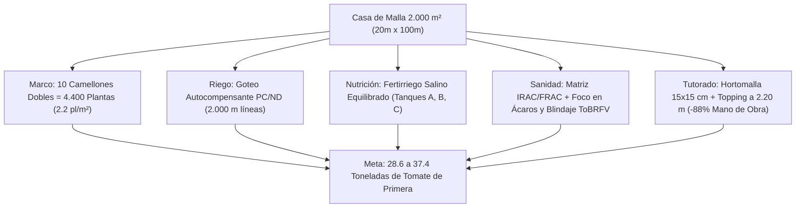

# PLAN MAESTRO DE PRODUCCIÓN AGRONÓMICA: TOMATE INDETERMINADO EN CASA DE MALLA (2.000 m²)
## Valle de Quíbor, Municipio Jiménez, Estado Lara, Venezuela (695 – 710 msnm — Clima Semiárido Cálido BSh)
### Georreferenciación Satelital: [9°53'20.0"N 69°35'35.0"W (9.8889°N, -69.5931°W)](https://maps.app.goo.gl/yEVs9KCuuX1SvYJj8)

---

## INTRODUCCIÓN Y MEMORIA AGRONÓMICA

El presente plan de producción establece las directrices agronómicas, hidráulicas, nutricionales y fitosanitarias de alta precisión para el cultivo intensivo de **tomate indeterminado de fruto redondo / saladette (*Solanum lycopersicum*)** dentro de la estructura de **Casa de Malla de 2.000 m² ($20.00\text{ m}\ \text{ancho} \times 100.00\text{ m}\ \text{largo} \times 3.80\text{ m}\ \text{altura}$)** localizada exactamente en las coordenadas **$9^\circ 53' 20.0''\ \text{N},\ 69^\circ 35' 35.0''\ \text{W}$** ([abrir en Google Maps](https://maps.app.goo.gl/yEVs9KCuuX1SvYJj8)), con cubierta de malla anti-insectos 50×25 HDPE monofilamento, estructura de parral plano tensado con guayas de acero galvanizado (cero tubos en techo) y tutorado mecánico mediante **Malla Espaldera Biorientada (Hortomalla de 15×15 cm)** con despunte apical a 2.20 m.

El objetivo agronómico es maximizar la eficiencia en el uso de agua salina de pozo ($EC_w \approx 1.2 - 1.5\text{ dS/m}$), suprimir el 88% de la mano de obra en guiado manual, blindar el cultivo contra virosis mecánicas (*ToBRFV* / *TMV*) y plagas del valle, logrando un rendimiento comercial proyectado de **6.5 a 8.5 kg/planta** (**28.6 a 37.4 toneladas métricas en la nave de 2.000 m²** = 143 a 187 t/ha equivalente) en un ciclo de 22 a 24 semanas.



---

## CAPÍTULO 1: MARCO DE PLANTACIÓN Y ADECUACIÓN DEL SUELO

### 1.1. Distribución Espacial de Camellones (20.00 m de Ancho)
La nave dispone de 20.00 m de ancho transversal que se dividen exactamente en **10 módulos de cultivo longitudinales de 100.00 m de fondo** (orientados de Este a Oeste):

* **Ancho de Camellón (Mesa de Cultivo):** $0.80\text{ m}$ en la base superior, con conformación trapezoidal de $0.25\text{ m}$ a $0.30\text{ m}$ de altura sobre el nivel del suelo para garantizar drenaje radicular y oxigenación.
* **Ancho de Pasillo de Tránsito y Labores:** $1.20\text{ m}$ libre entre camellones, permitiendo el paso holgado de carretillas de cosecha, cuadrillas y equipos pulverizadores de carretilla.
* **Distancia Entre Ejes de Camellones:** $0.80\text{ m} + 1.20\text{ m} = \mathbf{2.00\text{ m}}$.
* **Comprobación Modular:** $10\text{ camellones} \times 2.00\text{ m} = \mathbf{20.00\text{ m}}$ (aprovechamiento del 100% del ancho de la casa de malla).

```
   |<-- 0.80m -->|<------ 1.20m ------>|<-- 0.80m -->|
   +-------------+                     +-------------+
   |  *       *  |                     |  *       *  |
   |   (Cam. 1)  |      PASILLO        |   (Cam. 2)  | ... hasta Camellón 10
   |  *       *  |                     |  *       *  |
===+=============+=====================+=============+=== NPT ±0.00
   \____0.25m___/                       \____0.25m___/
```

### 1.2. Marco de Siembra y Densidad Poblacional
* **Doble Hilera por Camellón:** En cada lomo de $0.80\text{ m}$ se plantan 2 hileras de tomate separadas entre sí a **$0.50\text{ m}$**, dejando $0.15\text{ m}$ de margen libre a cada hombro del camellón.
* **Distancia Entre Plantas (Tresbolillo / Zig-Zag):** Plantas espaciadas a **$0.45\text{ m}$** sobre la hilera, desfasadas en tresbolillo para optimizar la interceptación de radiación fotosintéticamente activa (PAR) y la aireación del dosel foliar.
* **Número de Plantas por Metro Lineal de Camellón:** 
  $$\frac{2\text{ hileras}}{0.45\text{ m}} = 4.44\text{ plantas/metro lineal de camellón}$$
* **Población por Camellón (100 m de largo, descontando 1 m en cada cabecera para giros de esclusa):**
  $$98\text{ m netos} \times 4.44\text{ plantas/m} \approx \mathbf{440\text{ plantas por camellón}}$$
* **Población Total en la Nave de 2.000 m²:**
  $$10\text{ camellones} \times 440\text{ plantas} = \mathbf{4.400\text{ plantas totales}}$$
* **Densidad Superficial Resultante:**
  $$\text{Densidad} = \frac{4.400\text{ plantas}}{2.000\text{ m}^2} = \mathbf{2.20\text{ plantas/m}^2}$$
  *(Densidad agronómica estándar para tomate indeterminado en climas cálidos-semiáridos, evitando el sombreado mutuo y la proliferación de hongos por condensación interna).*

### 1.3. Acolchado Plástico (Mulch Bicolor Plata/Negro)
* **Especificación:** Película de polietileno coextruido plata/negro de **1.20 m a 1.40 m de ancho**, calibre 1.0 a 1.2 mil (25 a 30 micras), estabilizado anti-UV.
* **Instalación:** Cara **PLATA HACIA ARRIBA** y cara **NEGRA HACIA EL SUELO**.
* **Beneficios Críticos en Quíbor:**
  1. **Repelencia de Plagas:** La cara plateada refleja la luz UV en longitudes de onda desorientadoras para mosca blanca (*Bemisia tabaci*) y trips (*Frankliniella occidentalis*), reduciendo la colonización temprana en un 40%.
  2. **Control Térmico de la Rampa Radicular:** Refleja la alta radiación solar incidente de Quíbor, manteniendo la temperatura de la zona radicular (0-30 cm) entre 20 °C y 25 °C (temperaturas de suelo >30 °C inducen senescencia de raicillas absorbentes).
  3. **Control de Evaporación y Ascenso Capilar de Sales:** Reduce la evaporación directa del suelo en un 70%, evitando que los sulfatos y cloruros del agua de pozo asciendan a la superficie por capilaridad y quemen el cuello de las plántulas.
  4. **Cero Malezas:** La cara negra bloquea la fotosíntesis de malezas competidoras dentro de la hilera.

---

## CAPÍTULO 2: DISEÑO TÉCNICO DEL SISTEMA DE RIEGO POR GOTEO

### 2.1. Hidráulica y Selección de la Emisión
En un camellón de 100 metros de longitud, una cinta convencional de laberinto o gotero turbulento simple sufre una pérdida de carga ($\Delta H$) que genera un diferencial de descarga >20% entre el inicio y el final de la hilera. Dado que el agua de pozo de Quíbor contiene sales, cualquier sub-dosificación al final de la hilera provocaría salinización inmediata del bulbo húmedo.

* **Tipo de Emisor Seleccionado:** Tubería de polietileno (PE) Ø 16 mm (calibre pesado 35 a 40 mil / 0.9 mm) o cinta pesada (15 mil) con **Goteros Integrados Autocompensantes y Antidrenantes (PC/ND - Pressure Compensating / Non-Draining)**.
  * *Autocompensante (PC):* Rango de presión de compensación constante de $0.7\text{ a }3.5\text{ bar}$ ($10\text{ a }50\text{ PSI}$), garantizando exactamente el mismo caudal ($\pm 3\%$) a lo largo de los 100 m.
  * *Antidrenante (ND):* Presión de apertura a $0.4\text{ bar}$ y cierre hermético a $0.2\text{ bar}$. Evita que al apagarse la bomba la tubería se vacíe por las partes bajas, y permite el **arranque simultáneo e instantáneo de todos los goteros** al encenderse el pulso de riego.
* **Caudal Nominal del Gotero:** **$1.20\text{ a }1.60\text{ L/h}$** (se adopta $1.20\text{ L/h}$ para suelo franco-arcilloso o $1.60\text{ L/h}$ para franco-arenoso; diseño base a $1.20\text{ L/h}$).
* **Espaciamiento Entre Goteros:** **$0.20\text{ m}$** de distancia en la línea.
* **Número de Líneas por Camellón:** **2 líneas paralelas** (una línea por hilera de siembra).
* **Total de Tubería de Goteo Instalada:**
  $$10\text{ camellones} \times 2\text{ líneas} \times 100\text{ m} = \mathbf{2.000\text{ metros lineales de lateral de goteo}}$$
* **Total de Emisores en la Nave:**
  $$\frac{2.000\text{ m}}{0.20\text{ m/gotero}} = \mathbf{10.000\text{ goteros}}$$
  *(Promedio de 2.27 goteros de 1.20 L/h por cada planta, garantizando un bulbo húmedo continuo y coalescente a lo largo de todo el camellón).*

### 2.2. Caudal Total Horario y Requerimientos de Bombeo
* **Caudal Horario Total del Sistema:**
  $$Q_{sistema} = 10.000\text{ goteros} \times 1.20\text{ L/h} = 12.000\text{ L/h} = \mathbf{12.00\text{ m}^3\text{/h}} \quad (3.33\text{ L/s})$$
* **Sectorización:** El módulo de 2.000 m² puede regarse en **1 solo turno completo** con un caudal de $12.00\text{ m}^3\text{/h}$, o dividirse en **2 sectores hidráulicos de 5 camellones cada uno** ($6.00\text{ m}^3\text{/h}$ por sector) si la capacidad del pozo o del cabezal es menor a 15 m³/h.
* **Presión de Operación Requerida en Cabecera:** $2.0\text{ a }2.5\text{ bar}$ en cabezal para mantener $1.2\text{ a }1.5\text{ bar}$ en la entrada de los laterales.
* **Potencia de Bomba Sugerida:** Electrobomba centrífuga de **$3.0\text{ a }5.5\text{ HP}$** con variador de frecuencia.

### 2.3. Cabezal de Filtrado y Equipamiento
El agua subterránea de Quíbor arrastra arenas finas y presenta sales disueltas que forman precipitados cálcicos.
1. **Hidrociclón Desarenador:** Primera barrera para separar partículas de arena densas provenientes del pozo profundo.
2. **Batería de Filtros de Anillas Ranuradas (Discos):** Dos cuerpos de 2" o 3" con anillas de **120 mesh / 130 micras** con retrolavado manual/semiautomático.
3. **Válvula Reguladora de Presión y Sostenedora:** Mantiene la presión estable a $2.0\text{ bar}$ en el múltiple de distribución.
4. **Válvulas de Aire de Doble Efecto (Ventosas):** Instaladas en los puntos altos de los múltiples de alimentación y en el extremo final de los 100 m para evitar golpes de ariete y succión de partículas del suelo por presión negativa al apagar el riego.

---

## CAPÍTULO 3: PROGRAMACIÓN DE RIEGO POR PULSOS (FAO-56 AJUSTADO A QUÍBOR)

### 3.1. Estrategia de Pulsos Cortos contra la Salinidad del Pozo
En el clima de Quíbor, regar en 1 o 2 riegos largos diarios es un grave error técnico: en un suelo franco, un riego de 60 minutos genera percolación profunda rápida de los nutrientes (lavando el nitrógeno) y, al secarse la superficie horas después, las sales del agua de pozo ($EC_w \approx 1.4\text{ dS/m}$) se concentran en la zona radicular elevando la conductividad eléctrica del extracto saturado ($EC_e$) por encima de $4.0\text{ dS/m}$, deteniendo la absorción hídrica y causando pudrición apical (culillo) en los tomates.

La estrategia profesional es el **Riego Fraccionado por Alta Frecuencia (Pulsos de 12 a 20 minutos)**:
* Mantiene el potencial mátrico del suelo constantemente alto (entre $-10\text{ y }-25\text{ kPa}$), facilitando que la planta tome agua sin esfuerzo osmótico.
* Mantiene un frente húmedo descendente continuo que empuja el anillo de sales hacia la periferia del bulbo (lejos del eje radicular principal).
* Incorpora la **Fracción de Lavado ($LF = 20\%$)** en cada pulso diario.

```
                           SUPERFICIE ACOLCHADA
    ===================[ Gotero ]========[ Gotero ]===================
             . - ~ ~ - .                  . - ~ ~ - .
          /               \            /               \
         |  ZONA DE BAJA   |          |  ZONA DE BAJA   |
         |    SALINIDAD    |          |    SALINIDAD    |
         |   (0 - 25 cm)   |          |   (0 - 25 cm)   |
          \   RAÍCES       /          \   RAÍCES       /
            ~ . _ _ _ . ~               ~ . _ _ _ . ~
       ====================================================
       FRENTE DE LAVADO: Sales empujadas a la periferia (>35 cm)
```

### 3.2. Calendario Dinámico de Riego por Etapa Fenológica

| Etapa Fenológica | Duración (Semanas) | Kc FAO-56 | Demanda Neta (L/planta/sem) | Fracción Lavado (LF) | Lámina Bruta (L/planta/sem) | Volumen Diario Nave 2.000 m² | N° de Pulsos Diarios | Duración de Cada Pulso | Horarios Típicos Recomendados |
| :--- | :--- | :--- | :--- | :--- | :--- | :--- | :--- | :--- | :--- |
| **1. Enraizamiento / Establecimiento** | Semanas 1 a 3 | 0.60 | 8.0 L | 15% | **9.4 L/pl/sem** | **5.91 m³/día** | 3 pulsos | 10 – 12 min | 08:30, 11:30, 15:00 |
| **2. Crecimiento Vegetativo** | Semanas 4 a 7 | 0.80 | 11.0 L | 18% | **13.4 L/pl/sem** | **8.43 m³/día** | 4 pulsos | 12 – 15 min | 08:00, 10:30, 13:00, 15:30 |
| **3. Floración y Primeros Cuajados** | Semanas 8 a 11 | 1.10 | 16.0 L | 20% | **20.0 L/pl/sem** | **12.57 m³/día** | 5 – 6 pulsos | 14 – 16 min | 07:30, 09:30, 11:30, 13:30, 15:30 |
| **4. Fructificación Masiva y Cosecha** | Semanas 12 a 22+ | 1.05 | 18.5 L | 20% | **23.1 L/pl/sem** | **14.53 – 15.75 m³/día** | 6 – 8 pulsos | 15 – 18 min | 07:00, 08:30, 10:00, 11:30, 13:00, 14:30, 16:00 |
| **5. Fin de Ciclo / Cierre** | Últimas 2 sem | 0.90 | 13.5 L | 15% | **15.9 L/pl/sem** | **9.98 m³/día** | 4 pulsos | 12 – 14 min | 08:00, 11:00, 13:30, 15:30 |

---

## CAPÍTULO 4: PLAN DE FERTIRRIEGO Y NUTRICIÓN MINERAL COMPLETA

### 4.1. Fundamento Hidrogeológico del Acuífero y Análisis del Agua (CIDIAT-ULA / SHYQ)
La calidad química del agua de riego en Quíbor está gobernada por la hidrogeología del valle, descrita científicamente por **Jégat, Mora, Hernández (CIDIAT-ULA), Alvarado, Massiah (SHYQ) y Terán (2012)**:
* **El Cono de Abatimiento Central:** Tras 50 años de minería de agua subterránea (extracción de $22\text{ Mm}^3\text{/año}$ frente a una recarga renovable de solo $17\text{ Mm}^3\text{/año}$, sobreexplotación del 29%), los niveles piezométricos cayeron entre 53 y 95 metros, situándose en **546 msnm en el centro del valle** (25 m por debajo de la cota de salida a 571 msnm).
* **Profundidad de Bombeo y Salinización:** Los pozos operan entre **11 m y 136 m de profundidad**, bombeando lentes de grava en contacto con arcillas terciarias que aportan sales solubles y bicarbonatos.

#### Parámetros Químicos Típicos del Pozo:
* pH: $7.6\text{ a }8.2$ (alcalina, con alta concentración de bicarbonatos $\text{HCO}_3^- \approx 2.5 - 4.5\text{ mmol/L}$).
* Conductividad Eléctrica ($EC_w$): $1.2\text{ a }1.5\text{ dS/m}$ (pudiendo llegar a $2.0\text{ dS/m}$ en el fondo del cono central).
* Calcio disuelto: $2.5\text{ a }4.0\text{ mmol/L}$ (aporta calcio natural, el cual se descuenta del balance de fertilizantes).
* Magnesio disuelto: $1.5\text{ a }2.5\text{ mmol/L}$.
* Sulfatos disueltos: $2.0\text{ a }3.5\text{ mmol/L}$.

#### Acción Obligatoria: Corrección de Bicarbonatos y pH con Ácido
* Para evitar que el calcio disuelto precipite con los fosfatos obstruyendo los goteros y bloqueando el hierro, se debe inyectar **Ácido Nítrico al 60%** (o **Ácido Fosfórico al 85%**) para neutralizar los bicarbonatos hasta dejar un remanente de $0.5\text{ mmol/L}$, estabilizando el pH de la solución de gotero en **$5.8\text{ a }6.2$**.
* Consumo estimado de ácido: **$150\text{ a }250\text{ mL de Ácido Nítrico por cada m}^3\text{ de agua regada}$** (aporta aproximadamente $1.5\text{ a }2.5\text{ mmol/L de Nitrógeno nítrico}$ utilizable por la planta).

#### Dualidad Hidrológica: Pozo Abatido vs Recarga Artificial Yacambú (1 m³/s)
El modelo matemático en Visual MODFLOW 4.1 de CIDIAT-ULA evaluó la recarga artificial de $1\text{ m}^3\text{/s}$ con aguas del Río Yacambú, lo que proyecta dos escenarios operativos para el módulo de 2.000 m²:
1. **Escenario A (Actual - Pozo Profundo Salino):** $EC_w = 1.4\text{ dS/m}$, Fracción de lavado $LF = 20\%$, demanda pico nave = **$15.08\text{ a }15.75\text{ m}^3\text{/día}$**, consumo de Ácido Nítrico = **$22\text{ L/semana}$**.
2. **Escenario B (Futuro - Conexión Yacambú / Recarga Artificial):** Agua dulce andina ($EC_w \approx 0.5\text{ dS/m}$), Fracción de lavado reducida a **$LF = 6.5\%$**, demanda pico nave = **$12.45\text{ m}^3\text{/día}$ (ahorro del 17.5% de agua = $2.63\text{ m}^3\text{/día}$ menos)** y consumo de ácido nítrico reducido a solo **$7\text{ a }8\text{ L/semana}$** (ahorro del 65% en insumo de ácido).

### 4.2. Sistema de Tanques de Solución Madre (Inyección A + B + C)
Para evitar la precipitación química insoluble (ej. Calcio + Fósforo $\rightarrow$ Fosfato Tricálcico; Calcio + Sulfato $\rightarrow$ Yeso), se requiere una batería de 3 tanques concentrados al 10% (100 kg por cada 1.000 L de agua en el tanque):

* **TANQUE A (Tanque de Calcio y Hierro):**
  * Nitrato de Calcio $\text{Ca(NO}_3)_2$ (aporta $\text{Ca}^{2+}$ y $\text{N-NO}_3^-$).
  * Nitrato de Potasio $\text{KNO}_3$ (fracción compatible).
  * Quelato de Hierro Fe-EDDHA (al 6%) o Fe-DTPA (estable en pH hasta 7.5).
* **TANQUE B (Tanque de Fosfatos, Sulfatos y Micronutrientes):**
  * Fosfato Monopotásico $\text{KH}_2\text{PO}_4$ (MKP 0-52-34) o Fosfato Monoamónico (MAP 12-61-0).
  * Sulfato de Potasio $\text{K}_2\text{SO}_4$ (0-0-50).
  * Nitrato de Potasio $\text{KNO}_3$ (13-0-46).
  * Sulfato de Magnesio $\text{MgSO}_4\cdot 7\text{H}_2\text{O}$.
  * Boro (Ácido Bórico / Solubor al 20.5% B).
  * Mezcla de Micronutrientes Quelados (Manganeso, Zinc, Cobre, Molibdeno).
* **TANQUE C (Tanque de Ácido Regulador):**
  * Ácido Nítrico o Fosfórico diluido al 10-15% para regulación automática de pH.

### 4.3. Concentraciones Óptimas de Elementos en el Riego (ppm)

| Elemento | Fase 1: Enraizamiento (Sem 1-3) | Fase 2: Vegetativo (Sem 4-7) | Fase 3: Floración/Cuajado (Sem 8-11) | Fase 4: Cosecha Plena (Sem 12-22+) |
| :--- | :--- | :--- | :--- | :--- |
| **N Total (ppm)** | 110 – 120 | 150 – 170 | 170 – 190 | 180 – 200 |
| **P ($\text{P}_2\text{O}_5$) (ppm)**| 50 – 60 | 45 – 50 | 55 – 65 | 50 – 55 |
| **K ($\text{K}_2\text{O}$) (ppm)** | 140 – 160 | 220 – 250 | 320 – 360 | 380 – 420 |
| **Ca (ppm)** | 130 – 150 | 140 – 160 | 170 – 190 | 180 – 200 |
| **Mg (ppm)** | 35 – 45 | 45 – 50 | 50 – 60 | 55 – 65 |
| **S ($\text{SO}_4$) (ppm)** | 50 – 60 | 60 – 75 | 80 – 100 | 90 – 110 |
| **Relación N : K** | **1 : 1.3** | **1 : 1.5** | **1 : 1.9** | **1 : 2.2** |
| **CE Objetivo Salida Gotero**| **1.8 – 2.0 dS/m** | **2.1 – 2.3 dS/m** | **2.4 – 2.6 dS/m** | **2.6 – 2.8 dS/m** |
| **pH Objetivo** | **5.8 – 6.0** | **5.8 – 6.2** | **5.8 – 6.2** | **5.8 – 6.2** |

### 4.4. Dosificación Semanal de Fertilizantes Comerciales para las 4.400 Plantas (2.000 m²)

A continuación se detalla la cantidad física en **kilogramos por semana** que deben disolverse y aplicarse en la nave de 2.000 m² según cada etapa:

| Fertilizante Comercial Sólido Soluble | Fase 1 (kg/semana) [Sem 1 a 3] | Fase 2 (kg/semana) [Sem 4 a 7] | Fase 3 (kg/semana) [Sem 8 a 11] | Fase 4 (kg/semana) [Sem 12 a 22] |
| :--- | :--- | :--- | :--- | :--- |
| **Nitrato de Calcio** ($15.5\%\text{ N}, 26.5\%\text{ CaO}$) | 12.0 kg | 22.0 kg | 32.0 kg | **36.0 kg** |
| **Nitrato de Potasio** ($13\%\text{ N}, 46\%\text{ K}_2\text{O}$) | 10.0 kg | 20.0 kg | 35.0 kg | **45.0 kg** |
| **Fosfato Monopotásico (MKP 0-52-34)** | 6.0 kg | 8.0 kg | 12.0 kg | **10.0 kg** |
| **Sulfato de Potasio Soluble** ($50\%\text{ K}_2\text{O}, 18\%\text{ S}$)| 4.0 kg | 10.0 kg | 18.0 kg | **24.0 kg** |
| **Sulfato de Magnesio Heptahidratado** ($16\%\text{ MgO}$) | 5.0 kg | 9.0 kg | 14.0 kg | **16.0 kg** |
| **Quelato de Hierro (Fe-EDDHA 6%)** | 0.45 kg | 0.70 kg | 0.90 kg | **1.10 kg** |
| **Solubor / Boro Soluble (20.5% B)** | 0.08 kg | 0.15 kg | 0.25 kg | **0.30 kg** |
| **Mezcla Micronutrientes (Tradecorp AZ / similar)**| 0.20 kg | 0.35 kg | 0.50 kg | **0.60 kg** |
| **Ácido Nítrico 60% (Consumo Semanal)** | ~6.0 L | ~12.0 L | ~18.0 L | **~22.0 L** |
| **TOTAL FERTILIZANTES SÓLIDOS / SEMANA** | **37.73 kg** | **70.20 kg** | **112.65 kg** | **133.00 kg** |

---

## CAPÍTULO 5: PLAN INTEGRAL DE SANIDAD VEGETAL (FUMIGACIÓN, MIP Y BIOSEGURIDAD)

### 5.1. El Punto Crítico de la Malla 50×25 en Quíbor: Ácaros
La malla 50×25 HDPE retiene al 100% insectos voladores de cuerpo mediano o grande (mosca blanca, trips, pulgón, minador, polillas). Sin embargo, los **ácaros fitófagos poseen dimensiones de 120 a 180 micras** y atraviesan físicamente cualquier poro comercial. Por tanto, la defensa anti-ácaros es **100% de manejo preventivo y monitoreo agronómico**:

1. **Araña Roja (*Tetranychus urticae*):** Punteaduras cloróticas en el haz, bronceado y telaraña densa en el envés. Disparada por humedades relativas <50% y vientos secos.
2. **Ácaro Blanco (*Polyphagotarsonemus latus*):** Deformación helicoidal de brotes apicales (hojas acucharadas hacia abajo, quebradizas) y aborto floral.

### 5.2. Matriz de Fumigación y Rotación Química por Modo de Acción (IRAC / FRAC)

Para evitar la aparición de biotipos resistentes en el Valle de Quíbor, se prohíbe terminantemente aplicar un mismo grupo químico más de dos veces consecutivas.

| Blanco / Plaga / Enfermedad | Ingrediente Activo Oficial | Nombre Comercial Referencia | Grupo IRAC / FRAC | Dosis por 100 L de Agua | Tipo de Acción y Momento | Periodo de Carencia (PC) |
| :--- | :--- | :--- | :--- | :--- | :--- | :--- |
| **Ácaros (Araña roja / Ácaro blanco)** | Abamectina 1.8% EC | Vertimec / Acaramik | **IRAC 6** | 75 – 100 mL | Translaminar. Foco al envés foliar. | 3 días |
| **Ácaros (Ovicida / Larvicida)** | Hexitiazox 10% WP | Caesar / Nissorun | **IRAC 10A** | 50 – 60 g | Inhibidor de crecimiento de huevos/ninfas. | 7 días |
| **Ácaros y Mosca Blanca (Ninfas)**| Spiromesifen 24% SC | Oberon | **IRAC 23** | 60 – 80 mL | Inhibidor síntesis de lípidos. Muy residual. | 3 días |
| **Trips (*Frankliniella*)** | Spinosad 48% SC | Tracer | **IRAC 5** | 20 – 25 mL | Modulador receptor nicotínico. Tarde fresca. | 1 día |
| **Trips y Mosca Blanca** | Acetamiprid 20% SP | Mospilan | **IRAC 4A** | 35 – 50 g | Neonicotinoide sistémico. Rotar con IRAC 29. | 3 días |
| **Pulgones y Mosca Blanca** | Flonicamid 50% WG | Teppeki / Beleaf | **IRAC 29** | 15 – 20 g | Bloqueador selectivo de alimentación. | 1 día |
| **Gusano Perforador / Polilla** | Clorantraniliprol 20% SC | Coragen | **IRAC 28** | 15 – 20 mL | Modulador rianodina. Ovicida-larvicida. | 1 día |
| **Oídio / Cenicilla (*Leveillula taurica*)**| Azufre Micronizado 80% WP | Kumulus / Microthiol | **FRAC M02** | 250 – 300 g | Multisitio preventivo. No aplicar a >32°C. | 0 días |
| **Oídio y Tizón Temprano** | Difenoconazol 25% EC | Score | **FRAC 3** | 40 – 50 mL | DMI Triazol. Curativo-erradicante. | 7 días |
| **Tizón Temprano (*Alternaria solani*)**| Clorotalonil 72% SC | Daconil / Bravo | **FRAC M05** | 200 – 250 mL | Contacto multisitio. Preventivo puro. | 3 días |
| **Moho Gris (*Botrytis cinerea*)** | Boscalid 50% WG | Cantus | **FRAC 7** | 50 – 60 g | Inhibidor respiratorio SDHI. En floración. | 3 días |
| **Bacteriosis (*Xanthomonas / Clavibacter*)**| Oxicloruro de Cobre + Mancozeb | Cobrethane / Cupravit | **FRAC M01 + M03** | 250 g + 200 g | Barrera de contacto bactericida y fungicida. | 7 días |
| **Desinfección Antiviral (ToBRFV/TMV)** | Solución Leche Descremada al 10% o Virkon S | Virkon S | Bioseguridad | 10 g / L (Virkon) o 100 mL/L | Lavado de manos y tijeras de podar en seco. | N/A |

### 5.3. Calendario Preventivo Semanal de Aspersión Foliar (4.400 Plantas)
Volumen de caldo de aplicación:
* Semanas 1 a 4: **$80\text{ a }120\text{ L de caldo}$** para toda la nave de 2.000 m².
* Semanas 5 a 10: **$160\text{ a }220\text{ L de caldo}$**.
* Semanas 11 en adelante: **$250\text{ a }300\text{ L de caldo}$** (cobertura total haz y envés a $1.2\text{ bar}$ de presión de pulverización con gotas finas de $150 - 200\ \mu\text{m}$).

**Régimen de Aplicación Preventiva Quincenal / Semanal:**
* **Semana A (Sanidad Preventiva de Contacto):** Clorotalonil ($200\text{ mL/100L}$) + Azufre Micronizado ($250\text{ g/100L}$) + Abamectina ($80\text{ mL/100L}$) + Coadyuvante penetrante organosiliconado ($25\text{ mL/100L}$). Regular pH del agua de caldo a $5.5 - 6.0$.
* **Semana B (Sistémica y Selectiva):** Acetamiprid ($40\text{ g/100L}$) + Difenoconazol ($45\text{ mL/100L}$) + Bacillus thuringiensis ($100\text{ g/100L}$) + Fertilizante Foliar Calcio-Boro ($150\text{ mL/100L}$).
* **Semana C (Rotación Anti-Ácaro y Bactericida):** Spiromesifen ($70\text{ mL/100L}$) + Oxicloruro de Cobre ($200\text{ g/100L}$) + Mancozeb ($200\text{ g/100L}$).
* **Semana D (Foco en Floración y Cuajado):** Spinosad ($25\text{ mL/100L}$) + Boscalid ($50\text{ g/100L}$) + Hexitiazox ($50\text{ g/100L}$).

### 5.4. Protocolo de Bioseguridad contra el Virus Rugoso del Tomate (ToBRFV)
El Virus de la Fruta Rugosa Marrón del Tomate (*Tomato Brown Rugose Fruit Virus*) es transmitido **mecánicamente por contacto físico**. Para blindar la nave de 2.000 m²:
1. **Desinfección de Manos Obligatoria:** Cuencos con solución de leche en polvo descremada al 10% en la esclusa (las proteínas de la leche desactivan la cápside del virus por contacto).
2. **Desinfección de Tijeras de Poda:** Sumergir las tijeras en amonio cuaternario al 2% o alcohol isopropílico al 70% entre camellón y camellón.
3. **Cero Tabaco:** Prohibición absoluta de fumar o manipular cigarrillos en las proximidades del módulo (vector comprobado de TMV).
4. **Sentido Único de Trabajo:** Las labores se inician siempre en los sectores más sanos y finalizan en las esquinas más próximas a la esclusa.

---

## CAPÍTULO 6: MANEJO CULTURAL CON MALLA ESPALDERA (HORTOMALLA 15×15 cm)

### 6.1. Secuencia Operativa de Tutorado Mecánico
La instalación de la **Hortomalla de 15×15 cm** a lo largo de los 10 camellones de 100 metros ($1.000\text{ m}$ lineales de malla) revoluciona la productividad laboral en Quíbor:

1. **Montaje Estructural:**
   * Alambre superior maestro **Calibre 10 ($3.4\text{ mm}$)** fijado a **$2.20\text{ m}$** de altura, anclado rígidamente a los postes de las cabeceras Este y Oeste y soportado por los pilares intermedios cada 5.0 m.
   * Alambre inferior tensor **Calibre 14** a **$0.20\text{ m}$** sobre el camellón para mantener la verticalidad de la malla.
   * La malla se desenrolla y se asegura con grapas metálicas o amarres plásticos al alambre superior cada metro.
2. **Cero Clips y Cero Atados:**
   * A medida que los tallos crecen a razón de 15 a 20 cm por semana, el operario simplemente **encamina las ramas dentro del cuadro de 15×15 cm contiguo**.
   * Las ramas laterales y los racimos florales descansan horizontalmente sobre los hilos de polipropileno por su propio peso.
   * No se gastan más de 60.000 clips plásticos ni se invierten horas en enrollar rafia en espiral alrededor del tallo.

### 6.2. Poda de Brotes Axilares (Deschuponado)
* **Frecuencia:** Semanal, ejecutada a paso continuo.
* **Criterio Técnico:** Eliminar los chupones axilares cuando midan entre **$3\text{ y }5\text{ cm}$**. A este tamaño, el chupón se quiebra limpiamente con los dedos en sentido lateral sin causar heridas desgarradas y sin necesidad de tijeras.
* **Horario de Poda:** Exclusivamente en horas de la mañana (08:30 a 11:30), con baja humedad relativa y antes de iniciar el ciclo de riego, asegurando una cicatrización instantánea por el calor seco del mediodía.

### 6.3. Despunte Apical (Topping) a 2.20 m
* **Momento de Ejecución:** Cuando el ápice del tallo principal rebasa el alambre maestro a $2.20\text{ m}$ (habitualmente entre la semana 10 y 12, sobre la **7ª u 8ª inflorescencia**).
* **Procedimiento:** Se corta la yema apical dejando 2 hojas fotosintéticas por encima del último racimo floral para proteger los frutos superiores contra el golpe de sol (*sunscald*).
* **Ventajas Agronómicas:**
  * Cancela el crecimiento vegetativo vertical indefinido.
  * Reorienta el 100% de la savia y asimilados fotosintéticos hacia el llenado rápido y uniforme de los racimos inferiores.
  * Toda la labor en los 10 camellones ($1.000\text{ m}$) la ejecuta **1 solo trabajador en menos de 2 horas**.

### 6.4. Deshoje Basal Sanitario Escalonado
* **Procedimiento:** A partir del inicio de la cosecha comercial (semana 12), se retiran **1 a 2 hojas basales por semana** por debajo del racimo en maduración.
* **Beneficios:**
  * Incrementa la ventilación rasante en el tercio inferior del camellón, secando microclimas húmedos propicios para *Botrytis* y *Alternaria*.
  * Elimina follaje viejo y sombreado que actúa como parásito de carbohidratos.
  * Priva a los ácaros de sus reservorios primarios basales.

### 6.5. Aclareo de Frutos por Racimo (Calibre Comercial)
* Para variedades de tomate tipo Saladette o bola indeterminado, desbotonar los frutos deformes o apicales pequeños, dejando un número uniforme de **4 a 5 frutos de primera por racimo**.
* Asegura homogeneidad de calibres (pesos de 160 a 220 g por fruto) y evita el quiebre de pedúnculos.

---

## CAPÍTULO 7: PROYECCIÓN PRODUCTIVA, COSECHA Y EVALUACIÓN ECONÓMICA

### 7.1. Curva de Cosecha y Metas de Rendimiento en 2.000 m²

* **Inicio de Cosecha:** Semana 11 – 12 post-trasplante.
* **Período de Cosecha Activa:** 10 a 12 semanas consecutivas (Semanas 12 a 24).
* **Potencial Productivo por Planta:**
  * 7 a 8 racimos útiles $\times$ 4.5 frutos por racimo = 31 a 36 frutos comerciales por planta.
  * Peso promedio por fruto: $180\text{ a }210\text{ g}$.
  * **Rendimiento por Planta:** **$6.5\text{ a }8.5\text{ kg/planta}$**.
* **Producción Total de la Nave (4.400 Plantas):**
  $$\text{Producción Mínima (6.5 kg/pl)} = 4.400 \times 6.5\text{ kg} = \mathbf{28.600\text{ kg} \quad (28.6\text{ toneladas})}$$
  $$\text{Producción Óptima (8.5 kg/pl)} = 4.400 \times 8.5\text{ kg} = \mathbf{37.400\text{ kg} \quad (37.4\text{ toneladas})}$$
* **Equivalente por Hectárea:** **$143\text{ a }187\text{ toneladas/ha}$** (más del triple que el campo abierto de Quíbor, que promedia 45-60 t/ha).
* **Empaque en Cajas Comerciales Plásticas (20 kg netos):**
  $$\text{Volumen de Cosecha} = 1.430\text{ a }1.870\text{ cajas de 20 kg}$$

### 7.2. Clasificación Comercial Proyectada de la Fruta
* **Calibre Extra / Primera (180 - 240 g):** 75% de la cosecha (**21.5 a 28.0 toneladas**). Fruta firme, color rojo uniforme, sin manchas, destinada a cadenas de supermercados y mercados mayoristas premium (Mercabar Barquisimeto / Coche Caracas).
* **Calibre Segunda (130 - 179 g):** 18% de la cosecha (**5.1 a 6.7 toneladas**).
* **Tercera / Destrío Industrial (<130 g o defectos leves):** 7% (**2.0 a 2.6 toneladas**).

### 7.3. Balance de Mano de Obra: Hortomalla vs Sistema Convencional

| Labor Agrícola de Mantenimiento | Sistema Holandés High-Wire (Jornales/Mes en 2.000 m²) | Sistema Español Tradicional con Rafia (Jornales/Mes) | SISTEMA HORTOMALLA + TOPPING (Jornales/Mes) |
| :--- | :--- | :--- | :--- |
| **Colocación Inicial de Guías** | 6.0 jornales | 4.0 jornales | **1.0 jornal (desenrollar malla)** |
| **Atado / Enrollado Semanal** | 12.0 jornales | 6.0 jornales | **0.0 jornales (cero atados)** |
| **Descolgado / Manipulación** | 6.0 jornales | 0.0 jornales | **0.0 jornales (topping a 2.2 m)** |
| **Poda de Chupones y Encaminado**| 4.0 jornales | 3.0 jornales | **1.2 jornales** |
| **Deshoje Basal Sanitario** | 2.5 jornales | 1.5 jornales | **0.8 jornales** |
| **TOTAL JORNALES / MES** | **30.5 jornales/mes** | **14.5 jornales/mes** | **3.0 jornales/mes (-88% vs Holandés)** |

---

## CAPÍTULO 8: CRONOGRAMA MAESTRO SEMANA A SEMANA (CICLO DE 24 SEMANAS)

```
Semana  0: Preparación de camas, instalación de cinta de goteo, solarización y mulch plata/negro.
Semanas 1-2: Trasplante plántulas (12-15 cm, 4 hojas verdaderas). Drench fungicida-enraizador. Riego Fase 1.
Semanas 3-4: Amarre de Hortomalla al alambre superior (2.20 m). Primer deschuponado manual en seco.
Semanas 5-7: Fase vegetativa acelerada. Encaminado en cuadros 15x15 cm. Inicia fertirriego Fase 2.
Semanas 8-9: Inicio de floración masiva. Primera aplicación de Calcio-Boro foliar. Riego Fase 3.
Semanas 10-11: Primer cuajado de frutos. Despunte apical (topping) a 2.20 m al llegar al alambre maestro.
Semana  12: Inicio de cosecha racimos 1 y 2. Deshoje basal de las primeras 2 hojas senescentes.
Semanas 13-20: Pico de cosecha continua (2 a 3 cortes por semana). Fertirriego Fase 4 (K:N 2.2).
Semanas 21-23: Cosecha de racimos superiores (7 y 8). Cierre gradual de fertirriego (Fase 5).
Semana  24: Cosecha final completa, retiro de restos vegetales fuera de la nave y desinfección total.
```

---

## CONCLUSIONES AGRONÓMICAS

1. **Eficiencia Máxima en 2.000 m²:** La configuración de 10 camellones dobles de 100 m aloja con holgura a **4.400 plantas**, garantizando pasillos de 1.20 m para una cosecha ágil y libre de tropiezos.
2. **Blindaje contra la Salinidad:** Los pulsos fraccionados de 12 a 18 minutos con goteros autocompensantes PC/ND a 1.20 L/h empujan las sales fuera del bulbo radicular, permitiendo cultivar con agua de pozo de Quíbor ($EC_w = 1.4\text{ dS/m}$) sin quemaduras foliares ni "culillo".
3. **Erradicación de Costos de Mano de Obra:** La combinación de **Hortomalla 15×15 cm y despunte apical a 2.20 m** reduce el requerimiento de personal a **solo 1 trabajador a tiempo parcial** para el manejo cultural de la nave (3 jornales/mes), generando un ahorro económico superior a $4.500 USD por ciclo respecto al sistema de hilo tradicional.
4. **Sanidad Profesional:** La rotación química estricta (IRAC 6, 10A, 23, 5, 29 / FRAC 3, 7, M02, M05) y el protocolo antiviral protegen la inversión contra el único vector incontrolable por malla (los ácaros) y el virus rugoso (*ToBRFV*).
