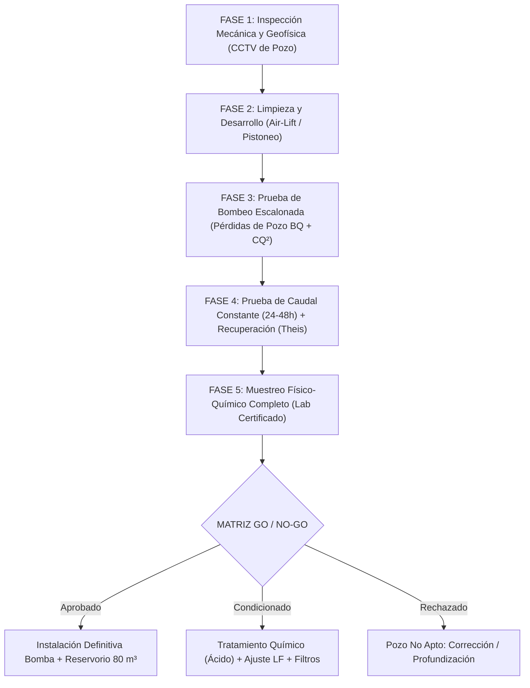

# Protocolo Maestro de Validación y Certificación de Pozo Profundo para Casa de Malla (2.000 m²)
## Finca Agroproductiva Quíbor — Cultivo Intensivo de Tomate (*Solanum lycopersicum*)
### Coordenadas Satelitales Exactas: [9°53'20.0"N 69°35'35.0"W (9.8889°N, -69.5931°W)](https://maps.app.goo.gl/yEVs9KCuuX1SvYJj8) | Cota: ~700 msnm

---

## RESUMEN EJECUTIVO Y OBJETIVO DEL PLAN

El presente documento establece el **protocolo técnico, hidrogeológico, mecánico y de calidad fisicoquímica** para validar y certificar formalmente la aptitud de un **pozo profundo de agua subterránea** localizado en las coordenadas satelitales **$9^\circ 53' 20.0''\ \text{N},\ 69^\circ 35' 35.0''\ \text{W}$** (Municipio Jiménez, Estado Lara, Venezuela), con el fin de garantizar el suministro ininterrumpido, seguro y agronómicamente viable para una **Casa de Malla de 2.000 m² ($20.00\text{ m} \times 100.00\text{ m}$)** con **4.400 plantas de tomate indeterminado** conducidas bajo tutorado de malla espaldera almeriense (Hortomalla 15×15 cm) y fertirriego por goteo autocompensante PC/ND.

```
       ========================================================================================
       ESQUEMA HIDRÁULICO GENERAL RECOMENDADO PARA EL VALLE DE QUÍBOR
       ========================================================================================

       [ POZO PROFUNDO ] 
       Coord: 9°53'20.0"N 69°35'35.0"W (~700 msnm)
       Q_bombeo = 2.0 a 2.5 L/s (7.2 - 9.0 m³/h)
       Operación: 2.0 a 2.5 horas/día
              |
              v
       [ DESARENADOR HIDROCICLÓN (2") ]  <--- Separación centrífuga de arenas (>75 micras)
              |
              v
       [ RESERVORIO REGULADOR AUSTRALIANO (80 m³) ] <--- 5 días de autonomía de reserva
       (Ecualización térmica, desgasificación, sedimentación)
              |
              v
       [ CABEZAL DE FERTIRRIEGO NAVE ] <--- Bomba 5.5 HP (12.0 m³/h a 3.0 bar con VFD)
       Inyección Tanque A (Ca-Fe), Tanque B (P-K-Mg) y Tanque C (Ácido Nítrico 60%)
              |
              v
       [ 10 CAMELLONES DOBLES / 10.000 GOTEROS PC/ND (1.20 L/h) ] en Nave 2.000 m²
       ========================================================================================
```

---

## 1. MARCO GEOGRÁFICO, GEOLÓGICO Y PIEZOMÉTRICO DEL SITIO

### 1.1. Localización y Fisiografía
* **Georreferenciación:** **$9^\circ 53' 20.0''\ \text{N},\ 69^\circ 35' 35.0''\ \text{W}$** ([Ver en Google Maps](https://maps.app.goo.gl/yEVs9KCuuX1SvYJj8)).
* **Elevación Topográfica:** **695 a 705 msnm**.
* **Unidad Hidrológica:** Cuenca intramontana del Valle de Quíbor (243 km²), subcuenca de drenaje de la Quebrada Atarigua (flanco meridional de recarga).

### 1.2. Hidrogeología Regional (Línea Base CIDIAT-ULA / SHYQ, Jégat et al., 2012)
* **Medio Acuífero:** Depósito fluvio-lacustre cuaternario constituido por una alternancia heterogénea multicapa de **lentes de gravas y arenas de alta conductividad hidráulica ($K \approx 10\text{ a }45\text{ m/día}$)** separados por estratos limo-arcillosos semiconfinantes.
* **Espesor Sedimentario:** En el sector meridional del valle (donde se emplaza la coordenada), el relleno aluvial alcanza profundidades entre **120 y 230 metros** hasta el contacto con el basamento terciario (Formación Morán / Paují).
* **Gradiente Piezométrico y Dinámica de Flujo:**
  * Cota piezométrica en zona de recarga sur (Quebrada Atarigua): **795 msnm**.
  * Cota de depresión máxima en el centro del valle (cono de abatimiento inducido por sobreexplotación): **546 msnm**.
  * La coordenada se sitúa en la rampa de descenso piezométrico, con un **Nivel Estático ($NE$) esperado entre 65 y 95 metros de profundidad**.

---

## 2. BALANCE DE DEMANDA HÍDRICA DEL INVERNADERO DE 2.000 m²

Para certificar que el pozo es apto, debe satisfacer con holgura los siguientes consumos calculados bajo la metodología FAO-56 adaptada a Quíbor:

### 2.1. Métricas de Demanda Hídrica
1. **Población Vegetal:** 4.400 plantas de tomate ($2.20\text{ plantas/m}^2$).
2. **Consumo Máximo Pico (Etapa 4: Fructificación y Cosecha en Marzo-Abril):**
   * Demanda evapotranspirativa neta ($ET_c$): $18.50\text{ L/planta/semana}$ ($2.64\text{ L/planta/día}$).
   * Fracción de Lavado de Sales ($LF = 20\%$ para agua con $EC_w = 1.4\text{ dS/m}$):
     $$Lámina\ Bruta = \frac{18.50}{1 - 0.20} = \mathbf{23.125\text{ L/planta/semana}} \quad (\mathbf{3.30\text{ a }3.58\text{ L/planta/día}})$$
   * **Volumen Diario Máximo de la Nave:**
     $$V_{diario\_max} = 4.400\text{ plantas} \times 3.58\text{ L/día} = \mathbf{15.75\text{ m}^3\text{/día}}$$
   * **Volumen Mensual Máximo (Pico de Cosecha):**
     $$V_{mensual\_max} = 15.75\text{ m}^3\text{/día} \times 30\text{ días} = \mathbf{472.5\text{ m}^3\text{/mes}}$$

### 2.2. Caudal Instantáneo del Sistema de Riego en Nave
* 10 camellones dobles de 100 m = 2.000 m lineales de lateral.
* Goteros autocompensantes PC/ND a 0.20 m = 10.000 emisores de 1.20 L/h.
* **Caudal Instantáneo de Riego:**
  $$Q_{riego} = 10.000 \times 1.20\text{ L/h} = 12.000\text{ L/h} = \mathbf{12.00\text{ m}^3\text{/h}} \quad (\mathbf{3.33\text{ L/s}})$$
* **Tiempo de Riego Diario Acumulado:**
  $$T_{riego} = \frac{15.75\text{ m}^3}{12.00\text{ m}^3\text{/h}} = 1.31\text{ horas/día} \quad (78.75\text{ minutos/día})$$
  *(Distribuido en 7 pulsos de 11.2 minutos a lo largo de la jornada).*

### 2.3. Caudal Seguro de Explotación Requerido del Pozo ($Q_{seguro}$)
* **Con Reservorio de Almacenamiento Regulador de $80\text{ m}^3$ (RECOMENDADO):**
  Para reponer el volumen diario pico ($15.75\text{ m}^3$) en una ventana de bombeo de solo 2 a 3 horas al día:
  $$Q_{pozo\_min} = \frac{15.75\text{ m}^3}{2.5\text{ horas}} = \mathbf{6.30\text{ m}^3\text{/h}} = \mathbf{1.75\text{ L/s}}$$
  * **Caudal de Certificación Objetivo del Pozo:** **$2.00\text{ a }2.50\text{ L/s}$ ($7.20\text{ a }9.00\text{ m}^3\text{/h}$)**.
* **Bombeo Directo Pozo a Riego (NO RECOMENDADO):**
  Requeriría un caudal instantáneo de **$3.33\text{ L/s}$ ($12.0\text{ m}^3\text{/h}$)** encendiendo y apagando la electrobomba de pozo 7 veces al día, lo cual destruye el arrancador, genera golpes de ariete e introduce agua fría y sedimentos a la nave.

---

## 3. PROTOCOLO DE VALIDACIÓN EN CAMPO (5 FASES TÉCNICAS)



---

### FASE 1: INSPECCIÓN MECÁNICA, INTEGRIDAD ESTRUCTURAL Y SONDEO PRELIMINAR

Antes de introducir una bomba de prueba, es obligatorio realizar el diagnóstico estructural del pozo:

1. **Video-Inspección Submarina con Cámara de Pozo Profundo (CCTV 360° Rotativo):**
   * *Objetivo:* Verificar el diámetro real de entubado (típicamente 6", 8" o 10"), tipo de tubería (acero al carbono Sch 40 o PVC ranurado hidrogeológico), verticalidad y posibles estrangulamientos.
   * *Localización de Filtros:* Identificar con precisión milimétrica la profundidad de inicio y término de las rejillas o ranuras de captación.
   * *Estado de Corrosión e Incrustaciones:* Evaluar depósitos de carbonato cálcico ($\text{CaCO}_3$) o hidróxidos de hierro en los filtros.
   * *Nivel del Fondo Real vs Nivel de Diseño:* Determinar la altura del "tapón de sedimentos" o azolve acumulado en el fondo. Si el sedimento cubre más del 15% de los filtros, se ordena limpieza previa.
2. **Medición del Nivel Estático ($NE$):**
   * Mediante sonda piezométrica sonora milimetrada con pozo en reposo absoluto (mínimo 48 horas sin bombeos en el predio ni en pozos vecinos inmediatos a menos de 200 m).

---

### FASE 2: LIMPIEZA, DESAZOLVE Y DESARROLLO DEL POZO

Si el pozo es nuevo o ha permanecido inactivo por más de 6 meses en Quíbor, los sedimentos y lodos bentoníticos taponan los poros del acuífero adyacente:

1. **Desarrollo por Inyección de Aire Comprimido (*Air-Lift*):**
   * Compresor de alta presión ($150 - 250\text{ PSI}$) con tubería de inyección concéntrica dentro de la columna de descarga.
   * Ciclos alternados de inyección violenta y descarga para remover arenas finas, limos y restos de perforación.
2. **Pistoneo y Desfloculación Química:**
   * Uso de pistón de goma rígido accionado por malacate a la altura de los filtros para crear flujo bidireccional forzado a través del empaque de grava.
   * Si hay presencia de arcillas expansivas del Terciario, se aplica dispersante a base de polifosfatos (hexametafosfato de sodio a $5\text{ kg/m}^3$ de agua en el pozo), dejándolo actuar 12 horas antes del purgado final.
3. **Criterio de Fin de Limpieza:** El desarrollo concluye cuando el agua extraída por *air-lift* sale completamente cristalina con contenido de arena **inferior a $10\text{ g/m}^3$** (medido en cono Imhoff).

---

### FASE 3: PRUEBA DE BOMBEO ESCALONADA (STEP-DRAWDOWN TEST)

Permite determinar la curva característica del pozo, separar las pérdidas de carga en el acuífero de las pérdidas turbulentas en la rejilla, y establecer el caudal óptimo sin sobreexplotar el filtro.

#### Configuración de la Prueba Escalonada:
* **Equipo:** Electrobomba sumergible de prueba de $10\text{ a }15\text{ HP}$ instalada **por encima de la cota superior de los filtros** (prohibido colocarla frente a las ranuras).
* **Válvula de Compuerta y Medidor de Caudal:** Macromedidor electromagnético o volumétrico calibrado + manómetro de glicerina.
* **Tubo de Sondeo de 3/4":** Tubo de PVC liso adosado a la columna para deslizar la sonda piezométrica sin interferencias de turbulencia.
* **Escalones Programados (4 niveles de 90 a 120 minutos continuos cada uno):**

| Escalón | Caudal Objetivo ($Q$) | Equivalente Horario | Duración | Variable a Medir |
| :--- | :--- | :--- | :--- | :--- |
| **Escalón 1** | **$1.0\text{ L/s}$** | $3.6\text{ m}^3\text{/h}$ | 90 min | Abatimiento $s_1$ y estabilización |
| **Escalón 2** | **$2.0\text{ L/s}$** | $7.2\text{ m}^3\text{/h}$ | 90 min | Abatimiento $s_2$ |
| **Escalón 3** | **$3.0\text{ L/s}$** | $10.8\text{ m}^3\text{/h}$ | 90 min | Abatimiento $s_3$ |
| **Escalón 4** | **$4.5\text{ L/s}$** | $16.2\text{ m}^3\text{/h}$ | 90 min | Abatimiento $s_4$ (Caudal de sobrecarga) |

#### Ecuación de Jacob para Análisis de Pérdidas:
$$s = B \cdot Q + C \cdot Q^2$$
* Donde:
  * $s$: Abatimiento total ($ND - NE$) en metros.
  * $B \cdot Q$: Pérdidas lineales de carga en la formación acuífera (flujo laminar).
  * $C \cdot Q^2$: Pérdidas cuadráticas de carga por turbulencia en las ranuras del filtro y tubería.
* **Cálculo de Eficiencia del Pozo ($E_p$):**
  $$E_p = \frac{B \cdot Q}{B \cdot Q + C \cdot Q^2} \times 100$$
  * *Criterio de Aceptación:* Para el caudal de diseño ($2.0 - 2.5\text{ L/s}$), la eficiencia del pozo debe ser **$E_p \ge 70\%$**. Valores inferiores denotan colmatación o ranurado deficiente.

---

### FASE 4: PRUEBA DE BOMBEO A CAUDAL CONSTANTE Y RECUPERACIÓN (24 A 48 HORAS)

Es la prueba definitiva que certifica el rendimiento hidrodinámico continuo del acuífero y su capacidad de recarga local en la coordenada.

#### 4.1. Protocolo de Caudal Constante:
* **Caudal Fijo de Prueba:** Se fija a **$Q = 2.50\text{ a }3.00\text{ L/s}$ ($9.0\text{ a }10.8\text{ m}^3\text{/h}$)** (un 25% por encima de la necesidad de operación con reservorio).
* **Duración:** **24 horas ininterrumpidas** (óptimo 48 horas en época seca de enero-marzo).
* **Frecuencia de Toma de Datos de Abatimiento ($ND$):**
  * Minuto 0 a 10: Cada 1 minuto.
  * Minuto 10 a 30: Cada 2 minutos.
  * Minuto 30 a 60: Cada 5 minutos.
  * Minuto 60 a 120: Cada 15 minutos.
  * Hora 2 a 12: Cada 30 minutos.
  * Hora 12 a 24: Cada 60 minutos.
* **Descarga del Agua de Prueba:** El agua extraída debe conducirse mediante manguera plana o tubería flexible a un drenaje natural o acequia a **más de 300 metros de distancia a sotavento** del pozo, para evitar la recarga artificial inmediata y falsear la prueba.

#### 4.2. Prueba de Recuperación (Recovery Test):
* Al cumplirse la hora 24 (o 48), se apaga instantáneamente la bomba.
* Se mide el ascenso del nivel del agua ($s'$) con la misma escala temporal (minuto 1 al 10 cada minuto, etc.) hasta que el pozo recupere el **$95\%$ de su Nivel Estático original ($NE$)**.
* **Tiempo de Recuperación Aceptable:** En el Valle de Quíbor, un pozo en buen estado debe recuperar el 90% de su nivel original en un tiempo $t' \le \text{duración del bombeo}$.

#### 4.3. Parámetros Hidrogeológicos a Determinar:
1. **Caudal Específico ($Q_s$):**
   $$Q_s = \frac{Q}{s_{max}} \quad \left[\frac{\text{L/s}}{\text{m}}\right]$$
2. **Transmisividad del Acuífero ($T$ mediante método de Theis/Cooper-Jacob):**
   $$T = \frac{2.30 \cdot Q}{4 \pi \cdot \Delta s}$$
   *(Valores típicos en gravas de Quíbor: $T = 150\text{ a }800\text{ m}^2\text{/día}$).*
3. **Nivel Dinámico Máximo Estabilizado ($ND_{max}$):**
   Cota fundamental para fijar la profundidad definitiva de la bomba y dimensionar la potencia del motor eléctrico.

---

### FASE 5: PROTOCOLO DE MUESTREO Y ANÁLISIS FISICOQUÍMICO DEL AGUA

El agua de pozo en Quíbor suele ser salina-alcalina. La muestra para laboratorio certificado debe tomarse en la **hora 22 de la prueba de bombeo a caudal constante**, garantizando que proviene de las capas profundas del acuífero y no de agua estancada en el tubo.

#### Batería Analítica Requerida (Norma COVENIN y Criterios FAO de Riego):

```
       ===================================================================================
       BATERÍA ANALÍTICA OBLIGATORIA PARA EL POZO EN QUÍBOR (COORD: 9°53'20"N 69°35'35"W)
       ===================================================================================
       PARÁMETRO                         UNIDAD         MÉTODO DE LABORATORIO
       -----------------------------------------------------------------------------------
       1. Conductividad Eléctrica (CEw)   dS/m (o µS/cm) Conductimetría a 25 °C
       2. pH                             Unidades       Potenciometría
       3. Sólidos Totales Disueltos (TDS) mg/L (ppm)     Gravimetría / Sensor CE
       4. Calcio (Ca²⁺)                  mg/L y meq/L   Espectrofotometría ICP / Absorción
       5. Magnesio (Mg²⁺)                mg/L y meq/L   Espectrofotometría ICP
       6. Sodio (Na⁺)                    mg/L y meq/L   Fotometría de llama / ICP
       7. Potasio (K⁺)                   mg/L y meq/L   Fotometría de llama
       8. Bicarbonatos (HCO₃⁻)           mg/L y meq/L   Titulación ácido sulfúrico (pH 4.5)
       9. Carbonatos (CO₃²⁻)             mg/L y meq/L   Titulación fenolftaleína (pH 8.3)
       10. Sulfatos (SO₄²⁻)              mg/L y meq/L   Turbidimetría con Cloruro de Bario
       11. Cloruros (Cl⁻)                mg/L y meq/L   Argentometría / Método de Mohr
       12. Nitratos (NO₃⁻)               mg/L y meq/L   Espectrofotometría UV
       13. Boro Total (B)                mg/L           Método Azometina-H / ICP
       14. Hierro Total (Fe)             mg/L           Colorimetría ortofenantrolina
       15. Manganeso (Mn)                mg/L           Espectrofotometría ICP
       16. RAS (Relación Adsorción Na)   Adimensional   Cálculo: Na / sqrt((Ca + Mg)/2)
       17. Sólidos Sedimentables (Arena) g/m³           Cono Imhoff (lectura a 15 min)
       ===================================================================================
```

---

## 4. MATRIZ DE CRITERIOS DE DECISIÓN "GO / NO-GO" (SEMÁFORO DE ACEPTACIÓN)

Con los resultados de las Fases 3, 4 y 5, el especialista agronómico e hidrogeológico emite el dictamen formal:

| Parámetro Clave | Rango Óptimo (Verde: GO) | Rango Aceptable con Manejo (Amarillo: GO CONDICIONADO) | Rango Crítico de Rechazo (Rojo: NO-GO) | Impacto Agronómico en Tomate |
| :--- | :--- | :--- | :--- | :--- |
| **Caudal de Explotación ($Q$)** | **$\ge 2.50\text{ L/s}$** ($9.0\text{ m}^3\text{/h}$) | **$1.50\text{ a }2.49\text{ L/s}$** (Requiere reservorio $80\text{ m}^3$) | **$< 1.20\text{ L/s}$** ($<4.3\text{ m}^3\text{/h}$) | Déficit hídrico en horas críticas de calor |
| **Abatimiento Específico ($Q/s$)**| $> 0.50\text{ L/s/m}$ | $0.20\text{ a }0.49\text{ L/s/m}$ | $< 0.15\text{ L/s/m}$ | Acuífero pobre o colmatado |
| **Recuperación en 4 horas** | $\ge 90\%$ del nivel original | $75\text{ a }89\%$ | $< 70\%$ | Pozo de baja recarga; agotamiento rápido |
| **Conductividad Eléctrica ($EC_w$)**| **$\le 1.20\text{ dS/m}$** | **$1.21\text{ a }2.20\text{ dS/m}$** (Lavado $LF=20-25\%$) | **$> 2.50\text{ dS/m}$** | Aborto floral, culillo, estrés osmótico |
| **Bicarbonatos ($\text{HCO}_3^-$)** | $\le 2.0\text{ meq/L}$ ($122\text{ ppm}$) | $2.1\text{ a }5.0\text{ meq/L}$ (Ácido nítrico en Tanque C) | $> 6.0\text{ meq/L}$ ($>366\text{ ppm}$) | Taponamiento masivo por cal en goteros |
| **Sodio ($\text{Na}^+$) y RAS** | $\text{RAS} < 3.0$ | $\text{RAS } 3.0\text{ a }6.0$ | $\text{RAS} > 8.0$ o $\text{Na}^+ > 5.0\text{ meq/L}$ | Toxicidad foliar, asfixia radicular |
| **Cloruros ($\text{Cl}^-$)** | $< 3.0\text{ meq/L}$ ($<106\text{ ppm}$) | $3.0\text{ a }5.0\text{ meq/L}$ | $> 6.0\text{ meq/L}$ ($>213\text{ ppm}$) | Quemado de bordes foliares en tomate |
| **Boro ($\text{B}$)** | $< 0.50\text{ mg/L}$ | $0.50\text{ a }0.80\text{ mg/L}$ | $> 1.00\text{ mg/L}$ | Toxicidad irreversible por micronutriente |
| **Hierro Total ($\text{Fe}$)** | $< 0.10\text{ mg/L}$ | $0.10\text{ a }0.30\text{ mg/L}$ (Filtro arena obligatorio) | $> 0.50\text{ mg/L}$ | Bio-colmatación por ferrobacterias |
| **Contenido de Arenas** | $\le 5\text{ g/m}^3$ | $6\text{ a }15\text{ g/m}^3$ (Hidrociclón mandatorio) | $> 25\text{ g/m}^3$ | Destrucción de impulsores de bomba |

---

## 5. INGENIERÍA DE EQUIPAMIENTO ELECTROMECÁNICO Y CABEZAL DE SUPERFICIE

Una vez validado el pozo, se dimensiona el tren de impulsión y almacenamiento:

### 5.1. Cálculo de la Altura Manométrica Total ($HMT$)
Supóngase los datos característicos esperados en la coordenada ($9^\circ 53' 20.0''\ \text{N},\ 69^\circ 35' 35.0''\ \text{W}$):
* Nivel Estático ($NE$): $75.0\text{ m}$.
* Abatimiento máximo en prueba constante a $2.5\text{ L/s}$ ($s$): $12.0\text{ m}$.
* Nivel Dinámico Estabilizado ($ND$): $75.0 + 12.0 = \mathbf{87.0\text{ m}}$.
* Profundidad de instalación de la bomba sumergible: **$95.0\text{ m}$** (con 8 m de sumergencia de resguardo).
* Desnivel geométrico desde boca de pozo a borde superior de tanque australiano ($h_{geom}$): $+3.5\text{ m}$.
* Pérdidas por fricción en columna de descarga de 2" (acero/PEAD) + codos y válvulas ($h_f$): $4.5\text{ m}$.
* Presión residual libre requerida a la descarga del tanque ($P_{desc}$): $0.5\text{ bar} = 5.0\text{ mca}$.

$$\mathbf{HMT} = ND + h_{geom} + h_f + P_{desc} = 87.0 + 3.5 + 4.5 + 5.0 = \mathbf{100.0\text{ mca}} \quad (142\text{ PSI})$$

### 5.2. Potencia de la Electrobomba Sumergible de Pozo
Para bombear $Q = 2.5\text{ L/s}$ ($9.0\text{ m}^3\text{/h}$) a $HMT = 100.0\text{ mca}$ con eficiencia del conjunto motor-bomba $\eta = 62\%$:

$$Potencia\ (HP) = \frac{Q\text{ [L/s]} \times HMT\text{ [m]}}{75 \times \eta} = \frac{2.5 \times 100.0}{75 \times 0.62} = \mathbf{5.38\text{ HP}}$$

* **Especificación Comercial Recomendada:**
  * **Electrobomba sumergible de $5.5\text{ a }7.5\text{ HP}$ (4.0 - 5.5 kW)**, 230V o 460V trifásica, con cuerpo de acero inoxidable AISI 304 e impulsores flotantes de Noryl resistentes a abrasión de arena.
  * **Protección Electromecánica:** Tablero con Variador de Frecuencia (VFD) con arranque y parada suave (rampas de 15 segundos) para anular el golpe de ariete sobre la columna y suprimir el pico de corriente de arranque (evita disparos en la red eléctrica inestable de Lara).
  * Sensor de nivel por electrodos de pozo seco para corte automático si el nivel dinámico cae por debajo de 93 m.

---

### 5.3. Dimensionamiento del Reservorio de Regulación y Seguridad ($80\text{ m}^3$)

El almacenamiento intermedio es la clave de la resiliencia en Quíbor:

```
                  ===================================================
                  CORTE DEL RESERVORIO REGULADOR AUSTRALIANO (80 m³)
                  ===================================================
                       Entrada desde Pozo (con Desarenador 2")
                                      |
                                      v
                  +-----------------------------------------+
                  | ~ ~ ~ ~ ~ ~ ~ ~ ~ ~ ~ ~ ~ ~ ~ ~ ~ ~ ~ ~ |  Nivel Máx: 2.85 m
                  |                                         |
                  |     VOLUMEN ÚTIL = 80.5 m³             |
                  |     (5.1 DÍAS DE CONSUMO PICO EN NAVE)  |
                  |                                         |
                  |                                         |
                  |  [Sedimentación Fina de Carbonatos]     |
                  +-----------------------------------------+
                     | Drenaje de Purga de Fondo               | Salida a Cabezal
                     v (Válvula 2" para lavar fango)           v (Flotante a 30 cm)
```

* **Tipo Constructivo:** Tanque australiano prefabricado de chapa de acero galvanizado corrugado calibre 14/16 con liner interior de geomembrana HDPE de 1.0 mm termosellada, o balsa circular excavada con talud 1:1 revestida con geotextil no tejido $200\text{ g/m}^2$ + geomembrana HDPE 1.0 mm.
* **Dimensiones Geométricas:**
  * Diámetro interior: **$6.00\text{ metros}$**.
  * Altura de pared: **$3.00\text{ metros}$** (altura útil de llenado: $2.85\text{ m}$).
  * Volumen Útil Almacenado:
    $$V = \pi \times \left(\frac{6.00}{2}\right)^2 \times 2.85 = \mathbf{80.58\text{ m}^3}$$
* **Autonomía Operativa de Respaldo:**
  $$\text{Autonomía} = \frac{80.58\text{ m}^3}{15.75\text{ m}^3\text{/día}} = \mathbf{5.11\text{ días continuos de riego al 100\%}}$$
  *(Permite realizar mantenimientos preventivos a la bomba de pozo, reparar fallas eléctricas o aguantar cortes de Corpoelec de hasta 5 días sin perder una sola planta ni abortar floración).*

---

### 5.4. Cabezal de Pre-Filtrado y Tratamiento en Superficie

1. **Hidrociclón Desarenador (2"):**
   * Instalado inmediatamente a la salida del cabezal de pozo antes de ingresar al reservorio.
   * Separa por vórtice centrífugo el 98% de partículas sólidas $>75\ \mu\text{m}$. Purga manual periódica a través de depósito colector inferior.
2. **Desgasificación y Acondicionamiento Térmico en el Reservorio:**
   * El agua de pozo profundo sale entre 26 y 28 °C cargada de gases disueltos ($\text{CO}_2$, $\text{H}_2\text{S}$).
   * Al caer por gravedad en el reservorio abierto (con malla anti-algas superior), se produce la volatilización de sulfuros, oxigenación y precipitación primaria de sales insolubles que se van al fondo.
3. **Equipo de Bombeo Nave y Fertirriego Secundario:**
   * Bomba centrífuga horizontal multietapa de **$5.5\text{ HP}$ ($12.0\text{ m}^3\text{/h}$ a $3.0\text{ bar}$)** conectada a la salida del reservorio (con toma flotante a 30 cm sobre el fondo para no aspirar lodos).
   * Sistema de inyección proporcional (Bomba inyectora dosificadora o Venturi Mazzei de 2") conectado a:
     * **Tanque A (1.000 L):** Calcio y Hierro Quelado.
     * **Tanque B (1.000 L):** Nitrato de Potasio, Sulfatos, Fosfatos y Micronutrientes.
     * **Tanque C (200 L):** Ácido Nítrico al 60% para corrección milimétrica de pH ($5.8 - 6.2$) y destrucción de bicarbonatos.
   * **Batería de Filtros de Anillas de Discos (120 mesh / 130 µm):** Doble cuerpo de 3" con retrolavado para retención de precipitados antes de alimentar los 10 camellones de la nave.

---

## 6. CRONOGRAMA Y PRESUPUESTO ESTIMADO DE VALIDACIÓN (DURACIÓN: 6 DÍAS)

| Día | Actividad Técnica en Coordenadas $9^\circ 53' 20.0''\ \text{N},\ 69^\circ 35' 35.0''\ \text{W}$ | Equipos Requeridos | Responsable |
| :--- | :--- | :--- | :--- |
| **Día 1** | Montaje de campamento. Sondeo sonoro de nivel estático ($NE$). Video-inspección submarina continua CCTV 360° hasta fondo de pozo. Diagnóstico de filtros y azolve. | Cámara CCTV sumergible, monitor, sonda eléctrica | Técnico Especialista en Video-Pozo |
| **Día 2** | Maniobra de limpieza por *air-lift* y pistoneo mecánico. Purga de lodos bentoníticos y arenas finas hasta turbidez $<10\text{ g/m}^3$. Reposo nocturno de 12 horas. | Compresor 200 PSI, columna de lavado, cono Imhoff | Cuadrilla de Perforación |
| **Día 3** | Instalación de electrobomba sumergible de prueba ($15\text{ HP}$) a $95\text{ m}$. Colocación de macromedidor y válvula reguladora. Prueba escalonada (Step Test: 4 pasos de 90 min). | Bomba 15 HP, generador eléctrico, macromedidor, manómetro | Hidrogeólogo Senior |
| **Día 4 y 5** | Prueba de bombeo a caudal constante ($2.5 - 3.0\text{ L/s}$) durante **24 horas ininterrumpidas**. Monitoreo continuo de abatimiento ($ND$). Toma de muestra final para laboratorio (hora 22). | Generador diésel continuo, sonda piezométrica | Hidrogeólogo y Asistente |
| **Día 5 (Tarde)** | Apagado de bomba e inicio inmediato de la **Prueba de Recuperación (Theis)** durante 6 a 12 horas hasta $\ge 90\%$ del $NE$. Desmontaje de equipos. | Sonda eléctrica, cronómetro | Hidrogeólogo |
| **Día 6** | Entrega de muestras a laboratorio certificado. Procesamiento matemático de datos en software hidrogeológico (Aqtesolv / Jacob). Emisión de Informe Técnico Final. | Software hidrogeológico, laboratorio acreditado | Especialista Agronómico & Hidrogeólogo |

---

## 7. CONCLUSIÓN Y DICTAMEN TÉCNICO

Con la ejecución de este protocolo técnico, el productor del predio en el **Valle de Quíbor ($9^\circ 53' 20.0''\ \text{N},\ 69^\circ 35' 35.0''\ \text{W}$)** obtiene una **garantía técnica absoluta**:
1. **Seguridad Hídrica:** Conoce el caudal sustentable real del pozo ($Q_{seguro}$) para no arriesgar la inversión de 4.400 plantas de tomate ($19.8$ toneladas vivas bajo malla espaldera).
2. **Eficiencia de Costos:** Al instalar un **reservorio regulador de $80\text{ m}^3$**, el pozo solo necesita producir **$2.0\text{ L/s}$ durante 2.2 horas diarias**, reduciendo en un 70% el consumo eléctrico y desgaste mecánico en comparación con el bombeo directo.
3. **Blindaje Agronómico:** El análisis químico permite ajustar desde el día 1 la receta de ácido nítrico en el Tanque C y la fracción de lavado ($LF=20\%$), eliminando el riesgo de quemado por salinidad y taponamiento de goteros en el Valle de Quíbor.
