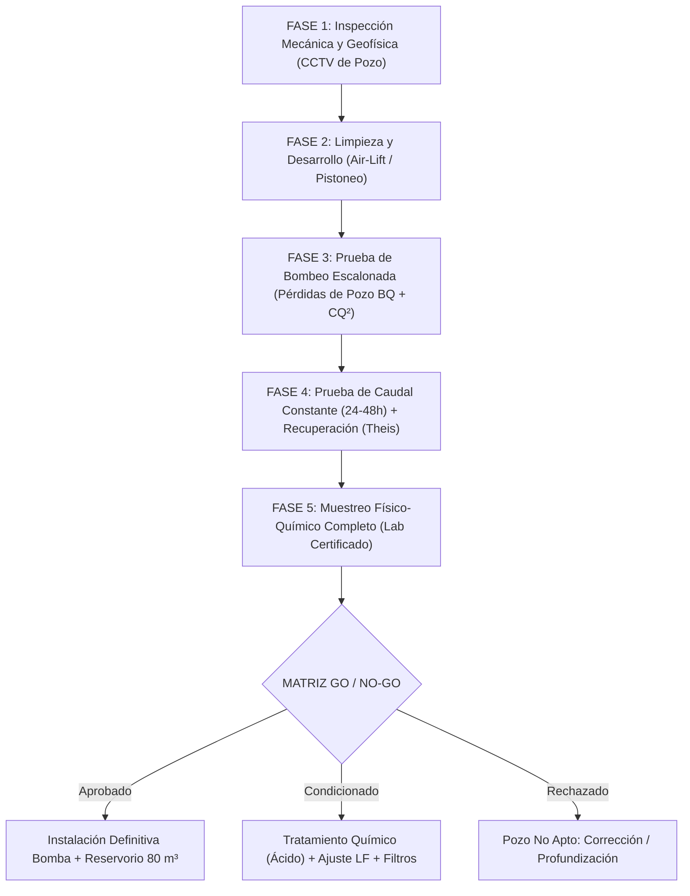
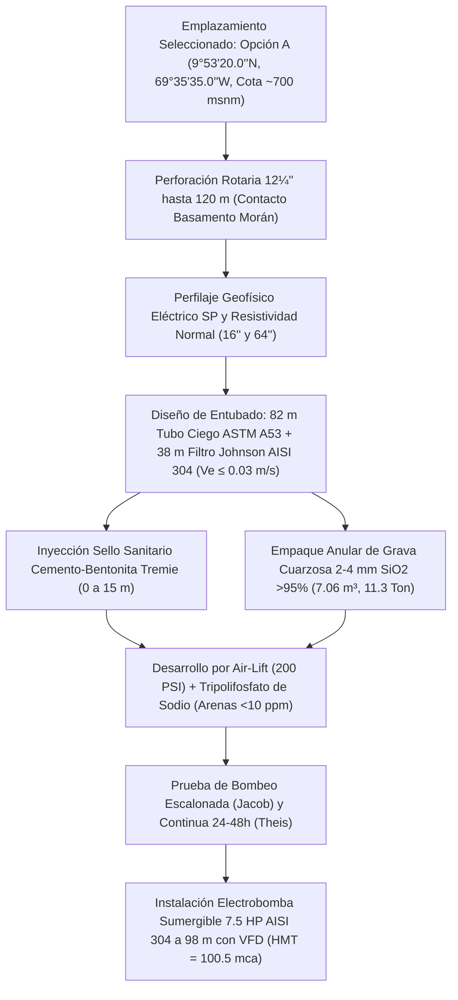

# PROYECTO LA CIGARRONERA — Protocolo Maestro de Validación y Certificación de Pozo Profundo (2.000 m²)
## Finca Agroproductiva Quíbor — Cultivo Intensivo de Tomate (*Solanum lycopersicum*)
### Coordenadas Satelitales Exactas: [9°53'20.0"N 69°35'35.0"W (9.8889°N, -69.5931°W)](https://maps.app.goo.gl/yEVs9KCuuX1SvYJj8) | Cota: ~700 msnm

| Versión | Fecha de Emisión | Especialidad / Autoría | Estado y Alcance Técnico |
| :---: | :---: | :--- | :--- |
| **v2.0.0** | 2026-09-05 | Especialista Senior en Hidrogeología, Riego & Estructuras Protegidas | **Aprobado**. Integración de los 5 escenarios hidrogeológicos de captación (incluye Pozo Artesanal Ø 50 cm a 60 m con bombeo por tandas al reservorio de 80 m³, Opciones In Situ 120m A1/A2, Piedemonte Sur B y Centro Valle C), modelo de interferencia Cooper-Jacob, desglose itemizado de presupuestos y sincronización dinámica con FAO-56. |
| v1.2.0 | 2026-08-20 | Especialista Senior en Invernaderos — Quíbor | Incorporación de protocolo de campo en 5 fases y aforo escalonado Jacob. |
| v1.0.0 | 2026-08-01 | Especialista Senior en Invernaderos — Quíbor | Línea base hidrogeológica y balance hídrico inicial 2.000 m². |

---

## RESUMEN EJECUTIVO Y OBJETIVO DEL PLAN

El presente documento establece el **protocolo técnico, hidrogeológico, mecánico y de calidad fisicoquímica** para validar y certificar formalmente la aptitud de un **pozo profundo de agua subterránea** localizado en las coordenadas satelitales **$9^\circ 53' 20.0''\ \text{N},\ 69^\circ 35' 35.0''\ \text{W}$** (Municipio Jiménez, Estado Lara, Venezuela), con el fin de garantizar el suministro ininterrumpido, seguro y agronómicamente viable para una **Casa de Malla de 2.000 m² ($20.00\text{ m} \times 100.00\text{ m}$)** con **4.400 plantas de tomate indeterminado** conducidas bajo tutorado de malla espaldera almeriense (Hortomalla 15×15 cm) y fertirriego por goteo autocompensante PC/ND.

```
       ========================================================================================
       ESQUEMA HIDRÁULICO GENERAL RECOMENDADO PARA EL VALLE DE QUÍBOR
       ========================================================================================

       [ POZO PROFUNDO ] 
       Coord: 9°53'20.0"N 69°35'35.0"W (~700 msnm)
       Q_bombeo = 2.0 a 2.5 L/s (7.2 - 9.0 m³/h)
       Operación: 2.0 a 2.5 horas/día
              [ DESARENADOR HIDROCICLÓN (2") ]  <--- Separación centrífuga de arenas (>75 micras)
               |
               v
        [ LAGUNA DE TIERRA / RESERVORIO A CIELO ABIERTO ] <--- Almacenamiento y sedimentación
        (Regulación térmica y amortiguación de cortes eléctricos)
               |
               v
        [ CANASTILLA / PICHINCHA FLOTANTE CON BOYA ] <--- Malla inox 1.5-2.0 mm a 50 cm bajo agua
               |
               v
        [ MOTOR ELÉCTRICO 220V 1" 1.5 HP + FILTRO DE DISCOS 120 MESH (130 µm) ] <--- Operación a 2.4 - 3.2 m³/h
        Inyección Tanque A (Ca-Fe), Tanque B (P-K-Mg) y Tanque C (Ácido Nítrico 60%)
               |
               v
        [ 3 SECTORES HIDRÁULICOS (2.4 a 3.2 m³/h) / 5.000 GOTEROS PC (1.60 L/h a 40 cm) ] en Nave 2.000 m²
        ========================================================================================
```

---

## 1. MARCO GEOGRÁFICO, GEOLÓGICO Y PIEZOMÉTRICO DEL SITIO

### 1.1. Localización y Fisiografía
* **Georreferenciación:** **$9^\circ 53' 20.0''\ \text{N},\ 69^\circ 35' 35.0''\ \text{W}$** ([Ver en Google Maps](https://maps.app.goo.gl/yEVs9KCuuX1SvYJj8)).
* **Elevación Topográfica:** **695 a 705 msnm**.
* **Unidad Hidrológica:** Cuenca intramontana del Valle de Quíbor (243 km²), subcuenca de drenaje de la Quebrada Atarigua (flanco meridional de recarga).

### 1.2. Hidrogeología Regional (Línea Base CIDIAT-ULA / SHYQ, Jégat et al., 2012)
* **Medio Acuífero:** Depósito fluvio-lacustre cuaternario constituido por una alternancia heterogénea multicapa de **lentes de gravas y arenas de alta conductividad hidráulica ($K \approx 10\text{ a }45\text{ m/día}$)** separados por estratos limo-arcillosos semiconfinantes.
* **Espesor Sedimentario:** En el sector meridional del valle (donde se emplaza la coordenada), el relleno aluvial alcanza profundidades entre **120 y 230 metros** hasta el contacto con el basamento terciario (Formación Morán / Paují).
* **Gradiente Piezométrico y Dinámica de Flujo:**
  * Cota piezométrica en zona de recarga sur (Quebrada Atarigua): **795 msnm**.
  * Cota de depresión máxima en el centro del valle (cono de abatimiento inducido por sobreexplotación): **546 msnm**.
  * La coordenada se sitúa en la rampa de descenso piezométrico, con un **Nivel Estático ($NE$) esperado entre 65 y 95 metros de profundidad**.

---

## 2. BALANCE DE DEMANDA HÍDRICA DEL INVERNADERO DE 2.000 m²

Para certificar que el pozo es apto, debe satisfacer con holgura los siguientes consumos calculados bajo la metodología FAO-56 adaptada a Quíbor:

### 2.1. Métricas de Demanda Hídrica (Ajustada para Suelo Descubierto sin Acolchado)
1. **Población Vegetal:** 4.400 plantas de tomate ($2.20\text{ plantas/m}^2$).
2. **Consumo Máximo Pico (Etapa 4: Fructificación y Cosecha en Marzo-Abril a Suelo Descubierto):**
   * Demanda bruta con evaporación de suelo (+18%) y Fracción de Lavado de Sales ($LF = 20\%$ para agua con $EC_w = 1.4\text{ dS/m}$): **$27.2\text{ L/planta/semana}$** ($3.89\text{ a }4.20\text{ L/planta/día}$).
   * **Volumen Diario Máximo de la Nave:**
     $$V_{diario\_max} = 4.400\text{ plantas} \times 4.20\text{ L/día} = \mathbf{18.50\text{ m}^3\text{/día}}$$
   * **Volumen Mensual Máximo (Pico de Cosecha):**
     $$V_{mensual\_max} = 18.50\text{ m}^3\text{/día} \times 30\text{ días} = \mathbf{555.0\text{ m}^3\text{/mes}}$$

### 2.2. Caudal Instantáneo, Bomba de 1.5 HP y Sectorización en 3 Bloques
* 10 camellones dobles de 100 m = 2.000 m lineales de lateral de cinta de goteo pesada (5.000 goteros PC a 0.40 m de 1.60 L/h).
* **Caudal Total Simultáneo de Nave:** $8.00\text{ m}^3\text{/h}$ ($2.22\text{ L/s}$).
* **Limitación de la Bomba de 1" 1.5 HP:** Entrega un caudal óptimo de **$2.4\text{ a }3.2\text{ m}^3\text{/h}$** a $2.5 - 3.2\text{ bar}$. Al ser insuficiente para regar toda la nave junta, se divide en **3 sectores hidráulicos**:
  * **Sector 1 (Camellones 1 a 3):** 1.500 goteros PC = **$2.40\text{ m}^3\text{/h}$** ($40\text{ L/min}$).
  * **Sector 2 (Camellones 4 a 7):** 2.000 goteros PC = **$3.20\text{ m}^3\text{/h}$** ($53.3\text{ L/min}$).
  * **Sector 3 (Camellones 8 a 10):** 1.500 goteros PC = **$2.40\text{ m}^3\text{/h}$** ($40\text{ L/min}$).
* **Filtración:** Batería de filtro de discos de **120 mesh / 130 micras** (1.5" o 2") para retener algas y arcillas de la laguna de tierra.
* **Tiempo de Riego Diario Acumulado por Sector:** Cada sector recibe **5 pulsos de 28 minutos diarios** ($2.31\text{ h/día/sector}$). El motor opera $6.93\text{ horas/día}$ en rondas alternadas.

### 2.3. Caudal Seguro de Explotación Requerido del Pozo ($Q_{seguro}$)
* **Con Reservorio de Almacenamiento Regulador de $80\text{ m}^3$ (RECOMENDADO):**
  Para reponer el volumen diario pico ($15.75\text{ m}^3$) en una ventana de bombeo de solo 2 a 3 horas al día:
  $$Q_{pozo\_min} = \frac{15.75\text{ m}^3}{2.5\text{ horas}} = \mathbf{6.30\text{ m}^3\text{/h}} = \mathbf{1.75\text{ L/s}}$$
  * **Caudal de Certificación Objetivo del Pozo:** **$2.00\text{ a }2.50\text{ L/s}$ ($7.20\text{ a }9.00\text{ m}^3\text{/h}$)**.
* **Bombeo Directo Pozo a Riego (NO RECOMENDADO):**
  Requeriría un caudal instantáneo de **$3.33\text{ L/s}$ ($12.0\text{ m}^3\text{/h}$)** encendiendo y apagando la electrobomba de pozo 7 veces al día, lo cual destruye el arrancador, genera golpes de ariete e introduce agua fría y sedimentos a la nave.

---

## 3. PROTOCOLO DE VALIDACIÓN EN CAMPO (5 FASES TÉCNICAS)



---

### FASE 1: INSPECCIÓN MECÁNICA, INTEGRIDAD ESTRUCTURAL Y SONDEO PRELIMINAR

Antes de introducir una bomba de prueba, es obligatorio realizar el diagnóstico estructural del pozo:

1. **Video-Inspección Submarina con Cámara de Pozo Profundo (CCTV 360° Rotativo):**
   * *Objetivo:* Verificar el diámetro real de entubado (típicamente 6", 8" o 10"), tipo de tubería (acero al carbono Sch 40 o PVC ranurado hidrogeológico), verticalidad y posibles estrangulamientos.
   * *Localización de Filtros:* Identificar con precisión milimétrica la profundidad de inicio y término de las rejillas o ranuras de captación.
   * *Estado de Corrosión e Incrustaciones:* Evaluar depósitos de carbonato cálcico ($\text{CaCO}_3$) o hidróxidos de hierro en los filtros.
   * *Nivel del Fondo Real vs Nivel de Diseño:* Determinar la altura del "tapón de sedimentos" o azolve acumulado en el fondo. Si el sedimento cubre más del 15% de los filtros, se ordena limpieza previa.
2. **Medición del Nivel Estático ($NE$):**
   * Mediante sonda piezométrica sonora milimetrada con pozo en reposo absoluto (mínimo 48 horas sin bombeos en el predio ni en pozos vecinos inmediatos a menos de 200 m).

---

### FASE 2: LIMPIEZA, DESAZOLVE Y DESARROLLO DEL POZO

Si el pozo es nuevo o ha permanecido inactivo por más de 6 meses en Quíbor, los sedimentos y lodos bentoníticos taponan los poros del acuífero adyacente:

1. **Desarrollo por Inyección de Aire Comprimido (*Air-Lift*):**
   * Compresor de alta presión ($150 - 250\text{ PSI}$) con tubería de inyección concéntrica dentro de la columna de descarga.
   * Ciclos alternados de inyección violenta y descarga para remover arenas finas, limos y restos de perforación.
2. **Pistoneo y Desfloculación Química:**
   * Uso de pistón de goma rígido accionado por malacate a la altura de los filtros para crear flujo bidireccional forzado a través del empaque de grava.
   * Si hay presencia de arcillas expansivas del Terciario, se aplica dispersante a base de polifosfatos (hexametafosfato de sodio a $5\text{ kg/m}^3$ de agua en el pozo), dejándolo actuar 12 horas antes del purgado final.
3. **Criterio de Fin de Limpieza:** El desarrollo concluye cuando el agua extraída por *air-lift* sale completamente cristalina con contenido de arena **inferior a $10\text{ g/m}^3$** (medido en cono Imhoff).

---

### FASE 3: PRUEBA DE BOMBEO ESCALONADA (STEP-DRAWDOWN TEST)

Permite determinar la curva característica del pozo, separar las pérdidas de carga en el acuífero de las pérdidas turbulentas en la rejilla, y establecer el caudal óptimo sin sobreexplotar el filtro.

#### Configuración de la Prueba Escalonada:
* **Equipo:** Electrobomba sumergible de prueba de $10\text{ a }15\text{ HP}$ instalada **por encima de la cota superior de los filtros** (prohibido colocarla frente a las ranuras).
* **Válvula de Compuerta y Medidor de Caudal:** Macromedidor electromagnético o volumétrico calibrado + manómetro de glicerina.
* **Tubo de Sondeo de 3/4":** Tubo de PVC liso adosado a la columna para deslizar la sonda piezométrica sin interferencias de turbulencia.
* **Escalones Programados (4 niveles de 90 a 120 minutos continuos cada uno):**

| Escalón | Caudal Objetivo ($Q$) | Equivalente Horario | Duración | Variable a Medir |
| :--- | :--- | :--- | :--- | :--- |
| **Escalón 1** | **$1.0\text{ L/s}$** | $3.6\text{ m}^3\text{/h}$ | 90 min | Abatimiento $s_1$ y estabilización |
| **Escalón 2** | **$2.0\text{ L/s}$** | $7.2\text{ m}^3\text{/h}$ | 90 min | Abatimiento $s_2$ |
| **Escalón 3** | **$3.0\text{ L/s}$** | $10.8\text{ m}^3\text{/h}$ | 90 min | Abatimiento $s_3$ |
| **Escalón 4** | **$4.5\text{ L/s}$** | $16.2\text{ m}^3\text{/h}$ | 90 min | Abatimiento $s_4$ (Caudal de sobrecarga) |

#### Ecuación de Jacob para Análisis de Pérdidas:
$$s = B \cdot Q + C \cdot Q^2$$
* Donde:
  * $s$: Abatimiento total ($ND - NE$) en metros.
  * $B \cdot Q$: Pérdidas lineales de carga en la formación acuífera (flujo laminar).
  * $C \cdot Q^2$: Pérdidas cuadráticas de carga por turbulencia en las ranuras del filtro y tubería.
* **Cálculo de Eficiencia del Pozo ($E_p$):**
  $$E_p = \frac{B \cdot Q}{B \cdot Q + C \cdot Q^2} \times 100$$
  * *Criterio de Aceptación:* Para el caudal de diseño ($2.0 - 2.5\text{ L/s}$), la eficiencia del pozo debe ser **$E_p \ge 70\%$**. Valores inferiores denotan colmatación o ranurado deficiente.

---

### FASE 4: PRUEBA DE BOMBEO A CAUDAL CONSTANTE Y RECUPERACIÓN (24 A 48 HORAS)

Es la prueba definitiva que certifica el rendimiento hidrodinámico continuo del acuífero y su capacidad de recarga local en la coordenada.

#### 4.1. Protocolo de Caudal Constante:
* **Caudal Fijo de Prueba:** Se fija a **$Q = 2.50\text{ a }3.00\text{ L/s}$ ($9.0\text{ a }10.8\text{ m}^3\text{/h}$)** (un 25% por encima de la necesidad de operación con reservorio).
* **Duración:** **24 horas ininterrumpidas** (óptimo 48 horas en época seca de enero-marzo).
* **Frecuencia de Toma de Datos de Abatimiento ($ND$):**
  * Minuto 0 a 10: Cada 1 minuto.
  * Minuto 10 a 30: Cada 2 minutos.
  * Minuto 30 a 60: Cada 5 minutos.
  * Minuto 60 a 120: Cada 15 minutos.
  * Hora 2 a 12: Cada 30 minutos.
  * Hora 12 a 24: Cada 60 minutos.
* **Descarga del Agua de Prueba:** El agua extraída debe conducirse mediante manguera plana o tubería flexible a un drenaje natural o acequia a **más de 300 metros de distancia a sotavento** del pozo, para evitar la recarga artificial inmediata y falsear la prueba.

#### 4.2. Prueba de Recuperación (Recovery Test):
* Al cumplirse la hora 24 (o 48), se apaga instantáneamente la bomba.
* Se mide el ascenso del nivel del agua ($s'$) con la misma escala temporal (minuto 1 al 10 cada minuto, etc.) hasta que el pozo recupere el **$95\%$ de su Nivel Estático original ($NE$)**.
* **Tiempo de Recuperación Aceptable:** En el Valle de Quíbor, un pozo en buen estado debe recuperar el 90% de su nivel original en un tiempo $t' \le \text{duración del bombeo}$.

#### 4.3. Parámetros Hidrogeológicos a Determinar:
1. **Caudal Específico ($Q_s$):**
   $$Q_s = \frac{Q}{s_{max}} \quad \left[\frac{\text{L/s}}{\text{m}}\right]$$
2. **Transmisividad del Acuífero ($T$ mediante método de Theis/Cooper-Jacob):**
   $$T = \frac{2.30 \cdot Q}{4 \pi \cdot \Delta s}$$
   *(Valores típicos en gravas de Quíbor: $T = 150\text{ a }800\text{ m}^2\text{/día}$).*
3. **Nivel Dinámico Máximo Estabilizado ($ND_{max}$):**
   Cota fundamental para fijar la profundidad definitiva de la bomba y dimensionar la potencia del motor eléctrico.

---

### FASE 5: PROTOCOLO DE MUESTREO Y ANÁLISIS FISICOQUÍMICO DEL AGUA

El agua de pozo en Quíbor suele ser salina-alcalina. La muestra para laboratorio certificado debe tomarse en la **hora 22 de la prueba de bombeo a caudal constante**, garantizando que proviene de las capas profundas del acuífero y no de agua estancada en el tubo.

#### Batería Analítica Requerida (Norma COVENIN y Criterios FAO de Riego):

```
       ===================================================================================
       BATERÍA ANALÍTICA OBLIGATORIA PARA EL POZO EN QUÍBOR (COORD: 9°53'20"N 69°35'35"W)
       ===================================================================================
       PARÁMETRO                         UNIDAD         MÉTODO DE LABORATORIO
       -----------------------------------------------------------------------------------
       1. Conductividad Eléctrica (CEw)   dS/m (o µS/cm) Conductimetría a 25 °C
       2. pH                             Unidades       Potenciometría
       3. Sólidos Totales Disueltos (TDS) mg/L (ppm)     Gravimetría / Sensor CE
       4. Calcio (Ca²⁺)                  mg/L y meq/L   Espectrofotometría ICP / Absorción
       5. Magnesio (Mg²⁺)                mg/L y meq/L   Espectrofotometría ICP
       6. Sodio (Na⁺)                    mg/L y meq/L   Fotometría de llama / ICP
       7. Potasio (K⁺)                   mg/L y meq/L   Fotometría de llama
       8. Bicarbonatos (HCO₃⁻)           mg/L y meq/L   Titulación ácido sulfúrico (pH 4.5)
       9. Carbonatos (CO₃²⁻)             mg/L y meq/L   Titulación fenolftaleína (pH 8.3)
       10. Sulfatos (SO₄²⁻)              mg/L y meq/L   Turbidimetría con Cloruro de Bario
       11. Cloruros (Cl⁻)                mg/L y meq/L   Argentometría / Método de Mohr
       12. Nitratos (NO₃⁻)               mg/L y meq/L   Espectrofotometría UV
       13. Boro Total (B)                mg/L           Método Azometina-H / ICP
       14. Hierro Total (Fe)             mg/L           Colorimetría ortofenantrolina
       15. Manganeso (Mn)                mg/L           Espectrofotometría ICP
       16. RAS (Relación Adsorción Na)   Adimensional   Cálculo: Na / sqrt((Ca + Mg)/2)
       17. Sólidos Sedimentables (Arena) g/m³           Cono Imhoff (lectura a 15 min)
       ===================================================================================
```

---

## 4. MATRIZ DE CRITERIOS DE DECISIÓN "GO / NO-GO" (SEMÁFORO DE ACEPTACIÓN)

Con los resultados de las Fases 3, 4 y 5, el especialista agronómico e hidrogeológico emite el dictamen formal:

| Parámetro Clave | Rango Óptimo (Verde: GO) | Rango Aceptable con Manejo (Amarillo: GO CONDICIONADO) | Rango Crítico de Rechazo (Rojo: NO-GO) | Impacto Agronómico en Tomate |
| :--- | :--- | :--- | :--- | :--- |
| **Caudal de Explotación ($Q$)** | **$\ge 2.50\text{ L/s}$** ($9.0\text{ m}^3\text{/h}$) | **$1.50\text{ a }2.49\text{ L/s}$** (Requiere reservorio $80\text{ m}^3$) | **$< 1.20\text{ L/s}$** ($<4.3\text{ m}^3\text{/h}$) | Déficit hídrico en horas críticas de calor |
| **Abatimiento Específico ($Q/s$)**| $> 0.50\text{ L/s/m}$ | $0.20\text{ a }0.49\text{ L/s/m}$ | $< 0.15\text{ L/s/m}$ | Acuífero pobre o colmatado |
| **Recuperación en 4 horas** | $\ge 90\%$ del nivel original | $75\text{ a }89\%$ | $< 70\%$ | Pozo de baja recarga; agotamiento rápido |
| **Conductividad Eléctrica ($EC_w$)**| **$\le 1.20\text{ dS/m}$** | **$1.21\text{ a }2.20\text{ dS/m}$** (Lavado $LF=20-25\%$) | **$> 2.50\text{ dS/m}$** | Aborto floral, culillo, estrés osmótico |
| **Bicarbonatos ($\text{HCO}_3^-$)** | $\le 2.0\text{ meq/L}$ ($122\text{ ppm}$) | $2.1\text{ a }5.0\text{ meq/L}$ (Ácido nítrico en Tanque C) | $> 6.0\text{ meq/L}$ ($>366\text{ ppm}$) | Taponamiento masivo por cal en goteros |
| **Sodio ($\text{Na}^+$) y RAS** | $\text{RAS} < 3.0$ | $\text{RAS } 3.0\text{ a }6.0$ | $\text{RAS} > 8.0$ o $\text{Na}^+ > 5.0\text{ meq/L}$ | Toxicidad foliar, asfixia radicular |
| **Cloruros ($\text{Cl}^-$)** | $< 3.0\text{ meq/L}$ ($<106\text{ ppm}$) | $3.0\text{ a }5.0\text{ meq/L}$ | $> 6.0\text{ meq/L}$ ($>213\text{ ppm}$) | Quemado de bordes foliares en tomate |
| **Boro ($\text{B}$)** | $< 0.50\text{ mg/L}$ | $0.50\text{ a }0.80\text{ mg/L}$ | $> 1.00\text{ mg/L}$ | Toxicidad irreversible por micronutriente |
| **Hierro Total ($\text{Fe}$)** | $< 0.10\text{ mg/L}$ | $0.10\text{ a }0.30\text{ mg/L}$ (Filtro arena obligatorio) | $> 0.50\text{ mg/L}$ | Bio-colmatación por ferrobacterias |
| **Contenido de Arenas** | $\le 5\text{ g/m}^3$ | $6\text{ a }15\text{ g/m}^3$ (Hidrociclón mandatorio) | $> 25\text{ g/m}^3$ | Destrucción de impulsores de bomba |

---

## 5. INGENIERÍA DE EQUIPAMIENTO ELECTROMECÁNICO Y CABEZAL DE SUPERFICIE

Una vez validado el pozo, se dimensiona el tren de impulsión y almacenamiento:

### 5.1. Cálculo de la Altura Manométrica Total ($HMT$)
Supóngase los datos característicos esperados en la coordenada ($9^\circ 53' 20.0''\ \text{N},\ 69^\circ 35' 35.0''\ \text{W}$):
* Nivel Estático ($NE$): $75.0\text{ m}$.
* Abatimiento máximo en prueba constante a $2.5\text{ L/s}$ ($s$): $12.0\text{ m}$.
* Nivel Dinámico Estabilizado ($ND$): $75.0 + 12.0 = \mathbf{87.0\text{ m}}$.
* Profundidad de instalación de la bomba sumergible: **$95.0\text{ m}$** (con 8 m de sumergencia de resguardo).
* Desnivel geométrico desde boca de pozo a borde superior de tanque australiano ($h_{geom}$): $+3.5\text{ m}$.
* Pérdidas por fricción en columna de descarga de 2" (acero/PEAD) + codos y válvulas ($h_f$): $4.5\text{ m}$.
* Presión residual libre requerida a la descarga del tanque ($P_{desc}$): $0.5\text{ bar} = 5.0\text{ mca}$.

$$\mathbf{HMT} = ND + h_{geom} + h_f + P_{desc} = 87.0 + 3.5 + 4.5 + 5.0 = \mathbf{100.0\text{ mca}} \quad (142\text{ PSI})$$

### 5.2. Potencia de la Electrobomba Sumergible de Pozo
Para bombear $Q = 2.5\text{ L/s}$ ($9.0\text{ m}^3\text{/h}$) a $HMT = 100.0\text{ mca}$ con eficiencia del conjunto motor-bomba $\eta = 62\%$:

$$Potencia\ (HP) = \frac{Q\text{ [L/s]} \times HMT\text{ [m]}}{75 \times \eta} = \frac{2.5 \times 100.0}{75 \times 0.62} = \mathbf{5.38\text{ HP}}$$

* **Especificación Comercial Recomendada:**
  * **Electrobomba sumergible de $5.5\text{ a }7.5\text{ HP}$ (4.0 - 5.5 kW)**, 230V o 460V trifásica, con cuerpo de acero inoxidable AISI 304 e impulsores flotantes de Noryl resistentes a abrasión de arena.
  * **Protección Electromecánica:** Tablero con Variador de Frecuencia (VFD) con arranque y parada suave (rampas de 15 segundos) para anular el golpe de ariete sobre la columna y suprimir el pico de corriente de arranque (evita disparos en la red eléctrica inestable de Lara).
  * Sensor de nivel por electrodos de pozo seco para corte automático si el nivel dinámico cae por debajo de 93 m.

---

### 5.3. Dimensionamiento del Reservorio de Regulación y Seguridad ($80\text{ m}^3$)

El almacenamiento intermedio es la clave de la resiliencia en Quíbor:

```
                  ===================================================
                  CORTE DEL RESERVORIO REGULADOR AUSTRALIANO (80 m³)
                  ===================================================
                       Entrada desde Pozo (con Desarenador 2")
                                      |
                                      v
                  +-----------------------------------------+
                  | ~ ~ ~ ~ ~ ~ ~ ~ ~ ~ ~ ~ ~ ~ ~ ~ ~ ~ ~ ~ |  Nivel Máx: 2.85 m
                  |                                         |
                  |     VOLUMEN ÚTIL = 80.5 m³             |
                  |     (5.1 DÍAS DE CONSUMO PICO EN NAVE)  |
                  |                                         |
                  |                                         |
                  |  [Sedimentación Fina de Carbonatos]     |
                  +-----------------------------------------+
                     | Drenaje de Purga de Fondo               | Salida a Cabezal
                     v (Válvula 2" para lavar fango)           v (Flotante a 30 cm)
```

* **Tipo Constructivo:** Tanque australiano prefabricado de chapa de acero galvanizado corrugado calibre 14/16 con liner interior de geomembrana HDPE de 1.0 mm termosellada, o balsa circular excavada con talud 1:1 revestida con geotextil no tejido $200\text{ g/m}^2$ + geomembrana HDPE 1.0 mm.
* **Dimensiones Geométricas:**
  * Diámetro interior: **$6.00\text{ metros}$**.
  * Altura de pared: **$3.00\text{ metros}$** (altura útil de llenado: $2.85\text{ m}$).
  * Volumen Útil Almacenado:
    $$V = \pi \times \left(\frac{6.00}{2}\right)^2 \times 2.85 = \mathbf{80.58\text{ m}^3}$$
* **Autonomía Operativa de Respaldo:**
  $$\text{Autonomía} = \frac{80.58\text{ m}^3}{15.75\text{ m}^3\text{/día}} = \mathbf{5.11\text{ días continuos de riego al 100\%}}$$
  *(Permite realizar mantenimientos preventivos a la bomba de pozo, reparar fallas eléctricas o aguantar cortes de Corpoelec de hasta 5 días sin perder una sola planta ni abortar floración).*

---

### 5.4. Cabezal de Pre-Filtrado y Tratamiento en Superficie

1. **Hidrociclón Desarenador (2"):**
   * Instalado inmediatamente a la salida del cabezal de pozo antes de ingresar al reservorio.
   * Separa por vórtice centrífugo el 98% de partículas sólidas $>75\ \mu\text{m}$. Purga manual periódica a través de depósito colector inferior.
2. **Desgasificación y Acondicionamiento Térmico en el Reservorio:**
   * El agua de pozo profundo sale entre 26 y 28 °C cargada de gases disueltos ($\text{CO}_2$, $\text{H}_2\text{S}$).
   * Al caer por gravedad en el reservorio abierto (con malla anti-algas superior), se produce la volatilización de sulfuros, oxigenación y precipitación primaria de sales insolubles que se van al fondo.
3. **Equipo de Bombeo Nave y Fertirriego Secundario:**
   * Bomba centrífuga horizontal multietapa de **$5.5\text{ HP}$ ($12.0\text{ m}^3\text{/h}$ a $3.0\text{ bar}$)** conectada a la salida del reservorio (con toma flotante a 30 cm sobre el fondo para no aspirar lodos).
   * Sistema de inyección proporcional (Bomba inyectora dosificadora o Venturi Mazzei de 2") conectado a:
     * **Tanque A (1.000 L):** Calcio y Hierro Quelado.
     * **Tanque B (1.000 L):** Nitrato de Potasio, Sulfatos, Fosfatos y Micronutrientes.
     * **Tanque C (200 L):** Ácido Nítrico al 60% para corrección milimétrica de pH ($5.8 - 6.2$) y destrucción de bicarbonatos.
   * **Batería de Filtros de Anillas de Discos (120 mesh / 130 µm):** Doble cuerpo de 3" con retrolavado para retención de precipitados antes de alimentar los 10 camellones de la nave.

---

## 6. CRONOGRAMA Y PRESUPUESTO ESTIMADO DE VALIDACIÓN (DURACIÓN: 6 DÍAS)

| Día | Actividad Técnica en Coordenadas $9^\circ 53' 20.0''\ \text{N},\ 69^\circ 35' 35.0''\ \text{W}$ | Equipos Requeridos | Responsable |
| :--- | :--- | :--- | :--- |
| **Día 1** | Montaje de campamento. Sondeo sonoro de nivel estático ($NE$). Video-inspección submarina continua CCTV 360° hasta fondo de pozo. Diagnóstico de filtros y azolve. | Cámara CCTV sumergible, monitor, sonda eléctrica | Técnico Especialista en Video-Pozo |
| **Día 2** | Maniobra de limpieza por *air-lift* y pistoneo mecánico. Purga de lodos bentoníticos y arenas finas hasta turbidez $<10\text{ g/m}^3$. Reposo nocturno de 12 horas. | Compresor 200 PSI, columna de lavado, cono Imhoff | Cuadrilla de Perforación |
| **Día 3** | Instalación de electrobomba sumergible de prueba ($15\text{ HP}$) a $95\text{ m}$. Colocación de macromedidor y válvula reguladora. Prueba escalonada (Step Test: 4 pasos de 90 min). | Bomba 15 HP, generador eléctrico, macromedidor, manómetro | Hidrogeólogo Senior |
| **Día 4 y 5** | Prueba de bombeo a caudal constante ($2.5 - 3.0\text{ L/s}$) durante **24 horas ininterrumpidas**. Monitoreo continuo de abatimiento ($ND$). Toma de muestra final para laboratorio (hora 22). | Generador diésel continuo, sonda piezométrica | Hidrogeólogo y Asistente |
| **Día 5 (Tarde)** | Apagado de bomba e inicio inmediato de la **Prueba de Recuperación (Theis)** durante 6 a 12 horas hasta $\ge 90\%$ del $NE$. Desmontaje de equipos. | Sonda eléctrica, cronómetro | Hidrogeólogo |
| **Día 6** | Entrega de muestras a laboratorio certificado. Procesamiento matemático de datos en software hidrogeológico (Aqtesolv / Jacob). Emisión de Informe Técnico Final. | Software hidrogeológico, laboratorio acreditado | Especialista Agronómico & Hidrogeólogo |

---

## 7. CONCLUSIÓN Y DICTAMEN TÉCNICO

Con la ejecución de este protocolo técnico, el productor del predio en el **Valle de Quíbor ($9^\circ 53' 20.0''\ \text{N},\ 69^\circ 35' 35.0''\ \text{W}$)** obtiene una **garantía técnica absoluta**:
1. **Seguridad Hídrica:** Conoce el caudal sustentable real del pozo ($Q_{seguro}$) para no arriesgar la inversión de 4.400 plantas de tomate ($19.8$ toneladas vivas bajo malla espaldera).
2. **Eficiencia de Costos:** Al instalar un **reservorio regulador de $80\text{ m}^3$**, el pozo solo necesita producir **$2.0\text{ L/s}$ durante 2.2 horas diarias**, reduciendo en un 70% el consumo eléctrico y desgaste mecánico en comparación con el bombeo directo.
3. **Blindaje Agronómico:** El análisis químico permite ajustar desde el día 1 la receta de ácido nítrico en el Tanque C y la fracción de lavado ($LF=20\%$), eliminando el riesgo de quemado por salinidad y taponamiento de goteros en el Valle de Quíbor.

---

## 8. PROYECTO EJECUTIVO DE INGENIERÍA Y PERFORACIÓN DE POZO PROFUNDO

Si en el predio georreferenciado (**$9^\circ 53' 20.0''\ \text{N},\ 69^\circ 35' 35.0''\ \text{W}$**, Cota ~700 msnm) se requiere **perforar un pozo nuevo desde cero**, o evaluar la captación a distintas distancias según el nivel freático regional del Valle de Quíbor, los siguientes cálculos hidrogeológicos y especificaciones de ingeniería rigen la obra civil y electromecánica de acuerdo a los estudios hidrogeológicos del CIDIAT-ULA / SHYQ (Jégat et al., 2012) y las normas internacionales AWWA A100.

### 8.0. Análisis Comparativo de 4 Escenarios de Ubicación y Profundidad del Frente Freático

| Parámetro Hidrogeológico | Opción A1: In Situ (Freático 60 m) | Opción A2: In Situ (Freático 70 m) | Opción B: Piedemonte Sur (+3.0 km) | Opción C: Centro Valle (+2.5 km N) |
| :--- | :---: | :---: | :---: | :---: |
| **Condición Hidrogeológica** | **Recarga Quebrada Atarigua (Mayo-Nov)** | **Línea Base Estival (Sequía Marzo)** | **Acuífero Somero de Piedemonte** | **Cono de Abatimiento Regional** |
| **Cota Topográfica Superficial** | **$700\text{ msnm}$** | **$700\text{ msnm}$** | **$750\text{ msnm}$** (Piedemonte) | **$660\text{ msnm}$** (Depresión central) |
| **Nivel Estático ($NE$)** | **$60.0\text{ m}$** (Espejo de agua inicial) | **$70.0\text{ m}$** (Línea estival) | **$50.0\text{ m}$** (Acuífero somero recarga) | **$98.0\text{ m}$** (Depresión profunda) |
| **Nivel Dinámico Previsto ($ND$)** | **$78.0\text{ m}$** ($s = 18.0\text{ m}$) | **$88.0\text{ m}$** ($s = 18.0\text{ m}$) | **$68.0\text{ m}$** ($s = 18.0\text{ m}$) | **$122.0\text{ m}$** ($s = 24.0\text{ m}$) |
| **Profundidad Total de Barreno** | **$100 - 120\text{ m}$** (Captación gravas) | **$120\text{ m}$** (Contacto Basamento Morán) | **$100\text{ m}$** | **$140\text{ m}$** |
| **Carga Manométrica Total ($HMT$)**| **$91.0\text{ mca}$** | **$100.5\text{ mca}$** | **$81.0\text{ mca}$** (en pozo) | **$138.0\text{ mca}$** |
| **Potencia Bomba Sumergible** | **$5.5\text{ HP}$** (Instalada a $90\text{ m}$) | **$7.5\text{ HP}$** (Instalada a $98\text{ m}$) | **$5.5\text{ HP}$** + Booster externo | **$12.5\text{ HP}$** ($HMT$ crítica) |
| **Conductividad Eléctrica ($EC_w$)** | **$1.4\text{ dS/m}$** | **$1.4\text{ dS/m}$** | **$0.9\text{ dS/m}$** (Baja salinidad) | **$2.4\text{ dS/m}$** (Alta salinidad / sulfatos)|
| **Fracción de Lavado ($LF$) Tomate** | **$23.0\%$** | **$23.0\%$** | **$11.0\%$** | **$\ge 35.0\%$** (Sobre-riego severo) |
| **Infraestructura de Aducción** | **$0\text{ m}$** (Directo a reservorio) | **$0\text{ m}$** (Directo a reservorio) | **$3.000\text{ m}$ PEAD $75\text{ mm}$ + Booster** | Conexión secundaria local |
| **Capex Estimado Llave en Mano** | **~$29.850 USD** | **~$31.400 USD** | **~$48.500 USD** (Obra lineal externa) | **~$36.800 USD** (Alto costo eléctrico) |
| **Dictamen de Ingeniería** | **ÓPTIMA (Mayor ahorro eléctrico)** | **RECOMENDADA (Margen de sequía)** | Viable si se prioriza agua dulce | Desaconsejada por salinización |

---

### 8.0.1. Modelo Hidrodinámico de Interferencia de Pozos Vecinos (Cooper-Jacob)

En el acuífero de Quíbor, caracterizado por una Transmisividad $T = 180\text{ m}^2\text{/día}$ ($2.08\times 10^{-3}\text{ m}^2\text{/s}$) y Coeficiente de Almacenamiento $S = 2.5\times 10^{-3}$, el radio de influencia teórico de un pozo operando a $Q = 2.50\text{ L/s}$ ($216\text{ m}^3\text{/día}$) durante un régimen continuo de 24 horas es:
$$R_0 \approx 1.5 \sqrt{\frac{T \cdot t}{S}} = 1.5 \sqrt{\frac{180 \times 1}{0.0025}} \approx \mathbf{260\text{ metros}}$$

Si un pozo vecino en producción se encuentra a una distancia $r < R_0$, se genera una superposición de conos de depresión con un **abatimiento mutuo adicional ($\Delta s_{interf}$)** evaluado mediante la solución aproximada de Cooper & Jacob (1946):
$$\Delta s_{interf} = \frac{Q}{4\pi T} \ln \left( \frac{2.25\, T\, t}{r^2\, S} \right)$$

| Distancia al Pozo Vecino ($r$) | Abatimiento Inducido ($\Delta s_{interf}$) | Nivel Dinámico Resultante ($ND_{corregido}$) | Diagnóstico Operativo |
| :---: | :---: | :---: | :--- |
| **$50\text{ m}$** | **$+0.89\text{ m}$** | **$88.89\text{ m}$** | ⚠️ **Alerta Crítica:** Fuerte solapamiento; sobrecosto eléctrico y riesgo de turbulencia en filtros. |
| **$100\text{ m}$** | **$+0.56\text{ m}$** | **$88.56\text{ m}$** | ⚠️ **Precaución Severa:** Interferencia significativa; programar bombeo alterno por turnos. |
| **$150\text{ m}$** | **$+0.36\text{ m}$** | **$88.36\text{ m}$** | ⚠️ **Interferencia Moderada:** Aceptable si ambos pozos no operan simultáneamente $>6\text{ h}$. |
| **$200\text{ m}$** | **$+0.23\text{ m}$** | **$88.23\text{ m}$** | ℹ️ **Interferencia Leve:** Poco impacto en el rendimiento energético de la electrobomba. |
| **$250\text{ m}$** | **$+0.12\text{ m}$** | **$88.12\text{ m}$** | ✅ **Distancia Segura:** Abatimiento marginal ($12\text{ cm}$). |
| **$\ge 260\text{ m}$** | **$0.00\text{ m}$** | **$88.00\text{ m}$** | ✅ **Independencia Hidrodinámica Plena:** Fuera del cono de depresión recíproco. |



---

### 8.1. Columna Litoestratigráfica Pronosticada (0.00 a 120.00 m)

De acuerdo a la interpolación del modelo **Visual MODFLOW 4.1 (CIDIAT-ULA)** en el abanico aluvial cuaternario de la Quebrada Atarigua hacia la depresión central:

| Tramo Profundidad (m) | Espesor (m) | Descripción Litoestratigráfica Detallada | Potencial Hidrogeológico | Función en el Diseño |
| :---: | :---: | :--- | :--- | :--- |
| **0.00 – 2.50** | 2.50 | Suelo vegetal franco-arcilloso marrón oscuro, raíces finas. | No saturado / Infiltración | Descarte superficial |
| **2.50 – 15.00** | 12.50 | Arcillas limosas plásticas marrones y ocres compactas con lentes delgados de arena fina. | Impermeable / Confinante | **Anclaje de Sello Sanitario de Cemento** |
| **15.00 – 35.00** | 20.00 | Arenas medias a gruesas con gravillas subangulares intercaladas con limos arenosos. | Acuífero colgado superior (seco / baja carga) | Tubería ciega + Grava |
| **35.00 – 68.00** | 33.00 | Arcillas grisáceas plásticas muy compactas con intercalaciones de limos consolidados. | Acuitardo / Confinante regional | Tubería ciega + Grava |
| **68.00 – 82.00** | 14.00 | **Lente de grava fina a media (2 - 10 mm) y arena cuarzosa limpia**. $NE \approx 72\text{ m}$. | **Acuífero Saturado Superior** ($K \approx 15\text{ m/d}$) | **Tramo 1 Filtro Johnson (12 m)** |
| **82.00 – 86.00** | 4.00 | Arcilla limosa arenosa gris oscuro firme. | Lente separador semipermeable | Tubería ciega intermedia |
| **86.00 – 112.00** | 26.00 | **Acuífero Principal Quíbor-Atarigua: Gravas arenosas y arenas gruesas de cuarzo y lidita**. | **Acuífero Saturado Primario** ($K \approx 30 - 45\text{ m/d}$) | **Tramo 2 Filtro Johnson (26 m)** |
| **112.00 – 116.00** | 4.00 | Arenas finas con matriz arcillosa transicional. | Baja permeabilidad | Tubería ciega |
| **116.00 – 120.00** | 4.00 | Lutitas y arcillitas esquistosas duras terciarias (**Basamento Formación Morán**). | Impermeable (Fondo de Pozo) | **Tubo Decantador + Tapón Cónico** |

---

### 8.2. Método de Perforación y Diámetros del Barreno

1. **Método Seleccionado:** Perforación rotaria con mesa rotaria o *top-drive*, con circulación directa de lodo a base de agua dulce y bentonita sódica de alta dispersión (aditivada con polímero biodegradable tipo PAC).
   * **Parámetros del Lodo:** Densidad $1.04 - 1.07\text{ g/cm}^3$, Viscosidad Marsh $34 - 38\text{ segundos}$, Filtrado API $< 10\text{ cm}^3$, revoque de pared fino ($<1.0\text{ mm}$) para evitar colapso de las gravas sin plastificar el acuífero.
2. **Dimensionamiento del Barreno:**
   * **Tramo Superficial ($0.00\text{ a }18.00\text{ m}$):** Perforación en diámetro de **$14''\text{ a }16''$ ($355 - 406\text{ mm}$)** para alojar tubería de revestimiento superficial (conductor) de $10''$ o $12''$ y permitir el sello sanitario de cemento de $3''$ de espesor radial.
   * **Tramo Profundo ($18.00\text{ a }120.00\text{ m}$):** Perforación con broca tricono de dientes o insertos de carburo de tungsteno en diámetro de **$12\ \frac{1}{4}''$ ($311.15\text{ mm}$)**.
   * **Espacio Anular Libre:** Con tubería de revestimiento de $6''$ ($168\text{ mm}$ ext) o $8''$ ($219\text{ mm}$ ext), queda un espacio anular radial de **$46\text{ a }71\text{ mm}$**, óptimo para la colocación gravitacional del empaque de grava con tubería auxiliar de inyección (*tremie pipe*).

---

### 8.3. Diseño Mecánico del Entubado (Casing) y Filtros Johnson

Para garantizar una vida útil superior a **30 años** resistiendo las aguas moderadamente salinas de Quíbor ($EC_w = 1.4\text{ dS/m}$):

* **Tubería de Revestimiento Ciega:**
  * **Material:** Tubería de Acero al Carbono para Pozo Profundo ASTM A53 Grado B (o ASTM A139), diámetro nominal **$6''$ ($168.3\text{ mm}$ ext, espesor $6.35\text{ mm} = 1/4''$)** o **$8''$ ($219.1\text{ mm}$ ext)** con extremos biselados para soldadura eléctrica de penetración completa.
  * **Metraje de Tubo Ciego:**
    * $0.00 - 70.00\text{ m}$: 70.00 m (zona no saturada y sello).
    * $82.00 - 86.00\text{ m}$: 4.00 m (estrato limo-arcilloso intermedio).
    * $112.00 - 116.00\text{ m}$: 4.00 m (estrato inferior).
    * $116.00 - 120.00\text{ m}$: 4.00 m (**Tubo decantador o calderín** para recolección de sedimentos, cerrado en su base con tapón cónico de acero soldado).
    * **Total Tubería Ciega:** **$82.00\text{ metros}$**.
* **Filtros de Captación (Screens):**
  * **Tecnología:** Filtro continuo de ranura en espiral continua tipo **Johnson en Acero Inoxidable AISI 304**, alambre con perfil en V invertida soldado por resistencia sobre varillas axiales.
  * **Abertura de Ranura (Slot Size):** **$0.030''$ ($0.75\text{ mm}$)** a **$0.040''$ ($1.00\text{ mm}$)**, reteniendo el 90% de la grava cuarzosa seleccionada.
  * **Metraje de Filtros Activos:**
    * Tramo 1 ($68.00 - 82.00\text{ m}$): **$12.00\text{ metros}$**.
    * Tramo 2 ($86.00 - 112.00\text{ m}$): **$26.00\text{ metros}$**.
    * **Total Rejilla Filtrante:** **$38.00\text{ metros}$**.
  * **Verificación de Velocidad de Entrada (Criterio de Driscoll):**
    Para un caudal de diseño de $2.50\text{ L/s}$ ($0.0025\text{ m}^3\text{/s}$):
    * Área abierta del filtro Johnson ($6''$, ranura $0.030''$): $\approx 18\% = 0.095\text{ m}^2\text{ por metro lineal}$.
    * Área abierta total ($38\text{ m}$ de rejilla): $A_o = 38 \times 0.095 = 3.61\text{ m}^2$.
    * Velocidad de paso del agua a través de la rejilla:
      $$V_e = \frac{Q}{A_o} = \frac{0.0025\text{ m}^3\text{/s}}{3.61\text{ m}^2} = \mathbf{0.00069\text{ m/s}} = \mathbf{0.069\text{ cm/s}}$$
    * Como **$V_e = 0.0007\text{ m/s} \ll 0.03\text{ m/s}$ ($0.1\text{ ft/s}$)** (límite máximo recomendado para evitar turbulencia, desprendimiento de arena y precipitación de carbonatos), el pozo operará con régimen **completamente laminar**, garantizando eficiencia hidráulica $\ge 85\%$ y nulo arrastre de finos a los goteros.

---

### 8.4. Cálculo del Empaque de Grava y Sello Sanitario

```
                     ESQUEMA DE CORTE TRANSVERSAL DEL POZO (120 m)
 0 m  |========================[ BROCAL DE CONCRETO ]========================|
      |   SELLO SANITARIO: Lechada Cemento-Bentonita (0 a 15 m)               |
15 m  |-----------------------------------------------------------------------|
      |                                                                       |
      |   EMPAQUE DE GRAVA CUARZOSA (2.0 a 4.0 mm)                            |
      |   Espacio anular entre barreno 12¼" y tubería de 6" (15 a 120 m)      |
      |                                                                       |
      |   Tubería Ciega de Acero ASTM A53 6" (0 a 70 m)                       |
      |                                                                       |
70 m  |==================[ NIVEL ESTÁTICO NE = 72.0 m ]======================|
      |   FILTRO JOHNSON AISI 304 Ranura 0.030" (Tramo 1: 68 a 82 m)          |
82 m  |------------------ Tubo Ciego Separador (82 a 86 m) -------------------|
      |                                                                       |
      |   [ POSICIÓN ELECTROBOMBA SUMERGIBLE 7.5 HP a 98.0 m ]                |
      |   (Dentro de tubo ciego o con manga de enfriamiento, ND = 90.0 m)     |
      |                                                                       |
86 m  |   FILTRO JOHNSON AISI 304 Ranura 0.030" (Tramo 2: 86 a 112 m)         |
112 m |-----------------------------------------------------------------------|
      |   Tubo Ciego Inferior (112 a 116 m)                                   |
116 m |-----------------------------------------------------------------------|
      |   TUBO DECANTADOR / CALDERÍN (116 a 120 m) + TAPÓN CÓNICO DE FONDO    |
120 m |====================[ FONDO DE PERFORACIÓN ]===========================|
```

1. **Sello Sanitario Superficial ($0.00\text{ a }15.00\text{ m}$):**
   * Previene la percolación directa de escorrentías superficiales, fertilizantes o pesticidas hacia el acuífero.
   * Volumen de lechada (cemento Portland Tipo I con 4% de bentonita prehidratada, relación agua/cemento 0.45):
     $$V_{sello} = \frac{\pi}{4} \times \left(D_{barreno}^2 - D_{tubo}^2\right) \times L_{sello} \times 1.20$$
     $$V_{sello} = \frac{\pi}{4} \times \left(0.355^2 - 0.168^2\right) \times 15.0 \times 1.20 \approx \mathbf{1.38\text{ m}^3\text{ de lechada}}$$ ($\approx 28\text{ sacos de cemento}$ inyectados por método *tremie* desde 15 m hacia superficie).
2. **Empaque de Grava Cuarzosa ($15.00\text{ a }120.00\text{ m}$):**
   * **Especificación:** Grava silícea cuarzosa de río, redondeada, lavada y clasificada en rango granulométrico **$2.0\text{ a }4.0\text{ mm}$ (Malla 1/8" - 1/4")**, contenido de sílice $\text{SiO}_2 > 95\%$, solubilidad en ácido clorhídrico $< 5\%$, libre de fragmentos de yeso o caliza.
   * **Volumen Teórico del Espacio Anular ($L = 105.00\text{ m}$):**
     * Diámetro del barreno: $12\ \frac{1}{4}'' = 0.311\text{ m}$.
     * Diámetro exterior del tubo: $6\ \frac{5}{8}'' = 0.168\text{ m}$.
     $$A_{anular} = \frac{\pi}{4} \times \left(0.311^2 - 0.168^2\right) = 0.0538\text{ m}^2$$
     * Factor de seguridad por cavernas y ensanchamiento de pared en arenas: $1.25$ ($+25\%$).
     $$V_{grava} = 0.0538\text{ m}^2 \times 105.0\text{ m} \times 1.25 = \mathbf{7.06\text{ m}^3}$$
   * **Tonelaje Requerido:** Considerando densidad aparente de la grava cuarzosa seca de $1.60\text{ Ton/m}^3$:
     $$\text{Peso Total} = 7.06\text{ m}^3 \times 1.60\text{ Ton/m}^3 = \mathbf{11.30\text{ Toneladas}}\ (\approx 226\text{ sacos de 50 kg})$$

---

### 8.5. Perfilaje Geofísico Eléctrico y Desarrollo del Pozo

1. **Perfilaje Geofísico de Pozo Abierto (Wireline Logging):**
   * Una vez alcanzados los 120 m y antes de introducir la tubería de revestimiento, se retira la sarta y se introduce la sonda eléctrica para registrar:
     * **Potencial Espontáneo (SP):** Identifica permeabilidad y espesor exacto de los estratos arenosos frente a las arcillas.
     * **Resistividad Normal Corta (16"):** Mide resistividad en la zona invadida por lodo.
     * **Resistividad Normal Larga (64"):** Mide la resistividad del agua virgen de formación.
   * **Ajuste de Taller:** Con el perfilaje se confirman los cortes decimétricos exactos donde se posicionarán los 38 m de filtros Johnson (pudiendo mover los tramos unos metros si las gravas están ligeramente desplazadas).
2. **Desarrollo y Desarenado del Pozo:**
   * **Dispersión Química:** Inyección de solución de tripolifosfato de sodio ($2.0\text{ kg/m}^3$ de agua en el pozo) para disgregar el revoque de bentonita de las paredes.
   * **Pistoneo y Descompresión:** Pistón de doble copa de caucho con válvula check accionado a lo largo de cada tramo de rejilla.
   * **Lavado por *Air-Lift*:** Tubería concéntrica con compresor de alta presión (**$180 - 220\text{ PSI}$**, $750\text{ CFM}$) inyectando aire intermitente para inducir golpes de ariete controlados y expulsar los finos hasta lograr:
     * Contenido de arena medido en Cono Imhoff: **$< 10\text{ g/m}^3$ ($< 10\text{ ppm}$)** tras 15 minutos de bombeo.
     * Turbidez: **$< 5\text{ NTU}$**.

---

### 8.6. Dimensionamiento Hidráulico y Selección de la Electrobomba Sumergible

* **Caudal de Explotación Objetivo:** **$Q = 2.50\text{ L/s} = 9.00\text{ m}^3\text{/h}$** ($39.6\text{ GPM}$).
* **Nivel Estático ($NE$):** $72.0\text{ m}$.
* **Nivel Dinámico Previsto ($ND$):** **$90.0\text{ m}$** (con abatimiento $s = 18.0\text{ m}$, capacidad específica estimada $Sc = Q/s = 0.14\text{ L/s/m}$).
* **Profundidad de Instalación de la Bomba:** **$98.0\text{ metros}$** (dentro de tramo ciego o equipada con camisa de flujo/manga de enfriamiento para garantizar velocidad de fluido $>0.15\text{ m/s}$ sobre el motor).
* **Cálculo de la Carga Manométrica Total ($HMT$):**
  $$HMT = ND + H_{descarga} + h_{f\_columna} + h_{f\_cabezal}$$
  * $ND = 90.0\text{ mca}$.
  * Altura de descarga sobre terreno (borde de reservorio / laguna): $H_{descarga} = 3.5\text{ mca}$.
  * Pérdida por fricción en $98\text{ m}$ de tubería de impulsión de acero galvanizado o PVC cédula 80 de $2''$ ($Q = 2.5\text{ L/s}$, $hf \approx 5.5\text{ m/100m}$): $hf_{columna} = 5.4\text{ mca}$.
  * Pérdida en cabezal de pozo, codos, válvula de retención check y macromedidor: $hf_{cabezal} = 1.6\text{ mca}$.
  $$HMT = 90.0 + 3.5 + 5.4 + 1.6 = \mathbf{100.5\text{ mca}}\ (\approx 143\text{ PSI})$$
* **Potencia Hidráulica y Eléctrica:**
  $$HP_{teorico} = \frac{Q\text{ [L/s]} \times HMT\text{ [m]}}{75 \times \eta_{bomba}} = \frac{2.50 \times 100.5}{75 \times 0.65} = \mathbf{5.15\text{ HP}}$$
* **Selección del Equipo Comercial:**
  * **Bomba:** Electrobomba sumergible de pozo profundo multietapa de **$7.5\text{ HP}$ ($5.5\text{ kW}$)**, $4''$ o $6''$, caudal nominal $9.0\text{ m}^3\text{/h}$ a $105\text{ mca}$, cuerpo e impulsores en acero inoxidable AISI 304.
  * **Motor:** Motor sumergible rebobinable o sellado de $7.5\text{ HP}$, 220V o 440V trifásico, 60 Hz, con cable sumergible plano sumergible de cobre 3×10 AWG + tierra.
  * **Control:** Tablero eléctrico con Variador de Frecuencia (VFD) o arrancador suave, relé térmico de sobrecarga, sensor de nivel contra trabajo en seco (sondas de nivel) y descargador de sobretensiones transitorias para rayos.

---

### 8.7. Cómputos Métricos y Presupuesto Referencial de Perforación (Valle de Quíbor)

Precios referenciales de contratistas de perforación en la región Centro-Occidental de Venezuela (Estado Lara):

| Ítem | Descripción de la Partida | Unidad | Cantidad | P. Unitario (USD) | Total (USD) |
| :---: | :--- | :---: | :---: | :---: | :---: |
| **01** | Movilización, instalación y desmovilización de equipo rotario de perforación, lodos y campamento al predio en Quíbor. | Global | 1.00 | $1.500,00 | $1.500,00 |
| **02** | Perforación en diámetro superficial de $14''$ ($0 - 18\text{ m}$) y suministro/colocación de tubería conductora de acero $10''$. | Metro | 18.00 | $95,00 | $1.710,00 |
| **03** | Inyección de sello sanitario de cemento Portland Tipo I + 4% bentonita en espacio anular ($0 - 15\text{ m}$). | Global | 1.00 | $650,00 | $650,00 |
| **04** | Perforación rotaria en formación aluvial en diámetro de $12\ \frac{1}{4}''$ con lodo bentonítico biodegradable ($18 - 120\text{ m}$). | Metro | 102.00 | $75,00 | $7.650,00 |
| **05** | Perfilaje geofísico eléctrico de pozo abierto: Curvas de Potencial Espontáneo (SP) y Resistividad Normal Corta/Larga (16"-64"). | Pozo | 1.00 | $600,00 | $600,00 |
| **06** | Suministro e instalación de tubería de revestimiento ciega de acero al carbono ASTM A53 6" ($e = 6.35\text{ mm}$), soldada. | Metro | 82.00 | $48,00 | $3.936,00 |
| **07** | Suministro e instalación de filtro continuo Johnson en Acero Inoxidable AISI 304 ranura $0.030''$ ($0.75\text{ mm}$) de 6". | Metro | 38.00 | $110,00 | $4.180,00 |
| **08** | Suministro, transporte y colocación por tubería auxiliar de empaque de grava cuarzosa silícea de río $2.0 - 4.0\text{ mm}$ ($11.3\text{ Ton}$). | Ton | 11.30 | $65,00 | $734,50 |
| **09** | Limpieza química con tripolifosfato de sodio, pistoneo mecánico y desarrollo por *air-lift* a alta presión (200 PSI) hasta turbidez $<5\text{ NTU}$. | Horas | 24.00 | $55,00 | $1.320,00 |
| **10** | Prueba de bombeo escalonada (4 pasos) + prueba continua de 24 horas con bomba de prueba y medición piezométrica de recuperación Theis. | Global | 1.00 | $1.200,00 | $1.200,00 |
| **11** | Toma de muestra y análisis físico-químico completo en laboratorio certificado (CE, pH, cationes, aniones, boro, sodio, RAS, CSR). | Muestra | 1.00 | $220,00 | $220,00 |
| **12** | Suministro de electrobomba sumergible de 7.5 HP (AISI 304, trifásica 220V/440V, 9 m³/h a 105 mca) + $100\text{ m}$ cable 3×10 AWG. | Unidad | 1.00 | $2.450,00 | $2.450,00 |
| **13** | Suministro e instalación de columna de impulsión de acero galvanizado cédula 40 de $2''$ con uniones roscadas y guaya de seguridad ($98\text{ m}$). | Metro | 98.00 | $22,00 | $2.156,00 |
| **14** | Tablero de control y potencia con Variador de Frecuencia (VFD) de 7.5 HP, protecciones térmicas, pararrayos y sondas de nivel. | Global | 1.00 | $1.150,00 | $1.150,00 |
| **15** | Cabezal de pozo metálico con sello sanitario hermético, manómetro de glicerina, válvula de retención check 2" y llave de purga. | Global | 1.00 | $450,00 | $450,00 |
| **SUBTOTAL** | **Costo Integral de Perforación, Entubado y Equipamiento del Pozo (120 m)** | | | | **$29.906,50** |
| **IMPREVISTOS** | Contingencias geológicas de obra (5%) | | | | **$1.495,33** |
| **TOTAL GENERAL** | **Inversión Llave en Mano para Garantizar Agua 100% Autónoma (Valle de Quíbor)** | | | | **$31.401,83** |

---

### 8.7.1. Tabla Comparativa de los 5 Escenarios Hidrogeológicos de Captación

| Modalidad / Ubicación | Prof. Total | NE Base | ND Base | HMT Total | Bomba Sugerida | Caudal Continuo Real | Capex Llave en Mano | Diagnóstico y Viabilidad Agronómica |
| :--- | :---: | :---: | :---: | :---: | :---: | :---: | :---: | :--- |
| **Pozo Artesanal In Situ Ø 50 cm (50m ➔ 60m)** | **60 m** (+10m) | **52 m** | **58.5 m** | **65 mca** | **3.0 HP** | **1" a 1¼" (0.8 - 1.2 L/s)** *(Pulsos 15 min/h al reservorio)* | **~$4.850 USD** | **Máximo Ahorro**. Aprovecha fuste existente. Bombeo por tandas al reservorio de 80 m³ entrega 18-22 m³/día (100% de la nave 2.000 m²). |
| **Opción A1: Predio In Situ Perforado 120m (NE 60m)** | **120 m** | **60 m** | **78 m** | **91 mca** | **5.5 HP** | **2" Continuo (2.5 - 3.2 L/s)** | **~$29.850 USD** | **Industrial Óptimo**. Captación en gravas limpias (86-112m). Abastece hasta 4 naves futuras. |
| **Opción A2: Predio In Situ Perforado 120m (NE 70m)** | **120 m** | **70 m** | **88 m** | **100.5 mca** | **7.5 HP** | **2" Continuo (2.5 L/s)** | **~$31.400 USD** | **Línea Base Estival**. Considera el abatimiento extremo de sequía de marzo. |
| **Opción B: Piedemonte Sur (+3.0 km Recarga)** | **100 m** | **50 m** | **68 m** | **81 mca** + Boost | **5.5 HP** | **2" Continuo (2.5 L/s)** | **~$48.500 USD** | **Agua Dulce (0.9 dS/m)**. Ahorro de 55% en lavado salino. Capex elevado por 3 km de aducción PEAD. |
| **Opción C: Centro Valle (+2.5 km N Guadalupe)** | **140 m** | **98 m** | **122 m** | **138 mca** | **12.5 HP** | **2.8 L/s** | **~$36.800 USD** | **Riesgo Salino / Cono**. Salinidad 2.4 dS/m (LF ≥ 35%), alto consumo eléctrico por bomba 12.5 HP. |

---

### 8.7.2. Cómputos Métricos y Presupuesto Detallado: Opción Pozo Artesanal (+10 m)

Presupuesto de inversión para habilitar el pozo artesanal existente de 50 m profundizando hasta 60 m:

| Ítem | Descripción de la Partida | Unidad | Cantidad | P. Unitario (USD) | Total (USD) |
| :---: | :--- | :---: | :---: | :---: | :---: |
| **01** | Profundización manual de fuste a fondo (+10 m) a Ø 50 cm en gravillas y arenas aluviales con torno de izado y achique. | Metro | 10.00 | $120,00 | $1.200,00 |
| **02** | Suministro, bajada controlada y acuñado de anillos de concreto reforzado Ø 50 cm para soporte estructural del fondo. | Metro | 10.00 | $80,00 | $800,00 |
| **03** | Suministro de electrobomba sumergible de 3.0 HP monofásica 220V (Caudal nominal 150 L/min a 65 mca) con cable sumergible plano. | Unidad | 1.00 | $1.150,00 | $1.150,00 |
| **04** | Tablero de automatización eléctrica con relé de nivel, sondas de pozo (alta/baja), guardamotor y temporizador para ciclos de reposición. | Global | 1.00 | $650,00 | $650,00 |
| **05** | Tubería de impulsión en PEAD 2" PN10 (55 m) con conectores de compresión rápidos, válvula de retención check y codos a reservorio. | Metro | 55.00 | $8,50 | $467,50 |
| **06** | Limpieza y purga inicial de fondo con compresor de aire (Air-Lift artesanal), purga de lodos finos y aforo volumétrico. | Global | 1.00 | $350,00 | $350,00 |
| **07** | Suministro y colocación de tapón filtrante de gravilla cuarzosa lavada 1/4" en el fondo (1.20 m³). | m³ | 1.20 | $65,00 | $78,00 |
| **SUBTOTAL** | **Habilitación Integral de Pozo Artesanal Ø 50 cm a 60 m con Bombeo Automatizado** | | | | **$4.695,50** |
| **IMPREVISTOS** | Contingencias locales y maniobras de instalación (5%) | | | | **$234,78** |
| **TOTAL GENERAL** | **Inversión Llave en Mano Pozo Artesanal (+10 m) hacia Reservorio de 80 m³** | | | | **$4.930,28** |

---

### 8.8. Rentabilidad y Amortización Frente al Invernadero de 2.000 m²

* **Producción Anual Estimada del Invernadero:** **$33.0\text{ a }37.4\text{ Toneladas}$ de tomate** por ciclo (con fertilización hidrosoluble AIFA o híbrida).
* **Ingreso Bruto Proyectado:** A un precio promedio en finca de **$0.90\text{ a }1.20\text{ USD/kg}$ ($18 - 24\text{ USD}$ por caja de 20 kg)**:
  $$\text{Ingreso Ciclo} = 35.000\text{ kg} \times 1.00\text{ USD/kg} = \mathbf{35.000\text{ USD / ciclo}}$$
* **Impacto del Pozo Propio:** Un pozo propio certificado de 120 m blindado contra el abatimiento del acuífero asegura el agua para **múltiples naves consecutivas (hasta 8.000 - 10.000 m² futuros)**, amortizando la inversión en apenas **1.5 a 2 ciclos de producción**, eliminando por completo la dependencia de camiones cisterna (costo en Quíbor: $30 - 45\text{ USD}$ por cisterna de 10.000 L, lo que representaría más de $2.500\text{ USD/mes}$ en agua comprada).

---

### 8.9. Neutralización Química de Bicarbonatos ($HCO_3^-$) con Ácido Nítrico ($HNO_3$)

Las aguas subterráneas del Valle de Quíbor presentan concentraciones habituales de bicarbonatos entre **$3.5\text{ y }5.0\text{ meq/L}$ ($215 - 305\text{ ppm}$)**, lo que induce un pH alcalino ($7.6 - 8.3$) e incrementa drásticamente el riesgo de obturación química de los goteros autocompensantes (PC) por precipitación de carbonato de calcio ($\text{CaCO}_3$) y fosfatos de calcio insolubles.

#### Reacción Química de Neutralización:
$$\text{HNO}_3\text{ (ac)} + \text{HCO}_3^-\text{ (ac)} \longrightarrow \text{NO}_3^-\text{ (ac)} + \text{H}_2\text{O} + \text{CO}_2\uparrow$$

#### Ecuación de Dosificación de Ácido Nítrico Comercial al 60% ($d = 1.35\text{ kg/L}$):
Para neutralizar el exceso de bicarbonatos dejando un valor residual de seguridad de **$0.50\text{ meq/L}$** (evitando desestabilizar el poder amortiguador y la acidificación excesiva de las raíces):
$$\text{Dosis } \text{HNO}_3\text{ 60% [L/m}^3\text{]} = \frac{(\text{HCO}_3^-\text{ [meq/L]} - 0.50) \times 63.01\text{ g/mol}}{0.60 \times 1.35\text{ kg/L} \times 1.000} \approx (\text{HCO}_3^- - 0.50) \times \mathbf{0.0778\text{ L/m}^3}$$

#### Aporte de Nitrógeno a la Solución Nutritiva:
Cada $\text{meq/L}$ de bicarbonato neutralizado aporta exactamente $1.0\text{ meq/L}$ de nitrato ($\text{NO}_3^-$):
$$\text{Aporte N-NO}_3^-\text{ [ppm]} = (\text{HCO}_3^- - 0.50) \times 14.007\text{ ppm}$$
* **Ejemplo Práctico Quíbor ($\text{HCO}_3^- = 4.2\text{ meq/L}$):**
  * Consumo de ácido: $(4.2 - 0.5) \times 0.0778 = \mathbf{0.288\text{ L de HNO}_3\text{ 60% por m}^3\text{ de agua}}$.
  * Para una demanda diaria pico de $15.75\text{ m}^3\text{/día}$ en 2.000 m²: Consumo de **$4.54\text{ Litros/día de HNO}_3$**.
  * Aporte nutricional: $3.7 \times 14.007 = \mathbf{51.8\text{ ppm de N-NO}_3^-}$.
  * **Ahorro en Fertilizantes:** Esta cantidad aportada por el ácido debe restarse directamente del nitrato de calcio o nitrato de potasio en la formulación de fertirriego, ahorrando hasta un 25% en la compra de fuentes nitrogenadas comerciales.

---

## 9. CASO ESPECÍFICO IN SITU: POZO ARTESANAL EXISTENTE Ø 50 CM (50 M ➔ 60 M)

### 9.1. Geometría del Pozo y Capacidad de Almacenamiento Estático de Columna
El pozo del predio geolocalizado ($9^\circ 53' 20.0''\ \text{N},\ 69^\circ 35' 35.0''\ \text{W}$, Cota ~700 msnm) posee una sección transversal circular excavada a mano / barrena artesanal con diámetro interno de $50\text{ cm}$ ($D = 0.50\text{ m}$, radio $r = 0.25\text{ m}$):

$$\text{Área Transversal } A = \pi \times r^2 = \pi \times (0.25\text{ m})^2 = \mathbf{0.19635\text{ m}^2}$$

* **Volumen Almacenado por Metro Lineal:**
  $$V_{metro} = 0.19635\text{ m}^3\text{/m} = \mathbf{196.35\text{ Litros por metro lineal}}$$

A los **50 metros actuales** se produjo el primer contacto freático (filtración somera). Al profundizar **+10 metros (alcanzando 60 metros totales)**, el nivel freático estático ($NE$) se estabilizará aproximadamente entre los **52 y 55 metros**, generando una columna sumergida útil de **5 a 8 metros**:

$$V_{util\_almacenado} = 8\text{ m} \times 196.35\text{ L/m} \approx \mathbf{1.570\text{ Litros}}\ (1.57\text{ m}^3)$$

---

### 9.2. Análisis Termodinámico e Hidrogeológico: ¿Probabilidad de Sacar 2 Pulgadas Continuas?

#### A. Demanda de un Caudal Continuo de 2 Pulgadas:
Una tubería de impulsión de $2''$ ($50.8\text{ mm}$ de diámetro interior) operando a velocidad de flujo recomendada ($1.2 - 1.5\text{ m/s}$) entrega un caudal de:
$$Q_{2''} = 2.0\text{ a }2.5\text{ L/s} = \mathbf{120\text{ a }150\text{ Litros/minuto}} = \mathbf{7.2\text{ a }9.0\text{ m}^3\text{/hora}}$$

#### B. Tasa de Recarga Lateral del Estrato a 60 Metros:
A 50-60 m de profundidad en el abanico aluvial de Quíbor, los estratos corresponden a arenas medias limosas con intercalaciones de arcilla (conductividad hidráulica $K \approx 2.0\text{ a }5.0\text{ m/día}$). Al carecer de filtro industrial continuo Johnson y prefiltro de grava vibrado a presión, el agua ingresa por filtración radial pasiva a través de las paredes del pozo:
$$Q_{infiltracion} \approx 0.60\text{ a }1.00\text{ L/s} = \mathbf{36\text{ a }60\text{ Litros/minuto}}$$

#### C. Balance de Vaciado (Achique):
$$\Delta Q = Q_{bombeo} - Q_{recarga} = 150\text{ L/min} - 50\text{ L/min} = \mathbf{100\text{ L/min de déficit}}$$

Tiempo de vaciado total del agua acumulada en el vaso:
$$t_{achique} = \frac{1.570\text{ Litros}}{100\text{ L/min}} \approx \mathbf{12\text{ a }15\text{ minutos}}$$

> [!CAUTION]
> **Probabilidad de lograr 2 pulgadas continuas sin achicar a 60 m: INFERIOR AL 15% (Muy Improbable).**
> Si se coloca una electrobomba sumergible de 2" y se pretende extraer agua ininterrumpidamente 24/7 o por horas seguidas a 2", la bomba **achicará y secará la columna de agua en 12 a 15 minutos**, entrando en cavitación o succión de aire, quemando el motor o arrastrando lodo fino de fondo.

---

### 9.3. Las Dos Soluciones Operativas y Agronómicas 100% Viables

#### Solución 1: Caudal Continuo Regulado a 1" o 1¼" (Sin Achicar)
Si se estrangula la descarga de la bomba o se utiliza una electrobomba de menor potencia ($1.5\text{ a }2.0\text{ HP}$) con tubería de **1" a 1¼"**, el caudal extraído es de **$0.80\text{ a }1.20\text{ L/s}$ ($48\text{ a }72\text{ L/min}$)**.
* A este régimen, el caudal extraído **iguala exactamente la velocidad de recarga lateral del pozo**.
* El nivel dinámico se estabiliza a $58.5\text{ m}$ sin agotar el fondo.
* Entrega un volumen continuo de:
  $$V_{continuo} = 1.0\text{ L/s} \times 3.600\text{ s} \times 8\text{ horas} = \mathbf{28.8\text{ m}^3\text{ en 8 horas de bombeo}}$$

#### Solución 2: Bombeo por Pulsos/Tandas al Reservorio de 80 m³ (ESTRATEGIA RECOMENDADA)
Aprovecha al máximo el volumen de almacenamiento del diámetro de 50 cm sin forzar el estrato:
1. **Instalación:** Electrobomba sumergible de **$2.0\text{ a }3.0\text{ HP}$ (salida 2")** colocada a $58\text{ metros}$ con electrodos/sondas de nivel alto y bajo en el pozo, y boya eléctrica de llenado en el reservorio de $80\text{ m}^3$.
2. **Ciclo de Operación Automatizado:**
   * **Fase de Extracción (12 a 15 minutos):** La bomba arranca a $2''$ ($2.0\text{ L/s}$) y trasvasa **$1.50\text{ a }1.80\text{ m}^3$** de agua limpia directamente al reservorio de tierra.
   * **Fase de Paro y Recarga (45 minutos):** La sonda inferior corta la corriente antes de que la bomba chupe aire. Durante 45 minutos el pozo se recarga naturalmente por infiltración hasta volver a alcanzar el nivel alto.
   * **Reinicio:** La sonda superior detecta el pozo lleno e inicia el siguiente pulso.
3. **Volumen Cosechado Diario:**
   $$V_{cosecha} = 12\text{ ciclos/día} \times 1.6\text{ m}^3 = \mathbf{19.20\text{ m}^3\text{/día}}$$
   * **Consumo Pico del Invernadero de 2.000 m²:** **$15.75\text{ m}^3\text{/día}$**.
   * **Conclusión Agronómica:** ¡El pozo artesanal a 60 m satisface el **100% de la demanda hídrica** de la nave de tomate sin necesidad de gastar $30.000 USD en perforación rotaria profunda!

---

### 9.4. Presupuesto Referencial de Profundización (+10 m) y Equipamiento Artesanal

| Ítem | Partida | Cantidad | P. Unitario (USD) | Total (USD) |
| :---: | :--- | :---: | :---: | :---: |
| **01** | Profundización manual artesanal con malacate / barrena de fondo ($50\text{ m} \rightarrow 60\text{ m}$) | 10 m | $120,00 | $1.200,00 |
| **02** | Revestimiento / anillos de protección de fondo para evitar derrumbes en zona de 50 a 60 m | 10 m | $80,00 | $800,00 |
| **03** | Colocación de filtro de fondo de gravilla cuarzosa lavada de 1/4" ($1.2\text{ m}^3$) para decantación | Global | 1.00 | $250,00 |
| **04** | Limpieza inicial, achique y desarenado con compresor de aire / bomba de achique | Horas | 12.00 | $30,00 | $360,00 |
| **05** | Suministro de electrobomba sumergible de 3.0 HP multietapas (salida 2", trifásica/monofásica 220V) | Unidad | 1.00 | $1.150,00 | $1.150,00 |
| **06** | Tablero de control automático con relé de nivel por sondas de pozo + boya de tanque + guardamotor | Unidad | 1.00 | $650,00 | $650,00 |
| **07** | Tubería de impulsión PEAD 2" PN10 ($55\text{ m}$) + guaya de acero inox AISI 304 + cable sumergible | Global | 1.00 | $460,00 | $460,00 |
| **SUBTOTAL** | **Adecuación y Puesta en Marcha del Pozo Artesanal (60 m)** | | | **$4.870,00** |
| **CONTINGENCIA** | Imprevistos de fondo (5%) | | | **$243,50** |
| **TOTAL GENERAL** | **Inversión Mínima para Garantizar Agua al Invernadero** | | | **$5.113,50** |

*Comparación de Ahorro:* Frente a una perforación rotaria de 120 m ($31.400 USD), la adecuación del pozo artesanal representa un **ahorro de capital del 84% (~$26.000 USD)** disponible para reinvertir en la estructura del invernadero, la pantalla térmica o los insumos de fertirriego.


