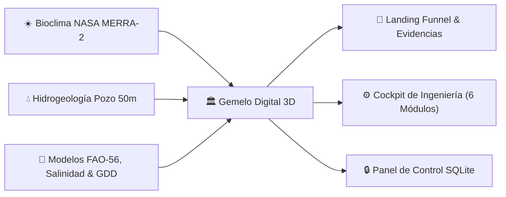
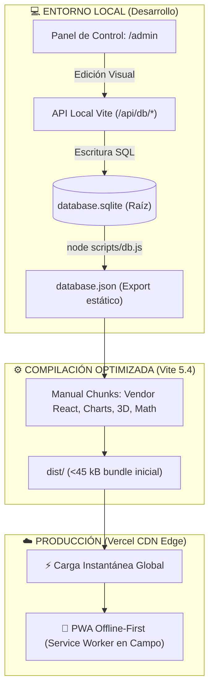

<div align="center">

# 🌱 LA CIGARRONERA — Suite Agrotecnológica & Gemelo Digital v3.0
### Horticultura Protegida, Hidrogeología & Climatología de Precisión — Valle de Quíbor, Lara, Venezuela

[](https://vitejs.dev/)
[](https://reactjs.org/)
[](https://www.typescriptlang.org/)
[](https://sqlite.org/)
[](https://threejs.org/)
[](https://web.dev/progressive-web-apps/)
[](https://vercel.com/)

<p align="center">
  <a href="#-manual-canónico-unificado"><strong>📖 Manual Canónico Unificado</strong></a> •
  <a href="#-rutas-y-módulos-de-la-suite"><strong>🚀 Módulos y Rutas</strong></a> •
  <a href="#-motores-agronómicos-y-financieros-v30"><strong>🌱 Motores v3.0</strong></a> •
  <a href="#-arquitectura-de-datos-sqlite--data-baking"><strong>💾 Data Baking</strong></a> •
  <a href="#-guía-rápida-de-desarrollo"><strong>💻 Guía de Inicio</strong></a>
</p>

</div>

---

## 📖 Manual Canónico Unificado

> [!IMPORTANT]
> **Documento Canónico Oficial de Ingeniería:** Toda la memoria técnica, análisis bioclimático NASA MERRA-2, fórmulas psicrométricas (Tetens/VPD), ecuaciones Theis/Cooper-Jacob de pozo, plan nutricional AIFA y dimensionamiento estructural se encuentran consolidados en:  
> 👉 **[`docs/MANUAL_CANONICO_AGROVENECUA.md`](./docs/MANUAL_CANONICO_AGROVENECUA.md)**

---

## 📍 Resumen Ejecutivo del Proyecto

**La Cigarronera** es una plataforma agrotecnológica de alta eficiencia desarrollada para optimizar el diseño, operación y retorno de inversión en horticultura protegida en **Cuara, Municipio Jiménez, Estado Lara, Venezuela** ($9^\circ 53' 20.0''\ \text{N},\ 69^\circ 35' 35.0''\ \text{W}$, 700 msnm).



### Pilares Clave de Ingeniería v3.0:
* **Casa de Malla Tecnificada (1.000 m²):** Altura bioclimática al alero $\ge 3.0\text{ m}$ y cumbrera $\ge 5.5\text{ m}$ con malla monofilamento virgen **110–130 gsm, 50 mesh blanco** ($\le 192\ \mu\text{m}$) que mitiga el bochorno térmico (>31.5 °C) y bloquea 100% de vectores plaga.
* **Activo Hídrico Subterráneo Estratégico:** Pozo artesanal excavado verticalmente a **50 metros de profundidad** con nivel estático comprobado a **49.5 m** en manto de grava permeable con cuarzo cristalino.
* **Cultivos Principales:** Pimentón (*Capsicum annuum* var. Magistral F1, 13.0 Ton/ciclo) y Tomate Indeterminado de Hilo Alto (*Solanum lycopersicum*, 18.7 Ton/ciclo).
* **Erradicación de la Maraña:** Modelo comercial que elimina el descarte tradicional pasando de 30% a **0% de maraña**, concentrando el **88% de la cosecha en Cesta Grande a $14 USD**.

---

## 🚀 Rutas y Módulos de la Suite

| Ruta URL | Módulo | Propósito & Capacidades | Carga Inicial |
| :--- | :--- | :--- | :---: |
| [`/`](http://localhost:3000/) | **Landing Page de Inversión** | Funnel comercial, propuesta de valor, retorno de inversión y evidencias técnicas con plano 2D. | Instantánea (~42 kB) |
| [`/cockpit`](http://localhost:3000/cockpit) | **Cockpit de Ingeniería** | Gemelo digital 3D, telemetría MERRA-2, VPD foliar, riego FAO-56, fenología GDD y plan fitosanitario IPM. | Lazy Chunk (~114 kB) |
| [`/calculo-pozo`](http://localhost:3000/calculo-pozo) | **Calculadora de Pozo** | Modelo Theis/Cooper-Jacob, abatimiento dinámico, curvas de bombeo y estratigrafía de Cuara. | Lazy Chunk (~38 kB) |
| [`/malla-50mesh`](http://localhost:3000/malla-50mesh) | **Cotizador de Malla** | Desglose técnico de rollos, gramajes (110 vs 130 gsm) y exclusión física de plagas. | Lazy Chunk (~37 kB) |
| [`/catalogo-invernaderos`](http://localhost:3000/catalogo-invernaderos) | **Catálogo Leader Greenhouse** | Modelos góticos multicapilla (AGRO-U3, U4, U5), túneles y equipamiento de ventilación. | Lazy Chunk (~46 kB) |
| [`/admin`](http://localhost:3000/admin) | **Panel de Control BD** | Administración integral de la base de datos SQLite: parámetros, cultivos, clima mensual y textos. | Lazy Chunk (~31 kB) |

---

## 🌱 Motores Agronómicos y Financieros v3.0

1. **Psicrometría & VPD (`vpd.ts`):** Ecuación de Tetens para presión de vapor ($e_s, e_a$) y diferencial foliar ($\Delta T \approx -1.8^\circ\text{C}$).
2. **Hidrología & Salinidad (`salinity.ts`):** Modelo Mass-Hoffman y FAO-29 para fracción de lavado ($LF$) y factor de lámina bruta ante aguas salinas de pozo ($EC_w \approx 1.65\text{ dS/m}$).
3. **Balance Hídrico (`fao56.ts`):** Demanda en 4 etapas fenológicas con $Kc = 0.60 \to 1.15$, uniformidad $90\%$ y sincronía 1:1 gotero-planta ($1.60\text{ L/h}$).
4. **Ventilación Eólica (`ventilation.ts`):** Ley de Hellmann para gradiente de viento a cumbrera ($z = 5.5\text{ m}$), caudal convectivo por malla 50 mesh y 8 extractores eólicos ($\text{RAH} \ge 45\ \text{h}^{-1}$).
5. **Grados-Día de Desarrollo & Fenología (`gdd.ts`):** Ecuación Baskerville-Emin con temperatura base ($12^\circ\text{C}$) y cutoff térmico ($34^\circ\text{C}$) para pimentón y tomate.
6. **Finanzas & Erradicación de Maraña (`finance.ts`):** Liquidación por cestas de 20 kg (Grande $14, Mediana $8, Maraña $3.50) con proyección de ROI y punto de equilibrio.

---

## 💾 Arquitectura de Datos: SQLite, Data Baking & PWA



---

## 💻 Guía Rápida de Desarrollo

### Requisitos
* **Node.js:** Versión `22.5.0` o superior (para soporte nativo de `node:sqlite`).
* **NPM:** `10.0+`.

### Instalación y Ejecución
```bash
# 1. Clonar el repositorio
git clone https://github.com/julljoll/invernadero.git
cd invernadero

# 2. Instalar dependencias
npm install

# 3. Iniciar el servidor de desarrollo local
npm run dev
```

### Comandos Disponibles
| Comando | Acción |
| :--- | :--- |
| `npm run dev` | Inicia Vite con el plugin de API SQLite local activo en el puerto 3000. |
| `npm run build` | Ejecuta prebuild (Data Baking) y compila con Rollup Chunks optimizados. |
| `npm run test` | Ejecuta la suite de 21 pruebas unitarias agronómicas con Vitest. |
| `npm run db:bake` | Fuerza la regeneración de `src/core/constants/database.json` desde `database.sqlite`. |
| `npm run preview` | Previsualiza localmente la compilación de producción de `dist/`. |

---

## 📊 Base Bioclimática NASA MERRA-2 (Quíbor)

| Mes | T. Máx (°C) | T. Mín (°C) | T. Med (°C) | Lluvia (mm) | Viento (km/h) | Días Bochorno | Dirección Dominante |
| :--- | :---: | :---: | :---: | :---: | :---: | :---: | :--- |
| **Enero** | 30.1 | 16.0 | 23.8 | 18.9 | 7.7 | 16.0 | 88% ESTE |
| **Febrero** | 30.8 | 16.0 | 24.6 | 11.2 | 8.5 | 14.5 | 85% ESTE |
| **Marzo** ☀️ *(Pico Calor)* | 31.0 | 16.0 | 25.4 | 23.9 | 8.6 | 18.6 | 84% ESTE |
| **Abril** | 30.6 | 17.5 | 25.6 | 61.8 | 8.5 | 22.6 | 80% ESTE |
| **Mayo** 🌧️ *(Máx Lluvia)* | 29.8 | 18.4 | 25.1 | 104.0 | 8.8 | 28.1 | 78% ESTE |
| **Junio** 💨 *(Máx Viento)* | 28.6 | 18.0 | 24.2 | 99.0 | 10.4 | 27.6 | 82% ESTE |
| **Julio** ❄️ *(Más Fresco)* | 28.0 | 19.0 | 23.8 | 99.8 | 9.1 | 28.0 | 85% ESTE |
| **Agosto** 🔥 *(Pico Bochorno)*| 28.5 | 17.9 | 24.0 | 95.2 | 9.0 | 28.6 | 86% ESTE |
| **Septiembre** 🔄 | 29.2 | 18.1 | 24.2 | 82.8 | 8.2 | 27.6 | 53% SUR *(Excepción)* |
| **Octubre** | 29.4 | 16.7 | 24.0 | 98.3 | 6.7 | 28.5 | 79% ESTE |
| **Noviembre** 🍃 *(Más Calmo)* | 29.2 | 17.6 | 23.9 | 72.0 | 7.0 | 26.4 | 84% ESTE |
| **Diciembre** | 29.4 | 15.9 | 23.7 | 28.0 | 7.2 | 22.0 | 87% ESTE |

---

## 🎨 Sistema de Diseño Agrovenecua (`agri-ux-ui`)

* 🟢 **Verde Logo Primario (`#53C942`):** Brotes, clorofila activa, estados óptimos y acentos interactivos.
* 🌲 **Verde Bosque Profundo (`#0F4D06`):** Títulos de autoridad, encabezados de módulo y contraste WCAG AAA.
* 💧 **Azul Hidráulico (`#0284c7`):** Recursos hídricos, láminas FAO-56, goteros y abatimiento del pozo.
* ☀️ **Ámbar Bioclimático (`#d97706`):** Radiación solar, grados-día y tasas de ventilación eólica.
* 🚨 **Alerta Osmótica (`#dc2626`):** Salinidad de pozo crítica (>2.0 dS/m), riesgo de virosis y estrés hídrico.

---

## 👨‍🌾 Créditos & Autoría Técnica

* **Ingeniería Agronómica y Bioclimática:** Agrovenecua Ingeniería C.A. — Especialista Senior en Horticultura Protegida.
* **Hidrogeología y Geotecnia:** Consultoría en Recursos Hídricos Subterráneos de la Formación Cuara.
* **Desarrollo Tecnológico:** Finca La Cigarronera, Cuara, Municipio Jiménez, Estado Lara, Venezuela.
