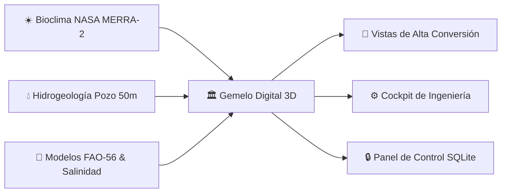

<div align="center">

# 🌱 LA CIGARRONERA — Suite Agrotecnológica & Gemelo Digital
### Horticultura Protegida, Hidrogeología & Climatología de Precisión — Valle de Quíbor, Lara, Venezuela

[](https://vitejs.dev/)
[](https://reactjs.org/)
[](https://www.typescriptlang.org/)
[](https://sqlite.org/)
[](https://threejs.org/)
[](https://vercel.com/)

<p align="center">
  <a href="#-rutas-y-módulos-de-la-suite"><strong>🚀 Módulos y Rutas</strong></a> •
  <a href="#-arquitectura-de-datos-sqlite--data-baking"><strong>💾 SQLite & Data Baking</strong></a> •
  <a href="#-panel-de-control-administrativo"><strong>⚙️ Panel de Control</strong></a> •
  <a href="#-guía-rápida-de-desarrollo"><strong>💻 Guía de Inicio</strong></a> •
  <a href="#-base-bioclimática-nasa-merra-2"><strong>📊 Bioclima Quíbor</strong></a>
</p>

</div>

---

## 📍 Resumen Ejecutivo del Proyecto

**La Cigarronera** es una plataforma agrotecnológica de alta eficiencia desarrollada para optimizar el diseño, operación y retorno de inversión en horticultura protegida en **Cuara, Municipio Jiménez, Estado Lara, Venezuela** ($9^\circ 53' 20.0''\ \text{N},\ 69^\circ 35' 35.0''\ \text{W}$, 700 msnm).



### Pilares Clave de Ingeniería:
* **Casa de Malla Tecnificada (1.000 m²):** Altura bioclimática al alero $\ge 3.0\text{ m}$ y cumbrera $\ge 5.5\text{ m}$ con malla monofilamento virgen **110–130 gsm, 50 mesh blanco** ($\le 192\ \mu\text{m}$) que mitiga el bochorno térmico (>31.5 °C) y bloquea 100% de vectores plaga.
* **Activo Hídrico Subterráneo Estratégico:** Pozo artesanal excavado verticalmente a **50 metros de profundidad** con nivel estático comprobado a **49.5 m** en manto de grava permeable con cuarzo cristalino.
* **Cultivos Principales:** Pimentón (*Capsicum annuum*, 12.5 Ton/ciclo) y Tomate Indeterminado de Hilo Alto (*Solanum lycopersicum*, 18.7 Ton/ciclo).

---

## 🚀 Rutas y Módulos de la Suite

| Ruta URL | Módulo | Propósito & Capacidades | Perfil de Usuario |
| :--- | :--- | :--- | :--- |
| [`/`](http://localhost:3000/) | **Landing Page de Inversión** | Funnel comercial, propuesta de valor, retorno de inversión y visor 3D interactivo de pozo. | Inversionista / Propietario |
| [`/cockpit`](http://localhost:3000/cockpit) | **Cockpit de Ingeniería** | Gemelo digital 3D, telemetría MERRA-2, VPD foliar, riego FAO-56, cálculo de extractores y plan de cultivo. | Ingeniero Agrónomo / Asesor |
| [`/admin`](http://localhost:3000/admin) | **Panel de Control BD** | Administración integral de la base de datos SQLite: parámetros, cultivos, clima mensual y textos. | Administrador Técnico |
| [`/calculo-pozo`](http://localhost:3000/calculo-pozo) | **Calculadora de Pozo** | Modelo Theis/Cooper-Jacob, abatimiento dinámico, curvas de bombeo y estratigrafía de Cuara. | Hidrogeólogo / Regador |
| [`/malla-50mesh`](http://localhost:3000/malla-50mesh) | **Cotizador de Malla** | Desglose técnico de rollos, gramajes (110 vs 130 gsm) y exclusión física de plagas. | Comprador / Mayordomo |
| [`/catalogo-invernaderos`](http://localhost:3000/catalogo-invernaderos) | **Catálogo Leader Greenhouse** | Modelos góticos multicapilla (AGRO-U3, U4, U5), túneles y equipamiento de ventilación. | Productor Comercial |

---

## 💾 Arquitectura de Datos: SQLite & "Data Baking"

Para garantizar **velocidad de carga instantánea en Vercel (CDN)** sin incurrir en costos de bases de datos remotas, la plataforma implementa la arquitectura de **Data Baking en Tiempo de Compilación**:

```mermaid
flowchart TD
    subgraph LOCAL["💻 ENTORNO LOCAL (Desarrollo)"]
        A["Panel de Control: /admin"] -->|Edición Visual| B["API Local Vite (/api/db/*)"]
        B -->|Escritura SQL| C[("database.sqlite (Raíz)")]
        C -->|node scripts/db.js| D["database.json (Export estático)"]
    end

    subgraph VERCEL["☁️ PRODUCCIÓN (Vercel CDN)"]
        D -->|Data Baking (SSG)| E["Bundler Vite / React 18"]
        E -->|Cero consultas remotas| F["⚡ Sitio Web Estático Ultra-Rápido"]
    end
```

### Ventajas de esta Arquitectura:
1. **Rendimiento Máximo en Vercel:** La interfaz consume un dataset estático pre-horneado (`database.json`), eliminando la latencia de red de consultar una base de datos externa.
2. **Cero Costos de Infraestructura:** No requiere servicios de base de datos como Supabase o Vercel Postgres.
3. **Seguridad Absoluta:** La base de datos SQLite y el panel de edición solo admiten mutaciones en tu máquina local.
4. **Respaldo Versionado:** Cada cambio en la base de datos se refleja de inmediato en Git al hacer commit de `database.sqlite` y `database.json`.

---

## ⚙️ Panel de Control Administrativo (`/admin`)

El nuevo Panel de Control permite actualizar todos los datos de la plataforma sin tocar una sola línea de código:

```text
/admin
├── ⚙️ Configuración General  → Nombre de proyecto, ubicación, coordenadas satelitales, altitud msnm.
├── 🏗️ Invernadero y Malla    → Largo, ancho, alturas alero/cumbrera, extractores eólicos, precio de malla.
├── 💧 Pozo y Acuífero       → Caudal de bombeo (L/s), nivel estático (m), salinidad CE (dS/m), transmisividad.
├── 🌤️ Climatología Quíbor   → 12 meses editables (T. Máx, T. Mín, T. Med, Lluvia mm, Viento km/h, ETo).
├── 🌱 Cultivos Agronómicos  → Pimentón, tomate y pepino: umbral CE Mass-Hoffman, rendimientos y precios USD/kg.
└── 📝 Textos y Contacto     → Títulos principales, llamadas a la acción (CTA), WhatsApp y correos oficiales.
```

> [!TIP]
> **Botón "🔥 Hornear Datos (Bake)":** En la esquina superior del panel `/admin` puedes forzar en cualquier momento la exportación inmediata de la base de datos SQLite hacia el archivo JSON de producción.

---

## 💻 Guía Rápida de Desarrollo

### Requisitos
* **Node.js:** Versión `22.5.0` o superior (para soporte nativo de `node:sqlite` sin dependencias externas).
* **NPM:** `10.0+`.

### Instalación y Ejecución
```bash
# 1. Clonar el repositorio
git clone https://github.com/julljoll/invernadero.git
cd invernadero

# 2. Instalar dependencias
npm install

# 3. Iniciar el servidor de desarrollo local
npm run dev
```

El servidor iniciará en:
* **Sitio Web:** `http://localhost:3000/`
* **Cockpit 3D:** `http://localhost:3000/cockpit`
* **Panel de Control:** `http://localhost:3000/admin`

### Scripts Disponibles en `package.json`
| Comando | Acción |
| :--- | :--- |
| `npm run dev` | Inicia Vite con el plugin de API SQLite local activo en el puerto 3000. |
| `npm run build` | Ejecuta automáticamente `prebuild` (Data Baking SQLite -> JSON) y compila para producción en `dist/`. |
| `npm run test` | Ejecuta la suite de pruebas unitarias agronómicas con Vitest. |
| `npm run db:bake` | Fuerza la regeneración de `src/core/constants/database.json` desde `database.sqlite`. |
| `npm run preview` | Previsualiza localmente la compilación de producción de `dist/`. |

---

## 📊 Base Bioclimática NASA MERRA-2

| Mes | T. Máx (°C) | T. Mín (°C) | T. Med (°C) | Lluvia (mm) | Viento (km/h) | Días Bochorno | Dirección Dominante |
| :--- | :---: | :---: | :---: | :---: | :---: | :---: | :--- |
| **Enero** | 30.1 | 16.0 | 23.8 | 18.9 | 7.7 | 16.0 | 88% ESTE |
| **Febrero** | 30.8 | 16.0 | 24.6 | 11.2 | 8.5 | 14.5 | 85% ESTE |
| **Marzo** ☀️ *(Pico Calor)* | 31.0 | 16.0 | 25.4 | 23.9 | 8.6 | 18.6 | 84% ESTE |
| **Abril** | 30.6 | 17.5 | 25.6 | 61.8 | 8.5 | 22.6 | 80% ESTE |
| **Mayo** 🌧️ *(Máx Lluvia)* | 29.8 | 18.4 | 25.1 | 104.0 | 8.8 | 28.1 | 78% ESTE |
| **Junio** 💨 *(Máx Viento)* | 28.6 | 18.0 | 24.2 | 99.0 | 10.4 | 27.6 | 82% ESTE |
| **Julio** ❄️ *(Más Fresco)* | 28.0 | 19.0 | 23.8 | 99.8 | 9.1 | 28.0 | 85% ESTE |
| **Agosto** 🔥 *(Pico Bochorno)*| 28.5 | 17.9 | 24.0 | 95.2 | 9.0 | 28.6 | 86% ESTE |
| **Septiembre** 🔄 | 29.2 | 18.1 | 24.2 | 82.8 | 8.2 | 27.6 | 53% SUR *(Excepción)* |
| **Octubre** | 29.4 | 16.7 | 24.0 | 98.3 | 6.7 | 28.5 | 79% ESTE |
| **Noviembre** 🍃 *(Más Calmo)* | 29.2 | 17.6 | 23.9 | 72.0 | 7.0 | 26.4 | 84% ESTE |
| **Diciembre** | 29.4 | 15.9 | 23.7 | 28.0 | 7.2 | 22.0 | 87% ESTE |

---

## 🎨 Sistema de Diseño Agrovenecua (`agri-ux-ui`)

El diseño de la plataforma sigue los estándares estrictos de **Agri-UX/UI** para máxima legibilidad bajo sol intenso y semántica agronómica universal:

* 🟢 **Verde Logo Primario (`#53C942`):** Brotes, clorofila activa, estados óptimos y acentos interactivos.
* 🌲 **Verde Bosque Profundo (`#0F4D06`):** Títulos de autoridad, encabezados de módulo y contraste WCAG AAA.
* 💧 **Azul Hidráulico (`#0284c7`):** Recursos hídricos, láminas FAO-56, goteros y abatimiento del pozo.
* ☀️ **Ámbar Bioclimático (`#d97706`):** Radiación solar, grados-día y tasas de ventilación eólica.
* 🚨 **Alerta Osmótica (`#dc2626`):** Salinidad de pozo crítica (>2.0 dS/m), riesgo de virosis y estrés hídrico.

---

## 👨‍🌾 Créditos & Autoría Técnica

* **Ingeniería Agronómica y Bioclimática:** Agrovenecua Ingeniería C.A. — Especialista Senior en Horticultura Protegida.
* **Hidrogeología y Geotecnia:** Consultoría en Recursos Hídricos Subterráneos de la Formación Cuara.
* **Desarrollo Tecnológico:** Finca La Cigarronera, Cuara, Municipio Jiménez, Estado Lara, Venezuela.
