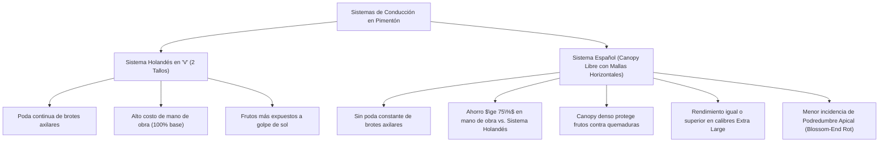

# MANUAL TÉCNICO UF/IFAS — PRODUCCIÓN DE PIMENTÓN (*Capsicum annuum*) EN CULTIVO PROTEGIDO Y FERTIRRIEGO INTENSIVO
## Basado en la Publicación Canónica EDIS HS979 / HS22800 (Protected Agriculture Project, University of Florida)
### Adaptación Específica para el Valle de Quíbor (695 msnm, Lara, Venezuela) — Módulo de 1.000 m² (3.500 plantas)

---

## 1. RESEÑA Y ORIGEN DEL DOCUMENTO CIENTÍFICO (HS228 / HS979)

El documento `HS22800.pdf` corresponde a la publicación de referencia internacional de la **Universidad de Florida (UF/IFAS Extension)**:
* **Título Original:** *Production of Greenhouse-Grown Peppers in Florida* (Documento HS979 / EDIS HS228).
* **Autores:** Dr. Elio Jovicich, Dr. Daniel J. Cantliffe (Decano y Profesor Emérito), Dr. Steven A. Sargent (Fisiología y Poscosecha), Dr. Lance S. Osborne (Entomología y Control Biológico).
* **Institución:** Horticultural Sciences Department & Mid-Florida Research and Education Center, UF/IFAS, Gainesville, Florida.
* **Propósito:** Transferir la tecnología de producción protegida en sustrato inerte y suelo, optimizando la arquitectura de invernaderos pasivos, tutorado, programas de nutrición mineral (ppm), manejo fitosanitario mediante control biológico y prevención de fisiopatías en pimentón bloque (*bell pepper*).

---

## 2. PARÁMETROS BIOCLIMÁTICOS Y ESTRUCTURALES COMPARADOS (FLORIDA vs. VALLE DE QUÍBOR)

| Parámetro Agronómico / Estructural | Recomendación UF/IFAS (Florida) | Adaptación Mandatoria Valle de Quíbor (Lara) | Justificación Termodinámica / Local |
| :--- | :--- | :--- | :--- |
| **Altura al Alero (Canal)** | $\ge 4.0\text{ m}$ (13 ft) | **$3.0\text{ a }4.0\text{ m}$ al alero** (cumbrera $5.5 - 6.5\text{ m}$) | En Quíbor, el pimentón requiere altura para crear colchón de aire buffer que mantenga $T_{interna} < 31.5^\circ\text{C}$. |
| **Cubierta y Malla** | Polietileno UV difuso + Malla 50 mesh en ventilaciones | **Malla 50 mesh monofilamento blanco virgen (110 o 130 gsm)** en toda la envolvente | Ventilación convectiva natural pasiva continua (viento Este dominante de 7 a 11 km/h). |
| **Sombreado Térmico** | Malla de sombreo 30% en meses de alta radiación | Malla blanca difusora + sombreo térmico 30% en meses secos (Marzo - Abril) | Disminuye la carga infrarroja directa, previene golpe de sol (*sunscald*) y aborto floral por estrés térmico ($> 32^\circ\text{C}$). |
| **Rendimiento Comercial** | $1.6\text{ a }3.0\text{ lb/ft}^2$ ($7.8\text{ a }14.6\text{ kg/m}^2$), con potencial de $4.0\text{ lb/ft}^2$ ($19.5\text{ kg/m}^2$) | **$17.5\text{ kg/m}^2$** ($17.5\text{ ton/1.000 m}^2$) | Equivale a **5.0 kg/planta** en densidad de 3.5 plantas/m² (3.500 plantas en 1.000 m²). |

---

## 3. PODA Y TUTORADO: SISTEMA HOLANDÉS EN "V" vs. SISTEMA ESPAÑOL

Uno de los aportes cruciales de la investigación de UF/IFAS (Jovicich & Cantliffe) es la validación técnica y económica de los dos sistemas de conducción en clima cálido:

### Directriz para Quíbor:
* **Se adopta el Sistema Español o uso de malla espaldera perimetral / tutores guía.**
* En el Valle de Quíbor, donde el recurso humano especializado es escaso y la radiación solar en mediodía es muy alta, el **Sistema Español reduce los jornales de labor en más del 75%**, al tiempo que el follaje exuberante brinda protección natural contra el golpe de sol y reduce la tasa de transpiración directa en los frutos en desarrollo.

---

## 4. PROGRAMA DE NUTRICIÓN MINERAL EN PARTES POR MILLÓN (PPM) Y FERTIRRIEGO

El manual UF/IFAS estandariza las concentraciones elementales en solución nutritiva para pimentón en sustrato/fertirriego según etapa fenológica:

### 4.1 Concentraciones Elementales UF/IFAS (ppm o mg/L)

| Elemento Nutritivo | Trasplante e Inicio (0 - 3 sem) | Crecimiento Vegetativo Activo | Plena Producción y Fructificación |
| :---: | :---: | :---: | :---: |
| **Nitrógeno ($N$)** | **70 ppm** | **110 – 130 ppm** | **160 ppm** |
| **Fósforo ($P$)** | **50 ppm** | **50 ppm** | **50 ppm** |
| **Potasio ($K$)** | **119 ppm** | **150 – 170 ppm** | **200 ppm** |
| **Calcio ($Ca$)** | **110 ppm** | **150 ppm** | **190 ppm** |
| **Magnesio ($Mg$)** | **40 ppm** | **44 ppm** | **48 ppm** |
| **Azufre ($S$)** | **55 ppm** | **60 ppm** | **65 ppm** |
| **Conductividad Eléctrica ($EC$)** | $1.2 - 1.5\text{ dS/m}$ | $1.6 - 2.0\text{ dS/m}$ | $2.0 - 2.5\text{ dS/m}$ |
| **pH Óptimo** | **5.5 – 6.5** | **5.5 – 6.5** | **5.5 – 6.5** |

### 4.2 Formulación Práctica con Insumos AIFA Hidrosolubles (Nave de 1.000 m² / 3.500 plantas)
Para alcanzar estas concentraciones elementales en Quíbor combinando con el agua de pozo ($EC_w \approx 1.65\text{ dS/m}$, aportando Calcio y Sulfatos nativos):

1. **Tanque A (Calcio y Hierro):**
   * **Nitrato de Calcio AIFA (15.5% N - 26% CaO):** 1.25 – 1.60 g/planta/semana.
   * **Quelato de Hierro Fe-EDDHA / Fe-DTPA (6% Fe):** 0.04 – 0.06 g/planta/semana.
2. **Tanque B (Fósforo, Potasio, Magnesio y Micronutrientes):**
   * **Nitrato de Potasio AIFA (13-0-46):** 1.80 – 2.40 g/planta/semana.
   * **Fosfato Monopotásico AIFA MKP (0-52-34):** 0.70 – 0.95 g/planta/semana.
   * **Sulfato de Magnesio AIFA (16% MgO, 13% S):** 0.80 – 1.10 g/planta/semana.
   * **Micronutrientes Quelatados (B, Zn, Mn, Cu, Mo):** 0.05 g/planta/semana.
3. **Tanque C (Corrector de pH):**
   * **Ácido Fosfórico / Ácido Nítrico:** Dosis según titulación para estabilizar pH de descarga en $5.8 - 6.2$.

---

## 5. VOLÚMENES DE RIEGO, FRECUENCIA Y LIXIVIACIÓN DE SALES

### 5.1 Frecuencia e Intensidad de Pulsos (UF/IFAS)
* **Trasplante (Etapa 1):** Hasta 10 riegos cortos diarios de aprox. 40 mL (1.3 fl oz) por planta. Total: **0.4 L/planta/día**.
* **Plena Cosecha en Calor Extremo (Etapa 4 - Quíbor Marzo/Abril):** Hasta 25 a 40 pulsos de 75 mL (2.5 fl oz). Consumo pico de **2.5 a 4.5 L/planta/día** (hasta 1.0 - 1.5 gal/planta/día en días de máxima radiación).

### 5.2 Fracción de Lixiviación ($LF$) Mandatoria para Quíbor
* UF/IFAS exige mantener un drenaje de **15% a 20%** para evitar acumulación de sales tóxicas en el bulbo húmedo.
* Con agua de pozo de Quíbor ($EC_w = 1.65\text{ dS/m}$) y tolerancia del pimentón ($EC_e \le 2.5\text{ dS/m}$ antes de merma de rendimiento):
  $$LF = \frac{EC_w}{5(EC_e) - EC_w} = \frac{1.65}{5(2.5) - 1.65} = \frac{1.65}{12.5 - 1.65} = \frac{1.65}{10.85} \approx 15.2\%$$
* **Conclusión:** La fracción de drenaje del 15% - 20% prescrita por la Universidad de Florida coincide de forma milimétrica con la física de salinidad del pozo en Quíbor.

---

## 6. PREVENCIÓN DE ENFERMEDADES BASALES Y EL SÍNDROME DEL "PIE DE ELEFANTE" (*Elephant's Foot*)

UF/IFAS describe con detalle el desorden basal denominado **Elephant's Foot** (*Pie de Elefante*):
* **Causa Fisiopatológica:** Hinchazón hipertrófica en la base del tallo y rajaduras epidérmicas a nivel del nudo cotiledonar, provocadas por la acumulación excesiva de sales fertilizantes concentradas combinadas con encharcamiento local permanente de los goteros. Estas heridas son puerta de entrada para hongos patógenos (*Fusarium oxysporum*, *Fusarium solani*, *Phytophthora capsici* y *Pythium*), causando marchitez súbita.
* **Protocolo de Prevención Obligatorio:**
  1. **Profundidad de Trasplante:** Sembrar la plántula (de 35 días y 5-7 hojas verdaderas) enterrando el cepellón justo al nivel del primer nudo foliar verdadero, evitando dejar el nudo cotiledonar vulnerable al contacto con la costra salina superficial.
  2. **Retiro Progresivo de Goteros:** Durante las primeras 3 semanas pos-trasplante, **alejar gradualmente los goteros entre 5 y 8 cm (2 a 3 pulgadas) de la base del tallo**. Jamás dejar el emisor goteando directamente contra el tronco de la plántula.

---

## 7. FISIOPATÍAS DEL FRUTO Y SU MANEJO PREVENTIVO

1. **Podredumbre Apical o "Culo Negro" (*Blossom-End Rot* - BER):**
   * *Mecanismo:* Deficiencia localizada de Calcio en el ápice distal del fruto en rápida expansión celular.
   * *Factores desencadenantes en Quíbor:* Alta salinidad en la solución ($EC > 2.5\text{ dS/m}$), fluctuaciones bruscas de humedad en el suelo (déficit hídrico entre riegos) y picos de calor que inducen excesiva transpiración foliar (el Ca viaja por xilema a las hojas y no entra al fruto).
   * *Control:* Las aplicaciones foliares de Ca son poco efectivas porque el Ca es inmóvil en el floema. La solución es **mantener riegos cortos frecuentes (evitar secado del bulbo)**, $LF \ge 15\%$ y autosombreado foliar mediante el sistema de tutorado tipo español.
2. **Rajado de Frutos (*Fruit Cracking* y *Russeting*):**
   * *Causa:* Riegos excesivos tras periodos de sequedad o variedades de pared gruesa ($> 8\text{ mm}$).
   * *Control:* Estabilizar el balance hídrico continuo mediante pulsos automatizados.
3. **Frutos Chatos y Partenocarpia (*Flat Fruits*):**
   * *Causa:* Temperaturas nocturnas bajas ($< 16^\circ\text{C}$ / $60^\circ\text{F}$) que reducen la viabilidad del polen, o falta de polinización eficiente.
   * *Solución:* Introducción de colmenas de abejorros (*Bombus impatiens* o *Bombus spp.*) a razón de 1 colmena cada 1.500 m².

---

## 8. MANEJO INTEGRADO DE PLAGAS Y CONTROL BIOLÓGICO AUGMENTATIVO (IPM)

UF/IFAS promueve la transición del control químico al control biológico en pimentón protegido, debido a que el uso de azufre, aceites y jabones causa **fitotoxicidad severa** en invernadero, y los insecticidas eliminan los polinizadores y generan resistencia rápida en plagas clave:

| Plaga Objetivo | Agente de Control Biológico Validado (UF/IFAS) | Modo de Acción / Manejo |
| :--- | :--- | :--- |
| **Ácaro Blanco** (*Polyphagotarsonemus latus*) | ***Neoseiulus californicus*** y ***Neoseiulus cucumeris*** | Ácaros fitoseidos depredadores. Clave para Quíbor donde ninguna malla detiene ácaros. |
| **Araña Roja** (*Tetranychus urticae*) | ***Neoseiulus californicus*** y ***Phytoseiulus persimilis*** | Depredación activa de estados móviles y huevos. |
| **Trips de las Flores** (*Frankliniella occidentalis*) | ***Orius insidiosus*** / ***Orius spp.*** (chinche pirata) y ***N. cucumeris*** | Depredadores de ninfas y adultos. Previene transmisión del virus TSWV. |
| **Pulgón de las Cucurbitáceas/Algodón** (*Aphis gossypii*) | Avispa parasitoide ***Aphidius colemani*** | Parasitoidismo de ninfas y adultos, formando momias. |
| **Mosca Blanca** (*Bemisia tabaci* / *argentifolii*) | Avispa parasitoide ***Eretmocerus eremicus*** / ***Encarsia formosa*** | Parasita ninfas L2-L3 de mosca blanca. |
| **Gusanos y Orugas de Fruto** (*Spodoptera*, *Helicoverpa*) | ***Bacillus thuringiensis*** (Bt kurstaki / aizawai) | Bioinsecticida por ingestión; inocuo para abejorros y fauna benéfica. |

---

## 9. COSECHA, CALIBRES COMERCIALES Y PROTOCOLO DE POSCOSECHA

1. **Técnica de Corte:**
   * Utilizar tijeras afiladas desinfectadas y **cortar exactamente a nivel de la zona de abscisión del pedúnculo**.
   * Conservar el pedúnculo intacto confiere resistencia natural contra la podredumbre blanda bacteriana (*Pectobacterium carotovorum* / *Erwinia*).
2. **Prohibición de Inmersión en Agua:**
   * **Nunca sumergir los pimentones en piletas de agua**. Al ser frutos huecos, la diferencia de presión hidrostática infiltra agua y bacterias hacia el interior de la cavidad placentaria, pudriendo el fruto en destino. Lavar únicamente con aspersión superior limpia y secar de inmediato.
3. **Cadena de Frío y Almacenamiento Óptimo:**
   * **Temperatura Óptima:** **$7.2^\circ\text{C}$ ($45^\circ\text{F}$)** con **90% a 95% de Humedad Relativa**.
   * **Punto Crítico de Daño por Frío (*Chilling Injury*):** Almacenar a temperaturas $< 7^\circ\text{C}$ provoca manchas translúcidas acuosas, picado de la cáscara y colapso de tejidos al salir del frío.
   * **Límite Superior:** A temperaturas $> 12.8^\circ\text{C}$ ($55^\circ\text{F}$), se acelera la maduración senescente y la proliferación de podredumbre bacteriana blanda.
   * **Pérdida de Peso:** Una pérdida de apenas **3% de agua** produce arrugamiento visible en la piel del fruto.

---

## 10. SÍNTESIS DE EJECUCIÓN PARA EL PROYECTO LA CIGARRONERA (1.000 m²)

```mermaid
flowchart TD
    Sub1["Preparación y Trasplante"] --> Sub1A["Plántulas a 35 días (5-7 hojas)"]
    Sub1 --> Sub1B["Enterrar hasta primer nudo foliar (prevenir Pie de Elefante)"]
    Sub1 --> Sub1C["Alejar goteros 5-8 cm de la base en semanas 1-3"]
    
    Sub2["Conducción"] --> Sub2A["Sistema Español con tutorado perimetral"]
    Sub2 --> Sub2B["Ahorro 75% mano de obra vs. Holandés en 'V'"]
    Sub2 --> Sub2C["Canopy protege frutos contra BER y golpe de sol"]
    
    Sub3["Nutrición y Riego"] --> Sub3A["Formulación AIFA: 160 ppm N, 50 ppm P, 200 ppm K, 190 ppm Ca"]
    Sub3 --> Sub3B["LF = 15-20% continuo para lixiviar agua de pozo"]
    Sub3 --> Sub3C["Pulsos de 40 a 75 mL hasta 4 L/planta/día en calor pico"]
    
    Sub4["Sanidad y Cosecha"] --> Sub4A["Malla 50 mesh + Control biológico de ácaros y trips"]
    Sub4 --> Sub4B["Corte en pedúnculo (sin inmersión en agua)"]
    Sub4 --> Sub4C["Cámara a 7.2 °C (45 °F) y 90-95% HR"]
```

