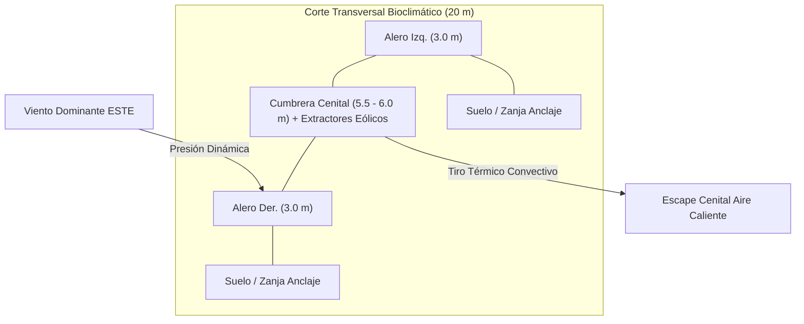
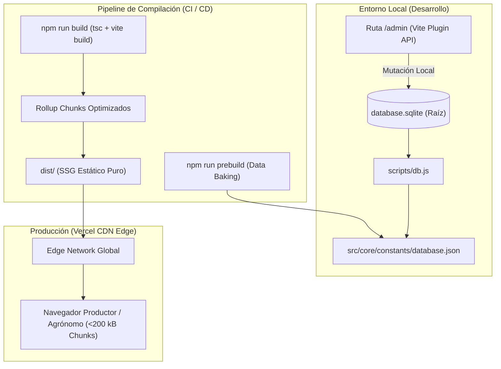

# 🌱 MANUAL CANÓNICO MAESTRO DE INGENIERÍA Y OPTIMIZACIÓN
## Agrovenecua · Finca La Cigarronera — Valle de Quíbor, Lara, Venezuela
### Compendio Unificado: Bioclimatología, Hidrogeología, Estructura, Agronomía Protegida, Agri-UX/UI y Arquitectura de Software

---

> **Estatus del Documento:** CANÓNICO DEFINITIVO (v3.0)  
> **Georreferenciación Satelital Exacta:** $9^\circ 53' 20.0''\ \text{N},\ 69^\circ 35' 35.0''\ \text{W}$ ($9.888889^\circ\text{N},\ -69.593056^\circ\text{W}$)  
> **Cota y Clima:** 695 – 710 msnm | Köppen BSh (Semiárido cálido / Bosque seco premontano)  
> **Acuífero:** Formación Cuara / Formación El Pegón, Municipio Jiménez, Estado Lara  
> **Cultivo Objetivo Primario:** Pimentón Híbrido (*Capsicum annuum* var. Magistral F1) bajo Casa de Malla  
> **Cultivo Objetivo Secundario:** Tomate Indeterminado de Hilo Alto (*Solanum lycopersicum*)  
> **Tecnología Frontend & Datos:** React 18 + TypeScript 5.6 + Vite + Zustand + SQLite Data Baking + Vercel SSG  

---

## 1. LÍNEA BASE BIOCLIMÁTICA Y METEOROLÓGICA (NASA MERRA-2)

Todas las decisiones estructurales, tasas de ventilación, cálculo de evapotranspiración y requerimientos de fertirriego se fundamentan en la serie temporal histórica validada de Quíbor:

### 1.1. Matriz Climatológica Mensual Oficial

| Mes | T. Máx (°C) | T. Mín (°C) | T. Med (°C) | Precipitación (mm) | Viento (km/h) | Días Bochorno | Viento Dominante |
| :--- | :---: | :---: | :---: | :---: | :---: | :---: | :--- |
| **Enero** | 30.1 | 16.0 | 23.8 | 18.9 | 7.7 | 16.0 | 88% ESTE |
| **Febrero** | 30.8 | 16.0 | 24.6 | 11.2 | 8.5 | 14.5 | 85% ESTE |
| **Marzo** ☀️ *(Pico Térmico)* | 31.0 | 16.0 | 25.4 | 23.9 | 8.6 | 18.6 | 84% ESTE |
| **Abril** | 30.6 | 17.5 | 25.6 | 61.8 | 8.5 | 22.6 | 80% ESTE |
| **Mayo** 🌧️ *(Máx. Lluvia)* | 29.8 | 18.4 | 25.1 | 104.0 | 8.8 | 28.1 | 78% ESTE |
| **Junio** 💨 *(Máx. Viento)* | 28.6 | 18.0 | 24.2 | 99.0 | 10.4 | 27.6 | 82% ESTE |
| **Julio** ❄️ *(Más Fresco)* | 28.0 | 19.0 | 23.8 | 99.8 | 9.1 | 28.0 | 85% ESTE |
| **Agosto** 🔥 *(Pico Bochorno)*| 28.5 | 17.9 | 24.0 | 95.2 | 9.0 | 28.6 | 86% ESTE |
| **Septiembre** 🔄 | 29.2 | 18.1 | 24.2 | 82.8 | 8.2 | 27.6 | 53% SUR *(Excepción anual)* |
| **Octubre** | 29.4 | 16.7 | 24.0 | 98.3 | 6.7 | 28.5 | 79% ESTE |
| **Noviembre** 🍃 *(Más Calmo)* | 29.2 | 17.6 | 23.9 | 72.0 | 7.0 | 26.4 | 84% ESTE |
| **Diciembre** | 29.4 | 15.9 | 23.7 | 28.0 | 7.2 | 22.0 | 87% ESTE |

### 1.2. Dinámica del Viento y Ráfagas de Diseño
- **Dirección Dominante:** Viento procedente del **ESTE** durante 11 meses continuos. Solamente en septiembre se produce una rotación temporal al Sur (~53%).
- **Velocidad Media Anual:** 7.0 a 10.4 km/h ($1.94\text{ a }2.89\text{ m/s}$).
- **Ráfaga de Diseño Estructural:** $27.0\text{ km/h}$ ($7.5\text{ m/s}$) sobre la capa límite superficial. Con factor de seguridad agronómico $FS \ge 1.5$, la estructura debe soportar ráfagas de hasta $40.5\text{ km/h}$ ($11.25\text{ m/s}$).
- **Gradiente Vertical de Hellmann:** Coeficiente de fricción $\alpha = 0.16$ para terreno agrícola abierto con obstáculos bajos:
  $$v(z) = v_{10} \left(\frac{z}{10}\right)^{0.16}$$

---

## 2. INGENIERÍA ESTRUCTURAL Y BIOCLIMÁTICA DE CASAS DE MALLA

### 2.1. Dimensionamiento Estructural y Volumen Buffer
* **Nave Estándar Unitaria (1.000 m²):** $20.00\text{ m (ancho)} \times 50.00\text{ m (largo)}$.
* **Altura al Alero (Canal):** Mínimo estricto de **$3.00\text{ m}$**.
* **Altura a Cumbrera Cenital:** **$5.50\text{ a }6.00\text{ m}$** (volumen de aire buffer $\ge 4.250\text{ m}^3$).
* **Prohibición Terminante:** Se prohíbe diseñar naves con altura de cumbrera $\le 2.50\text{ m}$ para tomate indeterminado o pimentón tecnificado. Una baja altura reduce el buffer térmico provocando sobrecalentamiento interno ($>34^\circ\text{C}$), cierre estomático y **aborto floral masivo**.

### 2.2. Ventilación Natural vs. Extractores Eólicos
* **Ventilación Convectiva en Malla Porosa:** Es el motor principal del enfriamiento.
  $$Q_{vent} = C_d \times A_{vent} \times v(z) \times 3600\quad [\text{m}^3/\text{h}]$$
  Donde $C_d \approx 0.22 - 0.26$ para malla 50 mesh y $A_{vent}$ es la superficie perimetral expuesta.
* **Rol de los Extractores Eólicos:** Los extractores eólicos giratorios (24" a 30") rinden un **23% menos a 2.5 m que a 6.0 m** por gradiente de capa límite. **No sustituyen el área de malla**, sino que actúan como refuerzo cenital para romper la bolsa de calor estancada en la cumbrera durante horas de calma solar.
* **Dotación Óptima:** **7 a 8 extractores eólicos** por cada nave de $1.000\text{ m}^2$, logrando renovaciones de aire $\text{RAH} \ge 40 - 55\ \text{h}^{-1}$.

### 2.3. Especificación Canónica de la Malla Anti-Insecto
* **Tejido:** Malla monofilamento virgen HDPE de **110 a 130 gsm, 50 mesh (50×25 hilos/pulgada)**.
* **Color:** **BLANCO CRISTAL / OPALINO**. El color blanco dispersa la radiación incidente (luz difusa), reduce la carga térmica infrarroja y evita el aborto floral sin provocar etiolación.
* **Apertura de Poro:** $\le 192\ \mu\text{m}$.
* **Exclusión Física Comprobada (100%):**
  - Mosca blanca (*Bemisia tabaci*) — Vector principal de Begomovirus (TYLCV).
  - Trips de las flores (*Frankliniella occidentalis*) — Vector del Tospovirus (TSWV).
  - Pulgones (*Aphis gossypii*, *Myzus persicae*).
  - Minador de la hoja (*Liriomyza spp.*).
  - Polilla del tomate (*Tuta absoluta*).
* **Alerta Crítica Biológica (Ácaros):** La araña roja (*Tetranychus urticae*) y el ácaro blanco (*Polyphagotarsonemus latus*) miden entre 80 y 150 $\mu\text{m}$, por lo que **atraviesan cualquier malla comercial**. Su control es exclusivamente agronómico (fauna benéfica, monitoreo y humedad relativa controlada).

---

## 3. HIDROGEOLOGÍA Y RECURSOS SUBTERRÁNEOS (CUARA, 50M)

### 3.1. Perfil Estratigráfico del Pozo Artesanal (La Cigarronera)
* **Profundidad Total Perforada:** **$50.00\text{ m}$**.
* **Nivel Estático Comprobado:** **$49.50\text{ m}$**.
* **Nivel Dinámico en Bombeo Continuo (2.5 L/s):** $51.20\text{ a }52.40\text{ m}$.
* **Formación Geológica:** Manto aluvial de grava cuarcítica permeable con matriz areno-arcillosa (Formación Cuara / El Pegón).
* **Transmisividad Hidráulica ($T$):** $180.0\text{ m}^2/\text{día}$.
* **Coeficiente de Almacenamiento ($S$):** $0.0025$ (Acuífero semiconfinado a libre profundo).
* **Radio de Influencia del Cono de Depresión ($R_0$):** $260.0\text{ m}$.

### 3.2. Ecuación de Descenso Theis / Cooper-Jacob
$$s(r, t) = \frac{Q}{4 \pi T} \ln\left(\frac{2.25 T t}{r^2 S}\right)$$
Donde:
- $Q = 2.50\text{ L/s} = 216.0\text{ m}^3/\text{día}$.
- $T = 180.0\text{ m}^2/\text{día}$.
- Abatimiento máximo proyectado tras 8 horas continuas de aforo: $\Delta s \le 2.90\text{ m}$.

### 3.3. Manejo de Salinidad y Conductividad Eléctrica ($EC_w$)
El agua de los pozos de Quíbor presenta salinidad media-alta ($EC_w \approx 1.65\text{ dS/m}$, fluctuando entre $1.2\text{ y }2.2\text{ dS/m}$).
Para evitar la acumulación tóxica de cloruros y sulfatos en el bulbo húmedo (0–40 cm), se aplica estrictamente el modelo de Mass-Hoffman y FAO-56:

$$\mathbf{LF = \frac{EC_w}{5 \cdot EC_e - EC_w}}$$

Para Pimentón ($EC_e = 1.5\text{ dS/m}$):
$$LF = \frac{1.65}{5(1.5) - 1.65} = \frac{1.65}{7.5 - 1.65} = \frac{1.65}{5.85} \approx \mathbf{0.282\ (28.2\%)}$$

**Lámina Bruta de Riego Requerida:**
$$\text{Lámina Bruta} = \frac{ET_c}{1 - LF} = \frac{ET_c}{0.718} \approx \mathbf{1.39 \times ET_c}$$
Un 28% de sobre-riego controlado es mandatorio para lixiviar sales fuera de la zona radicular activa.

---

## 4. ARQUITECTURA AGRONÓMICA: PIMENTÓN MAGISTRAL F1 (1.000 M²)

### 4.1. Marco de Plantación y Población
* **Superficie Efectiva:** $1.000\text{ m}^2$ ($20\text{ m} \times 50\text{ m}$).
* **Camellones:** 10 camellones dobles con separación entre ejes de **$2.00\text{ m}$**. Ancho de mesa $1.00\text{ m}$, pasillo de tránsito $1.00\text{ m}$.
* **Hileras de Cultivo:** 20 hileras de $50\text{ m}$ cada una.
* **Distancia entre Goteros y Plantas:** Goteros cada **$0.30\text{ m}$** con sincronía cercana a 1:1 (plantas a 28.5 cm).
* **Población Total:** **3.500 plantas** ($3.50\text{ plantas/m}^2$).
* **Emisores:** 3.333 goteros integrados autocompensantes y antidrenantes (PC/AS) de **$1.5\text{ L/h}$**.
  $$Q_{riego} = 3.333\text{ goteros} \times 1.5\text{ L/h} \approx 5.000\text{ L/h} = \mathbf{5.00\text{ m}^3/\text{h}}\ (1.38\text{ L/s})$$
* **Sectorización Hidráulica:** 2 sectores independientes de $2.50\text{ m}^3/\text{h}$ (5 camellones dobles / ~1.666 goteros por sector). Permite trabajar con electrobomba de **1.5 HP a 220V**.

### 4.2. Balance Hídrico por Etapa Fenológica (FAO-56 Ajustada a Quíbor)

| Etapa Fenológica | Semanas | Kc | Lámina Neta (mm/día) | Litros/Planta/Día | Litros/Planta/Semana | Duración Pulso (2 Sectores) |
| :--- | :---: | :---: | :---: | :---: | :---: | :---: |
| **I. Establecimiento** | Sem 01–03 | 0.60 | 3.00 | 1.20 L | 8.40 L | 22 min / sector |
| **II. Vegetativo** | Sem 04–06 | 0.80 | 4.00 | 1.60 L | 11.20 L | 30 min / sector |
| **III. Floración / Cuajado**| Sem 07–09 | 1.05 | 5.25 | 2.10 L | 14.70 L | 40 min / sector |
| **IV. Cosecha Plena (Pico)**| Sem 10–20 | 1.15 | 6.00 | 2.40 L | 16.80 L | 45 min / sector |

### 4.3. Plan Nutricional Hidrosoluble (AIFA) y Compatibilidad Química
La nutrición se administra en fertirriego diario fraccionado en 3 tanques concentrados para evitar precipitaciones:

* **TANQUE A (Calcio y Quelatos):**
  - Nitrato de Calcio ($15.5\%\text{ N} + 26.5\%\text{ CaO}$).
  - Nitrato de Potasio ($13\%\text{ N} + 46\%\text{ K}_2\text{O}$).
  - Quelato de Hierro Fe-EDDHA ($6\%$).
  - *Regla:* Cero contacto con sulfatos o fosfatos para impedir la precipitación de yeso ($\text{CaSO}_4$).
* **TANQUE B (Fosfatos, Sulfatos y Micronutrientes):**
  - Fosfato Monopotásico MKP ($52\%\text{ P}_2\text{O}_5 + 34\%\text{ K}_2\text{O}$).
  - Sulfato de Potasio ($50\%\text{ K}_2\text{O} + 18\%\text{ S}$).
  - Sulfato de Magnesio ($16\%\text{ MgO} + 13\%\text{ S}$).
  - Micronutrientes quelatados (Boro, Zinc, Manganeso, Cobre, Molibdeno).
* **TANQUE C (Corrección Ácida de Bicarbonatos):**
  - Ácido Nítrico ($\text{HNO}_3\ 65\%$) para neutralizar los bicarbonatos ($\text{HCO}_3^-$) del pozo de Quíbor, manteniendo el pH de la solución de riego en **$5.8 - 6.2$**.

### 4.4. Modelo Económico: Erradicación de la "Maraña" y Retorno Neto

| Categoría Comercial | Peso Fruto | Precio Liquidado en Finca | Sistema Tradicional (Suelo) | **Sistema Agrovenecua (Malla + AIFA)** |
| :--- | :---: | :---: | :---: | :---: |
| **Cesta Grande (Jumbo / 1ra)** | $> 220\text{ g}$ | **$15.00 USD / cesta** ($0.75/kg) | 25% (218 cestas) | **75% (656 cestas)** |
| **Cesta Mediana (2da)** | $140 - 180\text{ g}$ | **$8.00 USD / cesta** ($0.40/kg) | 45% (394 cestas) | **25% (219 cestas)** |
| **Cesta Pequeña ("Maraña")** | $< 120\text{ g}$ | **$3.50 USD / cesta** ($0.17/kg) | 30% (263 cestas) | **0% (0 cestas — Erradicada)** |
| **Producción Total Ciclo** | — | — | $17.500\text{ kg}$ (875 cestas) | **$17.500\text{ kg}$ (875 cestas)** |
| **Ingreso Bruto Cosecha** | — | — | **$7.484 USD** | **$11.592 USD** |
| **Margen Neto Libre de Costos** | — | — | **$4.000 USD** | **$8.892 USD** |

---

## 5. MANEJO INTEGRADO DE PLAGAS (IPM) Y ROTACIÓN IRAC

El Valle de Quíbor presenta alta presión de plagas y resistencia cruzada por uso histórico indiscriminado de pesticidas. En la casa de cultivo Agrovenecua se sigue el protocolo de rotación por Modo de Acción (código IRAC):

| Plaga Objetivo | Agente de Daño | Umbral de Acción | Mecanismo Físico / Químico | Modo de Acción IRAC |
| :--- | :--- | :--- | :--- | :---: |
| **Mosca Blanca** (*Bemisia tabaci*) | Transmisión TYLCV | 1 adulto / 5 trampas | Malla 50 mesh + Trampas amarillas + Spirotetramat | Grupo 23 (Inhibidor síntesis lípidos) |
| **Trips** (*Frankliniella occ.*) | Roña en fruto / TSWV | 0.5 trips / flor | Trampas azules + Spinetoram / Spinosad | Grupo 5 (Modulador alostérico nAChR) |
| **Polilla del Tomate** (*Tuta absoluta*) | Minas foliares y daño en fruto | 1 mina visible | Malla 50 mesh + Feromonas + Clorantraniliprol | Grupo 28 (Modulador receptor rianodina) |
| **Pulgones** (*Myzus persicae*) | Melaza y fumagina | Foco focalizado | Malla 50 mesh + Flonicamid | Grupo 29 (Bloqueador órganos cordotonales) |
| **Ácaro Blanco / Araña Roja** | Bronceado foliar | Detección precoz con lupa | *Amblyseius swirskii* + Azufre micronizado + Abamectina | Grupo 6 (Activador canales de cloro) |

---

## 6. SISTEMA DE DISEÑO AGRI-UX/UI (ESTÁNDARES DE CAMPO)

Las interfaces deben operar con máxima fluidez bajo la luz solar directa del Valle de Quíbor:
1. **Contraste WCAG AAA ($\ge 7:1$):**
   - Fondo de página de baja reflectancia: `#f3f3f3`.
   - Superficies de tarjetas de datos: `#ffffff` con sombras suaves de elevación.
   - Textos primarios de datos: `#0a2007` (Verde bosque profundo de alta agudeza visual).
2. **Semántica de Color Agronómica:**
   - 💧 **Azul Hidráulico (`#0284c7`):** Riego, caudales, goteros, volúmenes de pozo.
   - 🌿 **Verde Clorofila (`#53C942` / `#248a15`):** Sanidad vegetal, nitrógeno, KPIs comerciales óptimos.
   - ☀️ **Ámbar Bioclimático (`#d97706`):** Radiación solar, grados-día acumulados, temperatura.
   - 🚨 **Rojo Alerta Osmótica (`#dc2626`):** Salinidad crítica (>2.0 dS/m), ácaros, pH fuera de rango.
3. **Ergonomía Táctil de Campo:**
   - Todo botón o selector operable en dispositivo móvil tiene una altura mínima de **$48\text{px}$** (`touch-target-48`).
   - Espaciado entre elementos interactivos $\ge 8\text{px}$ para manejo con guantes o dedos húmedos.
4. **Divulgación Progresiva en 4 Niveles:**
   - *Nivel 1 (3 seg):* KPI grande visible al instante.
   - *Nivel 2 (10 seg):* Selectores interactivos (cultivo, etapa, fuente de agua).
   - *Nivel 3 (30 seg):* Directivas directas de campo (litros de ácido a mezclar, minutos de riego).
   - *Nivel 4 (A demanda):* Ecuaciones formales (LaTeX/KaTeX) y sustento teórico.

---

## 7. ARQUITECTURA DE SOFTWARE, DATA BAKING Y DEPLOY

### Principios de la Arquitectura:
1. **Cero Latencia en Servidor:** Todos los datos se pre-hornean en tiempo de compilación. En producción no hay llamadas a bases de datos remotas ni cuotas de API pagas.
2. **Persistencia Local Segura:** Los parámetros seleccionados por el agrónomo persisten en `localStorage` mediante Zustand `persist`.
3. **Resiliencia PWA:** Service worker con estrategia `Cache First` para cargar el Cockpit en zonas rurales sin cobertura móvil.

---

## 8. PLAN DE ACCIÓN DE OPTIMIZACIÓN v3.0 (CHECKLIST DE EJECUCIÓN)

| Fase | Tarea | Estado |
| :---: | :--- | :---: |
| **F1** | Integrar `zustand/persist` en `useAgroStore.ts` y separar `useWeatherStore.ts` | 🟢 En Ejecución |
| **F2** | Implementar motores de cálculo puro: `gdd.ts` (Fenología) y `finance.ts` (ROI) con tests | 🟢 En Ejecución |
| **F3** | Optimizar CSS global con tipografía fluid (`clamp`), espaciado armónico y BEM | 🟡 Pendiente |
| **F4** | Descomponer `Module03Fertirriego.tsx` y `AdminControlPanel.tsx` en submódulos atómicos | 🟡 Pendiente |
| **F4** | Crear nuevo Módulo 06 del Cockpit: `Module07Phenology.tsx` e implementar `AgroErrorBoundary` | 🟡 Pendiente |
| **F5** | Configurar Code Splitting con `React.lazy`, `Suspense` y `manualChunks` en Vite | 🟡 Pendiente |
| **F6** | Conectar Landing Page reactivamente al store y agregar sección técnica de evidencias | 🟡 Pendiente |
| **F7** | Generar Service Worker PWA (`sw.js`), actualizar manifest y configurar SEO semántico | 🟡 Pendiente |
| **F8** | Ejecutar suite de pruebas unitarias Vitest ($\ge 20$ tests) y verificar build limpio en `dist/` | 🟡 Pendiente |

---
*Este documento constituye la fuente única de verdad (Single Source of Truth) para todo el desarrollo agronómico, estructural y de software del ecosistema Agrovenecua.*